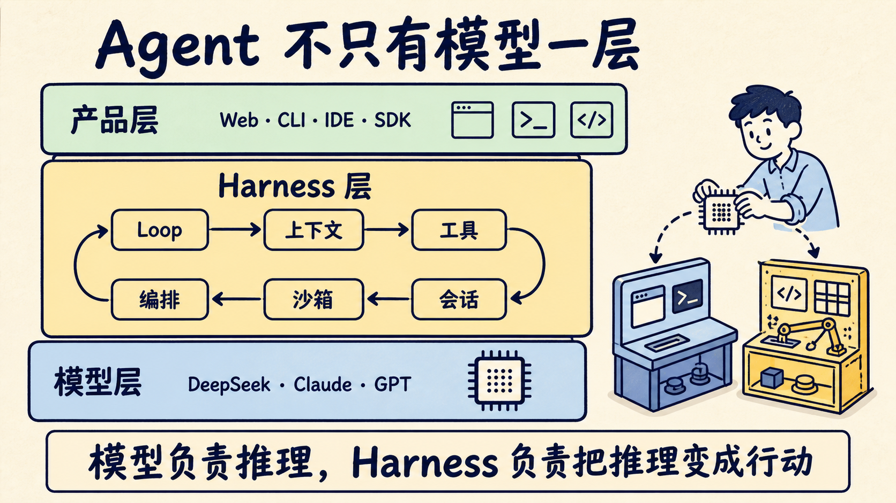
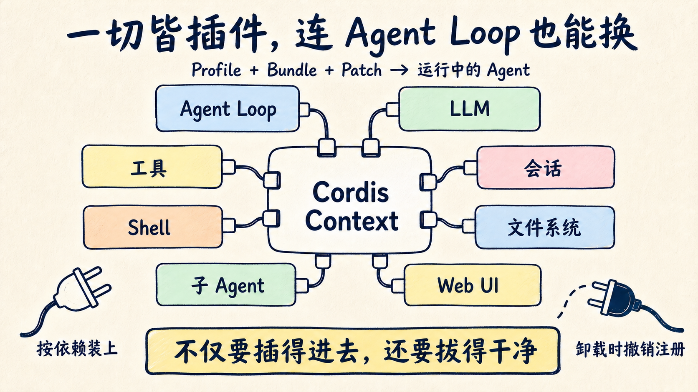
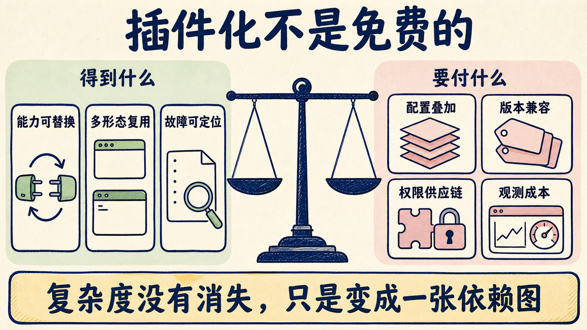

# DeepSeek 没做第二个 Claude Code：它把 Agent 拆成了插件

DeepSeek 确实做了一个能读代码、改文件、跑命令的 Web Agent。安装 Node.js 后，一条命令就能启动：

```bash
npx @deepseek-ai/dsh web
```

但如果只把 DeepSeek Harness 看成“DeepSeek 版 Claude Code”，会漏掉它最值得研究的部分。

这次开源的 `dsh` 更像一盒 Agent 乐高：模型、Agent Loop、工具、会话、文件系统、Shell、沙箱、审批、Skill、Subagent、Workflow，连 Web UI 都是插件。官方把这套架构压成一句话：**Everything is a plugin。**

我的判断是，DeepSeek 不是先把一个固定形态的 Coding Agent 打磨到稳定，再慢慢放出扩展接口；它直接把“Agent 如何被组装”摆到了台前。收益是几乎每一层都能替换，代价是配置、依赖、权限和版本治理也一起交给了开发者。

这不是一个今晚就该迁移生产环境的结论。官方首页写得很直白：目前仍是 Developer Preview，后面会有破坏兼容性的变更。它更适合现在拆、现在试、现在理解，而不是现在押上关键工作流。

## 模型会想，Harness 才让它动手

先把 Harness 讲清楚。

你给一个大模型丢进代码，让它回答问题，那是 Chat。你允许它搜索文件、编辑代码、运行测试，并根据结果继续行动，才接近 Agent。

中间多出来的那一层，就是 Harness。它至少要处理这些事：

- 这一轮给模型哪些系统指令和项目上下文；
- 模型能看见哪些工具，参数格式是什么；
- 工具调用要不要审批，在哪个沙箱里执行；
- 命令失败后是重试、修复，还是停下来问人；
- 上下文快满时怎么压缩，会话如何恢复；
- 用户中途改方向时，新消息插到哪一步；
- 多个子 Agent 怎么启动、通信和收尾；
- 最后拿什么证据证明任务真的做完。

所以同一个模型放进不同的 Coding Agent，体感可能像换了一个脑子。变的未必是推理能力，而是模型周围的工具说明、执行循环、权限、上下文和反馈信号。

可以把一套 Agent 粗略分成三层：

```text
产品层：Web / CLI / IDE / 企业工作台
Harness 层：Loop / Context / Tools / Memory / Sandbox / Orchestration
模型层：DeepSeek / Claude / GPT / 其他模型
```

DeepSeek Harness 的落点在中间。它附带 Web UI，也支持 Headless 单次任务和 Python SDK，但这些都是同一底座的不同装配。

名字里虽然写着 DeepSeek，模型层也没有被封死。Base 默认选择 `deepseek-official` 路由和 DeepSeek 模型，同时还挂着一套休眠的多 Provider 适配器；在设置页可以加入 Anthropic、OpenAI 或自定义兼容端点。模型变更会在下一次请求生效，不必重启服务器。

但“可接其他模型”不代表协议天然兼容。流式工具参数、思考内容回传、usage 顺序、上下文上限、图片输入和错误类型都要由适配器翻译。Harness 把模型做成插件，只是给差异找到了明确归属，并没有让差异消失。



## “一切皆插件”到底拆了什么

很多框架也有插件系统：加一个 MCP Server，挂一个数据库工具，装一份 Skill。`dsh` 的插件化更往下走了一层。

在它的默认配置里，`agent-loop` 自己就是一个插件。会话、系统提示词、工具注册表、模型适配器、文件系统、进程、审批服务也各自注册到共享上下文。没有哪个“特权内核”必须靠打补丁才能改。

支撑这套设计的是 Cordis。运行中的 Harness 可以理解成一个 Context，里面挂着一组稳定的服务键：

```text
ctx.sessions     会话日志
ctx.systemPrompt 提示词组装
ctx.tools        工具注册与执行流水线
ctx.agents       Agent 服务
ctx.agentLoop    默认循环
ctx.llm          模型适配器
ctx.fs           文件系统
ctx.shell        Shell 执行
```

插件不直接绑定某个具体实现，而是声明自己依赖哪个服务。依赖没准备好，它先不启动；提供服务的插件被卸载，依赖方也会跟着卸载；新实现补上后，再重新挂载。

这解决的是两种变化。

第一种是空间上的变化：谁依赖谁。比如文件搜索工具只需要 `ctx.fs`，不必知道后面是本地磁盘、E2B，还是另一套远程文件系统。

第二种是时间上的变化：组件离开时，副作用能不能收干净。一个插件注册了工具、提示词片段和事件监听器，卸载时这些注册也要撤销，不能留下半套旧状态。

Cordis 团队把它叫“时空可组合性”。名字有点学术，工程上可以翻成一句人话：**不仅要插得进去，还要拔得干净。**

不过，可逆副作用不等于安全沙箱。它保证的是生命周期：插件卸载后，注册的工具和监听器不该继续留在 Context 里；它不保证插件运行期间不会读错文件、上传数据或执行危险代码。生命周期正确和权限正确，是两张不同的验收表。



## Profile 决定最终装配

插件负责能力，Profile 负责把能力拼成一个可运行产品。

`dsh` 的配置不是从一份巨大的 YAML 直接启动，而是从一棵空插件树开始，按顺序叠加几层 patch：

```text
Base Bundle
  ↓
Web / Headless Bundle
  ↓
Profile 自己的 cordis.patch.yml
  ↓
用户 Home 级 patch
  ↓
临时 --patch overlay
```

Base 放入模型适配器、工具、会话持久化、沙箱、审批、设置、凭据和遥测等公共能力。Web Bundle 再挂上 HTTP Server、API Gateway、浏览器 UI 与 Coding Persona；Headless Bundle 则不启动服务器，只接收一个任务，等待 Agent 停稳后把最终文本写到 stdout。

这套分层有两个容易踩坑的细节。

第一，patch 命中某一行时，会替换整份 `config`，不是深度合并。你只想改一个字段，却没把其余字段重写进去，可能把默认配置一起抹掉。

第二，配置文件里的行顺序主要服务阅读，不负责加载时序。插件什么时候启动，由它声明的服务依赖决定。把 Provider 写在 Consumer 后面不一定有问题；漏掉依赖服务，Consumer 会一直等，或者在最早能判断的位置报错。

因此，排查 `dsh` 不能只看自己写的 patch。更可靠的动作是运行：

```bash
dsh --profile web --dump-config
```

把输出当成 Agent 的“运行时物料清单”。模型、权限、工具和 Provider 到底用了哪一个版本，应以组合后的树为准。

## Seam 才是关键抽象

`dsh` 文档里反复出现一个词：seam，可以理解成“可替换能力的接缝”。

一项完整能力被拆成三个角色：

1. Service Definition：定义接口和公共词汇；
2. Service Provider：提供具体实现；
3. Consumer：使用能力，通常把它包装成模型可调用的工具。

拿 Shell 举例。Harness 可以有一个抽象的 Shell 服务，本地 Bash 和受沙箱保护的 Bash 是两个 Provider，模型看到的 `bash` 工具则是 Consumer。

这样拆的价值不在代码显得漂亮，而在部署变化时少改一圈。

假设团队最初允许 Agent 在开发机上跑命令，后来要迁到远程容器。只要新 Provider 继续满足同一接口，上层的工具、Agent Loop 和 UI 不需要各写一份“远端专用版”。文件系统和进程如果共享同一个执行世界，Bash、持久终端和 LSP 也能一起迁过去。

Subagent 采用相同思路。默认 Agent Loop 并不内置“只能怎么开子 Agent”，仓库里同时放了进程内 spawn、fork、ACP、Codex、Claude Code 和 dsh SDK 等 Provider。编排层面对的是统一能力，部署时再决定任务交给谁。

这也是我认为 `dsh` 更像 Agent SDK 和运行时底座，而不只是编程助手的原因。

## 任务不是消息，是事件流

DeepSeek Harness 另一处值得抄作业的设计，是会话没有被简化成一份不断追加的 `messages[]`。

它把 Session 做成只追加的类型化事件日志。一次完整工作会留下这些事实：

```text
turn/start
step/start
user/message
assistant/chunk
assistant/message
tool/call
tool/result
step/end
turn/end
```

模型下一次看到的历史，是从日志投影出来的；UI、恢复、fork、transcript、遥测也从同一条事件流派生。

这个差别在短对话里不明显，任务一长就很关键。

比如模型发起三个工具调用，其中一个要审批，一个被权限策略拒绝，一个执行成功。只保存最终聊天文本，很难还原当时发生了什么；保存工具调用、审批、结果和轮次边界，就能回答：模型看到了什么，哪个动作实际发生了，失败从哪一层进入。

`dsh` 对工具调用的处理也不是“收到函数名就直接执行”。简化后，它会依次经过：

```text
tool/call 记账
  → tools/pre-execute 策略与 Hook
  → 单调 Guard
  → 必要时请求一次审批
  → tools/execute 执行、超时与指标
  → tools/post-execute 接受、拦截或替换结果
  → tool/result 写回事件日志
```

“单调 Guard”值得单独解释：Guard 可以拒绝，也可以不表态，但后面的插件不能把已经拒绝的动作重新放行。审批也发生在工具体执行之前；用户拒绝后，工具体不会先跑一半再补一条错误记录。

最终的 `tool/result` 会被固定成可由 JSON 无损表达的结果，供模型历史、UI 和日志共同消费。这个细节减少了一个典型故障：模型看到的工具结果是一版，页面显示的是另一版，审计日志又保存第三版。

事件溯源也不是免费午餐。事件 schema 要维护，旧记录要迁移，异步顺序要说清楚，不能把“Agent 变 idle”误当成某条消息已经拿到独立结果。`dsh` 自己的防御性文档用了不少篇幅处理这些边界，说明这不是换个存储格式就结束的事。

但对需要回放、审计和恢复的长任务来说，这笔复杂度通常比一份可变消息数组更值得。

## 中途改方向，也是调度

长任务还有一个常见问题：Agent 正在跑，你发现方向错了。

最粗糙的实现，会等当前任务结束，再把“别做 A，改做 B”作为下一轮消息。这时错误修改可能已经发生。

`dsh` 给输入区分了三种语义：

- `followup`：排队一个新的普通轮次；
- `steer`：在最近的 step 边界改变方向，必要时唤醒 Agent；
- `inject`：给下一次获准的模型请求补上下文，但不单独唤醒 Agent。

三种消息都进入 Inbox，却不被当成同一种“用户说话”。Agent Loop 每一步开始前，通过 `agent/pre-step` 决定这次模型到底看见什么；插件还可以改写或拒绝这批输入。

这套设计解决了一个经常被 UI 掩盖的问题：**中途插话不是聊天功能，而是调度语义。**

如果后台任务刚完成，结果应该唤醒 Agent，还是静静注入下一步？如果用户发来制动指令，它应该插在工具批次之前还是之后？如果取消当前轮次，队列里的后续消息还保不保留？这些都不能靠“把文本 append 到数组”回答。

## 插件化的四张账单

到这里，“Everything is a plugin”听起来几乎只有好处。实际落地时，我会先看四张账单。

**第一张是配置账单。**

`dsh` 用 Profile、Bundle 和多层 patch 组装插件树。好处是 Web、Headless、企业内网版本可以共用底座；麻烦是最终行为不再只由一份配置决定。官方专门提供 `--dump-config`，就是因为人脑很难只看几层 patch 推导出运行态。

**第二张是依赖和版本账单。**

接口能替换，不代表任意版本都能拼。服务键、事件模式、配置 schema、插件加载顺序和热更新都可能发生变化。项目公开当天，固定源码提交还是 rc.5，npm 已经推进到 rc.6。Developer Preview 阶段要锁版本、保存配置快照，并准备重建环境。

**第三张是权限与供应链账单。**

一个 UI 主题插件出问题，最多页面难看；一个 Shell、文件系统或 Workflow 插件出问题，可能直接触达源码、凭据和进程。官方默认是 `workspace-write + ask`，并把动态注册运行时代码的 Cordis 工具排除在默认装配之外，这个取舍是对的。

但开发者自己安装第三方 Bundle 后，必须重新做最小权限、来源审计和隔离验证。插件市场越繁荣，这项工作越不能只靠 README。

**第四张是可观测性账单。**

可替换组件变多后，失败也会横跨模型、循环、策略、工具、沙箱和 Provider。只看最终回答，定位不了故障。团队至少要保留配置快照、事件日志、审批轨迹、工具输入输出和版本信息。

所以插件化没有消灭复杂度。它只是把复杂度从“修改一块巨型内核”，换成了“治理一张动态依赖图”。



## Harness 不等于产品高下

这里要踩一脚刹车。

不能因为 DeepSeek 强调 Harness，就说 Claude Code 或 Codex 只有产品壳。OpenAI 也公开把 Codex 的 Agent Loop 与执行逻辑称为 Harness，并通过 App Server 和 SDK 支撑 CLI、IDE、App 等多个界面。成熟 Coding Agent 同样有 Hook、MCP、Skill、沙箱和多 Agent 能力。

差别主要在公开架构的重心。

Claude Code、Codex 这类产品先给用户一套有主见的默认体验：装好就能工作，扩展点围绕产品逐步开放。DeepSeek Harness 第一次公开，就把 Profile、Bundle、Service、Provider、Consumer 和运行时替换摆在了正中央，Web UI 更像这套 SDK 的第一个客户。

前一种路线降低普通开发者的选择成本，后一种路线给框架作者更大的改造空间。两者不是高下关系，而是默认值与自由度的不同配比。

更不能根据架构图推断谁写代码更强。Agent 效果同时取决于模型、系统提示词、工具描述、上下文策略、沙箱、验证机制和任务集。没有统一 Harness、统一模型与公开轨迹，排行榜很容易把变量混在一起。

## 谁适合现在试

如果你只是想找一个稳定的日常编程助手，我建议先等。Developer Preview 的破坏性变更，会把时间花在适配，而不是写业务代码上。

如果你在做下面三类工作，`dsh` 已经值得放进隔离环境：

- 自建 Agent 平台，需要替换模型、沙箱、文件系统或 UI；
- 研究长任务控制，关心 steering、恢复、fork 和事件回放；
- 维护插件或企业内能力包，希望同一能力在 Web、Headless 与 SDK 中复用。

企业团队则不该从“能不能启动”开始评估，而应该从“能不能治理”开始。

## 一份可直接跑的试用清单

我会按下面 10 项做第一轮 PoC：

1. 在可丢弃 checkout 或容器里运行，不碰主工作区。
2. 固定 npm 版本或 Git commit，不直接追 `latest`。
3. 先用 `read-only`，确认需要写入后再切 `workspace-write`。
4. 用 `--dump-config` 保存实际插件树，不只保存手写 patch。
5. 只启用一个模型、最少工具和一种文件系统 Provider。
6. 准备 10 个真实任务，覆盖读取、修改、测试、失败恢复和中途 steering。
7. 保存 Session 事件日志，核对模型所见上下文能否回放。
8. 给每个第三方插件记录来源、版本、权限和可访问的凭据。
9. 做一次故障注入：Provider 中断、审批拒绝、工具超时、上下文溢出。
10. 用任务成功率、人工接管次数、回滚能力和排障时间验收，不只看回答是否顺口。

如果这 10 项跑不通，再漂亮的插件目录也只是架构展示。

## 竞争又被推到模型之外

过去一年，行业讨论常常停在模型参数、榜单和价格。Coding Agent 普及后，工程差距正在往模型外面移动：谁能给模型稳定上下文，谁能安全执行工具，谁能在长任务里纠偏，谁能留下可回放的证据。

DeepSeek Harness 的价值，不是宣布这些问题已经解决。相反，它把问题拆开，给每一层留出替换位置，也把原本藏在产品内部的工程账单摊在开发者面前。

我会继续观察它能否守住三个承诺：插件卸载是否真的干净，能力替换是否不泄漏实现细节，快速迭代后配置与事件是否仍能迁移。如果这三点站得住，`dsh` 才会从一个有野心的 Developer Preview，长成可以承载生态的 Agent 底座。

建议先把上面的 10 项清单收藏下来。准备试 `dsh` 时，不要从装十个插件开始；先拿一个真实任务、一套最小权限和一条可回放日志，把闭环跑通。

关注「蒸馏小余」，下一篇我会继续拆 Agent Harness 里最容易被低估的一层：为什么 steering、injection 和 follow-up 不能共用一个消息队列语义。

## 参考资料

- [DeepSeek Harness 官方仓库](https://github.com/deepseek-ai/deepseek-harness)
- [DeepSeek Harness 架构文档](https://github.com/deepseek-ai/deepseek-harness/blob/master/docs/architecture.zh.md)
- [Cordis：A Programming Paradigm for Spatiotemporal Composability](https://github.com/cordiverse/paper)
- [OpenAI：Unrolling the Codex agent loop](https://openai.com/index/unrolling-the-codex-agent-loop/)
- [OpenAI：Unlocking the Codex harness](https://openai.com/index/unlocking-the-codex-harness/)
