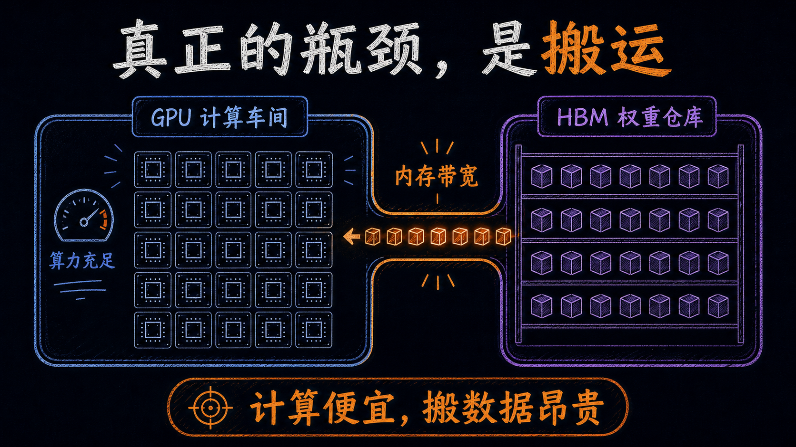
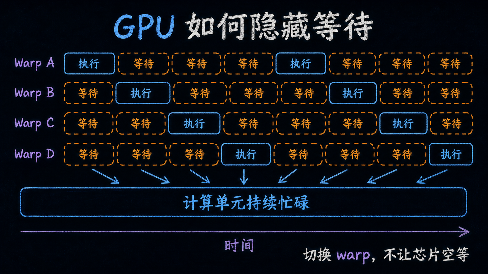
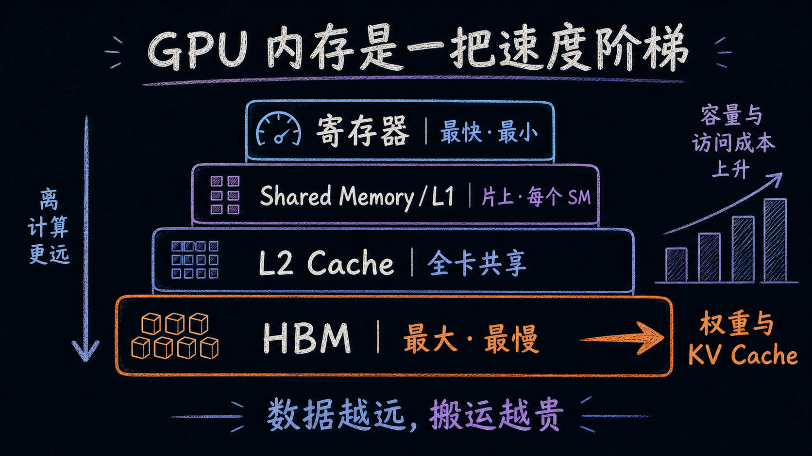
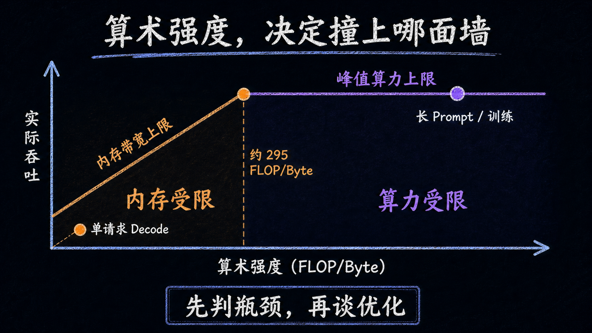
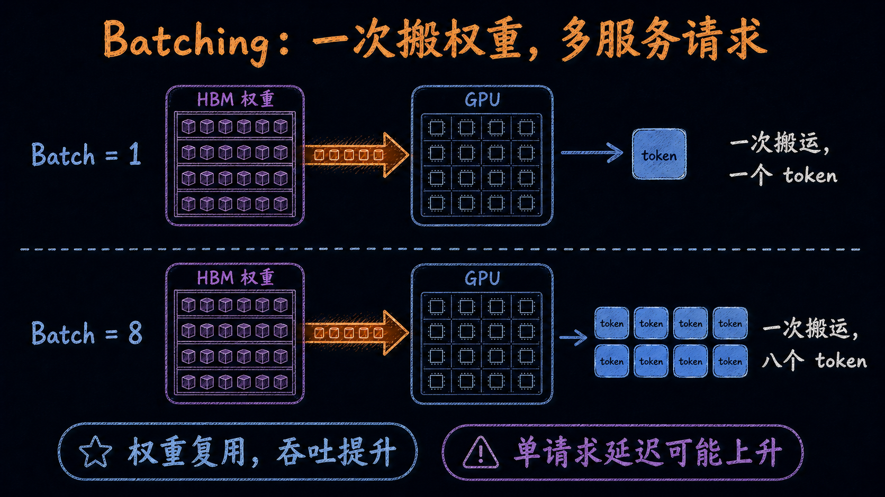
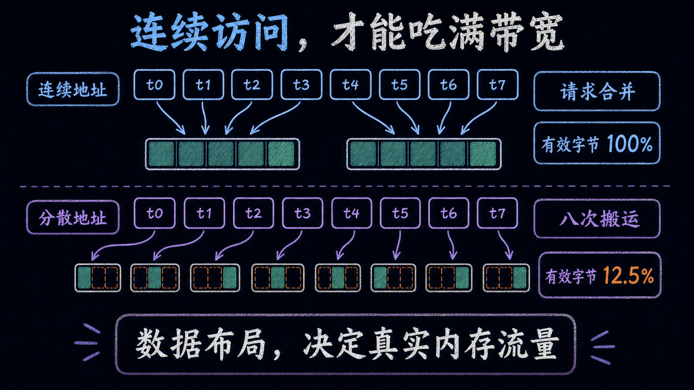

# LLM 单请求推理慢，不是 GPU 算不动，而是权重搬不动

你租了一张 H100，监控里的 GPU 利用率接近 100%，一个大模型却只吐出几十个 token/s。驱动没坏，框架也没报错，换一张峰值算力更高的卡，速度可能还是没明显变化。

小批量自回归生成最常见的瓶颈，不是“乘法做不够快”，而是每生成一个 token，都要把大量模型权重从 HBM 搬到计算单元。**Decode 拼的是内存带宽；Prefill 才更容易拼算力。**

看懂这条分界线，batching、量化、算子融合、FlashAttention 就不再是四个要背的技巧，而是同一套性能逻辑的四种落地。

## 先记住 GPU 最反直觉的一面

在现代 GPU 上，做一次乘加很便宜，把参与计算的数字搬过来反而更贵。

可以把 GPU 想成一间车间。成千上万个计算单元是工作台，模型权重放在远处的仓库，HBM 带宽是连接仓库和车间的走廊。

工作台消耗材料的速度远高于走廊送货的速度。继续增加工作台，并不会让产线更快；只要走廊已经塞满，更多峰值 TFLOPS 只能继续等数据。



这也解释了 GPU 为什么长成今天这样。CPU 为少量线程准备大缓存、分支预测和乱序执行，希望一条任务尽快完成；GPU 删掉不少复杂控制逻辑，把芯片面积换成大量简单执行单元。

NVIDIA GPU 会把线程按 32 个一组编成 **warp**。同一个 warp 共享指令，适合对大量数据做同一种运算。代价是，一旦 32 个线程在分支里走不同路径，硬件就得分批执行，没走当前路径的线程只能闲着。

## GPU 没有消灭等待，只是把等待藏起来

从 HBM 取数据的延迟不会凭空消失。GPU 的做法是，同时让很多 warp 驻留在芯片上。

一个 warp 等数据时，调度器立刻换另一个已经就绪的 warp。它再停，就继续换。每个 warp 都可能花很多时间等待，但整张卡仍然不断有工作可调度。



所以常见监控里的 `GPU-Util=100%` 很容易误导人：它通常只能说明采样窗口里有 kernel 在运行，不能证明 Tensor Core 或 CUDA Core 正在接近峰值吞吐。卡可能“很忙”，计算单元却一直吃不饱。

判断 GPU 有没有真干满，至少要同时看三件事：HBM 带宽、SM 计算吞吐，以及 CPU 和 kernel 的时间线。

## 数据住得越远，搬一次越贵

GPU 的“显存”不是一个平面，而是一把从快到慢的梯子。

- **寄存器**：每个线程手边的少量数据，最快；
- **Shared Memory / L1**：每个 SM 内部的片上存储，容量小，但适合一批线程反复复用；
- **L2 Cache**：整张卡共享，容量更大，距离也更远；
- **HBM**：权重、KV Cache 和激活主要住在这里，容量最大，搬运代价最高。



性能优化的目标通常不是“少做两次加法”，而是把数据尽可能留在上面几层，多用几次再丢回 HBM。

FlashAttention 就是典型例子。普通 attention 会生成较大的中间结果，写回 HBM，下一步再读出来。FlashAttention 把计算切成能放入片上 SRAM 的小块，边算边更新结果，减少 HBM 读写。数学定义没变，数据少跑了很多远路。

## 一次搬运值不值，看“每字节做了多少计算”

性能工程里有一个非常好用的数：**算术强度（Arithmetic Intensity）**。

```text
算术强度 = 计算量（FLOPs）÷ 从主存搬运的数据量（Bytes）
```

同样读一个数，如果只乘一次就扔掉，算术强度很低；如果把它放在片上存储里，与一千个数反复计算，算术强度就高得多。

每张 GPU 都有一条分界线：

```text
分界线 = 峰值计算吞吐 ÷ 峰值内存带宽
```

以 H100 SXM 为教学近似，dense BF16 计算吞吐约 989 TFLOPS，HBM 带宽为 3.35TB/s，分界线约为 **295 FLOP/Byte**。

低于这条线，继续加算力没用，工作负载受内存限制；高于这条线，数据已经喂得够快，瓶颈才转到计算单元。性能工程师把这张图叫 **Roofline Model**。



## 为什么小批量 Decode 几乎站在最左边

自回归生成一次只增加一个 token。生成下一个 token 时，模型要再跑一遍前向计算，并读取这一轮需要的权重。

一个 BF16 权重占 2 Bytes，参与一次乘加大约贡献 2 FLOPs。只看权重，算术强度接近 **1 FLOP/Byte**，离 H100 约 295 FLOP/Byte 的分界线很远。

用一个能放进 80GB H100 的 30B BF16 模型做粗略估算：

```text
权重大小：30B × 2 Bytes ≈ 60GB
带宽上限：3.35TB/s ÷ 60GB ≈ 56 次整模型读取/秒
理想 Decode 上限：约 56 token/s
```

这不是 benchmark，而是忽略 KV Cache、激活、调度和 kernel 开销后的物理上限。实际速度只会更低。

Prefill 正好相反。输入的一批 token 可以共同复用读进来的权重，矩阵乘法规模更大，算术强度明显上升，因此更容易进入 compute-bound 区域。把 TTFT 和每 token 延迟混成一个指标，性能判断很容易跑偏。

## 四类优化，其实只做了两件事

### 1. Batching：同一批权重多服务几个请求

一次处理多条序列，权重从 HBM 读进来后可以被重复使用。batch 从 1 增到 8，理论上的权重复用也接近增加 8 倍。



这就是 continuous batching 对服务吞吐如此重要的原因。但它主要改善总吞吐，不保证单请求更快。为了凑 batch 等太久，TTFT 和 p99 反而会变差。

### 2. Quantization：让每轮必须搬的权重变小

BF16 权重换成 INT8，体积大致减半，单看带宽上限，Decode 吞吐可能接近翻倍；更低比特还能继续压缩。

但量化不是免费午餐。模型精度、校准方式、量化/反量化 kernel，以及硬件有没有对应低精度加速路径，都要实测。

### 3. Fusion 和 FlashAttention：别把中间结果反复送回 HBM

多个逐元素算子分开跑，每个算子都可能读一次、写一次 HBM。融合后，中间值留在寄存器或 Shared Memory，最后只写回一次。

FlashAttention 也是这条路线：用 tiling 和重计算，换掉更昂贵的 HBM 往返。

### 4. 连续读写：把带宽花在真正需要的数据上

GPU 按内存事务成块读取数据。同一 warp 的线程访问相邻地址时，请求可以合并；访问位置很散，就可能为了几个字节搬来整块数据。



这也是为什么 tensor layout、padding 和读写轴向会影响性能。算术一行没变，实际内存流量却可能差很多。

## 别先换卡，先用三步定位瓶颈

我会按这个顺序查 LLM serving：

1. **HBM 接近上限，SM 吞吐很低**：memory-bound。先看 batch、权重精度、KV Cache、算子融合和数据布局；
2. **SM 接近上限，HBM 没吃满**：compute-bound。重点看低精度 kernel、矩阵形状、并行策略和更强算力；
3. **两边都低**：overhead-bound。查小 kernel 太多、CPU 调度、同步、通信，以及能否用 CUDA Graphs 或更大算子减少 launch。

采购 GPU 也该沿用同一逻辑。不要只比 TFLOPS，至少把模型能否装下、HBM 带宽、目标 batch、TTFT、ITL、p50/p99 和吞吐放进同一次 PoC。

下次看到 `GPU-Util=100%` 但 token/s 上不去，先别急着扩容。把上面三步存下来：**先判定是在等数据、等计算，还是等调度，再决定钱该花在带宽、算力还是 serving 系统上。**

如果你正在做 LLM serving，可以把这篇转给负责推理优化的同事。下一篇我会继续拆 KV Cache：上下文变长后，显存为什么会从“装权重”变成“养会话”。
