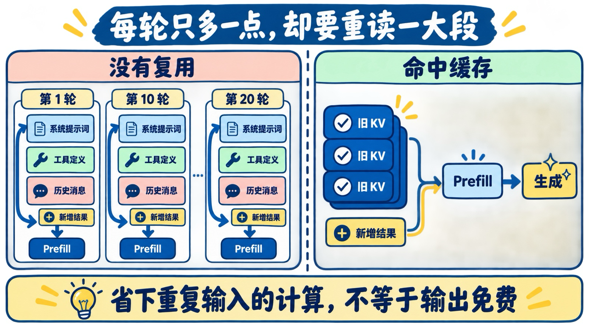
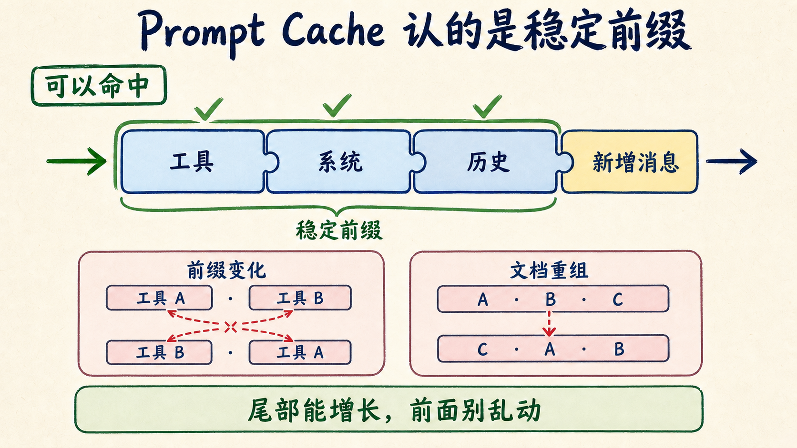
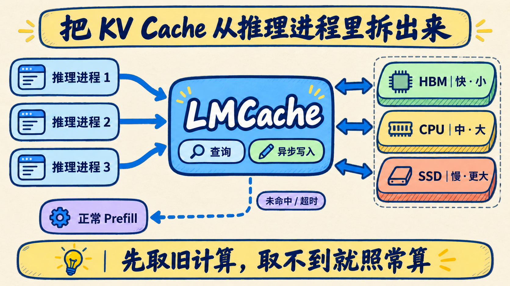

# Agent 上下文越跑越贵，先把 KV Cache 从推理进程里拆出来

一个 Coding Agent 跑到第 20 轮，眼前只多了一条工具结果，发给模型的输入却可能已经塞满系统提示词、工具定义、代码文件和前 19 轮历史。

模型每次都要先把这些内容读一遍，首字越来越慢。你以为 GPU 在继续思考，其实相当一部分时间花在重复做 prefill。

Provider 的 Prompt Cache 已经能省掉稳定前缀。可一旦自己部署模型，流量跨多个推理进程、工作集装不进显存，或者 RAG 文档不断换顺序，进程内 Prefix Cache 就开始撞墙。

LMCache 想做的，是把 KV Cache 从推理进程里拆出来，变成一层能共享、能分级、能观察的基础设施。

我的判断先放前面：API 用户先把 Prompt Cache 用对；自托管团队只有在“长输入、高复用、高并发、显存吃紧”同时出现时，才值得为独立 KV Cache 服务付出运维成本。

## Agent 的账单，常常先花在 prefill

模型收到一段输入，先经过 prefill：每个 token 在每一层注意力里生成 Key 和 Value。它们会被留在显存里，后续每生成一个 token，直接读取此前的 K/V，不必把旧 token 全部重新算一遍。

这份中间结果就是 KV Cache。

同一个系统提示词、同一组工具定义、同一段对话前缀，它们对应的 K/V 也可以复用。命中缓存后，服务跳过那段重复 prefill，只处理新追加的输入，再进入 decode。

所以要先分清两笔账：KV Cache 省的是重复输入的计算和首字等待时间；新输入与输出 token 仍然要处理。把“缓存输入便宜 90%”写成“总成本下降 90%”，上线后一定会失望。

命中也不是免费。KV 留在 HBM，读取很快但容量小；下沉到 CPU、SSD 或远端后，容量变大，搬运和等待也跟着增加。最终比较的是两段时间：**把旧 KV 取回来，还是把原输入重新 prefill，哪个更快。**

短上下文、低并发、小工作集经常是后者。缓存系统越复杂，不代表延迟越低。

## Prompt Cache 很划算，但它认前缀

以 Anthropic 当前公开价格为例，5 分钟缓存写入是普通输入价的 1.25 倍，命中读取是 0.1 倍。一次命中就足以覆盖那 0.25 倍的额外写入成本。

条件也很明确：可复用部分必须保持一致，并按 `tools → system → messages` 组成稳定前缀。前方改了一处，后面的缓存也会受影响。

这给 Agent 应用留下了几条很具体的优化：

- 系统提示词和工具定义放前面，别在每轮动态改写；
- 工具列表保持稳定顺序，不要随手遍历一个无序集合；
- 大段固定资料放在用户问题之前；
- 会话需要压缩时，避免频繁改动已经缓存的前段；
- 同一任务连续调用，别拖过缓存 TTL 才发下一轮。

如果你调用托管 API，先把这些做到位。没有必要一看见“缓存”两个字，就先搭一套新的分布式服务。

这里有个容易写错的细节：对话在尾部继续增长，不会自动毁掉前面的缓存。只要前缀保持一致，旧 K/V 仍能接上新一轮。麻烦来自前缀内容或顺序变化，以及多个独立片段重新组合。

比如 RAG 先取出文档 A、B、C，下一轮因为召回分数变化，顺序变成 C、A、B。三份材料都读过，拼起来却不再匹配旧前缀。又比如不同请求需要组合各自缓存过的文档，直接拼接各段 K/V 会漏掉文档之间的注意力关系。

对只在显存里维护缓存的推理服务，还有一层限制：多个数据并行进程各管一份缓存。相同上下文被路由到另一个进程，或者热数据被显存淘汰，复用机会就没了。

## LMCache 把缓存做成独立服务

LMCache 的做法像给推理集群加一层专门的缓存系统。

推理引擎继续负责调度和生成；KV 可以分层留在 GPU、CPU 内存、本地 SSD 或远端存储。LMCache 的 MP 模式以独立服务运行，多个推理进程注册到同一个缓存池，于是跨进程也能找回相同上下文。

一次请求进来，推理进程先按 token 块查询缓存。命中就把 KV 拉回可用位置，只对缺失部分做 prefill；未命中则照常计算，并异步把结果写入后面的存储层。缓存服务超时也应退回正常 prefill，不能让“加速层”变成整条推理链路的单点故障。

这套设计解决了两个现实问题：

- 缓存不再和某个推理进程同生共死，重启或跨实例调度时仍有机会复用；
- 显存放不下的工作集可以下沉到更大的存储层，再异步预取回来。

代价也一并进来了：缓存键必须在不同进程间保持一致；淘汰策略要看工作集；CPU 内存、PCIe、网卡和 SSD 都可能成为新瓶颈；命中率高但取回太慢，指标看上去漂亮，用户依然在等。

LMCache 团队在 2026 年 5 月公开了一组 MI300X 测试。8 用户、32K 上下文的低负载下，工作集能放进 HBM，原生 Prefix Cache 完成 52 个请求，LMCache 只完成 25 个。多一层搬运，此时成了负担。

压力拉到 32 用户、100K 上下文后，显存开始顶不住，LMCache 的平均 TTFT 才从 HBM Prefix Cache 的 102.17 秒降到 34.59 秒，并完成 28 个请求，对方只有 12 个。

数字属于 2 张 MI300X、MiniMax-M2.5 和指定软件版本，不能抄成“部署就提速 3 倍”。它提供的工程判断更有用：**工作集还在显存里时，搬缓存可能比重算更慢；工作集溢出后，分层缓存才开始还债。**

## 文档换顺序，CacheBlend 怎么补

独立存储解决“缓存放哪儿”，还没有解决“不同文档的 KV 能不能直接拼”。

CacheBlend 处理的是后一个问题。它先复用各文档已有的 KV，再挑出受上下文影响较大的少量 token 重算，用这部分计算补回跨文档注意力。

EuroSys 2025 论文在 3 个开源模型和 3 组数据集上测试，相比完整重算与 Prefix Cache 基线，TTFT 改善 2.2–3.3 倍，吞吐提高 2.8–5 倍。作者的经验是，重算少于 15% 的 token 往往能接近完整重算质量。

“往往”两个字不能删。模型、文档相关性、任务类型变了，重算比例和质量也会变。对答案可验证的检索任务，可以先做离线评测；涉及合规、医疗、财务等高风险回答，别拿论文均值替代自己的质量门槛。

## 上线前，先抄这张检查单

我不会先问“要不要上 LMCache”，而会先拉出一周请求数据，看六项：

1. 每轮输入里，有多少 token 与前一轮重复；
2. Prefix Cache 的命中率和命中 token 数；
3. p50、p95、p99 TTFT，而不只看平均值；
4. 从缓存读取一段 KV 花多久，从头 prefill 又花多久；
5. 工作集是否频繁被 HBM 淘汰，CPU、SSD、网络是否还有余量；
6. 缓存服务超时或命中异常时，能否降级为正常 prefill。

API 用户如果连第 2 项都没拿到，先检查稳定前缀、TTL、工具顺序和缓存断点。

自托管团队如果发现长上下文重复率高、跨进程调度频繁、p95 TTFT 被 prefill 拉长，再做一次真实流量回放。固定模型、硬件、并发与请求集，只切换三组配置：无缓存、引擎自带 Prefix Cache、LMCache 分层缓存。

每组至少记录命中 token、缓存读取时间、prefill 时间、TTFT 分位数和完成请求数。别拿一条重复提示词的 warm hit，替代真实 Agent 工作集。

缓存不是越大越好，也不是层数越多越先进。它只在“取回旧计算”比“重新计算”更便宜时成立。

如果你正好在做 Agent 推理服务，建议先收藏这六项。也欢迎留言说说你的上下文长度、并发和当前命中率，我后面可以按这些真实负载继续拆配置。

## 资料来源

- [LMCache 官方文档](https://docs.lmcache.ai/)
- [LMCache MP 模式基准](https://blog.lmcache.ai/en/2026/04/03/lmcaches-new-architecture-boosts-moe-inference-performance-by-10x/)
- [LMCache 在 AMD MI300X 上的 Agent 负载测试](https://blog.lmcache.ai/en/2026/05/12/benchmarking-lmcache-for-multi-turn-agentic-workloads-on-amd-mi300x/)
- [Anthropic Prompt Caching 定价](https://platform.claude.com/docs/en/about-claude/pricing)
- [Anthropic Prompt Caching 文档](https://platform.claude.com/docs/en/build-with-claude/prompt-caching)
- [CacheBlend 论文](https://www.microsoft.com/en-us/research/uploads/prod/2024/09/eurosys25-final999.pdf)
- [原始 X Article：Your KV Caching Is Broken](https://x.com/akshay_pachaar/status/2074502882812952666)
