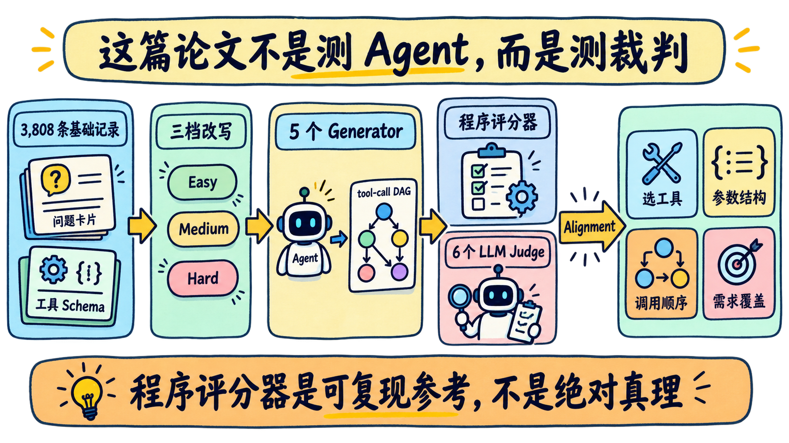
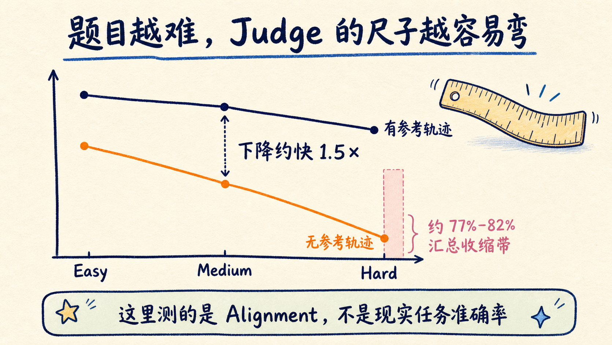
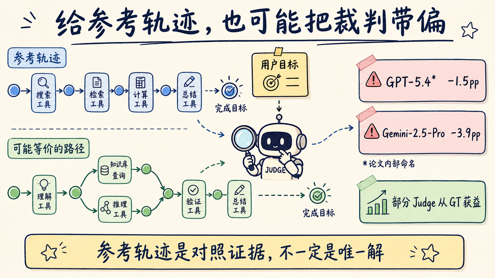
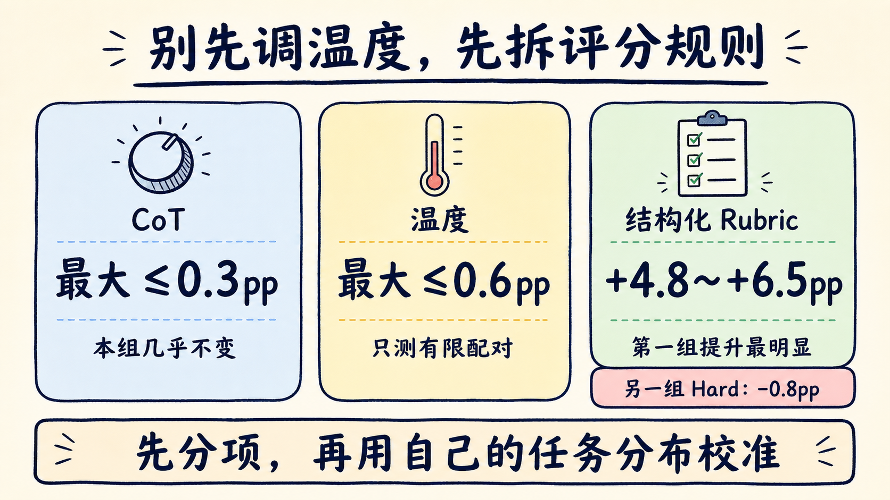

# 给 Agent 判卷，AI 裁判先撞上了结构性天花板

周五上线前，评测看板显示 Agent 新版本分数更高。团队准备放行，却没人能回答：Agent 真的变好了，还是负责打分的 LLM Judge 更愿意给高分？

ServiceNow AI 的新论文 [AgentJudgeBench](https://arxiv.org/html/2608.26623v1) 专门给“裁判”做了一次压力测试。11,424 道多步骤工具调用题里，任务越难、越缺参考轨迹，Judge 与程序评分器的一致度越低；给出参考轨迹，也不保证每个 Judge 都会更可靠。

论文测的是 LLM Judge 与一套程序评分器的 **alignment**，不是 Agent 在现实世界里的任务成功率。标题里的“天花板”，指 hard、without-GT 条件下 Judge 区分力收缩，不是现实准确率上限。如果你正用 LLM Judge 做回归、验收或发布门禁，工程结论很直接：**LLM 可以补语义，但不能独占真相层。**

## 这篇论文不是测 Agent，而是测裁判

文本生成好不好，多少带有偏好。工具调用不一样。

一个 Agent 要先选对工具，再填对参数；有依赖的调用必须按顺序执行，并行分支要在正确位置汇合；最后还得覆盖用户要求的所有步骤。回答写得流畅，和调用轨迹能不能执行，是两回事。

AgentJudgeBench 从 BFCL 风格数据出发，准备了 3,808 条基础记录。每条记录保留同一套工具和参考轨迹，再改写成 easy、medium、hard 三种问法，得到 11,424 个问题变体，覆盖六种 DAG 拓扑。

五个 Generator 先生成工具调用序列，六个主 Judge 再分别判卷。每个 Judge 都做两次：

- **with-GT**：能看到参考工具调用轨迹；
- **without-GT**：只能看问题、工具 Schema 和 Agent 输出。

判分拆成四项：工具有没有选对、参数 key 是否完整、调用顺序是否匹配、参考轨迹中的预期工具覆盖了多少。程序评分器也计算同样四项，论文再比较 LLM Judge 的分数离程序分数有多远。

实验最终保留 53,608 条可解析的 Generator 输出。每条输出交给六个 Judge，再成对比较 with-GT 与 without-GT，得到 321,648 个唯一 Judge 评测元组；如果把两个条件分别计数，就是 643,296 个 condition-specific evaluation instances。这里不能把“32 万组成对实验”缩写成“32 万次单独调用”，否则条件维度会被吃掉。

这里的程序评分器是一把可复现的尺子，但不是上帝视角。它没有执行真实工具；参数结构只看 key，不懂参数值的业务语义；顺序只认一条参考轨迹，两个功能等价的并行分支如果交换位置，也可能被扣分。

所以，这篇论文研究的是“裁判能否稳定复现一把结构化尺子”，不是“谁掌握了唯一正确答案”。

*据 Verma 等《AgentJudgeBench》Figure 1、Figure 2 重绘，CC BY 4.0。*

## 难题一多，Judge 的尺子也会变形

论文组合了 5 个 Generator 和 6 个 Judge。30 个组合无论有没有 GT，alignment 都随 easy → hard 单调下降。without-GT 的下降速度，大约是 with-GT 的 1.5 倍。

没有参考轨迹时，Judge 要同时从自然语言问题、工具 Schema 和生成结果中重建依赖关系。遇到 fan-in、diamond 或 loop-like 结构，它不仅要看单个调用对不对，还要追踪跨分支的先后约束。题目越含糊，裁判自己要完成的推理越接近一次新的规划任务。

**工作流结构本身也是难度。** 在论文的 with-GT 拓扑分析里，六 Judge 均值中 fan-out 约为 92.8%，fan-in 约为 84.1%，相差约 8.7 个百分点。并行分支如果彼此独立，可以拆开检查；多个分支汇入同一个后续调用时，Judge 必须同时追踪前置结果。这个结论只对该合成基准负责，但它提醒我们：Agent 评测不能只按“问题类型”切片，还要按依赖拓扑切片。

论文最醒目的结果出现在 hard、without-GT 条件：六个 Judge 的汇总 alignment 被压进约 77%–82% 的窄区间，模型规模没有拉开明显差距。

这不是说所有实验格都严格落在 77%–82%。不同 Generator 的绝对水平仍有差异，有些单元低到约 69%，有些高到约 85%。稳定出现的是另一件事：**面对同一个 Generator，不同 Judge 的差距被压扁了。**

如果这些 Judge 只是各自犯随机错误，多裁判投票应该有帮助。实验里，六 Judge 软集成约为 79.5%，最好单 Judge 约为 79.8%，差距不超过 0.4 个百分点。

至少在这套基准里，简单集成没有靠差异化错误获得额外收益。

*据 Verma 等《AgentJudgeBench》Figure 8 重绘，CC BY 4.0。*

## 六个裁判都同意，也可能只是一起乐观

更危险的是，一致率在这里给出了反向信号。

按指标级 verdict 的 exact agreement 计算，有 GT 时 Judge 之间的平均一致率是 79.1%，Cohen's κ 约为 0.419；没有 GT 时，Judge 间一致率反而升到 92.6%，κ 约为 0.559。

如果只看“一致率”，without-GT 似乎更可靠。可它与程序评分器的 alignment 明明下降得更快。

论文追到评分 Prompt 后发现，无 GT 的 Judge 在不确定时倾向给 1.0。分数大量挤向满分，裁判之间当然更容易一致，但这种一致缺少区分力。

这对线上监控很重要。一个评测 Dashboard 显示“六个 Judge 一致通过”，不能自动等同于高置信度。你还得看它们为什么一致：是证据充分，还是 rubric 把不确定性都折叠成了乐观分数。

**共识是一个观测值，不是正确性的替代品。**

到这里，我的判断已经够明确：LLM Judge 适合做语义复核和争议分流，不适合单独决定发布。能执行、能写成规则验证的约束，先交给程序；只有意图覆盖、语义等价和开放质量判断，才交给 LLM。

## 把参考答案递过去，也可能把裁判带偏

按直觉，给 Judge 参考轨迹应该更容易判准。按论文 GT lift 的口径——四个开放权重 Generator × 三档难度，共 12 个配置——QwQ-32B 和 GPT-OSS-120B 确实从 GT 中获益，但两个前沿 Judge 的程序参考 alignment 反而下降：

- 论文内部命名的 GPT-5.4：-1.5 个百分点；
- Gemini-2.5-Pro：-3.9 个百分点。

这里的负值只表示 with-GT 相对 without-GT 的程序参考 alignment 下降，不表示 GT 降低了 Agent 本身的能力。

作者认为这一结果与 over-anchoring 一致：Judge 看到参考轨迹后，可能过度依赖它的表面结构，从而惩罚功能等价、但结构不同的调用方案。

论文又做了一组 corrupted-GT 控制实验，故意把其他样本的错误参考轨迹交给 Judge。Gemini-2.5-Pro 在错误 GT 与标准 GT 下的 alignment 只差 0–1.8 个百分点；QwQ-32B 在错误 GT 下则更接近 without-GT 基线，两者相差不超过 0.2 个百分点。

这组证据对 Gemini 的锚定解释更直接。GPT-5.4 虽然也出现负 GT lift，但论文没有给它做同强度的案例验证，不能把两者写成已经证明的同一种机制。

工程上更稳的做法，是把“参考轨迹”当作对照证据，而不是唯一答案。特别是并行工具、可替代工具和合法的额外参数，都可能让一条有效轨迹长得不像标注轨迹。

*据 Verma 等《AgentJudgeBench》Figure 3、Table 1 与 corrupted-GT 控制实验重绘，CC BY 4.0。*

## 最像程序的 Judge，不一定最像人

论文还用 120 条 hard 样本做了人工验证，每条样本由一名标注者判断四个指标，共 480 个 metric-level verdict。

按程序评分器排，QwQ-32B 的 alignment 是 82.9%，略高于 GPT-OSS-120B 的 82.2%；换成人工判断，QwQ-32B 降到 74.3%，GPT-OSS-120B 则是 79.4%。两套 Judge 排名的 Spearman ρ 只有 0.26。

差异最大的指标是参数结构。程序评分器会惩罚参考轨迹里没有出现的额外参数 key；人类标注者却可能认为，只要额外参数 key 在工具 Schema 中合法，就不该因为它没出现在特定 GT 轨迹里而扣分。

这组实验不能证明 GPT-OSS-120B 是生产环境冠军。样本只有 120 条，每条只有一名标注者，没有标注者间一致率。它能支持的判断更克制：**“最好 Judge”取决于你把程序规则、参考轨迹还是人工语义当作目标。** 如果团队连目标都没说清，榜一模型也没有可解释意义。

评测条件也会改写排名。QwQ-32B 在 15 个 with-GT 配置中拿了 10 个第一，却没有在任何 without-GT 配置中排名第一。选 Judge 前只需先说清三件事：生产里有没有可靠 GT，要校准程序规则还是人工语义，门禁面对的是 easy 回归题还是 hard 长尾题。

## 先别急着加 CoT，评分结构更值得试

碰到 Judge 不稳定，常见反应是让模型多想一会儿，或者把温度调低。AgentJudgeBench 的消融给这两种办法泼了冷水。

QwQ-32B 在四个开放权重 Generator 上开关 thinking 后，平均 GT 差异只有 +0.11 个百分点，任一 difficulty × condition 单元的最大差异不超过 0.3。温度方面，Qwen3-32B Judge × Llama-3.3-70B Generator 在三档难度和两种 GT 条件中的最大 spread 为 0.6 个百分点；第二组 GPT-OSS-120B × Llama-3.1-8B-Instruct 只测试了 with-GT，最大 spread 为 0.25。

这不等于“所有 Judge 的 CoT 和温度都没用”。实验只覆盖有限模型配对。它说明的是：在这套结构匹配任务中，先调解码参数，收益很可能小于重写评分规则。

在论文测试的配置手段里，第一组配对上最大的改善来自逐指标、结构化的评分 Prompt。

在 Qwen3-32B Judge × Llama-3.3-70B Generator 的 with-GT 实验中，保留逐指标定义和评分 rubric 的结构化 Prompt，比移除这些 rubric 的 free-form Prompt 高 4.8–6.5 个百分点。换到 QwQ-32B × SmolLM3-3B 的 with-GT 实验，easy 提升 3.9、medium 提升 2.4，hard 还反转成 -0.8。

所以我的优先级会是：**先把“选工具、参数、顺序、覆盖”拆开评分，再用自己的模型和难度分布做校准。** 不会把论文里的 +6.5pp 直接抄成生产承诺。

*据 Verma 等《AgentJudgeBench》Figure 4、Figure 5 与 Table 5 重绘，CC BY 4.0。*

## 程序第一、LLM 第二：四层评测防线

如果今天要给一套 Agent 工具调用系统搭评测，我不会让一个 LLM Judge 输出总分后直接过闸。更稳的结构分四层。

**第一层：确定性结构检查。**

能写成代码的约束先别交给模型：JSON Schema、必填参数、类型、工具白名单、依赖顺序、真实执行结果、权限和副作用，都应该留下可重放证据。

论文的程序评分器没有执行真实工具。生产系统还要往前走一步：在安全环境里回放调用，验证参数值、返回状态和副作用，并把原始 trace、规则命中和执行结果一起保存。没有证据链的“通过”，以后很难复盘。

**第二层：LLM 语义复核。**

把 LLM 用在程序难以覆盖的位置：用户意图是否满足、两个工具是否功能等价、额外参数是否合理、失败解释是否诚实。Judge 要逐项给理由，不能只返回一个总分。

我会要求 Judge 输出错误类型、证据位置和不确定性说明。总分适合排序，不适合解释；一旦它直接控制发布门禁，团队必须知道是哪条证据让它放行。

**第三层：保存分歧，不急着平均。**

程序分、无 GT 盲审分、参考轨迹复核分如果差异很大，应该进入争议队列。可以测试“先盲审，再看 GT”的两阶段流程，观察参考答案有没有改变判断。注意：这套流程是工程建议，论文没有直接验证。

争议队列至少要区分硬约束违规、功能等价路径、参考轨迹缺失、证据不足和 Judge 不稳定。不要把三种分数简单平均；一个确定性的权限违规，不能被两位乐观 Judge 投票覆盖。

**第四层：分层人工抽检。**

不要只随机抽 easy 样本。按难度、DAG 拓扑、Generator、Judge 分歧和失败类型抽样，尤其检查 fan-in、loop-like 与没有 GT 的 hard 任务。

高副作用工具和大分歧样本应该优先复核，人工结论再沉淀成回归样本与 rubric 反例。只在 easy 集上做随机抽样，很容易得到一份好看的相关性报告，却看不到上线后最贵的错误。

上线前，可以逐项问四个问题：

1. 哪些错误已经由程序确定，为什么还要付费请 LLM 再猜一次？
2. Judge 的高一致率来自共同证据，还是共同默认分？
3. 参考轨迹是唯一合法路径，还是只是一条标注路径？
4. 最难的样本有没有人工校准，还是全靠 easy 集上的漂亮相关性？

这四问比“该选哪个最强 Judge”更接近评测系统的地基。

## 这篇论文还没有覆盖生产现场

AgentJudgeBench 的数据全部是合成的，只测单轮、无状态规划。它不执行真实工具，也不包含多轮恢复、环境状态和线上副作用。

人工验证也只有 120 条 hard 样本，每条由一名标注者完成，没有标注者间一致率。人工与程序总体一致 92.7%，但参数结构一项只有 82.5%，恰好说明程序尺子和人类语义判断并不完全重合。

此外，在 198 组抽样难度三元组中，只有 58.1% 的 easy → medium 改写被三个 meta-judge 一致认定为确实变难；medium → hard 的全票比例为 93.9%。所以主结论更应该看 medium 到 hard 的退化，不要把三档难度理解成同样精准的标尺。

论文还把一个不可复现的 Azure GPT-5 preview 快照内部称作 GPT-5.4，并让它同时担任 Generator、LLM Judge 和难度改写验证的 meta-judge。正文里的相关数字只能当作该快照在该实验设置中的结果，不能被读成一个公开产品型号的稳定能力。论文也没有把这些 Judge 接进 RLHF、DPO 或奖励训练，因此“难题上的分数压缩会污染训练信号”目前只是值得验证的风险，不是已经跑完的因果结论。

AgentJudgeBench 不是在宣布 LLM Judge 失去价值。它提醒我们：一个同样受难度、Prompt 和参考轨迹影响的模型，不能替代全部确定性证据。

把文末四问直接贴进下一次 Agent 评测方案评审。你们现在最难处理的是规则覆盖、语义等价，还是 Judge 分歧？留言 **Judge** 加一个具体场景。下一篇我会用一套 eval schema 拆字段、失败类型、争议队列和发布门禁。

## 论文与数据

- [AgentJudgeBench 论文 HTML](https://arxiv.org/html/2608.26623v1)
- [AgentJudgeBench 代码](https://github.com/ServiceNow/SyGra/tree/scratch/agent_judge_bench/tasks/agentic_bfcl_judge_eval)
- [AgentJudgeBench 数据集](https://huggingface.co/datasets/ServiceNow-AI/AgentJudgeBench)
