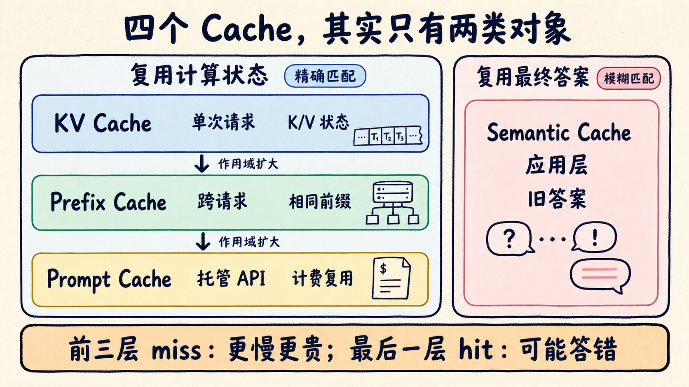
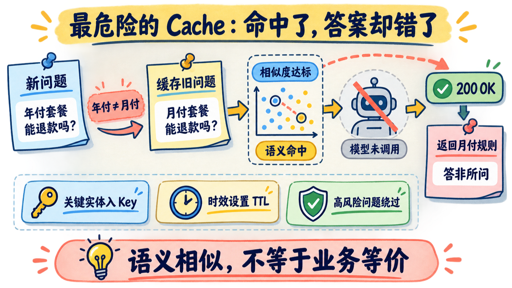
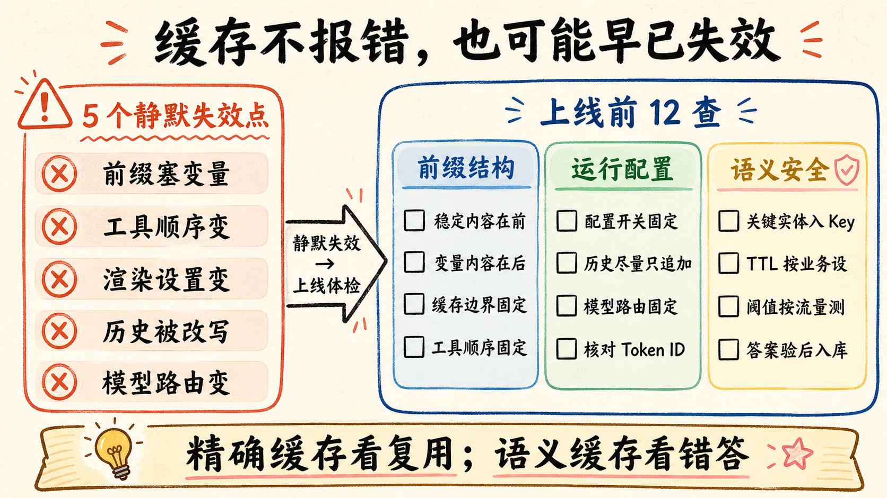

# 同样叫 Cache：前三层失效会变贵，最后一层命中却可能答错

你把 Agent 的系统提示词、工具定义和知识库都固定好了，第二天账单还是忽高忽低。监控里明明写着 Cache，首字延迟却没降；更麻烦的是，客服机器人偶尔会把“年付退款规则”答成“月付退款规则”，接口还正常返回 200。

问题通常不在“缓存有没有开”，而在团队把四种作用域不同的 Cache 混成了一个指标。

我的判断先放前面：**KV Cache、Prefix Cache、Prompt Cache，都在复用同一类中间计算；Semantic Cache 复用的是旧答案。前三种失效，主要后果是更慢、更贵；最后一种错误命中，可能把旧答案原封不动交给新问题。**

这篇不再展开 LMCache 的分层存储，而是用 5 分钟拆清四个名字、五个静默失效点，以及一张能直接放进上线评审的 12 项体检表。

## 四个 Cache，其实是两条路

先看 KV Cache。

模型读取提示词时，会为每个 token 计算 Key 和 Value。生成下一个 token 时，后续位置还要反复读取这些 K/V，所以推理引擎会把它们留在显存里，不再从头重算。常见实现中，它跟着一次生成请求生长；请求结束后，如果没有被外部持有或转入共享缓存，就会释放。

为什么没有 Query Cache？一个 token 的 Query 只在它被处理的那一步使用一次；后续 token 会反复读取的是此前的 Key 和 Value。把 K/V 留下来，decode 每一步只需要为新 token 追加一组状态。

这也解释了另一个边界：KV Cache 减少了重复计算，却让 decode 更依赖显存带宽。上下文越长，每生成一个 token，需要读取的历史 K/V 越多。缓存不是把计算消灭了，而是把一部分瓶颈从算力推向内存容量和带宽。

**Prefix Cache 做的是跨请求复用。**服务端不急着清除已经无引用的旧 K/V，而是按 token 块建立索引。新请求进来，从第一个 token 开始比对；前缀相同的部分直接接上，遇到第一处不匹配，后面重新 prefill。

当前块的 key 还会带上父块哈希，于是第 5 个块只有在前 4 个块也一致时才能命中。这是一条哈希链：中间断一次，后面即使再次出现相同文本，也不能直接接回去。

这里要纠正一个常见写法：**vLLM 当前标准配置里的 16 token 是默认块大小，不是 Prefix Cache 的物理定律。**模型、后端与匹配粒度会随实现演进。块越大，索引更少，但复用粒度更粗；块越小，复用更细，管理成本也会上升。

多租户服务还要处理隔离。两个客户发送相同前缀，理论上可能落到同一缓存键空间。按租户加入不可预测的 salt 可以把缓存空间分开，代价是多存一份 K/V、整体命中率下降。为了追求命中率把所有客户混进一个共享空间，安全账可能比 GPU 账更贵。

**Prompt Cache 是云厂商把精确前缀复用产品化。**硬件、块表和淘汰策略都藏在服务端，开发者看到的是缓存边界、TTL、usage 字段和单独计费。它存的仍不是“提示词文本”或最终答案，而是稳定前缀对应的中间状态。

**Semantic Cache 走了另一条路。**它先把问题转成向量，在历史问题中找近邻；相似度超过阈值，就跳过大模型，直接返回那条历史回答。输入和输出 token 都省了，但答案也不再经过本轮模型判断。

所以我不会把四层命中率加总成一个数字。前三层看复用 token、prefill 时间和 TTFT；Semantic Cache 要看错误命中率、答案新鲜度和越权风险。

## 缓存最怕的，不是大改，是前面动了一点

精确前缀有个苛刻规则：文本看着一样还不够，最终渲染出来的 token 序列必须从头一致。

我更常见的静默失效，集中在五处：

1. **动态字段跑到最前面。**时间戳、request ID、用户名一变，后面的稳定内容跟着失效。
2. **工具定义顺序漂移。**同一组 JSON Schema 被重新排序，token 序列已经不同。
3. **服务端配置改写上下文。**Web Search、citations、thinking、tool choice 或推理档位变化，都可能让渲染后的前缀分叉。
4. **历史摘要改写旧内容。**在尾部追加新消息可以继续复用；回头重写早期历史，会从修改点开始变冷。
5. **请求换了模型。**缓存通常按模型隔离，路由到便宜模型，不会继承原模型的 K/V。

日志里只保存原始文本，往往看不出这些差异。最有效的排障动作，是把两次请求经过同一 chat template 后的 token IDs 放在一起，找到第一个不同的索引。缓存从哪里断，通常几分钟就能定位。

## Anthropic 的 0.1 倍，不是整张账单打一折

按 Anthropic 当前公开规则，在支持 Prompt Caching 的 Claude 模型上：

- 5 分钟缓存写入，按基础输入 token 价格的 **1.25 倍**计费；
- 1 小时缓存写入，按基础输入 token 价格的 **2 倍**计费；
- 命中读取，按基础输入 token 价格的 **0.1 倍**计费。

边界比倍数更重要。

0.1 倍只落在**实际命中的缓存输入 token**上。本轮新增的输入照常计费，输出 token 也没有因为 Prompt Cache 自动打折。缓存段没达到对应模型的最小长度，或者前缀没有命中，请求照样成功，只是 usage 里的 cache read / creation 可能是 0。

命中省下的是重复 prefill，不是整次推理。输出很长、decode 占主导时，首字可能明显变快，总耗时却未必按相同比例下降。把“缓存输入便宜 90%”写成“总账单便宜 90%”，上线后一定会对不上账。

账也要按 TTL 算。5 分钟写入多付 0.25 倍，后续命中一次通常就能覆盖额外写入成本；1 小时写入多付 1 倍，需要至少两次后续命中，才开始比完全不缓存便宜。低频任务、间隔很长的批处理，开长 TTL 未必划算。

我会同时盯三项：`cache_creation_input_tokens`、`cache_read_input_tokens`、`input_tokens`。只看“缓存已开启”这个布尔值，没有排障价值。

## Semantic Cache：最省钱的一层，也最需要怀疑

Semantic Cache 的危险，不是它偶尔 miss，而是它“很像命中”。

原文用 MiniLM 做了一次演示：“How do I reset my password?”与同义改写的相似度是 0.961；“Is the API rate limited?”与加入一个 not 的反向问题，相似度仍有 0.952。两者只差不到 0.01。这是一次特定模型与版本下的实验，不是通用阈值，却足以说明：只靠一个相似度门槛，守不住所有业务反例。

金额、日期、套餐、地区、权限、否定词，都可能只改几个 token，却要求完全不同的答案。缓存不知道旧答案对不对，也不知道政策昨晚是否更新；它只知道两个问题在向量空间里很近。错误命中后，大模型根本没有出场，HTTP 状态仍然可以是 200。

还有一笔经常漏算的成本：Semantic Cache 的每次请求都要先做 embedding 和近邻检索，miss 之后才继续调用模型。数据量大了，还会引入 ANN 索引；索引自己的 recall 参数，会和相似度阈值叠在一起。命中少时，你得到的可能不是“免费缓存”，而是每次调用前又增加一段固定延迟。

我的取舍很保守：

- 字节完全相同的高频请求，先评估 **Exact-match Response Cache**；
- Semantic Cache 只放低风险、答案稳定、可明确过期的 FAQ；
- 按租户、权限、模型、知识库版本和政策版本隔离键空间；
- 命中前再检查实体、金额、时间、否定词等硬条件；
- 保留一键旁路和回退到模型的路径。

Exact-match 也不是只拿问题文本当 key。模型版本、系统提示词、知识库版本、用户权限和生成参数变了，旧回答同样要失效。它避免的是模糊匹配的误伤，不是自动解决内容过期。

阈值不能从博客里抄一个 0.95 就上线。它必须来自你自己的正负样本：确实同义的问题、看起来相似但答案不同的问题，都要进入评测集。命中率上升不代表系统更好，**错误命中率才是 Semantic Cache 的刹车距离。**

## 上线前，拿这 12 项逐条打勾

别先问“缓存开多大”。先用最近一周的真实请求回答下面 12 个问题。

**A. 先认清缓存对象**

1. 存的是单次请求 K/V、跨请求 K/V，还是完整回答？
2. 生命周期到请求、进程、模型，还是跨实例？
3. 命中条件是 token 精确前缀，还是 embedding 模糊相似？
4. 基线是否拆开记录 prefill、decode、p50 / p95 TTFT 和 token 成本？

**B. 再查精确前缀**

5. 是否做到稳定内容在前、动态字段在后？
6. tools、system、固定资料的顺序和序列化是否稳定？
7. Web Search、citations、thinking、tool choice 等开关是否被纳入缓存分组？
8. 是否按 token IDs 找过两次请求的第一个分歧点？
9. 是否监控缓存写入、读取、未缓存 token，以及最低可缓存长度？
10. TTL、模型路由、历史摘要和版本发布后，命中率是否会突然断崖？

**C. 最后审 Semantic Cache**

11. 评测集是否覆盖否定、金额、日期、套餐、地区、权限和跨租户反例？
12. 是否有答案过期、版本失效、错误命中告警、人工抽样和一键旁路？

只要第 11、12 项答不上来，我宁愿多付 token，也不会让 Semantic Cache 直接挡在高风险业务前面。

## 最后

四个 Cache 不该共用一张命中率报表。

KV、Prefix、Prompt 的目标，是少做重复 prefill；Semantic Cache 的目标，是连模型调用都跳过。一个 miss 让账单变厚，一个 false hit 让答案变错，事故等级完全不同。

把上面的 12 项保存下来，拿最近 100 条真实请求跑一次。然后在留言区告诉我：你第一次失效发生在“第几个 token”，还是第一次误命中发生在“哪个反例”。我下一篇就用这些真实问题，写一份可以直接运行的缓存诊断脚本。

## 资料来源

- [Avi Chawla：KV, Prefix, Prompt and Semantic Caching in LLMs, clearly explained](https://x.com/_avichawla/status/2093265776266637739)
- [Hugging Face：Caching](https://huggingface.co/docs/transformers/v5.15.1/cache_explanation)
- [vLLM：Automatic Prefix Caching](https://docs.vllm.ai/en/stable/features/automatic_prefix_caching/)
- [Anthropic：Prompt Caching](https://platform.claude.com/docs/en/build-with-claude/prompt-caching)
- [Anthropic：Pricing](https://platform.claude.com/docs/en/about-claude/pricing)
- [AWS：Semantic Caching Overview](https://docs.aws.amazon.com/AmazonElastiCache/latest/dg/semantic-caching-overview.html)
- [NDSS 2026：Semantic Cache Poisoning](https://www.ndss-symposium.org/wp-content/uploads/2026-f200-paper.pdf)
