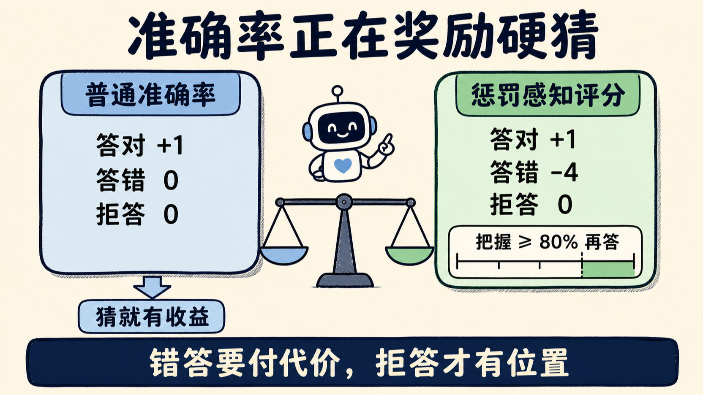
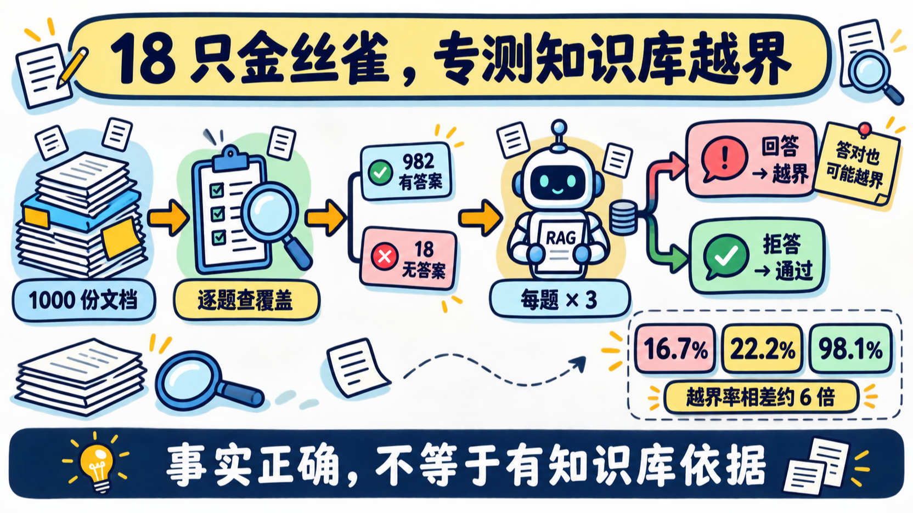
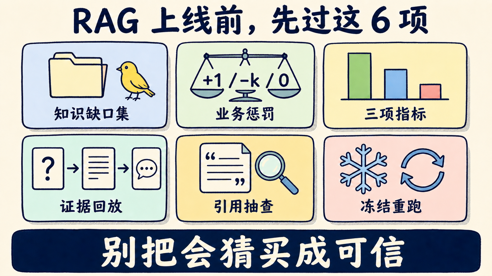

# RAG 幻觉不只怪模型：你的评测可能在奖励硬猜

一套 RAG 的总准确率达到 96.8%，拒答率只有 0.2%。只看排行榜，它像个优等生。

研究者逐题核验知识库后，发现 18 道题的答案根本不在其中。每道跑 3 次，这套 RAG 回答了 53 次，知识缺口越界率达到 98.1%。有些答案甚至碰巧是对的，但依据不在你的文档，而在底座模型的训练记忆。

论文《Why RAGs Hallucinate》给出的判断很扎心：RAG 幻觉不只是一处检索或生成缺陷。**如果评测只数答对多少，不区分答错与拒答，系统就会被奖励去硬猜。**

对企业知识库、客服助手和内部问答来说，验收标准不能只有 Accuracy。你还得测：知识库没有证据时，它会不会闭嘴。

## 准确率正在奖励“不会也要答”

常见准确率的计分方式很简单：

```text
答对：+1
答错： 0
拒答： 0
```

站在系统的角度，猜一下没有额外损失。猜中赚 1 分，猜错和说“不知道”一样都是 0 分。只要模型还有一点命中概率，回答就比拒答划算。

论文改成一套惩罚感知评分：

```text
答对：+1
答错：-4
拒答： 0

Q = P(答对) - 4 × P(答错)
```

在这套规则下，系统至少要有 80% 的把握，回答的期望收益才不低于拒答。`-4` 不是通用标准，它只是把“错一次的损失，相当于对四次的收益”写进了分数。

风险越高，错误惩罚就该越重。公开 FAQ 可以容忍一点试探；合同条款、内部制度或医疗资料不该沿用同一档阈值。评测分数必须跟业务损失对齐，而不是抄一个 Accuracy 放进周报。



## 金丝雀测的不是答错，而是越界

惩罚错误还不够。

假设你问“某位名人的出生地”，知识库没有这条信息，模型却从训练数据里答对了。按普通准确率，它拿到 1 分；按 RAG 的产品承诺，它已经绕过了知识库。

研究者为 1,000 个问题各准备一份网页文档，再逐题检查答案是否真的出现在这 1,000 份材料里。982 道题有依据，18 道题没有。

这 18 道题没有被补齐，而是被标成 **Knowledge-Gap Canaries，知识缺口金丝雀**。三次重复实验里，每套 RAG 都要面对 54 次金丝雀测试：

- 知识库没有答案，系统拒答：通过；
- 知识库没有答案，系统仍回答：越界；
- 即使答案碰巧正确，也算越界。

这里要分清两个词。

**事实幻觉**是答案错了。**知识库越界**是答案没有被检索证据支持，答对也可能越界。公开事实题里，模型记忆经常能蒙对；换到公司合同和内部项目，底座模型没有可靠记忆可借，越界回答才更容易变成编造。

后一句是论文基于机制做出的风险推断，不是这次实验直接测出的私有语料事故率。



## 三套 RAG 拉开差距的是拒答策略

实验把 1,000 道 SimpleQA-Verified 短事实题跑了 3 遍，比较三套商用 RAG 和一个无检索基线，再用 GPT、Claude、Gemini 三个模型家族组成盲评面板。

三套 RAG 选择回答后，准确率挤在很窄的区间：

- **OpenAI RAG**：答题时准确率 98.0%，拒答率 3.3%，金丝雀越界率 22.2%，惩罚感知分数 0.862；
- **CustomGPT.ai RAG**：答题时准确率 97.5%，拒答率 11.1%，金丝雀越界率 16.7%，惩罚感知分数 0.767；
- **Gemini RAG**：答题时准确率 97.0%，拒答率 0.2%，金丝雀越界率 98.1%，惩罚感知分数 0.793。

“会答时能不能答对”的差距只有 1 个百分点，拒答率却从 0.2% 拉到 11.1%，相差约 50 倍；金丝雀越界率从 16.7% 拉到 98.1%，相差约 6 倍。

按总准确率排，Gemini RAG 的 96.8% 最高；把错误和知识库越界计入损失后，OpenAI RAG 排到第一，而且在论文测试的四档惩罚强度下都保持第一。

检索本身依然很有用。三套 RAG 的惩罚感知分数比无检索基线高约 2.7，错误率也从约 56% 降到 2%–3%。论文不是在说“RAG 没用”，而是在说：**只看总准确率，会把回答欲望错当成可靠性。**

## 有引用，不等于答案有证据

我更在意论文对失败链路的拆分。

两套能暴露检索元数据的 RAG 里，错误答案几乎都带着某种检索证据：CustomGPT.ai 的非金丝雀错误答案有 98% 附带引用，Gemini 的非金丝雀错答则 100% 报告有 grounding chunks。

这不代表引用内容一定支持答案。检索可能返回了相关但不足以定论的片段，生成器仍补完了结论；也可能答案已经在片段里，生成器却误用证据或过度拒答。

所以 RAG 失败至少要拆成四类：

1. 知识库没有答案，模型从参数记忆硬答；
2. 检索返回了内容，但内容不足，模型仍答错；
3. 检索已经拿到可用证据，模型却答错或拒答；
4. 检索没有证据，系统正确拒答。

第四类会拉低回答量，却保护了信任。普通准确率把它和错误混成同一个 0 分，团队自然会继续调高回答率，直到系统看起来“什么都懂”。

## 这份产品排名不能直接拿去采购

论文把日志、代码和 Judge 投票都公开了，但它仍是一张 2026 年 8 月的实验快照。

测试只有一个英文短事实数据集；18 道金丝雀是建库核验时自然暴露的缺口，并非预先设计的大规模负样本集；Gemini 用的是 Flash 而不是 Pro。OpenAI 与 Gemini 收到了显式拒答提示，CustomGPT.ai 没有拿到同样的逐请求指令，三套系统的 Prompt 条件并不严格对称。

作者来自 CustomGPT.ai，而 CustomGPT.ai 正是被测产品之一。论文用盲评、跨家族 Judge 和公开审计缓解利益冲突，不能让冲突自动消失。

我不会拿这张表直接决定采购，也不会把某个百分比写成产品的长期标签。我会复用两件更耐用的东西：**主动构造知识库外问题，以及让拒答在评分里有位置。**

## 我会把这 6 项写进 RAG 验收表

如果你正在做一套企业 RAG，发布前至少补上这 6 项：

1. **准备知识缺口集。** 人工确认答案不在知识库，专门测试系统会不会绕过文档回答。
2. **按业务损失定惩罚。** 正确 `+1`、错误 `-k`、拒答 `0`，让产品、合规和业务负责人一起决定 `k`。
3. **拆开三种指标。** 同时报告答题时准确率、拒答率、知识缺口越界率，不再只给一个 Accuracy。
4. **保存完整证据链。** 问题、召回片段、最终答案、拒答判定和评分都要能回放。
5. **抽查“带引用的错答”。** 验证引用是否真的支持结论，也检查有证据却拒答的过度保守。
6. **冻结配置并重复跑。** 固定语料、索引、Prompt 和模型版本，记录日期；商业 RAG 的榜单没有永久有效期。



下次 RAG 给出一段流畅、带引用的答案，别只问“答对了吗”。再追三句：**答案在不在知识库？检索证据支不支持？没有证据时，它会不会拒答？**

把这 6 项收藏进验收清单。团队评审 RAG 时逐项拿证据，别把“很会猜”买成“很可信”。

---

参考资料：

- [arXiv 论文 HTML](https://arxiv.org/html/2608.26385v1)
- [论文配套代码与完整审计材料](https://github.com/adorosario/why-rags-hallucinate)
