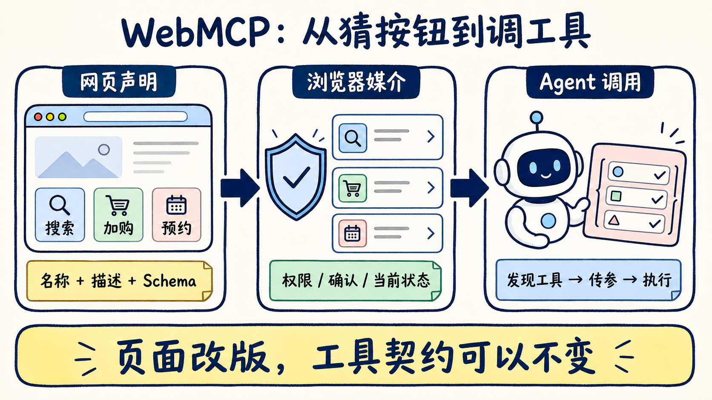
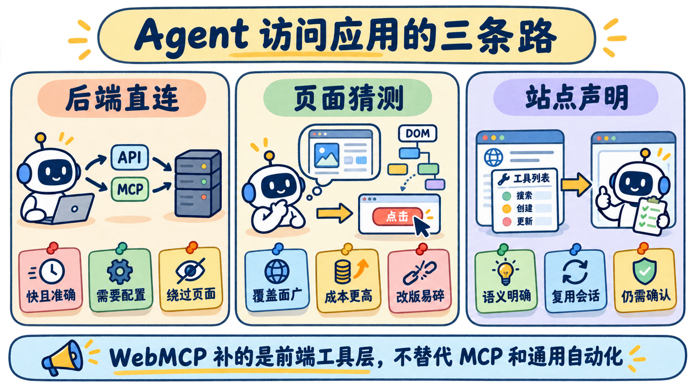

# 别再让 Agent 猜按钮：WebMCP 把网页能力变成工具

你让 Agent 去订一张机票，它先截图，找输入框，猜哪个按钮是“搜索”，点击后再截图。页面一改版，原本跑通的流程可能当场失灵。换成 DOM 自动化会稳一些，但 Agent 仍要从一堆 `div`、按钮和文本里推断：哪个动作会查票，哪个动作会付款。

WebMCP 想改的不是模型，而是网页的表达方式：**别再让 Agent 猜页面能做什么，让网站直接交出一份可调用的工具清单。**

这条路值得关注，但先把边界说清楚。WebMCP 目前是 W3C Web Machine Learning Community Group 的 Draft Community Group Report，不是正式 W3C Standard；Chrome 与 Edge 都还在 Origin Trial。它适合“打开网页、人在环、操作可见”的任务，也不会替代后端 MCP、权限校验和通用浏览器自动化。

## 网页不再只给人看，还要给 Agent 一份说明书

今天的网页主要用布局表达能力：搜索框告诉人可以搜索，购物车图标告诉人可以加购。Agent 看到的却可能只是像素、DOM 或可访问性树，然后自己拼出下一步动作。

WebMCP 在页面和浏览器 Agent 之间加了一层结构化约定。网站可以声明：

- 我有一个 `search_flights` 工具；
- 它需要出发地、目的地和日期；
- 参数必须符合 JSON Schema；
- 调用后执行页面已有的搜索逻辑。

浏览器再把这份工具定义交给兼容 WebMCP 的 Agent。Agent 不用从“蓝色圆角按钮”猜功能，而是直接调用有名字、有参数、有返回值的动作。



变化看起来不大：从“看页面、点按钮”变成“发现工具、传入参数、执行函数”。只要工具契约和底层业务逻辑保持稳定，纯视觉改版通常不再影响调用；Schema、页面状态、导航生命周期或业务代码变化，仍可能破坏兼容。

## Agent 访问应用，大致走三条路

原文作者列了六种方式。那是一套观察框架，不是官方分类。对开发者做技术选型，可以先压缩成三组。

**第一组，绕过页面直连后端。** 原始 API 和后端 MCP 都属于这一类。优点是快、准、参数清楚；代价是要处理 API、密钥、OAuth 或 MCP 配置，而且应用自己的网页界面通常不在执行链路里。

**第二组，让 Agent 自己理解页面。** Computer Use 读像素，Playwright、DevTools 一类工具读 DOM 或可访问性树。它们几乎什么站都能碰，但拿到的是通用结构，语义仍要靠 Agent 推断。页面改版、弹窗插入、按钮重名，都可能让流程偏航。

**第三组，让页面声明前端工具。** WebMCP 复用当前标签页的 UI、状态和登录会话，同时把站点知道的业务语义交给 Agent。用户仍在自己的网页里看结果，网站也不必为了 Agent 再造一套独立后端接口。



站内自带助手是另一种产品选择：站点控制模型、上下文和成本，但你的个人 Agent 通常进不去。它解决的是“网站替你提供 Agent”，WebMCP 解决的是“你的 Agent 如何使用网站”。

## WebMCP 不是网页里的 MCP

名字很像，边界不同。

MCP 更像公司的后端服务台。无论用户是否打开网页，Agent 都可以连接服务器，查询数据、调用工作流。它适合跨平台、后台执行和长期运行。

WebMCP 更像门店里的现场向导。它只在页面上下文里出现，知道用户当前打开了哪个项目、选中了哪条记录、处于什么登录状态，并把这些前端能力暴露成工具。

Chrome 官方给出的判断很明确：两者互补，不是替代关系。WebMCP 规范也不要求浏览器必须用 MCP 把工具交给 Agent，具体实现可以走私有 function calling 或其他桥接方式。一个完整产品可以同时提供后端 MCP 和 WebMCP——批量同步走后端，当前页面里的筛选、编辑和确认走浏览器。

## 两种接入方式，代码并不神秘

复杂动作可以用 JavaScript 注册工具：

```javascript
await document.modelContext.registerTool({
  name: "add_to_cart",
  description: "把指定商品加入购物车",
  inputSchema: {
    type: "object",
    properties: {
      productId: { type: "string" },
      quantity: { type: "number" }
    },
    required: ["productId"]
  },
  async execute({ productId, quantity = 1 }) {
    // 复用按钮背后的现有业务函数
    return addToCart(productId, quantity);
  }
});
```

如果能力本来就是一个 HTML 表单，还可以走 Declarative API：

```html
<form toolname="search_flights"
      tooldescription="搜索两座城市之间的可用航班">
  <input name="from" required>
  <input name="to" required>
  <button type="submit">搜索</button>
</form>
```

浏览器会根据表单字段合成参数结构。简单原型确实可能只加几个属性，但生产环境不能停在“能调用”：错误状态、取消操作、动态工具、权限、确认和评测都要补齐。

## 复用登录会话，不等于自动获得授权

WebMCP 的吸引力之一，是工具运行在当前标签页里，可以使用页面已有的 cookie、session 与界面状态。但“已经登录”和“允许 Agent 做任何事”是两回事。

官方安全材料专门提醒了间接提示注入：网页里的恶意文本可能诱导模型调用错误工具。哪怕工具只读，也可能泄露用户数据；写工具则可能代替用户购买、转账、发评论、改订单或提交表单。

现有提案提供同源、Permissions Policy 和跨域暴露限制，但没有一个协议级开关能保证“每次敏感调用都弹窗确认”。`readOnlyHint`、`untrustedContentHint` 是给 Agent 的判断信号，也不是强制安全边界；工具描述是否与真实执行逻辑一致，同样不能只靠规范验证。

所以我会试 WebMCP，但顺序很保守：先做搜索、状态查询、诊断这类可撤销或只读动作；支付、删除、公开发布继续保留产品自己的明确确认。服务端仍要按当前用户做鉴权、幂等和风控，不能因为请求来自页面工具就跳过权限检查。

> 复用会话，只是少配一套凭证；权限边界一条都不能少。

## 给开发者的 8 项试点清单

如果你想试，不要一上来给全站“Agent 化”。先挑一条高频、边界清楚的用户旅程：

1. **先选结果可验证的任务**：例如搜索、筛选、查订单状态，不从付款和删除开始。
2. **优先暴露现有业务函数**：工具调用和按钮调用同一套逻辑，避免维护两份实现。
3. **把名称、描述和 Schema 写短写准**：让 Agent 知道何时调用，也知道何时不该调用。
4. **只读和不可信内容要显式标注**：使用 `readOnlyHint`、`untrustedContentHint` 等信号。
5. **高风险动作自行设计确认与防重**：当前规范不会替产品补齐逐次确认、幂等与撤销。
6. **服务端重新鉴权**：前端工具不是可信调用方，用户身份、资源权限和业务规则照常检查。
7. **给失败留回退路径**：工具覆盖不了的任务，仍允许用户手动操作或让 Agent 回到 DOM 自动化。
8. **用数据判断是否更可靠**：至少记录工具选择成功率、任务完成率、人工接管率和自动化回退率。

这份清单比“先注册多少个工具”更重要。WebMCP 的成败，不在工具数量，而在网站有没有把意图、状态和边界说清楚。

## 现在值得做的是试点，不是押注

截至 2026 年 8 月 30 日，Chrome 的 WebMCP Origin Trial 覆盖 Chrome 149–156；Microsoft Edge 的官方试验页面显示活动期到 2026 年 11 月 17 日。规范仍在社区草案阶段，API 和支持范围都可能继续变化。

所以我的判断是：**它已经值得前端团队做一个小型 PoC，但还不适合写进“所有浏览器都能用”的产品承诺。**

从一个现成表单开始，给它补上工具名和描述，再观察 Agent 是否少走了冤枉路。收藏上面的 8 项清单，等你准备把“能演示”推进到“敢上线”时，逐项过一遍。

如果你也在做 Agent 工程化，欢迎关注「蒸馏小余」。我会继续跟进 WebMCP 的浏览器支持、权限模型和真实接入成本。

## 参考资料

- [Akshay Pachaar：WebMCP Clearly Explained](https://x.com/akshay_pachaar/status/2093452397402317239)
- [WebMCP Draft Community Group Report](https://webmachinelearning.github.io/webmcp/)
- [Chrome for Developers：WebMCP](https://developer.chrome.com/docs/ai/webmcp)
- [Chrome for Developers：Imperative API](https://developer.chrome.com/docs/ai/webmcp/imperative-api)
- [Chrome for Developers：Declarative API](https://developer.chrome.com/docs/ai/webmcp/declarative-api)
- [Chrome for Developers：WebMCP tool security](https://developer.chrome.com/docs/ai/webmcp/secure-tools)
- [Chrome for Developers：When to use WebMCP and MCP](https://developer.chrome.com/docs/ai/webmcp/compare-mcp)
- [WebMCP explainer](https://github.com/webmachinelearning/webmcp)
- [Microsoft Edge WebMCP Origin Trial](https://developer.microsoft.com/en-us/microsoft-edge/origin-trials/trials/0b76fe60-b266-458e-a285-04e375c0c31a)
