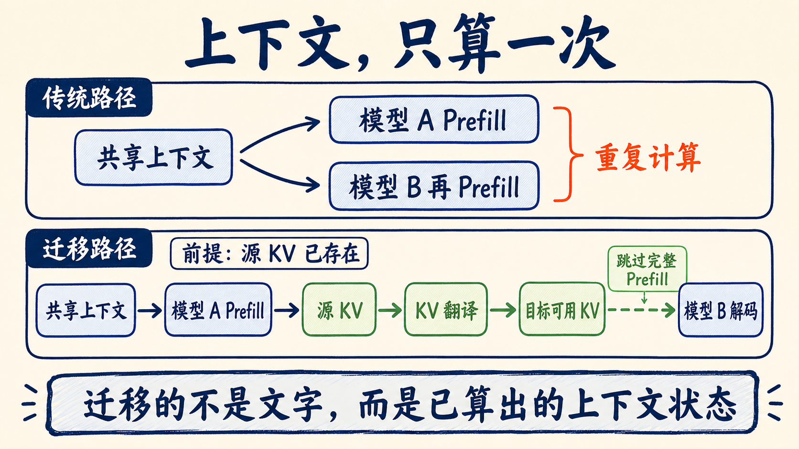
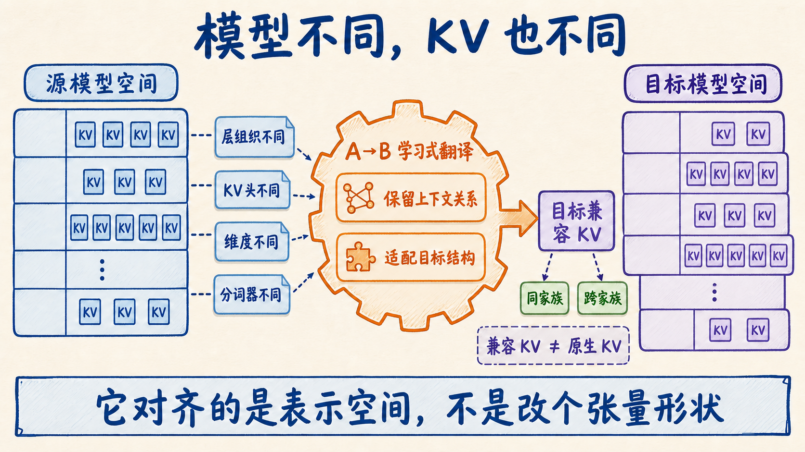
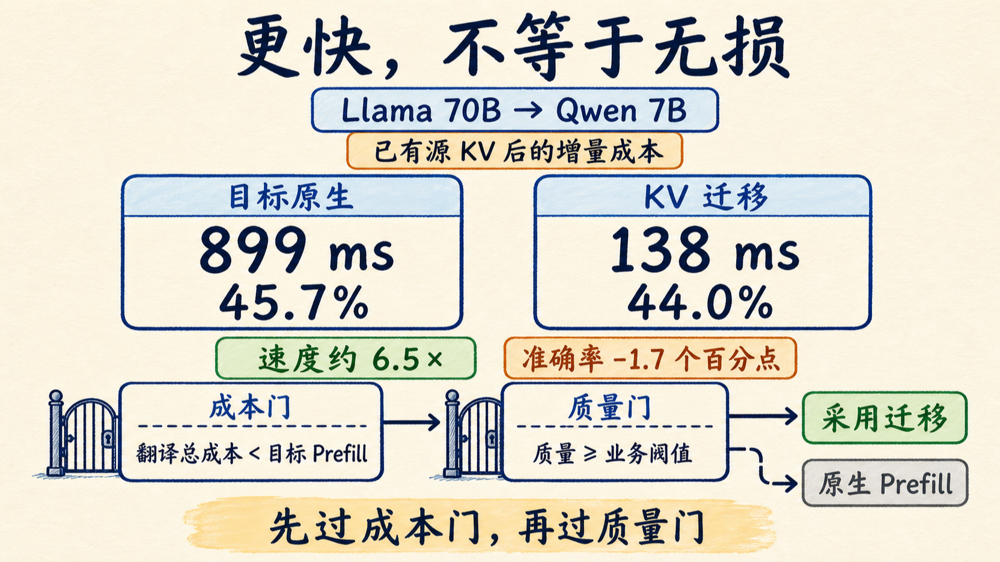

# 模型切换别再重算长上下文：KV Cache 开始跨模型接力

一个多模型 Agent 的常见 trace 是这样：小模型刚读完 32K 上下文，难题升级给大模型；到了复核模型，同一份系统提示、历史和检索证据又被读第三遍。模型每切一次，首 token 的计时重新开始，GPU 也把 Prefill 的账再付一遍。

UT Dallas 的新论文 [A Universal Context-Reuse Layer for Cross-Model KV Sharing](https://arxiv.org/abs/2608.30963v1) 想把这笔重复账省下来：不把原始 token 重新喂给目标模型，而是把源模型已经算好的 KV 状态，翻译成目标模型能继续使用的表示。

这条路线最值得关注的不是某个延迟数字，而是一个新的运行时抽象：**上下文不只可以在请求间复用，还可能跟着任务跨模型迁移。** 先把边界钉牢——论文给的是初步证据，不是一层已经能接任意模型的通用中间件。

## 同一段上下文，为什么每个模型还要重读一遍

大模型生成答案大致分两段。

第一段是 **Prefill**。模型把系统提示、历史消息、检索文档等输入全部过一遍 Transformer，生成每一层注意力要用的 Key 和 Value。输入越长，这一步越贵，也是你点下发送后迟迟看不到第一个字的重要原因。

第二段是 **Decode**。模型逐 token 生成，前面算好的 KV Cache 可以反复使用，不必每次重读全部历史。

现在的 Prefix Cache 已经能省掉不少 Prefill，但通常有一个硬条件：生产缓存和消费缓存的是同一个模型。Qwen 算出的 KV，Gemma 不能直接拿来用；即使都是 Qwen，不同规模的层数、隐藏维度和注意力配置也可能对不上。

所以多模型路由会出现一个尴尬场面：文字上下文没有变，计算表示却不能接力。模型 A 已经读完 32K 历史，切到模型 B 后，B 仍要从第一个 token 重新读。

*据论文 Figure 1 的流程与正文机制重新整理。*

## 论文的办法：不是搬缓存，而是翻译缓存

论文在源模型和目标模型之间放了一个 learned transport module。

源模型先对上下文做 Prefill，产出自己的 KV Cache；transport module 把这份状态映射到目标模型的表示空间；目标模型保持冻结，直接从翻译后的 KV 开始 Decode，不再独立执行完整 Prefill。

可以把它理解成一次“会议交接”。传统做法是让新同事把全部会议记录从第一页读起；跨模型 KV sharing 则让一位翻译，把上一位同事已经形成的工作记忆转换成新同事能接着用的记法。

难点不在文件格式。两个模型可能有不同的层数、隐藏表示、KV head、注意力结构，甚至 tokenizer 和模型家族都不同。论文也没有要求翻译后的 KV 与目标模型原生 KV 逐元素相等，只要求它保留足够的上下文信息，让目标模型以可接受的质量继续推理。

我会先算两笔账：translation、copy、assembly 加起来，是否真的比目标模型原生 Prefill 便宜；业务成功率是否守得住。任一项过不了，就让目标模型重新 Prefill。

*跨模型 KV 需要学习式表示翻译，不是 tensor 改形状。*

## 三组实验，各自证明了什么

论文用了一个同家族模型对和两个跨家族模型对。三个结果不能混成一句“跨模型都能无损加速”。

**第一组：大 Qwen 把状态交给小 Qwen。**

Qwen2.5-7B → Qwen2.5-1.5B 在 116 个 LongBench2 计分样本上，1.5B 原生准确率是 27.59%，接过 7B 翻译后的 KV 后达到 34.48%，提升 6.89 个百分点；但仍低于 7B 原生的 45.69%。

增量延迟也明显下降。8K–16K 上下文里，1.5B 原生 Prefill 是 158.7ms，Handoff 是 34.5ms；16K–32K 时，从 288.3ms 降到 53.8ms。

长区间给出了质量风险信号：Handoff 在 8K–16K 区间的准确率是 40.74%，到了 16K–32K 为 32.58%。不过两桶分别是 27 和 89 个不同样本，不能只凭这组分桶把下降归因于上下文变长。论文每个长度区间的延迟也只测了 3 个样本，适合看方向，不适合直接拿去写容量规划。

**第二组：Qwen 跨家族交给 Gemma。**

Qwen2.5-1.5B → Gemma-2-2B 在 4K prompt 下，Gemma 原生 Prefill 为 181.706ms，Handoff 为 59.897ms，增量延迟减少 67.04%。上下文从 128 增至 4K，收益从 45.25% 提高到 67.04%，说明长输入更容易摊薄翻译开销。

但 perplexity 不是每个 Decode 区间都更好。H=1、32、128 时 Handoff 略优，H=16、512 时又落后于 Gemma 原生。更准确的说法是：翻译状态在多个 Decode horizon 上接近原生，但并非每个区间都不掉质量。

**第三组：70B Llama 把状态交给 7B Qwen。**

这组跨了模型家族，也跨了 10 倍参数规模。在源 Llama KV 已经存在、且只统计 Handoff 增量成本的前提下，Qwen2.5-7B 原生路径是 899ms，Llama → Qwen Handoff 是 138ms，约快 6.5 倍；准确率则从 45.7% 降到 44.0%，相差 1.7 个百分点。

*数字来自论文 Table 7；138ms 不包含源 Llama 的 Prefill。*

## 138ms 的前提：源 KV 已经存在

论文明确说明，所有 Handoff 延迟测的都是“复用一份已经存在的源 KV”之后的增量成本，不包含源模型最初的 Prefill。

在 70B Llama → 7B Qwen 的实验里，Llama 原生路径是 7,328ms。138ms 不能被写成“把 70B 推理压缩到 138ms”，也不能和一个从零开始的完整请求直接比较。它回答的是另一个问题：**如果 70B 已经因为前序任务读过这段上下文，再把计算状态交给 Qwen，要追加多少成本？**

固定模型级联、先生成后校验、多 Agent 共享长上下文，源 KV 本来就存在，翻译可能比重算便宜。短 Prompt、低命中率，或者为了交接专门先跑一次更贵的源模型，账很可能算不过来。

## 离“通用层”还有五道工程闸门

如果团队准备做 PoC，我会先把下面五问贴进方案评审。

1. **源 KV 本来就存在吗？** 先测真实缓存命中率，不要拿理想化的每次命中计算收益。
2. **模型对怎么维护？** 论文写的是 `T(A→B)`。它没有证明一个 translator 能自动接任意模型；模型升级后也要回答兼容、失效和重训问题。
3. **质量闸门看什么？** LongBench2、perplexity 只能证明论文设置。生产里要测任务成功率，并按模型对、上下文长度和 Decode horizon 切片。
4. **端到端账算全了吗？** Source Prefill、translation、peer copy、cache assembly、调度、网络和存储都要入账。论文同家族实验里还有一部分 Handoff 时间没有被组件级测量解释。
5. **什么时候退回原生 Prefill？** Translator 不可用、模型版本不匹配、质量置信度不足或隔离策略不允许搬运 KV，都应该立即走安全 fallback。

还要再补一条论文没有评估的生产风险：KV 是从用户上下文计算出的内部状态。跨模型、跨 worker 搬运它，必须处理租户隔离、权限、加密、生命周期和版本绑定，不能只当作普通缓存文件。

## 我的判断：先放进固定路由，不要做开放市场

跨模型 KV sharing 最适合从固定少量模型对开始：模型组合稳定、长上下文占比高、切换路径可预测、业务允许用原生 Prefill 兜底。比如小模型路由后升级、大模型生成后由小模型复核，或固定 crew 的多 Agent 流水线。

我不会把这篇 v1 论文直接当成“任意模型共享上下文”的生产方案。正文没有给出 transport module 的具体结构、训练配方、硬件、吞吐、并发、缓存命中率；截至 arXiv v1，论文也没有提供代码链接。`Universal` 目前更像一层通用的系统抽象，而不是已经训练好的万能翻译器。

这篇论文还不足以让我上线，却会让我重画多模型路由的成本表。除了 token 单价和模型能力，我会再加三列：**源 KV 命中率、迁移端到端耗时、质量回退率。** 算不清这三列，就继续走目标模型原生 Prefill。

先把上面的五问保存下来。你正在评估哪一组模型接力？留言 **KV + 模型对**。下一篇我可以按真实组合继续拆：命中率、迁移耗时、质量回退和版本失效应该怎么记。

## 论文与演示

- [论文摘要与 PDF](https://arxiv.org/abs/2608.30963v1)
- [论文列出的演示视频](https://youtu.be/0TiOdUK0qB8)
