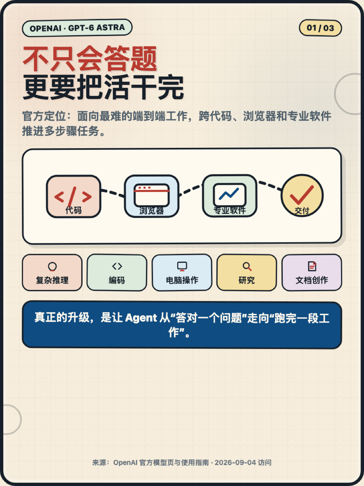
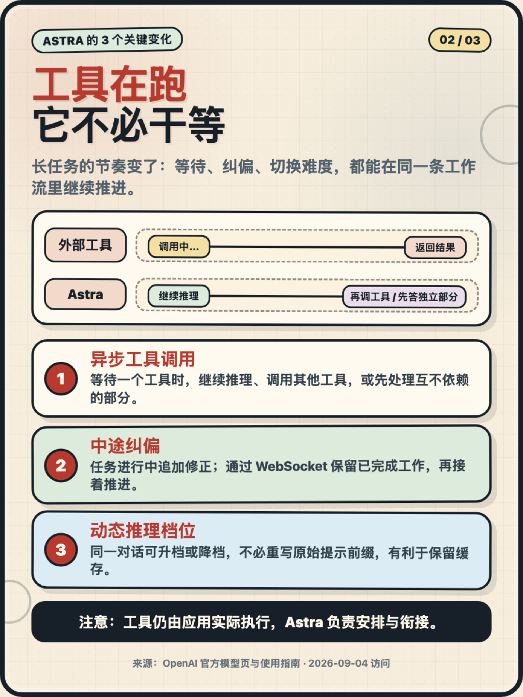
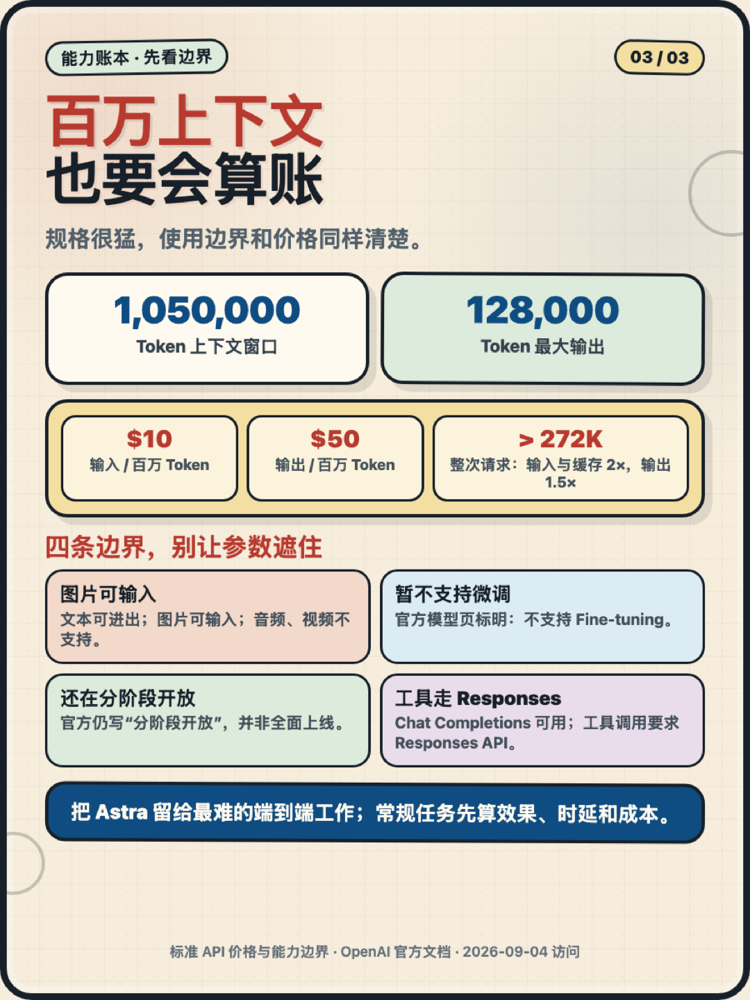

别只盯参数：GPT‑6 Astra 真正升级的，是 Agent 把长任务做完的节奏！

✅ 能跨代码、浏览器和专业软件推进多步骤工作；  
✅ 工具还在运行时，可以继续推理或先做互不依赖的部分；  
✅ 任务做到一半可以追加修正，并保留已经完成的工作；  
✅ 同一段对话里还能按难度切换推理档位。

它给了 1,050,000 Token 上下文和 128,000 Token 最大输出，但这不是“所有任务都上最强模型”的理由。标准 API 价格是输入 10 美元、输出 50 美元 / 百万 Token；超过 272K 输入后，整次请求还会进入更高费率。

更适合的用法，是把 Astra 留给真正复杂的端到端工作：研究、编码、电脑操作、文档交付，以及需要多轮工具协作的长流程。常规任务，先算效果、时延和成本。

来源：OpenAI GPT‑6 Astra 官方模型页与使用指南（2026‑09‑04 访问）

标签：#OpenAI #GPT6Astra #AIAgent #Agent工程化 #大模型
