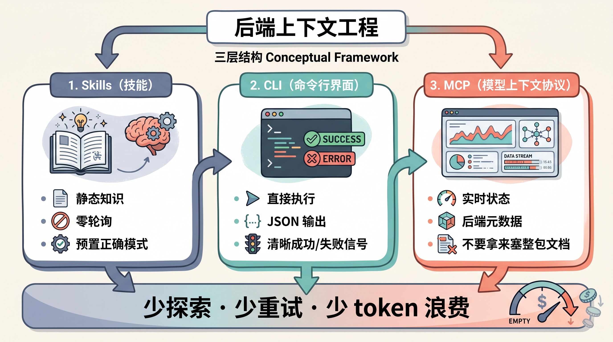
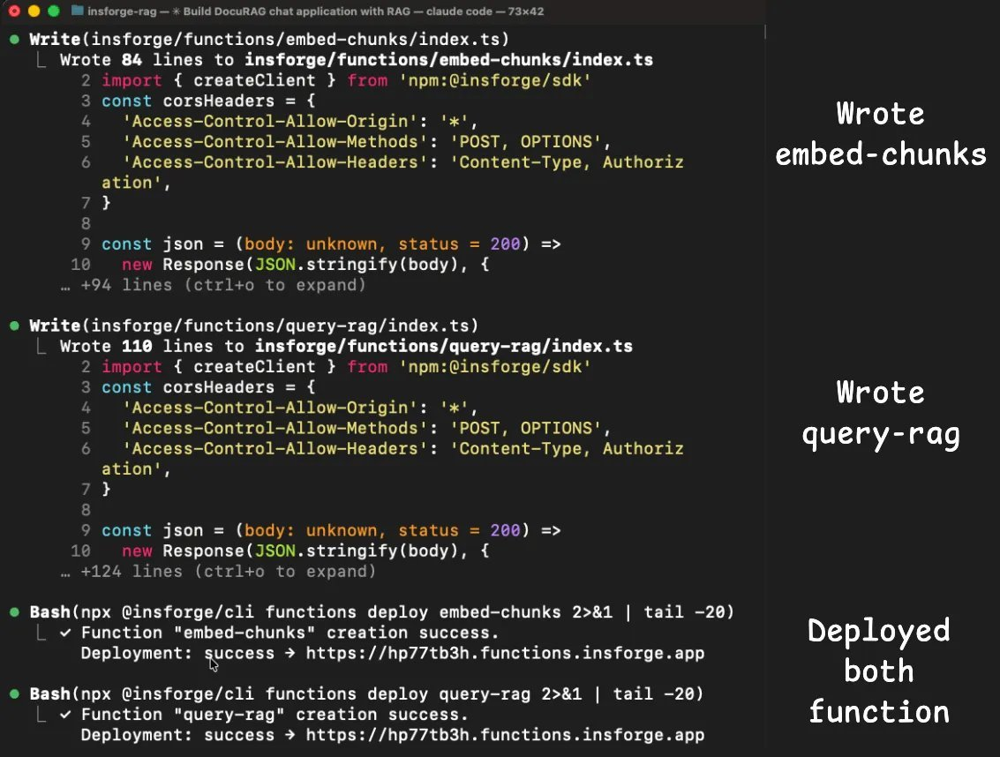
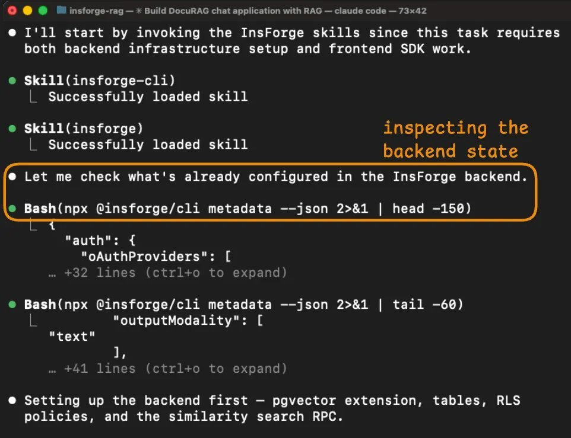
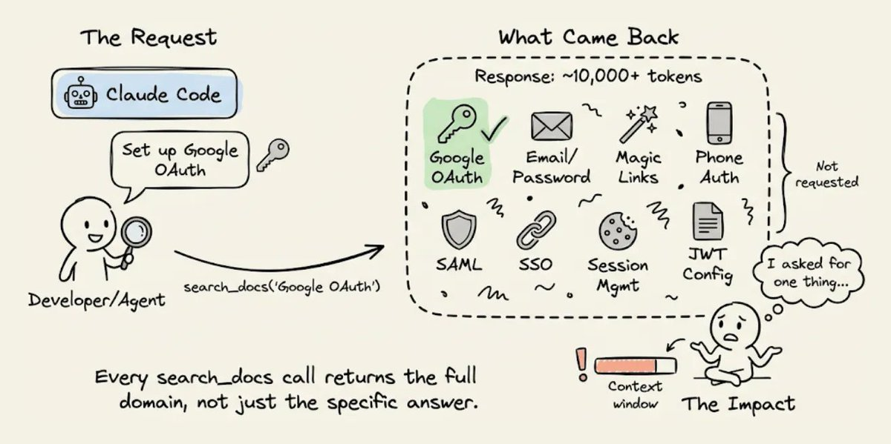

# Claude Code 成本怎么降 3 倍？真正该优化的，是后端上下文

先说结论。

这条帖子里最值得抄作业的，不是“换一个后端就能省钱”，而是一个更底层的判断：

**Claude Code 这类 coding agent 的很多 token 消耗，并不是花在“写代码”本身，而是花在“搞清楚后端到底长什么样”这件事上。**

如果后端给 Agent 的信息是碎的、糊的、冗长的，模型越强，往往不是越省，而是越贵。

因为它会更认真地去探索、重试和补洞。

这件事，本质上就是 Karpathy 说的 `context engineering`，只不过大多数人把它理解成：

- prompt 怎么写
- RAG 怎么喂
- 上下文窗口怎么塞

而这条帖子真正补上的一层是：

**后端本身，也是上下文。**



## 这条帖子到底在讲什么

作者做了一个很具体的实验：

用 Claude Code 分别在 `Supabase` 和 `InsForge` 上搭同一个应用 `DocuRAG`，然后比较整个开发会话的 token 消耗和成本。

这个应用不简单，基本把一个 AI 全栈应用常见的后端能力都摸了一遍：

- Google OAuth 登录
- PDF 上传
- 文本切块
- 向量存储
- RAG 检索
- Edge Function
- RLS 权限隔离
- 调 OpenAI 模型做 embedding 和问答

也就是说，这不是一个“做个 Todo App”的轻量测试。

它比较接近很多人现在真的会拿 Claude Code 去做的事情。

作者给出的结果很抓眼球：

- `Supabase` 会话：`10.4M` tokens，约 `$9.21`
- `InsForge` 会话：`3.7M` tokens，约 `$2.81`

表面看，这是一个“成本差了快 3 倍”的故事。

但如果只停在这个结论上，你很容易看错重点。

## 真正关键的地方，不是哪个后端赢了

如果只用一句话总结这条内容真正有价值的部分，那就是：

**Agent 的成本，经常不是由模型决定，而是由“系统怎么把信息暴露给 Agent”决定。**

这个判断很重要。

因为很多人做 Agent 系统时，默认会把成本问题归因到：

- 模型太贵
- context 太长
- prompt 写得不好
- 工具调用太多

这些当然都有关。

但这条帖子指出了一个经常被忽略的来源：

**后端接口的表达方式，本身就在决定 Agent 要不要反复试探。**

换句话说，问题不是 Claude Code 会不会用后端，而是：

**后端有没有把“对 Agent 有用的信息”用 Agent 友好的方式交出来。**

## 为什么后端会变成 token 黑洞

帖子里把原因拆成了 3 个，我觉得这个拆法很清楚。

### 1. 文档检索返回太多，Agent 每次都被迫吃整包

第一个问题是：文档 retrieval 粒度太粗。

举个帖子里的例子。

当 Agent 想配置 Google OAuth，它去查的是一个非常具体的问题。

它真正想知道的，可能只有：

- Google OAuth 相关配置项
- 回调地址怎么填
- 哪几个参数必填

但如果工具一把把整个认证文档都吐回来，里面还顺带塞了：

- email/password
- magic links
- phone auth
- SAML
- SSO
- JWT 配置

那 Agent 虽然“拿到了答案”，但也同时吞下了大量并不需要的上下文。

这不是信息不足，而是信息过载。



这意味着什么？

**Agent 每问一个小问题，后端都在往上下文窗口里倒一整盆东西。**

如果一个会话里要配置 auth、database、storage、edge functions，这种额外开销会叠得非常快。

### 2. Agent 看不到“全局状态”，只能靠猜

第二个问题更典型。

人类开发者看后端，通常会同时看很多东西：

- 当前有哪些表
- Auth provider 开了哪些
- 存储桶有没有配
- 函数是否部署成功
- RLS 状态对不对

你是在用“全局视角”理解系统。

但 Agent 如果拿不到这种全局状态，它就只能一条命令一条命令去拼图：

- 查表
- 查扩展
- 查配置
- 查日志
- 再根据结果补一轮查询

问题在于，**拼图式 discovery 很贵，而且很容易漏。**

一旦关键状态没有被清楚暴露，Agent 就会开始进入“猜测模式”。

而猜测模式，正是 token 开始失控的起点。

### 3. 错误信息不够结构化，Agent 会掉进 retry loop

第三个问题最花钱，也最真实。

当系统报错时，人类开发者通常会做几件事：

- 先看错误信息
- 再看 dashboard
- 再去对日志
- 再结合经验判断“错在代码、配置、权限还是平台”

但 Agent 并没有你这种综合判断路径。

如果返回给它的只是一个模糊的 `401`、`403` 或 `500`，它会做什么？

它会：

1. 先猜一个原因
2. 写一个修复
3. 重试
4. 发现不对
5. 再猜另一个原因

如果真实原因不在代码层，而在平台层，这个循环就会非常昂贵。

而这条帖子里最值钱的观察也在这里：

**很多 token，不是花在“实现功能”，而是花在“错误定位失败之后的连续重试”。**

## 为什么模型更强，反而可能更贵

这条帖子里有个很反直觉的点。

作者提到，在一组 MCPMark V2 的测试里，Claude 从 `Sonnet 4.5` 升到 `Sonnet 4.6` 之后，后端 token 使用反而从 `11.6M` 涨到了 `17.9M`。

乍一看很怪。

模型更聪明了，为什么还更贵？

原因其实不复杂：

**更强的模型，不会自动消灭上下文缺口。它只会更认真地处理这个缺口。**

也就是说，当信息不完整时，强模型往往会：

- 做更多推理
- 发起更多探索
- 尝试更多修复
- 进行更完整的自我验证

这会提高成功率，但同时也会放大成本。

所以如果后端暴露方式没有优化，模型升级有时会把问题“做得更认真”，而不是“做得更便宜”。

## 这其实就是“后端上下文工程”

作者把解决方案总结成一句话：

**不要让 Agent 通过探索来理解后端，而要让后端主动把关键上下文整理好。**

这个说法我非常认同。

因为 context engineering 的本质从来不是“把东西塞满”，而是：

**在下一步行动之前，把最该知道的信息，用最低摩擦的方式放进上下文。**

放到后端层，就是三件事：

### 1. 静态知识用 Skills 提前装进去

如果某些知识是稳定的，比如：

- SDK 用法
- 常见框架接入方式
- 哪些认证模式是推荐写法
- 哪些 edge case 最容易踩坑

那就不该让 Agent 每次都重新查文档。

更务实的做法是，把这些稳定知识做成 Skills。

这样 Agent 进入任务时，先看到的是已经整理过的模式，而不是从海量文档里做二次检索。

这能省的，不只是 token，还有很多“走错第一步”的成本。

### 2. 执行动作用 CLI，不要让状态修改过度依赖聊天式工具调用

帖子里特别强调 `CLI + structured output` 这一层。

这点很关键。

因为对 Agent 来说，最理想的执行接口，不是“像人在点网页”，而是：

- 命令明确
- 输出结构化
- 成功失败信号清楚
- 可以被程序继续处理

比如一条 CLI 命令如果支持：

```bash
# 返回结构化 JSON，Agent 可以直接解析
npx backend-cli metadata --json
```

那 Agent 就不需要先看一大段自然语言说明，再自己猜哪些字段有用。

### 3. MCP 更适合看“正在变化的状态”，不适合当文档仓库

这条内容里我最认可的一个设计判断是：

**MCP 不是不能用，而是要把它放在合适的位置。**

更合理的分工是：

- Skills 负责静态知识
- CLI 负责执行操作
- MCP 负责实时状态

如果把 MCP 主要用来查文档，你很容易出现“大量 schema / metadata 一起回传”的问题。

但如果用它来回答：

- 当前 auth provider 开了什么
- 当前表结构和 RLS 状态是什么
- 当前有哪些 bucket / function / model

那它就很有价值。



一句话总结：

**MCP 更像“系统透视镜”，不该变成“超大号文档搜索器”。**

## 那个 3 倍结果，到底该怎么理解

这里要稍微冷静一点。

作者的实验结果很亮眼，但帖子自己也补了一句边界条件：

这次接近 `2.8x` 的差距，有一部分是因为 Supabase 那边踩进了一个很贵的调试循环。

具体发生了什么？

登录修好之后，文档上传仍然报错。

Agent 看到的是一连串 `401`，于是连续尝试了很多代码层修复：

- 改 header
- 补日志
- 改 token 读取方式
- 换认证做法
- 再次部署函数

最后才发现，真正的问题不是代码，而是平台侧的 `verify_jwt` gate 在函数代码运行前就把请求挡掉了。

这就导致 Agent 在“错层排障”上烧掉了大量 token。

这不是一个虚构问题。

恰恰相反，这非常真实。

但也正因为它很真实，所以我们要更准确地解读这个结果：

**这不是在证明某个后端天然就永远便宜 3 倍，而是在证明：当后端上下文不清楚、错误信号不明确时，Agent 的调试成本会成倍放大。**

## 这个实验真正想告诉我们的，不是选型，而是设计原则

如果你把这条帖子理解成“InsForge 赢了，Supabase 输了”，那你其实只看到了表层。

它真正更通用的启发是这 4 条：

### 1. 不要让 Agent 自己去猜系统全貌

如果系统状态可以一次性给，就不要拆成 10 次工具调用让它拼。

### 2. 不要把稳定知识放在运行时反复检索

能前置成 Skills、模板、标准模式的，就尽量前置。

### 3. 不要让错误信息停留在“人类勉强看得懂，Agent 只能瞎猜”

错误应该尽量结构化，最好能告诉 Agent：

- 错在哪一层
- 是权限问题还是平台问题
- 是代码没跑到，还是代码跑了但失败

### 4. 真正贵的不是执行一次，而是连续重试

Agent 系统的成本，很多时候不是来自成功路径，而是来自失败路径。

所以最该优化的，往往不是 happy path，而是：

- state discovery
- ambiguity reduction
- failure diagnosis

## 如果你正在做 Agent + Backend，这篇内容最值得你检查什么

你可以直接拿它当一张自查清单。

### 1. 你的后端，能不能一次性返回“当前系统长什么样”

如果不能，Agent 基本就会进入探索模式。

### 2. 你的文档检索，是返回“相关答案”，还是返回“整个领域”

如果是后者，token 很容易被背景噪音吃掉。

### 3. 你的关键操作，有没有结构化 CLI 或等价接口

如果 Agent 只能靠网页、自然语言日志、非结构化输出做判断，成本通常会更高。

### 4. 你的错误信息，能不能明确指出失败层级

比如：

- 平台层拒绝
- 权限层拒绝
- 业务代码报错
- 外部服务失败

这几个对 Agent 来说完全不是一回事。

### 5. 你有没有把“错误重试成本”算进系统设计

很多团队只盯单次调用 token，不盯 retry loop。

但真实世界里，retry loop 才是最容易爆预算的地方。

## 最后一句

如果只留一个判断，我会选这个：

**Claude Code 这类 agent 的成本优化，很多时候不是 prompt engineering，也不是 model switching，而是 backend context engineering。**

真正关键的地方在于：

**别让 Agent 用昂贵的探索，去补你本来就可以明确给出的后端信息。**



这条帖子最有价值的，不是“3 倍”这个数字本身。

而是它把一个很少被单独拿出来讨论的问题讲清楚了：

**当我们开始让 Agent 真正接管全栈开发流程，后端不只是业务基础设施，它本身就是上下文基础设施。**
