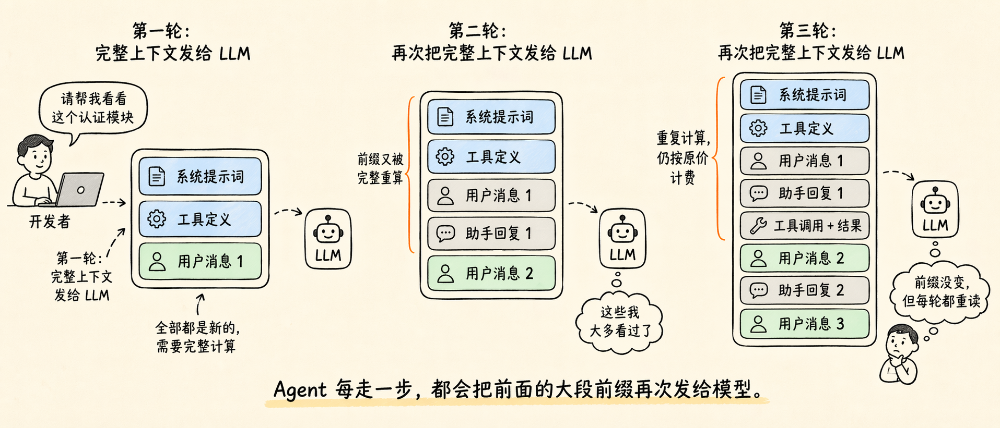
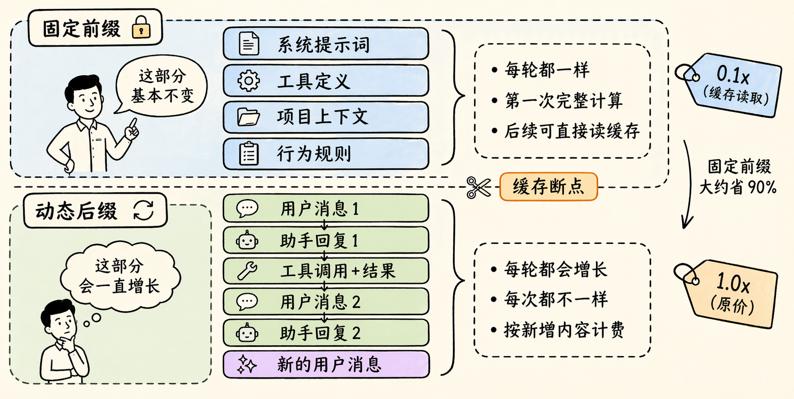
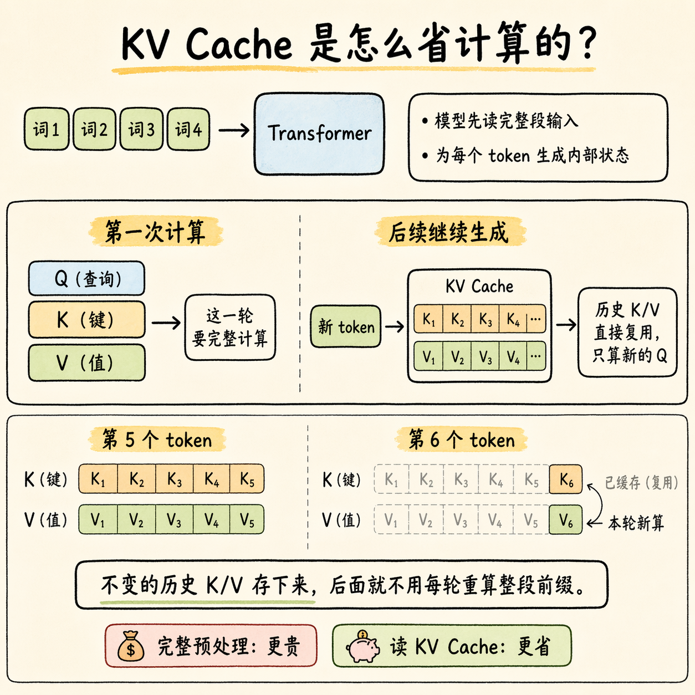
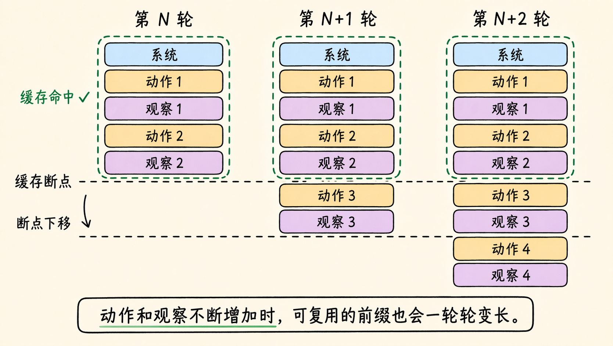
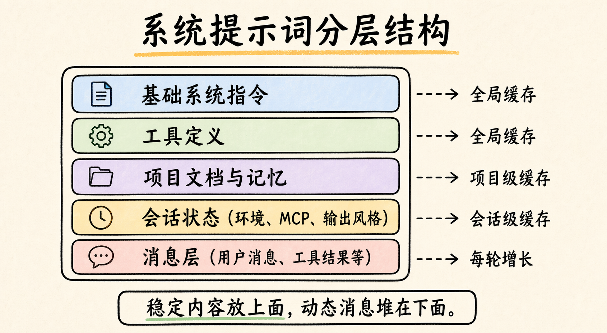

# Prompt Cache 为什么这么省钱？把 Claude Code 92% 命中率背后的门道讲清楚

Prompt Caching 最容易被误解的地方，是很多人把它当成一个“打开就省钱”的功能。实际上，它更像一条工程纪律：把稳定的上下文固定在前面，把会变化的消息追加在后面，并且尽量不要在会话中途破坏这段前缀。

Avi Chawla 这条帖子讲清楚的，也不只是 `KV Cache` 是什么，而是 **Agent 为什么特别依赖缓存，以及 Claude Code 为什么能把缓存命中率做得这么高**。

一句话说，**Prompt Caching 省下来的，不是“传输费”，而是重复处理同一段前缀的计算成本。**

想把 Prompt Caching 用好，至少要同时做到 3 件事：

- 把长期不变的内容固定在前面。
- 让每轮新增内容只追加在后面。
- 尽量不要在会话中途去破坏前缀结构。

Claude Code 那个 **92% cache hit rate**，靠的就是这套结构。

## 为什么 Agent 特别容易把钱烧在“重复理解”上

Agent 成本高，当然和工具调用多、会话长、任务复杂有关，但在很多长流程任务里，最大的一笔额外开销其实是重复重算前缀：

**每走一步，它都要把前面那一大坨已经看过的内容，再重新发给模型一遍。**

这段会被反复送回去的内容，通常包括：

- 系统提示词
- 工具定义
- 项目上下文
- 前面几轮的对话和工具结果

如果这部分有 `20,000` 个 token，一个会话跑了 `50` 轮，那就是 **100 万 token 的重复前缀计算**。第一次读这些内容当然有价值，因为模型要先建立上下文；但第三轮、第十轮、第五十轮再把同样的前缀完整重算一遍，新增的信息增量其实很低。



这也是为什么长时间运行的 coding agent、workflow agent、research agent 经常会出现一个现象：

**明明没有在生成很多新内容，但账单还是一路往上走。**

## 静态前缀和动态后缀，应该怎么分

要理解 Prompt Cache，先把一次请求拆成两层：

第一层是 **静态前缀**，也就是多轮里基本不变的内容，比如：

- system instructions
- tool definitions
- project context
- 行为约束和输出规范

第二层是 **动态后缀**，也就是每轮都会继续增长的内容，比如：

- 用户新消息
- 模型回复
- 工具调用结果
- 终端输出和观察记录



这个拆法非常重要，因为缓存命中的对象，不是“大致差不多的对话”，而是：

**那一截在很多轮请求里都保持完全一致的 token 前缀。**

普通单轮问答的重复上下文没有那么多，Agent 就不一样了。它的系统提示、工具协议、项目背景经常一挂就是大几千甚至上万 token，而且会在多轮调用里反复出现，所以缓存收益会特别明显。

## KV Cache 到底缓存了什么

很多人第一次听到缓存，会以为它只是“把上一轮文本存起来，下次不用再传”。这个理解不算全错，但还不够准确。

模型处理输入时，通常会先经过一段很重的 **prefill** 计算：把整段 prompt 读完，建立后续生成需要的内部状态。等这段状态准备好之后，模型才进入 **decode** 阶段，一个 token 一个 token 往后生成。

`KV Cache` 缓存的，不是“文本副本”本身，而是这段稳定前缀在 prefill 阶段算出来、后续还能继续复用的内部表示。可以先粗暴理解成 3 件事：

- `prefill` 阶段很费算力，因为模型要把整段上下文认真读一遍
- `decode` 阶段是一边读已有状态，一边往后续写新 token
- 对已经处理过、又没变化的前缀，没必要每轮都重新做一遍 prefill



所以 Prompt Cache 省下来的，不是“少传一点字”的成本，而是：

**让同一段稳定前缀，不要被重复预处理。**

这会直接反映到账单上。按原帖给的数据，缓存读的价格是基础输入价格的 `0.1x`，也就是大约 **90% 的折扣**；缓存写大约是 `1.25x`，因为服务端要先把这段前缀存进去。

对应到实际使用场景，就是这样一笔账：

- 第一次建立缓存时，会稍微贵一点
- 但后面反复读取这段前缀时，会便宜很多

所以只要会话够长、命中率够高，这笔账通常很划算。

## Claude Code 的 92% 命中率，是怎么跑出来的

Claude Code 这个案例的价值，在于它把“缓存友好型 Agent”长什么样展示得很具体。

### 第 0 分钟：先把贵的那次付掉

刚进会话时，Claude Code 会先加载：

- 系统提示词
- 工具定义
- 项目里的 `CLAUDE.md`
- 一些环境和行为上下文

这一步最贵，因为这些 token 都是第一次出现，需要完整走一遍 prefill。只要后面的会话结构稳定，这笔成本就不需要一轮轮重付。

### 第 1 到 20 分钟：保持缓存一直是热的

后面的每一轮，新增的主要是：

- 用户指令
- 探索代码得到的观察结果
- 工具调用回显
- 中间计划和修改动作

而前面那一大段稳定基础设施，就可以持续从缓存读。



这里最值得记住的一点是：缓存断点不是固定死的。如果你的上下文组织得足够稳定，**缓存断点会随着会话推进不断往下移动**，于是可复用的前缀会越来越长。

### 上下文快满时，尽量不要把前缀砸烂

很多系统在上下文快满时，会直接重写前面的系统提示词或工具定义。这样虽然也能继续跑，但会把已经攒起来的缓存一把砸掉。

更稳的做法，是做 **cache-safe compaction**：

- 保留原来的系统和工具层
- 把老对话总结成一段新的摘要
- 再把后续需要的上下文重新挂回去

这一步的重点不在“总结”本身，而在于 **尽量把变化控制在缓存断点之后**。

## 哪些工程细节，最容易把缓存打碎

原帖里有一句很形象的话：

**`1 + 2 = 3` 能命中缓存，但 `2 + 1` 就是一次 cache miss。**

原因不复杂。缓存通常是按完整 token 前缀去做哈希匹配的，只要前缀里有一点变化，哪怕只是顺序变了，哈希就会不一样，整段前缀也就要重算。

实际工程里，最常见的坑有 5 类：

### 1. 往系统提示词里塞时间戳

如果每轮都注入一个新的时间戳，系统提示词就不再稳定了。结果就是：**每轮都像一段全新前缀。**

### 2. 工具定义顺序或 schema 变了

哪怕工具本身没变，只是 JSON serializer 换了一次字段顺序，也可能导致前缀哈希不同。

### 3. 会话中途加工具、删工具、改工具参数

很多人喜欢边跑边加能力，但从缓存视角看，这等于直接动了前缀里最核心的一段。

### 4. 会话中途切模型

缓存往往是模型相关的。你以为是“省钱切个更便宜的模型”，结果常常是先把前面积累下来的缓存全部作废。

### 5. 想通过修改前缀去更新状态

这是最隐蔽的一类。更稳的做法通常不是改 system prompt，而是把新的状态提示追加成后续消息，让前缀本身保持稳定。

## 如果你自己在做 Agent，Prompt 顺序可以直接这样排

如果你希望自己的 Agent 更容易吃到缓存收益，最直接的做法就是把 prompt 结构排得更“上稳下动”一点。



可以直接按这个顺序来：

```text
1. System instructions           # 尽量整场会话不改
2. Tool definitions              # 提前加载，不要中途增删
3. Project context / docs        # 同一会话里尽量保持稳定
4. Session state                 # 能固定就固定，别混进系统层
5. Messages + tool outputs       # 把所有会增长的内容放在最底部
```

再补 3 个操作习惯：

1. 子 Agent 之间优先传摘要，不要总传原始大块输出。
2. 接近上下文上限时，优先做“基于旧前缀的压缩分叉”，不要重建整段前缀。
3. 每次 API 调用都监控缓存字段，不要只看总 token。

原帖提到的 3 个指标，也建议直接纳入监控：

- `cache_creation_input_tokens`
- `cache_read_input_tokens`
- `input_tokens`

如果要算缓存效率，最简单的方式就是看这个比例：

`cache_read_input_tokens / (cache_read_input_tokens + cache_creation_input_tokens)`

如果你真在做 Agent 成本优化，别把它当可有可无的埋点。它和延迟、成功率一样，都应该是基础观测指标。

## 最后给一个检查清单

**你不能把缓存当成功能点，而要把它当成架构约束。**

提示词怎么分层、工具什么时候注册、状态放在哪一层、上下文满了以后怎么压缩，这些看起来像实现细节的东西，最后都会直接反映到账单上。

如果你正在做自己的 Agent，至少先检查这 3 件事：

1. 系统提示词、工具定义、项目上下文，是否在同一会话里保持稳定。
2. 会话中途有没有频繁改工具、切模型、重写系统层内容。
3. API 响应里有没有持续监控 `cache_creation_input_tokens` 和 `cache_read_input_tokens`。

很多时候，成本差距不是来自模型本身，而是来自你有没有把这套前缀纪律真正落实到会话结构里。
