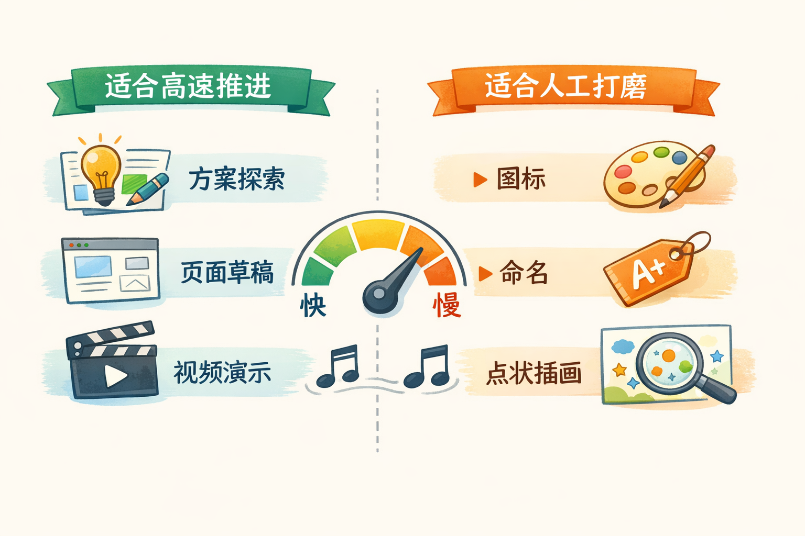

# Ryan Mather 讲了 7 条 Claude Design 经验，我觉得最值钱的是这套“高带宽设计”方法

最近看到 Ryan Mather 在 X 上发了一组很实在的连发分享，主题是 **怎么把 Claude Design 用出效果**。

如果只用一句话总结，那就是：

**Claude Design 最有价值的地方，不是“帮你画几张稿子”，而是把设计从低带宽的描述工作，变成高带宽的协作工作。**

Ryan Mather 自己就在 Anthropic 的垂直业务团队，服务 7 个不同产品。他给出的建议，不是空泛观点，而是很典型的一线使用经验。

我把这组连发内容重新梳理了一遍，发现这些经验大致可以分成两层：

1. 前 7 条，是非常具体的使用方法。
2. 后 4 条，讲的是更底层的设计观。

真正值得抄作业的，其实是后者。

## 先说结论：不要把 Claude Design 当成另一个 Figma

很多人第一次接触这类产品，直觉都是：

- 它是不是一个会聊天的画布工具？
- 它是不是能更快地产出界面稿？
- 它是不是可以替代现有设计软件？

但 Ryan Mather 给出的答案其实很明确：

**别按传统画布工具的方式去用它。**

在他的描述里，Claude Design 更像一个能快速理解上下文、生成方案、做局部修改、甚至临时造工具的设计工作台。

这背后的区别很大。

传统工具更像“你来操作，软件来执行”。

Claude Design 更像“你描述目标、限制和判断标准，它跟着你一起推演方案”。

所以它真正优化的，不只是出图速度，而是下面这几件事：

- 把想法变成可见结果的时间变短
- 把设计师和工程师来回翻译的成本变低
- 把文档、会议纪要、Slack 上下文直接接进设计流程
- 把很多原本要反复手动操作的事情，变成一次性描述

## Ryan Mather 的前 7 条经验，到底在讲什么

### 1. 先把设计系统和核心屏幕搭起来

他的第一条建议非常朴素：

**先花一个小时，把设计系统和核心屏幕整理好。**

这一步听起来不“酷”，但其实最重要。

因为 Claude Design 再快，也得先知道什么叫“你的产品风格”、什么叫“你的核心流程”、什么叫“已经被验证过的页面结构”。

如果连这些基础上下文都没有，模型再强，也只能在空气里发挥。

说白了，Claude Design 不是凭空替你做设计，它更像是在你已经铺好的地基上加速。

### 2. 和工程师实时迭代

Ryan 说，他经常能在一次会议里，直接和工程师把一个新功能设计出来。

这句话很关键。

以前很多设计沟通是这样的：

1. 设计师先讲概念。
2. 工程师再反问约束。
3. 会后再补稿。
4. 下一轮继续对齐。

现在因为 Claude Design 出原型很快，双方可以边聊边看结果，始终停留在“目标、限制、取舍”这种高层问题上。

这相当于把原本低带宽的口头沟通，变成了高带宽的实时共创。

### 3. 用批注工具（Comment）做“外科手术式”精修

Ryan 的第三条建议我很喜欢：

**不要费劲把所有修改点口头描述清楚，直接点出来、批出来。**

这是个很典型的经验。

当第一版出来以后，真正难的往往不是大方向，而是几十个小地方：

- 这里层级不对
- 那里留白太挤
- 这个按钮语气太重
- 那个信息块应该后移

这时候你再用一大段自然语言去描述，效率其实很低。

更好的方法是：**直接指位置，直接提批注。**

这也是为什么他说这是 “rapid fire surgical edits”。

不是重新做一遍，而是快速做精准修正。

### 4. 让 Claude 直接做视频演示

第四条经验看起来像功能介绍，其实背后是认知升级：

**不要只让它给你静态稿，也要让它把交互和使用过程演出来。**

为什么这点重要？

因为很多设计问题，静态图看不出来，只有到了“动起来”的时候才会暴露：

- 节奏顺不顺
- 过渡生不生硬
- 用户是不是知道下一步去哪
- 一个想法在真实使用里是不是成立

Ryan 甚至直接说，Claude Design 几乎能做任何你想到的东西，它更像 Claude Code，而不是一个画布工具。

这句话的意思不是“它会写代码”这么简单，而是：

**你应该把它当成可编排的生成式工作台，而不是固定操作面的软件。**

### 5. 用连接器，把文档和 Slack 直接接进来

第五条经验非常适合真实团队环境。

他举的例子是：

让 Claude 直接读取会议纪要，然后输出一份演示文稿，探索会上提到的不同设计方案。

这件事厉害在哪？

以前设计输入分散在很多地方：

- 产品文档里一部分
- Slack 讨论里一部分
- 会议纪要里一部分
- 脑子里还记着一部分

现在如果连接器接好了，这些上下文可以直接进入设计过程。

于是你的角色就变了。

你不再需要先做“信息搬运工”，再开始做设计；你可以直接从判断和取舍开始。

### 6. 让 Claude 临时造工具

这是 Ryan 这组分享里最容易被低估的一点。

他提醒大家：

**不要按画布工具的思路去用 Claude Design，因为它有完全不同的超能力。**

其中一个超能力，就是按需生成临时工具。

这意味着什么？

意味着它不只是给你结果，还能为当前任务临时搭一层能力。

比如：

- 做一个特定结构的展示器
- 做一个只服务当前任务的小组件
- 把某段重复操作临时封装起来

很多时候，真正拉开效率差距的，不是某个单独界面，而是这种“为了当前问题，顺手再造一个小工具”的能力。

### 7. 知道什么时候该慢下来，亲手做

第七条经验非常成熟。

Ryan 说，新图标、点状插画、命名，这些细节往往有非常大的影响。

也就是说：

**不是所有东西都适合一路自动加速。**

这种 AI 驱动的高速设计节奏很容易让人上头，因为它真的太快了。

但越快，越容易忽略那种“小而关键”的决定。

比如：

- 一个图标是不是有辨识度
- 一个命名是不是准确又顺手
- 一张小插画是不是刚好把气质立住了

这些地方，很多时候还是要靠人亲手打磨。

## 后面 4 条补充，才是这组分享真正有味道的地方

如果只看前 7 条，你会觉得 Ryan 在分享一套高效率的设计工作方法。

但后面 4 条补充，把这件事的气质讲出来了。

### 8. 设计过程要有“愉悦感”

Ryan 说，他最喜欢 Claude Design 的地方，是它让设计过程变得很愉快。

这不是一句轻飘飘的话。

因为设计这件事，本来就很依赖试错、发散、试探和回看。

当试一个想法的成本很高时，人就会更保守。

当试一个想法几乎没成本时，人就更愿意探索分歧更大的方案，也更愿意“先试试看，再决定”。

他说自己可以更轻松地持有这些想法，其实说的是：

**速度提升以后，设计师对方案的心理绑定会变弱，探索空间会变大。**

### 9. 好工具不只是强，还要有趣

他还特别提到，看 Nate Parrott 和团队做这个产品，本身就是一件很享受的事。

原因不只是产品强，而是整个过程里有一种轻盈感和玩心。

这个点很容易被技术团队忽略。

但真实情况是：

**设计工具的情绪体验，会反过来影响设计产出。**

一个让人觉得拘谨、僵硬、像在填表的软件，很难激发真正有创造力的工作状态。

而一个让人觉得轻盈、好玩、可以随手试错的系统，往往更容易产出有生命力的方案。

### 10. 这不是旁观者评论，而是一线使用者的心得

Ryan 还补充了一句：

他其实给 Claude Design 提过几次 PR，做过文件界面、输入区（composer）和一些零散功能，虽然现在那些代码早就过时了。

这句话的价值在于，它让这组分享更可信。

因为你会知道，这不是一个只看过演示的人，在转述产品发布会内容；而是一个真正参与过产品、也长期在用的人，在讲自己踩出来的经验。

### 11. 这套方法还在进化

他最后说，既然 Claude Design 已经上线，后面还会继续分享更多经验和小窍门。

这其实也说明了一件事：

**这不是一套已经完全固定的操作手册，而是一种正在快速演化的新工作方式。**

所以最好的学习方法，不是背下 7 条命令，而是抓住它背后的使用哲学。

## 如果把这组分享再蒸馏一遍，我会提炼成 4 个原则

### 原则 1：先把上下文搭好，再谈生成速度

设计系统、核心屏幕、文档连接器，这些看起来像准备工作，其实决定了后面能不能进入高质量加速。

没有上下文，生成只会更快地产生噪音。

### 原则 2：把设计变成高带宽协作，而不是低带宽转述

和工程师现场共创、直接批注精修、用视频验证想法，本质上都在做同一件事：

**减少“我来描述，你来想象”的损耗。**

### 原则 3：把 Claude Design 当成可编排工作台，不是单点工具

连接器、视频演示、临时工具，这些能力放在一起看，你会发现它更像一个能吸收上下文、按需扩展能力、快速生成中间成果的工作台。

不是单纯的“画图软件升级版”。

### 原则 4：在超高速里，保留人的慢工

真正有辨识度的设计，最后往往还是靠那些关键细节。

所以成熟的用法不是“什么都交给它”，而是：

**该高速的时候高速，该慢下来的地方，认真慢下来。**

## 最后，普通团队可以怎么开始

如果你想把 Ryan 这套方法真正用起来，我觉得可以先从下面 5 步开始：

1. 先整理 3 到 5 个最核心页面，外加一份最基本的设计规范。
2. 把常用设计输入接起来，比如产品文档、会议纪要、Slack 讨论。
3. 下一次和工程师开功能会时，直接用 Claude Design 现场推方案。
4. 第一版出来以后，不要重新长篇描述，直接用批注做精准修改。
5. 对命名、图标、品牌感这些高影响细节，保留人工精修环节。

说到底，Ryan Mather 这组分享最值得记住的，并不是某个技巧。

而是这句话：

**当设计工具开始具备 Agent 能力以后，设计的核心竞争力会越来越从“会不会操作软件”，转向“会不会组织上下文、推动协作、判断取舍”。**

这件事，可能比 Claude Design 本身更值得长期关注。
