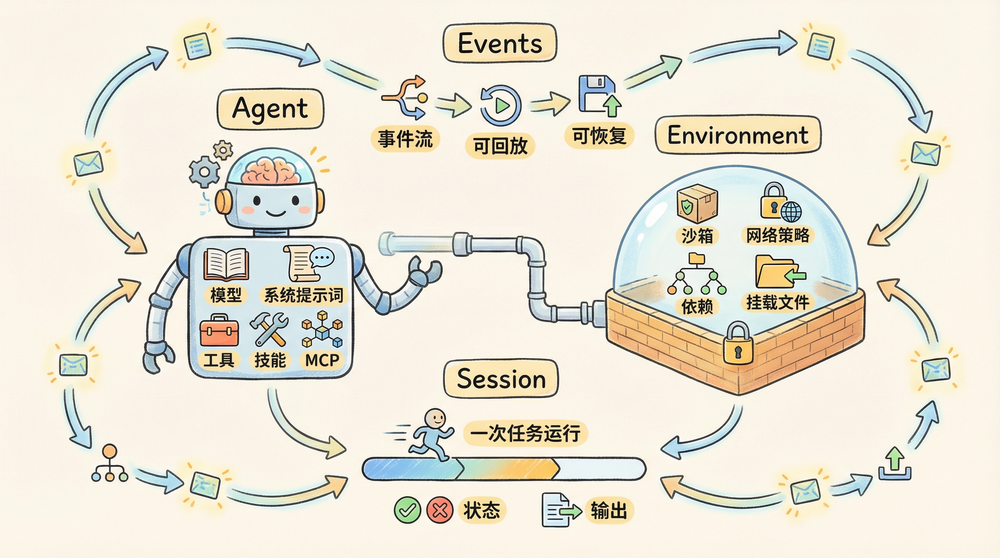
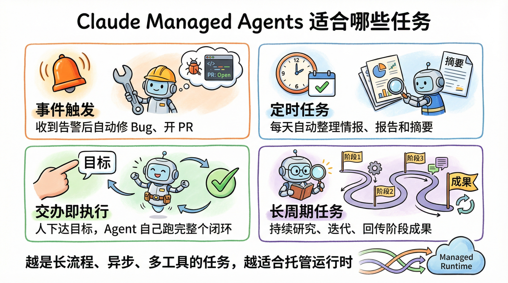

# Claude Managed Agents 发布了，但真正值得关注的，是 Agent 基础设施开始产品化

最近看到 Lance Martin 发的一条帖子，讲的是 **Claude Managed Agents**。

如果只用一句话总结，那就是：

**Anthropic 不是又发了一个“帮你调工具调用”的 Agent SDK，而是在把 Agent 运行时本身做成一个托管平台。**

这两者看起来很像，实际差别非常大。

前者的思路是：模型还是那个模型，你自己写一层 harness，把工具调用、上下文裁剪、文件读写、失败重试这些事情拼起来。

后者的思路是：这些本来就不该每个团队都重复造轮子，所以平台直接把它们托管掉。你描述 Agent 的配置、环境和任务，剩下的执行框架、上下文恢复、安全隔离、长任务运行，都交给底层基础设施。

这件事真正有价值的地方，不是“Agent 更方便了”，而是 **Agent 工程开始从脚手架时代，进入运行时时代了。**

## 为什么这件事值得认真看

这几年大家做 Agent，最常见的一条路是这样：

1. 先拿一个大模型接口。
2. 外面包一层 agent loop。
3. 再加工具调用。
4. 再补 memory、重试、日志、权限、沙箱。
5. 跑一阵子以后，发现系统越来越像一个分布式应用。

问题就来了。

很多人以为自己在“做 Prompt Engineering”，其实后面 80% 的时间都花在了 **上下文管理、失败恢复、工具执行、安全边界、异步任务调度** 这些工程问题上。

而且这里还有一个特别容易被忽略的坑：

**你写出来的 harness，往往偷偷假设了“模型现在做不到什么”。**

比如：

- 你默认模型不会自己整理上下文，所以你强行加摘要。
- 你默认模型不会规划长流程，所以你把步骤切得特别死。
- 你默认模型不会自己判断是否需要工具，所以你写很多硬编码规则。

这些假设短期内能工作，但模型一旦变强，它们就会从“补丁”变成“束缚”。

这也是官方工程博客里反复强调的一点：**Harness 会过时。**

所以 Managed Agents 想解决的，不只是“怎么更方便地调 Claude”，而是：

**当模型能力持续变化时，怎么让外围系统不要成为瓶颈。**

## Claude Managed Agents 到底是什么

按照官方文档的定义，Claude Managed Agents 是一个：

**预构建、可配置、运行在托管基础设施上的 Agent Harness。**

翻译成人话就是：

你不用自己从零拼一套 agent runtime 了，平台已经把这层准备好了。你主要关心三件事：

- `Agent`：这个 Agent 是谁，用什么模型，有什么系统提示词、工具、MCP、技能。
- `Environment`：这个 Agent 跑在什么环境里，能不能联网，要不要预装依赖，挂哪些文件。
- `Session`：这一次具体执行任务的运行实例。

官方文档还额外强调了 `Events`，也就是事件流。因为 Agent 不是“一问一答”，而是一个持续运行的过程，所以事件流本身就是核心接口的一部分。

你可以把它理解成下面这个模型：

```yaml
agent:
  model: claude-sonnet-4-6
  system: 你是一个能独立完成软件任务的工程 Agent
  tools:
    - bash            # 运行命令
    - file_ops        # 读写和编辑文件
    - web             # 搜索和抓网页
  skills:
    - github
    - xlsx

environment:
  network: enabled    # 允许联网
  packages:
    - nodejs
    - python

session:
  task: 修复一个线上 bug，并提交 PR
```

上面这段不是官方原样配置，而是一个帮助理解的简化版本。

它想表达的是：**你定义的是 Agent 的能力边界和运行环境，而不是每一步怎么循环调用模型。**



## 它真正解决的，不是“调模型”，而是三类基础设施问题

### 1. 长任务怎么稳定跑

以前很多 Agent Demo 都能跑 3 分钟，但一到半小时、一小时，问题就全出来了：

- 上下文越来越长，开始乱。
- 工具调用多了，状态很难追。
- 中间某个容器挂了，整个任务直接丢。

Managed Agents 的思路是，把长任务当成一个真正的系统问题来处理。

官方文档明确说，这套东西更适合 **分钟到小时级别的长任务和异步任务**。工程博客里进一步拆开讲：他们把 `session` 做成持久化事件流，把 `harness` 从执行环境里拆出来，让恢复执行不必依赖“那一个还活着的容器”。

这句话听上去有点抽象，换个更好懂的说法：

**以前很多 Agent 像“养宠物服务器”，挂了就得救。现在他们更想做成“牛群式基础设施”，坏一个可以直接换。**

这就是为什么它更适合长期运行。

### 2. 上下文怎么管理，才不会越跑越糊

Agent 一旦做复杂任务，就一定会碰到上下文窗口的问题。

常见做法是摘要、裁剪、压缩、写 memory 文件。问题在于，这些动作都带着强假设：你以为不重要的信息，后面可能正好有用。

Anthropic 在工程博客里提了一个很关键的思路：

**Session 不是 Claude 的上下文窗口，但它应该成为 Claude 随时可回看的外部上下文对象。**

什么意思？

不是把所有东西都硬塞进当前对话窗口里，而是把事件完整记下来，真正需要时再取回、重组、压缩。

这样做的好处是：

- 当前上下文可以保持轻。
- 历史过程不会直接丢。
- 未来换更强的 harness，也还能重新解释旧事件。

这点非常重要。因为它意味着系统把“可恢复的原始记录”和“当前如何组织上下文”分开了。

前者尽量稳定，后者可以随着模型进化。

## 3. 安全边界怎么划，才不会一提示注入就全泄露

Agent 一旦能执行代码、访问仓库、连接第三方工具，安全问题就不是锦上添花，而是底线。

以前很多简化实现，会把执行代码的环境和凭证放得很近。这样做虽然快，但风险也很直接：

如果模型在沙箱里跑了不可信代码，而这个沙箱又能碰到敏感凭证，那 prompt injection 就不只是“让模型说错话”，而是可能真的把权限带走。

Managed Agents 这套设计里，一个很重要的方向就是：

**把“脑子”“手”“凭证”分开。**

- 脑子：Claude 和 harness
- 手：沙箱、工具、外部执行环境
- 凭证：Vault 或代理层管理

这样即使 Agent 在某个执行环境里跑代码，也不等于它直接拿到了所有秘密。

这不是体验优化，这是 Agent 平台能不能进生产环境的分水岭。

## 为什么说它的核心思想，其实是“解耦”

我觉得这条帖子里最值得抄作业的，不是某个 API，而是背后的系统设计。

工程博客把它讲得很直白：他们在做的是把下面三件事拆开：

- `brain`：模型和 harness
- `hands`：执行动作的工具和沙箱
- `session`：整个任务的事件记录

为什么一定要拆？

因为只要这三件事绑死在一起，系统就会越来越难演化。

举个例子。

如果 brain 和 hands 强耦合，那你想接入多个执行环境，或者想让不同 Agent 协作，就会特别别扭。

如果 session 和 harness 强耦合，那 harness 一挂，恢复成本就会非常高。

如果凭证和沙箱强耦合，那安全边界就会很脆。

所以你会发现，Managed Agents 真正卖的不是“这个 Agent 比别家更聪明”，而是：

**它把 Agent 系统里最容易一起长歪的几层，提前拆开了。**

## 这套东西适合哪些场景

从 Lance 的帖子和官方案例来看，我觉得最典型的是四类：

### 1. 事件触发型任务

比如监控系统发现 bug，直接拉起一个 Agent 去定位问题、写补丁、开 PR。

这类场景的关键不是聊天，而是 **收到信号后能自己干完整个闭环。**

### 2. 定时任务

比如每天自动整理 GitHub 动态、X 信息流、销售数据、研究摘要。

这类任务最怕的是流程长、外部依赖多、偶发失败难恢复。托管运行时正好补这个短板。

### 3. Fire-and-forget 任务

你把目标丢给 Agent，让它自己回来交付结果，比如表格、Slides、代码、报告。

这种模式下，人类更像产品经理，而不是每一步都盯着的操作员。

### 4. 长周期任务

这可能才是它真正想打的场景。

不是“帮我查个资料”，而是“你接下来持续研究这个方向，整理方案，遇到问题自己迭代，最后给我结果”。

如果未来 Agent 真能连续工作几天、几周，甚至更久，那决定上限的就不是模型 API 本身，而是 **任务状态能不能持续、工具环境能不能恢复、上下文能不能回放、安全边界能不能守住。**



## 普通开发者最该学什么

我觉得不是立刻去记住多少个新接口，而是先把思路换掉。

以前我们讨论 Agent，常常会把重点放在：

- 提示词怎么写
- Tool calling 怎么配
- ReAct 循环怎么套

这些当然重要，但它们越来越像“局部优化”。

现在更值得问的是：

- 这个任务是不是长任务？
- 失败以后能不能恢复？
- 状态记录在哪里？
- 工具权限怎么隔离？
- 多个 Agent 怎么协作而不互相污染上下文？

如果你还停留在“给模型一个 system prompt，再包一个 while loop”，那大概率会在真正上线时踩一堆工程坑。

## 如果你想开始，用什么姿势最合适

按官方文档，最简单的路径其实很直接：

1. 先在 Console 里原型化你的 Agent。
2. 把模型、系统提示词、工具、MCP、技能配出来。
3. 再落到 API/SDK，用 `Agent + Environment + Session` 的方式接进你的应用。

如果你是第一次上手，我建议不要一开始就追求“大而全”。

更稳的做法是先做一个最小闭环：

- 一个明确任务
- 一个可控环境
- 一组必要工具
- 一条可以完整回放的事件流

先证明它能稳定跑完，再去加 memory、多 Agent、更多外部系统。

另外补一句，**截至 2026 年 4 月 9 日**，官方文档里 Managed Agents 仍然要求带上 `managed-agents-2026-04-01` 这个 beta header。也就是说，它已经很可用，但你最好把它当成一个仍在快速迭代的平台能力来看。

## 最后说一句

这条帖子表面上是在介绍 Claude Managed Agents。

但如果你只把它理解成“Anthropic 又发了一个 Agent 产品”，其实有点可惜。

它更像是在告诉开发者一件事：

**未来真正有竞争力的，不只是会不会调用模型，而是能不能把 Agent 做成一个可长期运行、可恢复、可扩展、可控权限的系统。**

换句话说。

Agent 的下一阶段，拼的不只是提示词。

拼的是运行时。

## 参考资料

- 原始帖子：https://x.com/RLanceMartin/status/2041927992986009773
- 官方概览：https://platform.claude.com/docs/en/managed-agents/overview
- 官方工程博客：https://www.anthropic.com/engineering/managed-agents
- Console 原型化说明：https://platform.claude.com/docs/en/managed-agents/onboarding
