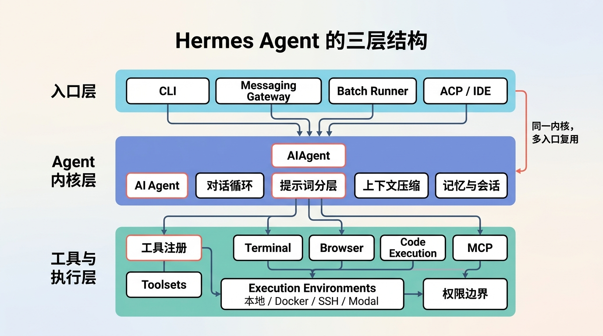
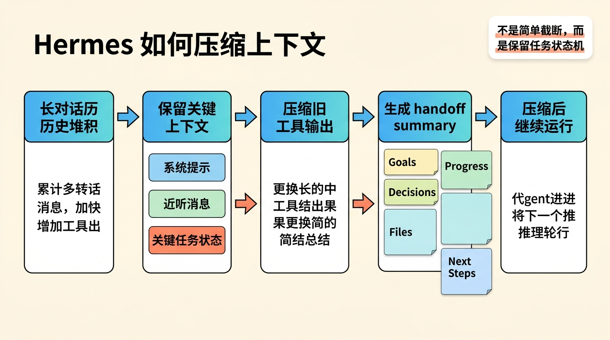
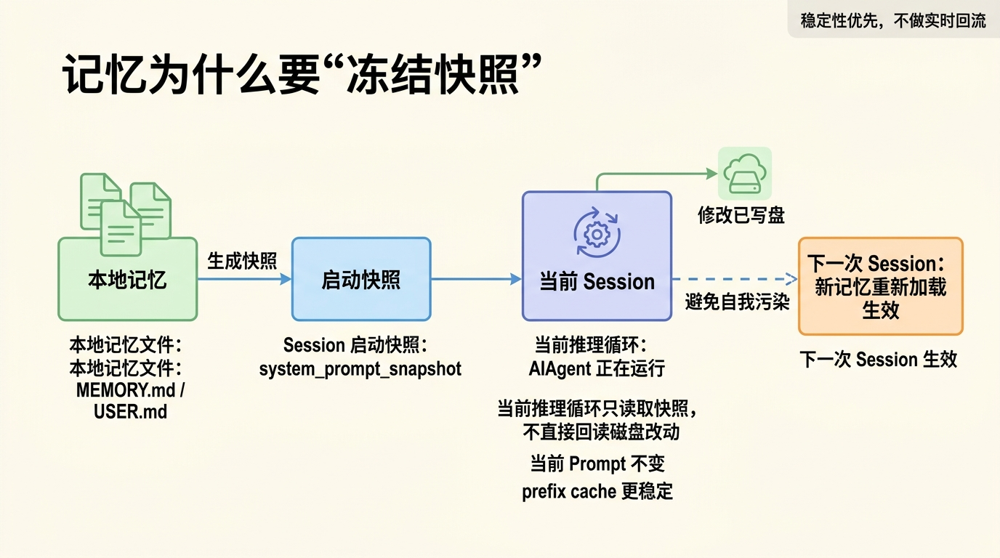
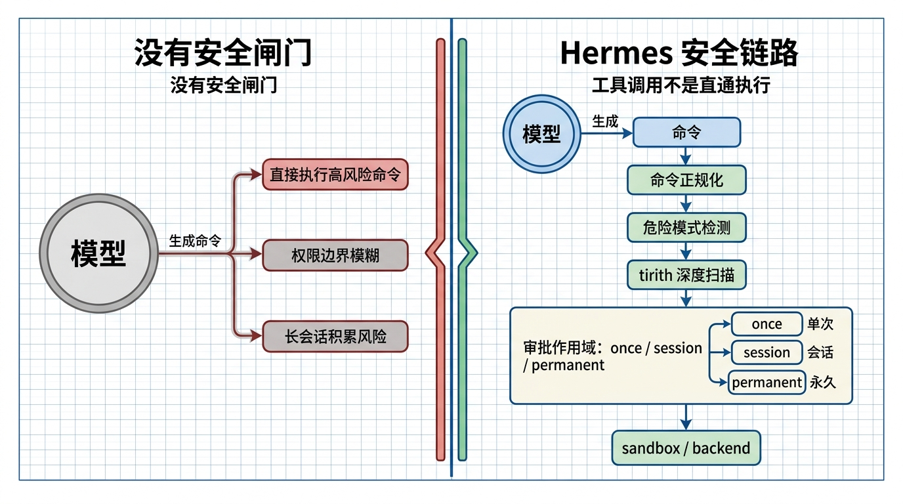
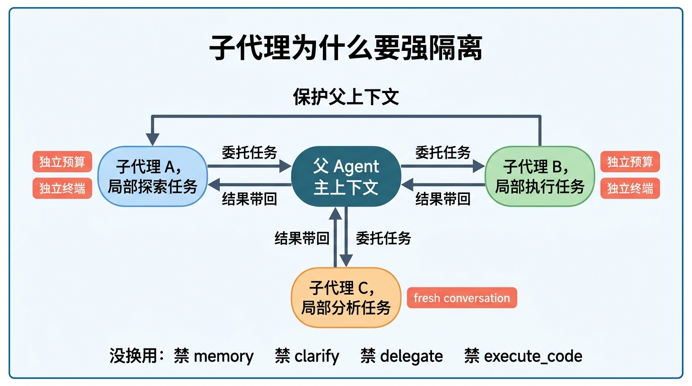
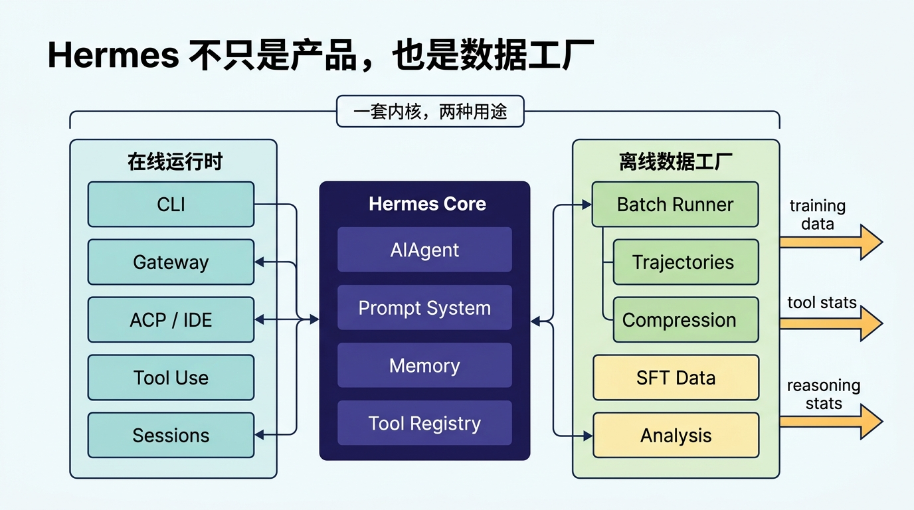

# 扒开 Hermes Agent 源码后，我发现它真正厉害的不是工具多，而是把 Agent 做成了“操作系统”

先说结论。

如果你只把 [NousResearch/hermes-agent](https://github.com/NousResearch/hermes-agent) 看成一个“会调工具的 AI CLI”，那基本只看到了表面，因为它真正想解决的问题，并不是“怎样把一个大模型接到 shell 上”，而是怎样把一个会思考、会调工具、会长期运行、会跨入口工作的 Agent，做成一套能在真实环境里持续运转的工程系统。

我把它的 DeepWiki 文档和相关源码入口重新梳理了一遍，最大的感受是：

> Hermes Agent 真正强的地方，不是它能接多少工具，而是它已经开始把 Agent 当成一套长期运行的系统来设计了。

这意味着它解决的问题，已经不是“怎么让模型调用 shell”这么简单，而是下面这些更难、也更接近系统设计本质的问题：

- 对话跑很多轮以后，状态怎么不乱
- prompt 越来越长以后，怎么不断电
- 记忆怎么存，才不会把自己毒死
- 子任务怎么分出去，才不会把主上下文搞脏
- 工具怎么开放，才不会权限失控
- 同一套内核，怎么同时服务 CLI、IDE、消息平台，甚至训练数据生成

如果只用一句话总结：

**Hermes Agent 更像一个 Agent runtime，甚至有点像“Agent 操作系统”，而不是一个聊天应用。**



## 为什么这个项目值得认真看

现在市面上 Agent 项目很多，但大部分项目都有一个共同问题：它们更像功能拼装，而不是一个经过认真约束的运行时系统。

比如：

- 接一个终端工具
- 接一个网页工具
- 接一个记忆文件
- 再搞个多代理

然后就说这是一个 agent framework。

Hermes 不太一样。它的设计重心不是“把能力堆起来”，而是先问清楚：

**一个能长期工作的 Agent，到底需要哪些稳定的基础设施。**

从源码结构看，它大致可以拆成三层：

1. 入口层
2. Agent 内核层
3. 工具与执行层

这三层一旦想清楚，很多原本看起来零碎的代码就会突然连起来，因为你会发现它们不是在分别补功能，而是在共同服务一个目标：让 Agent 在复杂任务里依然可控、可恢复、可扩展。

## 第一层：入口层不是主角，但决定了 Hermes 不是玩具

Hermes 有好几个入口：

- CLI
- Messaging Gateway
- Batch Runner
- ACP Server

这件事意味着什么？

意味着 Hermes 从一开始就不是为“终端里问两句”设计的。

它要做的是同一个内核，多处复用：

- 在终端里，它是 coding agent / research agent
- 在聊天平台里，它是带状态的对话代理
- 在 IDE 里，它是编辑器背后的 agent backend
- 在批处理里，它又成了轨迹生成器

很多项目的问题是，产品形态先定死了，后面再补架构，于是最后每加一个入口、每多一个平台、每接一套工具，内部抽象就会越来越乱；Hermes 反过来，它先把内核做出来，再把不同入口接上去，所以你会明显感觉到它的很多代码不是“某个功能专用逻辑”，而是在给后续复用留接口。

这是一种更像“系统软件”的思路。

## 第二层：真正的心脏，是 `AIAgent.run_conversation()`

如果你要抓 Hermes 的主线，最值得看的就是 `run_agent.py` 里的 `AIAgent.run_conversation()`。

它就是整个系统的“心跳”。

可以把它理解成一个标准的 Agent 主循环：

1. 组装消息
2. 调模型
3. 看模型是要回答，还是要调工具
4. 如果要调工具，就执行工具
5. 把工具结果塞回去，继续下一轮

光看这个流程，你可能会觉得没有什么新鲜的。

真正关键的地方在于，Hermes 把这条循环做成了“可长期运行”的版本，也就是说，它不是只关心一轮调用能不能顺利结束，而是关心这个循环在几十轮之后会不会失控、在中断时能不能收住、在上下文变长时还能不能维持任务连续性。

### 1. 它有迭代预算，不允许无限自转

Hermes 在主循环里用了 `IterationBudget`。

这个设计非常重要。

因为一旦进入：

`思考 -> 调工具 -> 再思考 -> 再调工具`

这种模式，模型很容易出现两类问题：

- 原地转圈
- 任务越拆越细，最后根本停不下来

Hermes 的处理很务实：

- 父 Agent 有默认轮次上限
- 子 Agent 也有单独预算
- 某些工具步骤还能 `refund()`，避免把“纯机械执行”也算成推理成本

这背后有个非常成熟的判断：

**Agent 不是一次大模型调用，而是一个消耗资源的进程。**

你把它当进程设计，很多事情就顺了。

### 2. 它把中断当一等公民

很多 Agent 项目的“中断”只是个附属能力。

Hermes 不是。

在它这里，中断是主流程的一部分。

比如：

- CLI 里按 `Ctrl + C`
- Gateway 里收到取消信号
- 正在执行的工具需要停下来
- 正在跑的子代理也要一起停

这说明作者考虑的是“真实使用场景”。

因为长任务系统最怕的不是报错，而是停不下来，或者表面上还在运行、实际上已经进入一种既消耗 token 又不再推进任务的“假忙碌”状态。

## 第三层：Hermes 的 prompt 设计，重点不是写得多，而是分层

聊 Agent 很容易掉进一个坑：把所有注意力都放在 system prompt 文案上，最后变成“研究文案措辞”，却忽略了真正决定系统稳定性的，是 prompt 怎样分层、怎样缓存、怎样随着工作目录和任务阶段变化而有选择地展开。

Hermes 更值得学的是它的**prompt 组织方式**。

它不是把所有规则一股脑塞进去，而是拆成多个层次，再按顺序拼接。

从 DeepWiki 的梳理看，系统提示词大致会包含这些部分：

- `SOUL.md` 里的人设和行为基调
- Memory 相关提示
- Session Search 相关提示
- Skills 相关提示
- 面向特定模型的工具调用强化说明
- Skills 索引
- 项目上下文文件
- 平台上下文提示

看起来有点长。

但真正值得注意的是下面三点。

### 1. 它把“人格”和“项目约束”分开

Hermes 里有个很重要的文件叫 `SOUL.md`。

这个文件定义的是：

**你是谁。**

而像 `AGENTS.md`、`HERMES.md`、`CLAUDE.md`、`.cursorrules` 这些文件定义的是：

**你在这个项目里怎么做事。**

这两个东西看起来相近，实际上最好分开。

否则会出现什么问题？

你改一点项目规则，整个人设和执行风格都跟着晃。

Hermes 的拆法很像配置系统：

- `SOUL.md` 负责稳定人格
- 项目上下文文件负责局部行为
- skills 索引负责可选能力目录

好处有两个：

1. 系统更稳定
2. 更容易做 prompt cache

### 2. 它把上下文文件做成“目录继承”

Hermes 有个设计我很喜欢。

它会从当前工作目录往上找上下文文件，一直到 git root。

大致优先级是：

1. `.hermes.md` / `HERMES.md`
2. `AGENTS.md`
3. `CLAUDE.md`
4. `.cursorrules` / `.cursor/rules/*.mdc`

这意味着什么？

意味着 Hermes 给项目上下文做了一套“继承链”。

一个大仓库可以有总规则。

一个子目录也可以有自己的局部规则。

更细的一点是，Hermes 不是一开始就把所有子目录规则塞进 system prompt。

它会在真正访问某个子目录内容时，再提示对应规则。

这一步非常关键。

因为如果一开始把整个仓库的局部规则全读进来，会有两个坏处：

1. prompt 巨大
2. prefix cache 命中率直接被打爆

所以 Hermes 做的是：

**先只放核心上下文，局部规则按需补充。**

这是一种典型的 runtime 思维，因为它不是在追求“第一次把所有信息喂满”，而是在追求“让正确的信息在正确的时刻出现”，从而用更低的上下文成本换来更稳定的任务推进。

### 3. skills 不是一次性全读，而是“目录先行”

Hermes 的 skills 系统不是把所有 `SKILL.md` 全塞进 prompt。

它只先给模型一个技能索引：

- 名字
- 描述
- 平台匹配结果

等模型判断“这个技能值得用”，再去读完整内容。

这个做法特别像软件里的懒加载。

为什么这么做？

因为上下文窗口是昂贵资源。

你需要让模型知道“我有哪些武器”，但不需要让它每一轮都背下整本武器说明书。

如果只看一句话：

**Hermes 把能力目录和能力内容分开了。**

这件事非常对。

## 上下文压缩：Hermes 真正厉害的地方，是知道“什么不能丢”

只要 Agent 真的开始工作，很快就会碰到一个问题：

上下文爆了怎么办？

很多项目在这里的做法都很简单：砍历史、留最近几轮、继续跑；短任务这样做也许还能混过去，但一旦任务周期拉长，你很快就会发现，模型丢掉的并不是一些可有可无的废话，而是那些真正决定后续推理质量的任务状态。

Hermes 不一样。

它做的是更像“外科手术”的压缩。

大致思路是：

1. 先清理旧工具输出
2. 保留系统提示词
3. 保留最近若干轮关键消息
4. 把中间长历史总结成 handoff summary
5. 如果已经有旧 summary，就不是重写，而是增量更新

真正关键的地方在于，它不是随便总结。

而是尽量保留这些任务状态：

- 当前目标
- 已完成进度
- 关键决策
- 涉及文件
- 下一步计划



这背后的判断很成熟，因为长任务真正需要保留的，从来不是“每一句历史原文”，而是：

**任务的状态机。**

换句话说，模型不一定要记得你第 17 轮第 3 句话怎么说的。

但它必须知道：

- 问题现在解决到哪了
- 哪些尝试已经失败过
- 哪些文件已经改过
- 下一步准备做什么

如果你把这些信息保住，任务就能继续。

如果这些信息丢了，哪怕保留了很多原始文本，也没有意义。

这也是为什么我会说，Hermes 的上下文压缩思路，比很多“截断式 agent”成熟一个层级，因为它并不是把压缩当成 token 节流，而是把压缩当成任务接力，在保证上下文足够短的同时，尽可能不打断任务状态机。

另外它还有一个工程上很实用的兜底：

- 如果接口报 `413 Payload Too Large`
- 或者出现 context length 相关错误

它会立刻触发压缩，再重试。

这就让压缩不只是优化功能，而成了故障恢复机制。

## 记忆系统：Hermes 最有意思的设计，不是写入，而是“冻结快照”

Hermes 的记忆系统表面上看不复杂，核心就两个文件：

- `MEMORY.md`
- `USER.md`

但如果你继续往里看，会发现它最聪明的地方根本不是“能存记忆”，而是**记忆怎么生效**。

### 1. 它不是实时回流，而是冻结在 session 开头

`MemoryStore` 在 session 启动时，会把 memory 文件读进 `_system_prompt_snapshot`。

后面就算 Agent 在运行中改了 `MEMORY.md` 或 `USER.md`：

- 磁盘文件会立刻更新
- 当前 session 的 system prompt 不会立刻变化
- 新记忆要下一次 session 才会进入 prompt

很多人第一次看到这个设计，会觉得“是不是太保守了”，但这恰恰是经验之谈，因为一旦你真的让 Agent 长时间运行，就会非常清楚地意识到：记忆实时回流看上去很聪明，实际上经常会把系统稳定性和缓存收益一起打掉。

如果记忆实时回流，会出现两个大问题：

1. prefix cache 失效
2. 模型会不断被自己刚写下的内容二次污染

前者让你越来越贵。

后者让行为越来越飘。

Hermes 选择的是：

**记忆允许延迟生效，换取系统稳定。**

这就是典型的工程取舍。它没有追求“记了就立刻生效”的表面聪明，而是优先保证当前 session 的行为边界稳定，让记忆像下一次启动时加载的新配置，而不是当前运行中不断自我改写的系统指令。

### 2. 它把记忆当成高风险输入来防

Hermes 这里还有一个特别对的判断。

它知道 memory 最终会进入 system prompt。

所以 memory 本身就不是“普通文本存储”。

它是高风险输入。

因此它会扫描 memory 内容，拦截这些模式：

- prompt injection
- exfiltration 文案
- `.ssh` / `authorized_keys` 等持久化后门相关内容
- 零宽字符等不可见 Unicode

很多项目一加 memory，就把它当“随便记点东西”的地方。

Hermes 不是。

它很清楚：

**记忆不是数据库，而是下一轮 prompt 的原材料。**

所以必须按 prompt 安全来防，而不是按“普通笔记文件”来防。



## 工具体系：Hermes 的重点不是工具多，而是边界干净

很多 Agent 项目一上来就喜欢说“支持 30+ tools”。

Hermes 当然也有很多工具。

但它更值得学的，不是数量，而是组织方式。

它大致用了很标准的一套 registry 思路：

- 工具模块在 import 时注册自己
- 注册表保存工具元数据
- 统一层收集 schema
- 执行时按名称分发
- toolset 决定当前会话真正暴露哪些能力

为什么这很重要？

因为一个成熟 Agent 的问题，从来不是“能不能多接一个工具”。

而是：

**怎么让工具能力既可扩展，又不失控。**

### 1. schema、handler、环境检查是分开的

在 Hermes 里，一个工具不是只有执行函数。

它通常至少包含三件事：

- schema
- handler
- check function

也就是：

- 怎么告诉模型这个工具能干嘛
- 真执行时跑什么逻辑
- 当前环境能不能用

这会带来一个很大的好处：

模型看到的是统一描述。

运行时拿到的是统一调度入口。

环境层还能决定某些工具当前是否禁用。

这是典型的插件系统思路。

### 2. Hermes 不会把所有工具默认全开

Hermes 有 `enabled_toolsets` 和 `disabled_toolsets` 这种机制。

这一点很关键。

因为很多 Agent 失败，不是模型不会选工具，而是你一口气把太多能力都暴露给它了。

工具暴露面一大，问题马上就来了：

- 权限过宽
- 选择困难
- 意外副作用增加

Hermes 的做法更像最小权限原则：

- coding 任务开文件和终端
- research 任务开 web / browser
- 高风险场景缩减写权限和 delegation 权限

所以 toolset 在 Hermes 里不是“功能分类”这么简单。

它其实是权限边界的一部分。

### 3. 工具结果尽量统一，这对整个系统都很重要

Hermes 的工具结果大量采用统一 JSON 字符串结构。

失败一般也会落到 `{"error": "..."}` 这种形态。

这件事不炫技，但极其有用，因为一旦输出统一：

- 主循环更容易处理
- 日志更容易归档
- 轨迹更容易训练化
- 批处理统计更容易做

很多系统早期不在意这个问题。

结果后面做数据沉淀和失败恢复时，整个链路都变得很痛苦。

Hermes 明显提前想到了。

## 安全系统：Hermes 是少数把“审批”认真做成子系统的 Agent 项目

如果说前面讲的是“能跑”，那安全系统讲的是“敢跑”。

Hermes 在安全这块，做得比很多同类项目细得多。它不是只弹一个确认框，而是把“模型生成的动作，怎样经过一套逐级收缩风险的闸门以后，才真正落到执行环境里”这件事拆成了多层防线。

### 第一层：危险命令快速扫描

Hermes 会对明显危险的命令做模式检测。

例如：

- `rm -r`
- 根目录删除
- `chmod 777`
- `curl | bash`
- `DROP TABLE`
- 写入 `/etc/`、`.ssh/`、`.hermes/.env`

这层像“前置粗筛”。

目的很明确：

先把高风险动作挡下来。

### 第二层：执行前先做正规化

这一步很多人会忽略。

Hermes 在扫描前会先做这些处理：

- 去掉 ANSI escape
- 清理空字节
- 做 Unicode NFKC 归一化

为什么？

因为有些恶意内容不是换命令，而是换写法。

比如：

- 混淆字符
- 不可见字符
- 奇怪的编码逃逸

如果不先正规化，你看到的字符串和机器真正执行的字符串，可能不是一回事。

### 第三层：`tirith` 做更深一层的内容扫描

Hermes 还接了一个额外安全扫描器 `tirith`。

它不是只看明显危险命令，而是尝试识别更细的内容级风险。

比如：

- 同形异义字符
- 终端注入
- 伪装成正常文本的危险 payload

更关键的是，这个工具缺失时 Hermes 还会自动下载并校验。

这说明它不是“文档里说支持”，而是真正把这条安全链路接进去了。

### 第四层：审批是有作用域的

Hermes 的审批不是简单的 yes / no。

而是分成：

- once
- session
- permanent

这背后的体验很好理解：

- 临时放行一次
- 当前会话都放行
- 永久加入 allowlist

而且在 Gateway 场景下，审批状态还和 session 绑定。

这就说明 Hermes 不是只考虑单用户 CLI。

它是在按多会话系统做设计。



## 子代理：Hermes 真正想解决的，不是“并行”，而是“上下文污染”

很多项目一提 subagent，就很容易变成营销词。

Hermes 的 `delegate_task` 倒是让我觉得很实在。

因为它真正想解决的问题是：

**主 Agent 的上下文很贵，不应该被所有中间步骤淹没。**

所以它给子代理做了非常强的隔离，这种隔离不是“为了好看”，而是为了保证父 Agent 的主上下文不被中间过程、失败尝试和大量工具回显冲垮。

从 DeepWiki 和相关源码入口看，子代理大致有这些特点：

- fresh conversation
- 独立任务 ID
- 独立预算
- 独立终端 session
- 跳过 memory 注入
- 跳过 context files 注入
- 屏蔽一批高副作用工具

这说明它不是把子代理当“第二个聊天窗口”，它更像是一个短生命周期 worker，专门拿来做局部探索、局部执行和局部收敛，完成以后只把结果带回父上下文，而不是把整个中间过程一股脑倒回来。



### 为什么它要屏蔽这些工具

Hermes 屏蔽的工具很有代表性：

- `delegate_task`
- `clarify`
- `memory`
- `send_message`
- `execute_code`

每个禁用都不是随便拍脑袋。

#### 禁 `delegate_task`

为了避免递归爆炸。

Hermes 还额外限制了最大深度和并行数量。

这很保守，但也是对的。

多级代理一旦放开，调试会很快变成灾难。

#### 禁 `clarify`

因为子代理不是用户前台，不应该自己跑去问人。

#### 禁 `memory`

因为多个子代理并发写长期记忆，副作用太大。

最后极容易把 shared memory 写坏。

#### 禁 `execute_code`

这个最耐人寻味。

它说明 Hermes 倾向让子代理去做“认知型拆分”，而不是把子任务直接丢进一个黑盒脚本里。

这其实很有节制。

不是所有能力都应该在子代理里继续放大。

### 它的本质是什么

如果只用一句话总结 Hermes 的 delegation：

**它不是为了显摆多代理，而是为了保护父 Agent 的主上下文。**

这个出发点非常成熟。

## BatchRunner：最容易被低估，但其实最有研究味的一块

如果你只从 CLI 视角看 Hermes，你会漏掉一大半价值。

因为项目里还有完整的 batch processing 管线：

- `batch_runner.py`
- `toolset_distributions.py`
- `trajectory_compressor.py`
- `mini_swe_runner.py`

这套东西是干嘛的？

不是服务实时用户。

而是为了：

- 批量跑 Agent
- 收集轨迹
- 压缩轨迹
- 生成训练数据
- 做工具使用和 reasoning 统计

这一步非常关键，因为它暴露了 Hermes 的第二层身份：

**它既是在线 Agent runtime，也是离线数据工厂。**

### 为什么这件事很重要

很多 Agent 项目可以拿来玩。

但很难拿来做研究和训练。

因为它们没有统一的轨迹格式，也没有批处理视角。

Hermes 不一样。

它会关注这些事情：

- 每个 prompt 是否成功完成
- 哪些工具被调用了多少次
- reasoning 是否存在
- 没有 reasoning 的样本要不要丢掉
- checkpoint 怎么做，方便断点续跑

这已经不是普通产品思路了。

这是在按“实验平台”来搭系统，也就是说 Hermes 并不满足于“让用户觉得好用”，它还希望自己产出的轨迹是可复用、可筛选、可统计的，这种视角会反过来影响你前面几乎所有接口设计。

### 从工程上看，这意味着什么

意味着 Hermes 的很多设计，不只是为了在线体验。

还为了让数据在后面可分析、可训练、可比较。

比如统一工具返回结构，就是很好的例子。

你今天拿它做在线 agent。

明天也可以直接拿它做：

- SFT 数据集生成
- tool-use 行为分析
- 不同 toolset 的效果实验
- reasoning 质量筛选

这种“一套内核，两种用途”的能力，在同类项目里其实并不多见，因为很多项目一开始根本没有把数据沉淀和实验复用当作一等目标。



## ACP 和 Gateway：Hermes 在努力摆脱“只能活在终端里”

Hermes 还有两个方向，很值得注意：

- Messaging Gateway
- ACP Server

如果只看表面，这好像只是多接两个入口，但本质上，它们在做的是同一件事：

**把 AIAgent 从单一 CLI 程序，抽象成可复用的代理内核。**

### Gateway 的意义

Gateway 不是简单 webhook。

它涉及：

- 平台适配
- session source
- 会话持久化
- 权限和上下文恢复

这说明 Hermes 设计的是“长期对话代理”，而不是一次性问答机器人。

### ACP 的意义

ACP 让 Hermes 能接到 AI-native IDE 里。

也就是说：

- 编辑器前端负责交互
- Hermes 负责 agent runtime

这一步特别重要。

因为它证明 Hermes 的内核抽象，已经不是只能服务一个命令行 UI 了。

它可以当后端服务存在。

## 如果你也在做 Agent，这个项目最值得学什么

看到这里，其实已经能得出几个很明确的结论。我自己最认可 Hermes 的，不是某个函数技巧，而是它在架构层面做对的那几个判断，而这些判断恰恰决定了它为什么不像一个 demo，而像一套真正准备长期演化的系统。

### 判断一：Agent 的核心问题不是“能不能调工具”，而是“怎么管理状态”

Hermes 花最多精力处理的，恰恰都是状态问题：

- prompt 状态
- memory 状态
- session 状态
- tool execution 状态
- approval 状态
- subagent 状态

这说明它看问题的角度很对。

真正难的从来不是再加一个工具。

真正难的是几十轮之后，系统还能不能知道自己在干嘛。

### 判断二：上下文窗口是最稀缺的资源

Hermes 很多设计，其实都在围绕这一点展开：

- skills 渐进式加载
- memory 冻结快照
- 子目录规则按需提示
- delegation 把噪音过程甩出去
- context compression 保留状态机

如果只从局部看，这些像是小优化。

但从整体看，它们都在回答同一个问题：

**怎样把有限上下文用在刀刃上。**

### 判断三：同一套系统，要同时服务产品和训练

这点是很多项目没有做到的。

Hermes 不是“顺手把日志存下来”。

它是一开始就给 trajectory、batch run、compression、tool stats、reasoning stats 预留了位置。

所以它不是纯产品，也不是纯研究代码。

它更像一个连接两边的中间层。

## 一个很短的伪代码，看懂 Hermes 的主设计

如果要把 Hermes 的核心思路压缩成一小段伪代码，大概可以写成这样：

```python
while budget.not_exhausted():
    messages = build_messages(
        system_prompt,     # 固定系统提示
        memory_snapshot,   # 冻结的记忆快照
        history,           # 当前会话历史
        user_input,        # 用户输入
    )

    result = call_model(messages)

    if result.has_tool_calls():
        tool_outputs = run_tools(result.tool_calls)  # 执行工具
        history.extend(tool_outputs)                 # 工具结果回流
        maybe_compress_context()                     # 上下文过长就压缩
        continue

    return result.final_answer()
```

这个循环看上去不复杂。

Hermes 真正做难的地方在于：

- `build_messages()` 怎么分层才稳定
- `run_tools()` 怎么调度才安全
- `maybe_compress_context()` 怎么压，才不丢任务状态

也就是说，框架的关键从来不在 `while`。

而在 `while` 里面每一个子系统的边界设计。

## 这个项目的代价是什么

当然，Hermes 的这套设计也不是没有代价。

我觉得它至少有三个明显成本。

### 1. 理解门槛更高

你很难像看一个小型 agent demo 那样，十分钟就把全貌看完。

因为这里不是单点功能。

而是一堆模块协同：

- prompt builder
- memory
- session
- tools
- environments
- delegation
- batch runner

这会让新读者一开始有点迷路。

### 2. 很多能力是“联动正确”才成立

Hermes 强，不在某一个函数特别神。

而在多个模块能互相配合。

比如：

- memory 冻结要和 prompt caching 配合
- delegation 隔离要和 terminal session 配合
- batch runner 要和 trajectory 格式配合
- approval 逻辑要和 backend 环境配合

这种系统的优点是整体性强。

缺点是你改一个抽象层，影响面也会比较大。

### 3. 它是一套 runtime，不只是代码集合

很多功能只有在真实运行环境里，你才会感受到价值。

比如：

- 长会话
- 高风险命令审批
- 子代理并行
- ACP / Gateway 接入
- 轨迹数据生成

所以读 Hermes 时，最好别把它当“几个 Python 文件”看。

更准确的看法是：

**你在看一套 Agent 操作系统的雏形。**

## 最后总结

再说一次结论。

Hermes Agent 真正厉害的，不是它工具多，也不是它 UI 多。

而是它已经在认真回答这些真正困难的问题：

- Agent 怎么长期运行
- 状态怎么稳定保存
- prompt 怎么分层
- 记忆怎么安全生效
- 上下文怎么持续压缩
- 工具怎么按权限暴露
- 子任务怎么隔离
- 在线运行怎么顺手沉淀成训练数据

这也是为什么我会觉得，Hermes 非常值得看。

不是因为它完美。

而是因为它已经明显走出了“demo 思维”。

如果你现在也在做 Agent，不管你是做：

- coding agent
- research agent
- 企业内部助手
- IDE agent backend
- 多代理协作系统

Hermes 都值得你重点学两件事：

1. **别只关注工具调用，要先把状态系统搭稳**
2. **别把上下文当无限资源，几乎所有设计都要围着它转**

很多 Agent 项目最后跑不远，不是因为模型不够强，而是因为系统层没有搭起来；表面上看是“调用工具偶尔不稳”“多轮以后变笨了”“任务越长越乱”，本质上通常都是状态管理、上下文管理和副作用边界没有设计好。

而 Hermes 这套源码，恰好展示了：

**当你真的把 Agent 当系统来做，代码会长成什么样。**

---

## 参考阅读

- DeepWiki Overview: <https://deepwiki.com/NousResearch/hermes-agent/1-overview>
- DeepWiki Architecture Overview: <https://deepwiki.com/NousResearch/hermes-agent/1.1-architecture-overview>
- DeepWiki Conversation Loop: <https://deepwiki.com/NousResearch/hermes-agent/4.1-conversation-loop>
- DeepWiki Context and Prompt Management: <https://deepwiki.com/NousResearch/hermes-agent/4.2-context-and-prompt-management>
- DeepWiki Memory and Sessions: <https://deepwiki.com/NousResearch/hermes-agent/4.3-memory-and-sessions>
- DeepWiki Tool System: <https://deepwiki.com/NousResearch/hermes-agent/5-tool-system>
- DeepWiki Security and Command Approval: <https://deepwiki.com/NousResearch/hermes-agent/5.4-security-and-command-approval>
- DeepWiki Subagent Delegation: <https://deepwiki.com/NousResearch/hermes-agent/5.7-subagent-delegation>
- DeepWiki Batch Processing: <https://deepwiki.com/NousResearch/hermes-agent/9-batch-processing>
- GitHub Repository: <https://github.com/NousResearch/hermes-agent>
