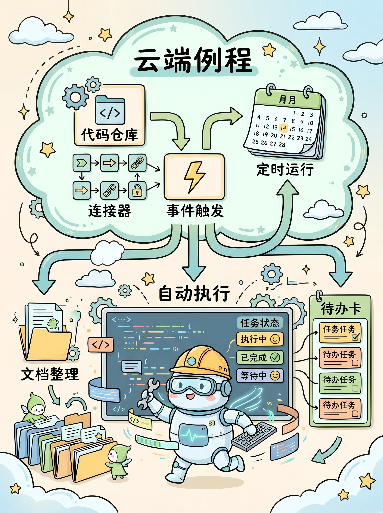
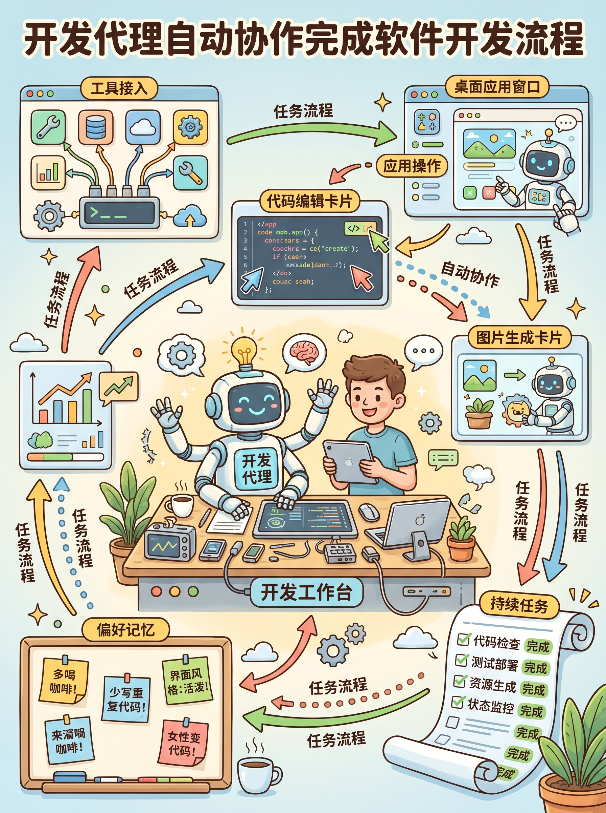
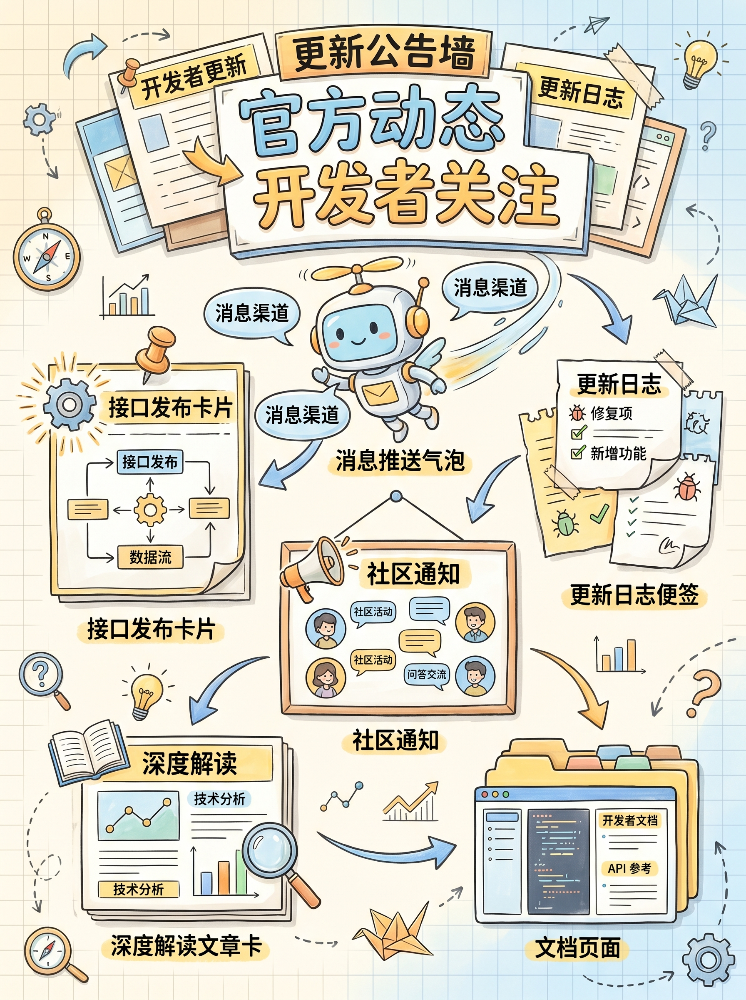

# 2026-04-17 X 英文技术圈 AI / AI Agent Top 3 热门简报

这份简报基于手动使用 Chrome 打开 X 后，对英文技术圈当天 `Today’s News` 与高热技术帖做交叉筛选整理而成。本次只保留 `top 3`，并且每条消息配一张独立的信息图。

筛选原则：

- 优先官方原帖
- 优先技术发布、开发者更新、工作流能力变化
- 过滤中文转述、情绪化讨论、营销号和重复转发

## 1. Anthropic：Claude Code 上线 Routines

**核心点**

Anthropic 为 Claude Code 推出 `Routines` 研究预览。用户配置一次 prompt、repo 和 connectors 后，就可以让它按计划运行，也可以由 API 调用或事件触发，在云端持续执行。

**为什么重要**

这代表编码助手开始从“人在本地盯着用的工具”，变成“能在云端持续运行的自动化 agent”。一旦触发方式、代码仓库和外部连接器打通，很多重复性工程任务都可以交给它长期跑。

**链接**

- 原帖: [claudeai / routines in Claude Code](https://x.com/claudeai/status/2044095086460309790)
- 产品页: [Claude Code Routines](https://claude.ai/code/routines)

## 2. OpenAI：Codex 变成更完整的开发代理

**核心点**

OpenAI 发布新版 Codex。它不再只是补全和改代码，而是开始具备更完整的代理能力，包括操作 Mac 应用、连接更多工具、生成图片、学习之前操作、记住工作偏好，并接管持续性的重复任务。

**为什么重要**

AI coding 正在从 “copilot” 往 “agent” 迁移。过去重点是“生成一段代码”，现在重点已经变成“让 AI 直接执行一段开发流程”。

**链接**

- 原帖: [OpenAI / Codex for (almost) everything](https://x.com/OpenAI/status/2044827705406062670)

## 3. Anthropic：推出开发者官方账号 ClaudeDevs

**核心点**

Anthropic 新开了 `@ClaudeDevs`，专门面向开发者发布 changelog、API release、community update 和 deep dive。

**为什么重要**

这说明 Anthropic 在把开发者沟通从品牌账号附带通知，升级成独立分发渠道。后续对开发者真正有价值的更新，例如接口变化、服务状态、产品细节和工程实践，大概率都会更集中、更持续地出现在这里。

**链接**

- 原帖: [ClaudeDevs / launch post](https://x.com/ClaudeDevs/status/2044780198722498580)

## 简短判断

今天 X 英文技术圈最强的主线很明确：

- Anthropic 在补“云端自动执行 + 开发者沟通渠道”
- OpenAI 在补“更完整的开发代理能力”

简单说，现在竞争点已经不只是模型强不强，而是谁能把模型、自动化触发、开发流程和开发者分发体系连成一套。
