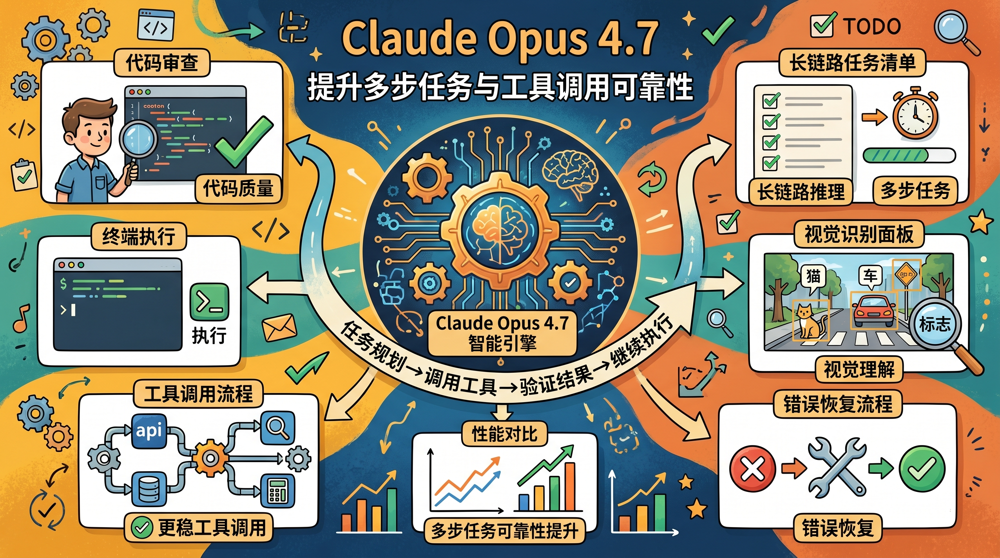
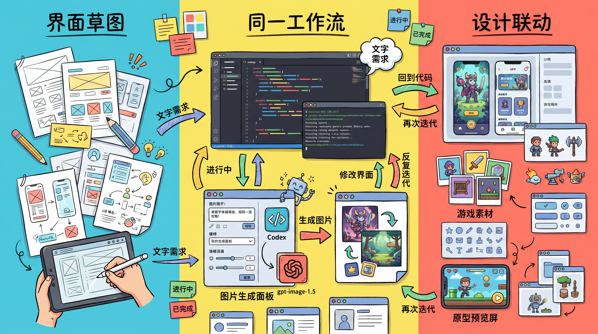

# 2026-04-19 X 英文技术圈 AI / AI Agent Top 3 热门简报

这份简报基于手动使用 Chrome 打开 X，在已登录上下文里查看 `Top` 搜索结果与 `Today’s News` 后整理而成；外链文章只补充官方产品页或官方 changelog。今天的热度主线仍然集中在两件事：`Codex` 继续向完整开发代理扩张，以及 `Claude Opus 4.7` 开始进入更多真实开发工作流。

筛选原则：

- 只看英文技术圈
- 优先官方原帖和官方产品页
- 优先技术能力变化、工程工作流变化、代理能力变化
- 过滤泛讨论、营销话术、中文转述和重复转发

## 1. OpenAI：Codex 从编码助手继续走向完整开发代理

**核心点**

OpenAI 这轮 Codex 更新，不只是“更会写代码”，而是明显往“能执行完整开发流程的代理”推进。重点包括：可以直接操作电脑、接入更多工具、并行处理任务、支持浏览器内工作，以及把自动化任务延续到后续线程里继续跑。

**为什么重要**

这说明 AI coding 的竞争点已经从“单轮生成代码质量”转向“能不能持续完成一段工程流程”。谁能把多代理协作、工具接入、上下文延续和真实环境操作串起来，谁就更接近真正的开发代理平台。

**链接**

- 原帖: [OpenAI / Codex for (almost) everything](https://x.com/OpenAI/status/2044827705406062670)
- 官方文章: [Codex for (almost) everything](https://openai.com/index/codex-for-almost-everything/)

## 2. Anthropic：Claude Opus 4.7 把“多步任务 + 工具使用”继续往前推

**核心点**

Anthropic 发布 `Claude Opus 4.7`，主打的不是单一 benchmark，而是更贴近真实 agent 工作流的能力提升：多步任务更稳，长链路推理更强，工具调用错误更少，对编码、视觉和复杂工作流的一致性更好。

**为什么重要**

现在模型值不值得用，关键不只是“会不会答”，而是“能不能把任务一路做完”。对代理场景来说，稳定地规划、调用工具、处理失败、继续执行，比一次性回答漂亮更关键。Opus 4.7 的意义就在这里。

**链接**

- 原帖: [GitHub / Claude Opus 4.7 is rolling out in GitHub Copilot](https://x.com/github/status/2044794259581161744)
- 官方文章: [Introducing Claude Opus 4.7](https://www.anthropic.com/news/claude-opus-4-7)
- GitHub Changelog: [Claude Opus 4.7 is generally available](https://github.blog/changelog/2026-04-16-claude-opus-4-7-is-generally-available/)

## 3. OpenAI：Codex 现在可以直接用 gpt-image-1.5 生成和迭代视觉内容

**核心点**

OpenAI 宣布 Codex 可以直接调用 `gpt-image-1.5`，在同一个工作流里生成并迭代图片。它面向的不是纯娱乐生图，而是更偏开发流程里的视觉资产，例如前端设计稿、产品概念图、游戏素材和界面 mockup。

**为什么重要**

这让“代码 agent”开始覆盖更多跨模态环节。过去做产品原型时，文字、代码、截图、图片工具是分裂的；现在图片生成被放进同一个代理工作流里，意味着 UI、素材和交互验证会更容易形成闭环。

**链接**

- 原帖: [OpenAI / gpt-image-1.5 in Codex](https://x.com/OpenAI/status/2044828015780343940)
- 官方文章: [Codex for (almost) everything](https://openai.com/index/codex-for-almost-everything/)
- 模型文档: [GPT Image 1.5](https://platform.openai.com/docs/models/gpt-image-1.5)

## 简短判断

今天英文技术圈里最清晰的信号是：

- OpenAI 在把 `Codex` 做成“能跨工具、跨界面、跨时间持续工作的开发代理”
- Anthropic 在把 `Opus 4.7` 做成“更适合真实 agent 链路”的底层模型

一句话概括，就是赛点已经从“谁更像聊天机器人”切到了“谁更像真正能交付工作的工程代理”。
