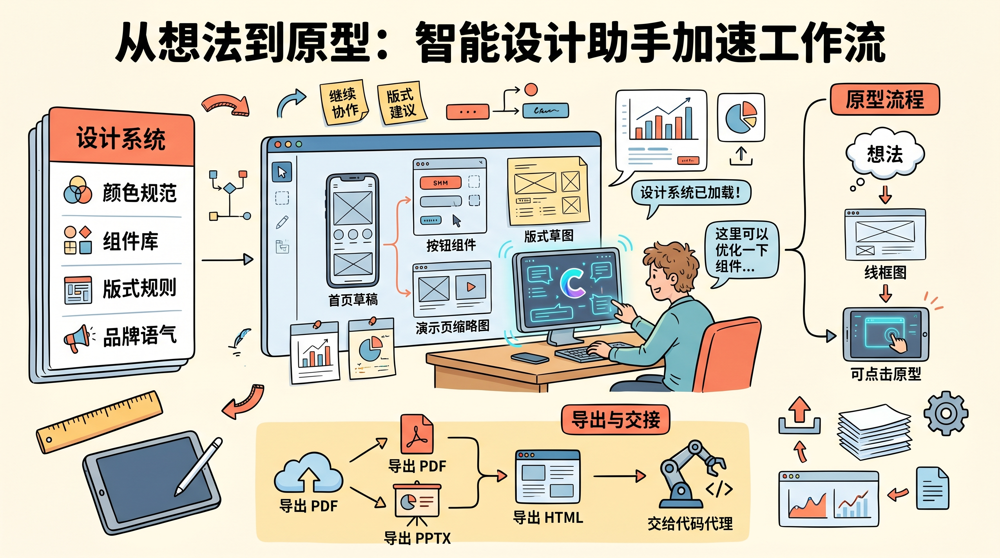
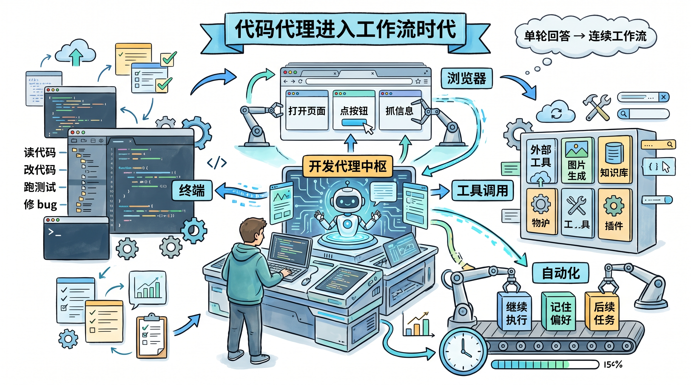
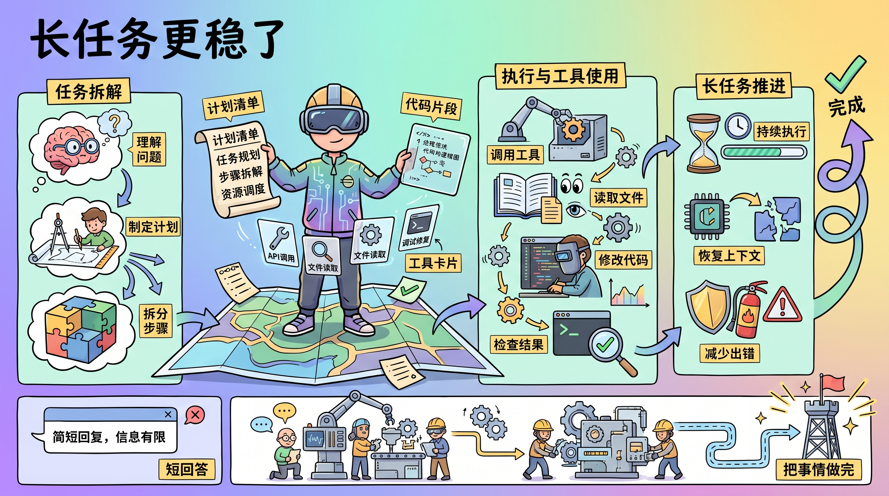

# 2026-04-20 X 英文技术圈 AI / AI Agent Top 3 热门简报

这份简报基于最近几天在英文技术圈持续高热、且能同时对上 X 帖子与官方产品页的内容整理而成。今天最强的共同主线很明确：

`AI 工具正在从“单点能力”快速变成“完整工作流”。`

不只是更会写代码，而是开始同时覆盖设计、原型、图片、工具调用、长任务推进和后续交付。

筛选原则：

- 只看英文技术圈里持续发酵的高信号内容
- 优先官方产品发布和一线使用经验
- 优先与开发工作流、Agent 工作流、设计到交付闭环相关的变化
- 过滤泛营销、纯融资讨论和低信息密度转述

## 1. Anthropic：Claude Design 把 AI 从“写代码”进一步推到“做设计 + 交付原型”

**核心点**

Anthropic 发布 `Claude Design`，把 Claude 从对话和编码进一步推到视觉工作流里。它不只是生一张图，而是能直接做设计稿、原型、演示文稿和 one-pager，还能读设计系统、代码库、图片和文档，然后继续导出到 `Canva`、`PDF`、`PPTX`、`HTML`，甚至直接交接给 `Claude Code`。

**为什么重要**

这说明大模型正在吃掉的不再只是“实现层”，而是开始进入产品定义和视觉表达层。以前一条工作流是 PM 提需求、设计师出稿、工程师接手；现在模型正试图把这几步压缩进同一个协作界面里。真正的变化不在“它会不会画”，而在“它能不能把设计意图顺着工作流继续传下去”。

**链接**

- 原帖: [Claude / Introducing Claude Design](https://x.com/claudeai/status/2045156267690213649)
- 经验帖: [Ryan Mather / Claude Design 使用技巧串](https://x.com/Flomerboy/status/2045162321589252458)
- 官方文章: [Introducing Claude Design by Anthropic Labs](https://www.anthropic.com/news/claude-design-anthropic-labs)

## 2. OpenAI：Codex 继续从编码助手走向“能跨工具推进整段开发流程的代理”

**核心点**

OpenAI 这轮 `Codex` 更新，重点不再只是补一点代码能力，而是把它往完整开发工作流继续推。官方明确强调了几件事：它可以直接操作电脑、接入更多工具和插件、在浏览器里工作、生成图片、记住偏好，并把任务延续到后续自动化线程里继续跑。

**为什么重要**

这其实是在改 AI coding 的竞争维度。赛点不再只是“哪家模型单轮写代码更强”，而是“哪家能把上下文、工具、界面和跨时间执行串成一个连续系统”。如果这个方向跑通，未来开发者管的不再是一次补全，而是一组持续工作的代理。

**链接**

- 原帖: [OpenAI / Codex for (almost) everything](https://x.com/OpenAI/status/2044827705406062670)
- 官方文章: [Codex for (almost) everything](https://openai.com/index/codex-for-almost-everything/)

## 3. Anthropic：Claude Opus 4.7 把“长链路任务 + 工具使用”这件事继续往前推

**核心点**

`Claude Opus 4.7` 的重点不是一次性回答更漂亮，而是对编码、视觉、多步任务和长任务执行做了整体增强。官方和早期测试反馈都在强调同一件事：更稳的规划、更少的工具错误、更强的长链路推进能力，以及对复杂技术任务更持续的执行力。

**为什么重要**

这类模型升级真正有价值的地方，不是榜单上多了几个点，而是它开始更像一个能把事情做完的系统。尤其是当开发者从“和一个模型 1:1 配合”走向“同时管理多个 Agent”时，稳定性、持续性和 error recovery 会比单题分数更重要。Opus 4.7 明显是在朝这个方向优化。

**链接**

- 原帖: [GitHub / Claude Opus 4.7 is rolling out in GitHub Copilot](https://x.com/github/status/2044794259581161744)
- 官方文章: [Introducing Claude Opus 4.7](https://www.anthropic.com/news/claude-opus-4-7)

## 简短判断

今天最值得记住的，不是某一个模型更强，而是工作流边界正在一起变：

- Anthropic 在把 `Claude` 从模型扩到设计与交付界面
- OpenAI 在把 `Codex` 做成跨工具、跨界面、跨时间的开发代理
- 新一代模型在把“长任务做完”变成真正可竞争的能力

一句话概括：

`AI 工具的下一阶段，不只是更聪明，而是更像一整套可连续运行的工作流系统。`
