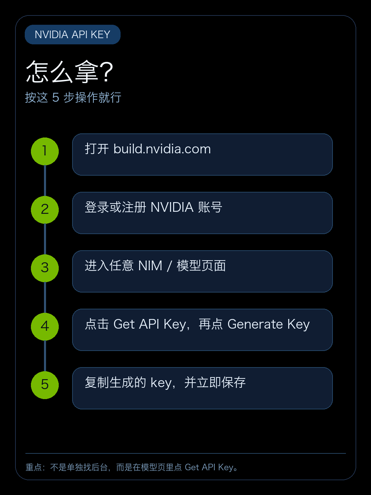
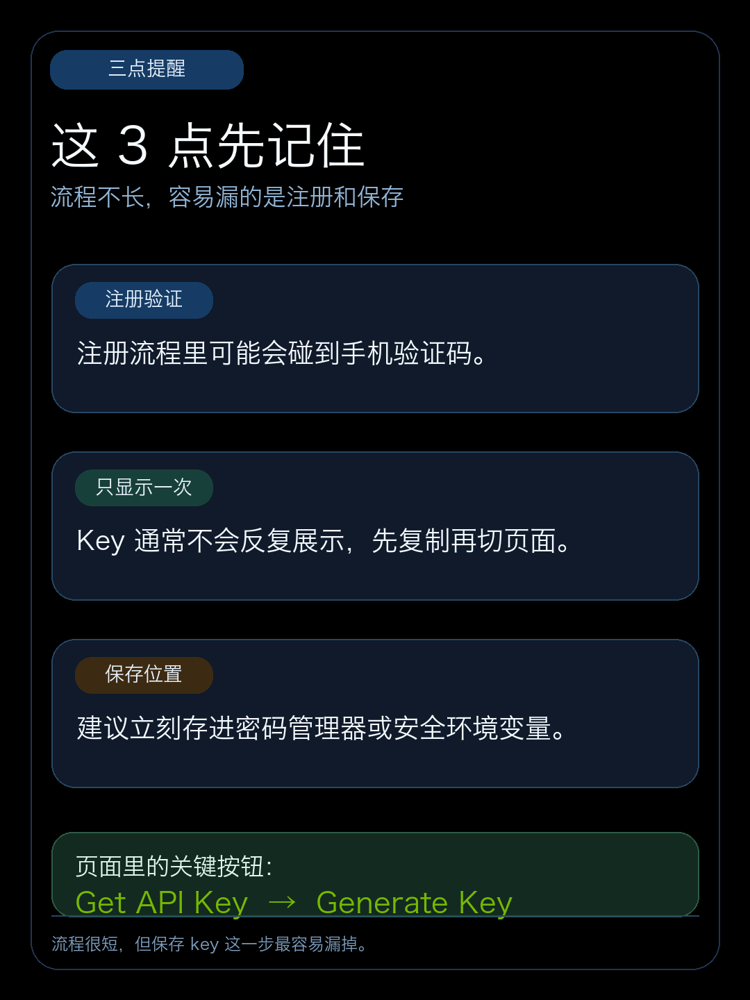
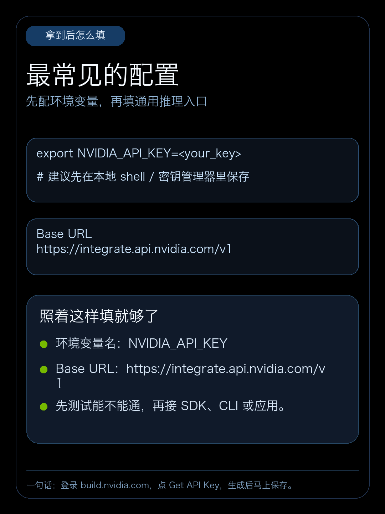

# NVIDIA API Key 获取步骤

`NVIDIA API Key` 的入口在 `build.nvidia.com` 的模型页面里，不是在一个单独的开发者后台。

直接按这 5 步操作：

1. 打开 `https://build.nvidia.com/explore/discover`，登录或注册 NVIDIA 账号。
2. 进入任意一个 NIM / 模型页面。
3. 找到页面里的 `Get API Key`。
4. 点击后继续点 `Generate Key`。
5. 复制生成的 key，并立刻保存。

下面这 3 张图是重新整理的自制信息卡版本：

有 3 个细节建议提前记住：

- 注册过程中可能会用到手机验证码。
- key 通常不会反复展示，先复制再切页面。
- 建议拿到后立刻存进密码管理器或安全环境变量。

拿到 key 之后，常见用法就是把它配成环境变量：

`NVIDIA_API_KEY=<your_key>`

如果你是接 NVIDIA 的通用推理入口，Base URL 常见写法是：

`https://integrate.api.nvidia.com/v1`

一句话总结：

登录 `build.nvidia.com`，点 `Get API Key`，生成后马上保存。
