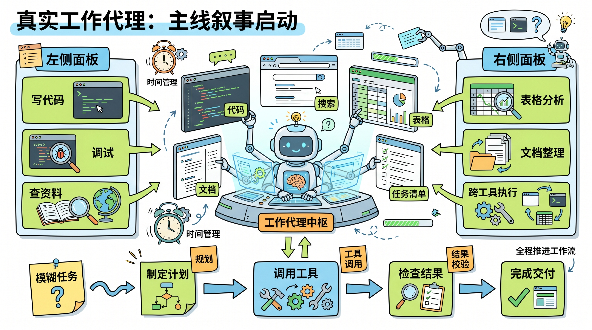
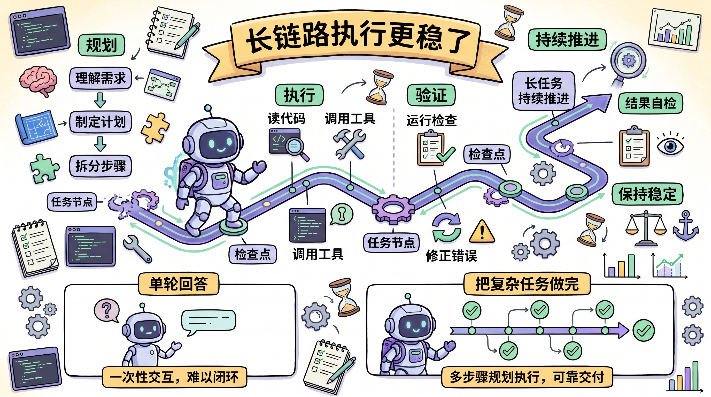

# 2026-04-26 X 英文技术圈 AI / AI Agent Top 3 热门简报

这份简报基于最近一天到几天里在英文技术圈持续高热、且能对上 X 讨论与官方原始资料的内容整理而成。今天最值得抓住的共同主线是：

`开发代理的竞争，正在同时发生在“模型前台”和“运行时后台”。`

一边是更强的 frontier model，开始更稳定地处理长任务、工具调用和跨界面工作流；另一边是越来越多一线工程经验在说明，真正决定成本和可扩展性的，往往不是 prompt 小技巧，而是上下文和运行时设计。

筛选原则：

- 只看英文技术圈里仍在持续发酵的高信号内容
- 优先官方产品发布、原始技术线程和可验证的一线工程经验
- 优先与 coding agent、tool use、长任务执行、上下文工程相关的变化
- 过滤泛营销、纯情绪站队和低信息密度转述

## 1. OpenAI：GPT-5.5 把“真实工作代理”推成了主线叙事

**核心点**

OpenAI 在 `GPT-5.5` 的官方发布里，把重点明确放在了 `real work` 上：不是单次回答更顺，而是更擅长处理脏、多步、跨工具的复杂任务。官方强调它更会写和改代码、更会查资料、分析数据、生成文档与表格，也更能自己规划、调用工具、检查结果，并把任务一路推进到完成。

**为什么重要**

这等于把“AI 模型升级”重新定义成了“工作流代理升级”。赛点不再只是 benchmark 里多几分，而是模型能不能更早理解任务、少要人盯、跨工具持续推进。这也是为什么 `GPT-5.5` 在 X 上的讨论，已经不是“更像哪个旧模型”，而是“它到底能不能替开发者接更多整段工作”。

**链接**

- X 热点: [OpenAI Unveils GPT-5.5 for Advanced Agentic Tasks](https://x.com/i/trending/2046809941114241464)
- 官方文章: [Introducing GPT-5.5](https://openai.com/index/introducing-gpt-5-5/)
- System Card: [GPT-5.5 System Card](https://openai.com/index/gpt-5-5-system-card/)

## 2. Anthropic：Claude Opus 4.7 继续把“长链路执行稳定性”做成差异点

**核心点**

`Claude Opus 4.7` 的升级重点，依旧不是“回答更华丽”，而是对复杂编码、长任务执行、工具使用和结果自检做整体增强。Anthropic 官方特别强调它在难的软件工程任务上更稳、更一致，也更能在长时间运行里保持指令精度和验证习惯。

**为什么重要**

这说明前沿模型竞争已经非常具体地落在“能不能把事情做完”上。对于 coding agent 来说，稳定规划、长上下文一致性、错误恢复和自我验证，往往比单轮聪明更重要。OpenAI 往代理工作流走，Anthropic 往持续执行质量走，二者其实都在指向同一个未来：开发者会越来越像在管理一组能长期运作的代理，而不是只调用一次模型。

**链接**

- 原帖: [GitHub / Claude Opus 4.7 is rolling out in GitHub Copilot](https://x.com/github/status/2044794259581161744)
- 官方文章: [Introducing Claude Opus 4.7](https://www.anthropic.com/news/claude-opus-4-7)

## 3. Avi Chawla：Claude Code 成本差 3 倍，问题可能不在模型，而在后端上下文

**核心点**

Avi Chawla 这条线程最有价值的地方，是把一个常被忽略的事实讲透了：`Claude Code` 这类 coding agent 的很多 token，并不是耗在“生成代码”上，而是耗在“重新理解后端和系统上下文”上。作者拿同一个 `DocuRAG` 应用做对照实验，给出的结果很直接：

- `Supabase` 会话：约 `10.4M` tokens，约 `$9.21`
- `InsForge` 会话：约 `3.7M` tokens，约 `$2.81`

**为什么重要**

这条内容直接把竞争维度往更底层推了一层。真正影响 agent 成本和效率的，不只是模型单价，也不只是 prompt，而是系统怎样把关键上下文暴露给模型。换句话说，`context engineering` 不只是前台提示词工程，后端接口、元数据组织、权限结构和返回信息密度，本身就是 agent runtime 的一部分。

**链接**

- 原帖: [Avi Chawla / How to cut Claude Code costs by 3x using Karpathy's context engineering idea](https://x.com/_avichawla/status/2046500537584218438)

## 简短判断

今天最值得记住的，不是某一家的宣传词更响，而是两个趋势已经合流：

- frontier model 正在把“复杂工作流代理”做成主战场
- runtime / context engineering 正在变成决定成本和可扩展性的硬门槛

一句话概括：

`下一阶段的 AI coding 竞争，不只是模型更强，而是谁能把长任务、工具链和上下文系统一起做顺。`
