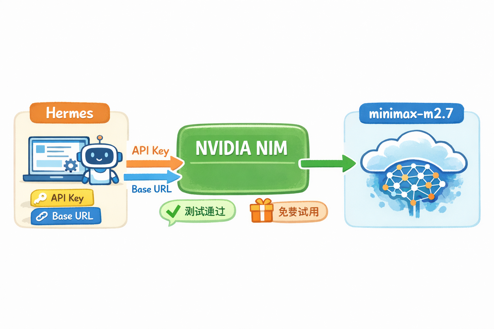
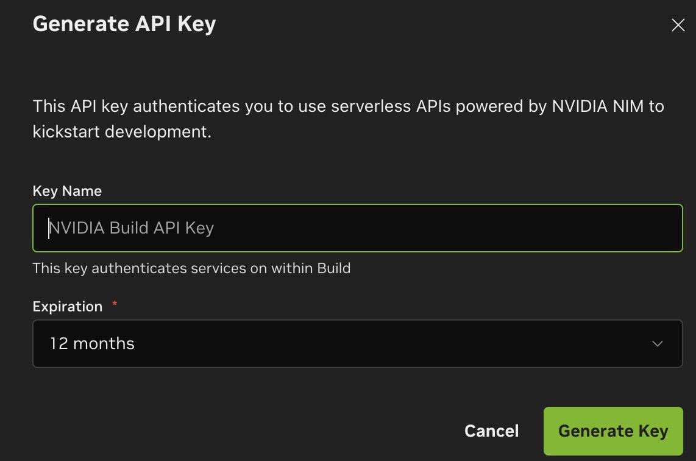
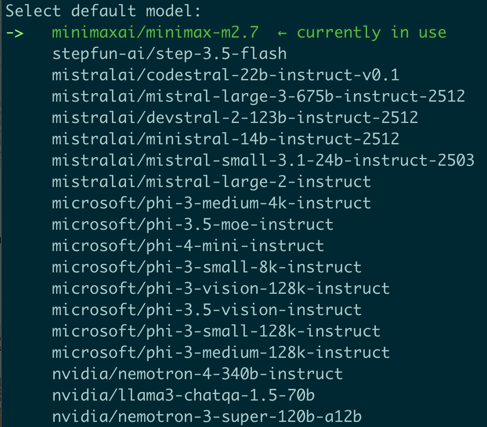
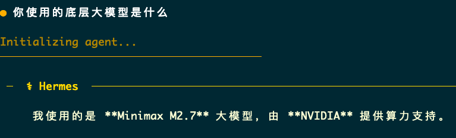
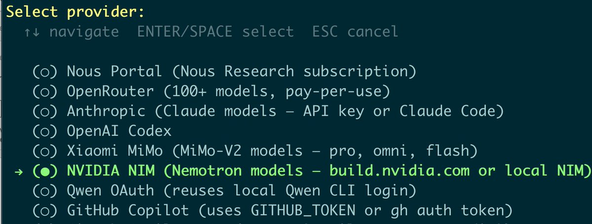
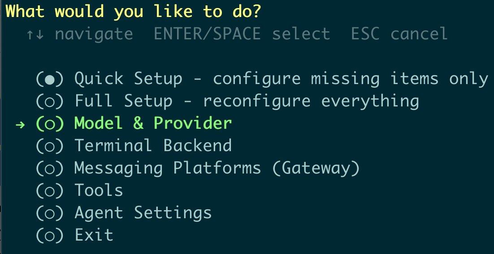
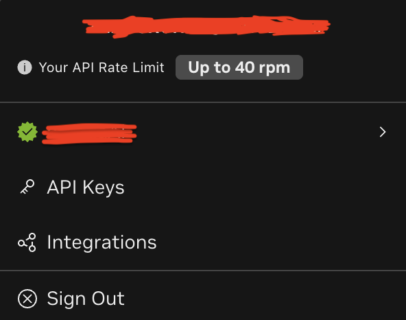

# 10 步把 Hermes 接上 NVIDIA 免费 Minimax-m2.7，这套低成本配置其实很适合日常折腾

最近看到 omegaAI 分享了一篇很实用的教程，核心内容就一件事：

**把 Hermes 接到 NVIDIA NIM，然后直接用上免费的 `minimaxai/minimax-m2.7`。**

如果只用一句话总结这篇内容，那就是：

**这不是一篇单纯的“点哪里、填什么”的教程，它真正有价值的地方，是给了大家一条低成本接入大厂模型基础设施的路径。**

对很多正在折腾 Agent、CLI 工具、自动化工作流的人来说，这条路很有吸引力。

原因很简单：

- Hermes 本身就是很适合折腾的 Agent 工具。
- NVIDIA NIM 提供了一套现成的推理服务入口。
- `minimax-m2.7` 又正好可以免费试。

组合起来，你几乎不用自己搭推理服务，就能很快把一个能跑的模型环境接起来。



## 先说结论：这篇教程最值得抄的，不是 10 个按钮，而是这条接入思路

很多人看到这类内容，第一反应都是：

- 这是不是又一篇平台注册教程？
- 这是不是“薅免费额度”的临时玩法？
- 配完之后到底能不能长期用？

但这篇内容更值得看的地方，不只是步骤本身，而是它说明了一件事：

**如果你只是想把 Hermes 跑起来做日常试验，其实没必要一上来就自己搭一整套推理后端。**

你完全可以先借助成熟的平台，把模型先接通、把流程先跑顺、把自己的用法先摸清楚。

这比一开始就折腾部署、显卡、服务编排，要轻得多。

## 这套配置到底解决了什么问题

说白了，它解决的是一个很常见的问题：

**很多人不是不会用 Hermes，而是卡在“到底接哪个模型、怎么接、成本高不高”。**

如果模型接入太麻烦，前面的很多想法都没法验证。

而这篇教程的价值就在于，它把事情压缩成了一条非常短的路径：

1. 去 NVIDIA 平台注册账号。
2. 生成 API Key。
3. 在 Hermes 里选好 Provider。
4. 填入 Base URL 和 Key。
5. 选中 `minimaxai/minimax-m2.7`。
6. 直接测试。

到这里，一个能跑的环境基本就起来了。

## 按原帖整理后的 10 个步骤

下面我按更适合中文阅读的方式，把原帖内容整理一遍。

### 第 1 步：打开 NVIDIA 的模型入口

原帖的第一步很直接，就是打开 `build.nvidia.com`。

这里你可以把它理解成 NVIDIA 给开发者准备的模型访问入口。

它不是让你自己部署模型，而是让你直接去申请可调用的能力。

### 第 2 步：注册账号

接着就是常规注册流程：

- 用邮箱注册
- 再用手机号收验证码

原帖特别提到，**国内手机号也能收到验证码**。

这一点很关键，因为很多教程最烦人的地方，不是技术难，而是你走到一半发现根本注册不了。

### 第 3 步：生成 API Key

登录以后，进入右上角账户区域，找到 `Generate API Key`。

这一步本质上是在拿到后续调用模型所需的凭证。

按原帖截图，这个 Key 的有效期是 **12 个月**。



### 第 4 步：把 Key 先保存好

这里有个很容易翻车的小点：

**API Key 只会展示一次。**

所以你看到之后，别急着切页面，先复制、先保存。

这类平台的常见坑就是：

- 当时没保存
- 过几分钟再回来找
- 结果发现得重新生成

### 第 5 步：进入 Hermes 的模型配置界面

接下来就不是 NVIDIA 这边了，而是回到 Hermes。

进入 `setup` 里的 `Model & Provider`。

这一步的意思很简单：

Hermes 需要知道你打算用哪个服务提供方，以及它该把请求发到哪里。



### 第 6 步：Provider 选择 NVIDIA NIM

Provider 这里，原帖给出的选择是：

**`Nvidia NIM`**

这一步不要选错。

因为不同 Provider 后面对应的认证方式、地址格式、可选模型，通常都不一样。



### 第 7 步：把 Key 和 Base URL 填进去

接着就是把刚才拿到的 API Key 和接口地址填进去。

原帖给出的配置是：

```yaml
provider: Nvidia NIM
api_key: <你刚复制的 API Key>   # 这里填刚生成的 key
base_url: https://integrate.api.nvidia.com/v1/chat/completions  # 请求入口
```

这里最容易出错的，通常不是 Key，而是 `Base URL` 填错。

所以这一段最好直接复制，不要手打。

### 第 8 步：模型选择 `minimaxai/minimax-m2.7`

然后在模型列表里，选中：

```text
minimaxai/minimax-m2.7
```

这一步其实决定了你后面实际在 Hermes 里调用的是谁。

所以不要只看平台名字，要看清楚最终落到哪个模型。



### 第 9 步：跑一次测试

配置完以后，别急着开干，先测试。

原因很简单：

如果这里不测，后面你可能会把问题误以为出在 Hermes、Prompt、工具调用或者工作流逻辑上。

其实很多时候，只是模型接入本身没通。



### 第 10 步：记住它的速率边界

原帖最后补了一句很重要的信息：

按作者实测和截图说明，**NVIDIA 这条免费通道每分钟限制 40 次请求**。

对于个人日常试用，这个量通常是够的。

就算你稍微有一点连续调用需求，只要做一点速率控制，问题也不算大。



## 这套方法为什么适合很多个人开发者

我觉得这篇内容最适合两类人：

### 1. 想先把 Hermes 跑起来的人

这类人最需要的，不是最完美的长期方案，而是：

- 先跑通
- 先验证
- 先开始用

因为只有真的用起来，你才知道自己后面该优化什么。

### 2. 想控制试验成本的人

很多人一开始折腾 Agent，最大的问题不是不会写，而是每试一次都觉得“有点贵”。

这种时候，能接上一条免费但又不是太弱的模型通路，价值其实非常高。

它让你可以更频繁地试：

- 配置是不是合理
- 提示词是不是顺
- 工作流是不是闭环
- Hermes 的习惯用法是不是适合你

## 这里最容易踩的 4 个坑

如果你照着做，我建议额外注意下面 4 件事。

### 1. Key 一定先保存

只显示一次的凭证，最怕的就是“我等会儿再记”。

这种事情基本都会翻车。

### 2. 不要把 Base URL 填错

很多人以为只要 Provider 选对就够了。

其实地址一旦错了，后面所有问题看起来都像“模型不工作”。

### 3. 先测通，再接复杂工作流

不要一上来就把它接进一整套复杂 Agent 流程。

先发一个最简单的请求，确认模型真的在回，再往后叠。

### 4. 免费额度不等于无限额度

免费很好，但也别当成没有边界。

如果后面你开始高频跑任务，还是得自己做限流、排队或者 provider 分流。

## 如果你想更省事，可以先记住这份最小配置

```yaml
provider: Nvidia NIM
base_url: https://integrate.api.nvidia.com/v1/chat/completions
model: minimaxai/minimax-m2.7

# 上面这三项是核心骨架
# 再把生成好的 API Key 填进去
```

对大多数人来说，先把这 3 个关键项记住，就够你把第一步走出去。

## 最后

omegaAI 这篇内容最有价值的，不是“教你点 10 次按钮”。

而是它提醒了大家一件很现实的事：

**很多时候，先找到一条便宜、稳定、够你开始用的模型接入路径，比一开始追求最强、最全、最完美更重要。**

对 Agent 工具来说，先跑起来，往往比一开始就配到极致更重要。

如果你正好在折腾 Hermes，这条路确实值得试一遍。
