# 如何搭一个可自托管的 Deep Researcher

> 本文基于 Akshay Pachaar 的 X Article 改写。上一版更像“蒸馏总结”，这版会更贴近原文：保留原文结构、关键论证、代码片段和配图信息，同时把图片里的英文图解翻成中文说明。

如果今天要让 AI 帮你做研究，最常用的选择大概是 ChatGPT Deep Research、Claude、Gemini 或 Perplexity。

这些工具都很强，也确实能把搜索、阅读、整理和写报告这套流程变得轻很多。

但它们还有一个共同点：大多是闭源 SaaS，跑在别人的云上。

这意味着什么？

你的问题会发到供应商服务器。你接入的内部文档、客户资料、知识库和项目记录，也会在供应商侧被处理、索引或缓存。对普通公开信息检索，这可能不是大问题；但对受监管行业、敏感 IP 团队、内部知识密集型团队，这就是 Deep Research 真正的门槛。

原文给出的第三条路是：搭一套 100% 开源、可自托管的 Deep Research 栈。

三件核心工具：

- **Onyx**：检索层，负责连接 Web 和内部知识库。
- **CrewAI**：编排层，负责把研究拆成多个 Agent 和多个阶段。
- **Voxtral**：语音层，负责语音输入和报告朗读体验。

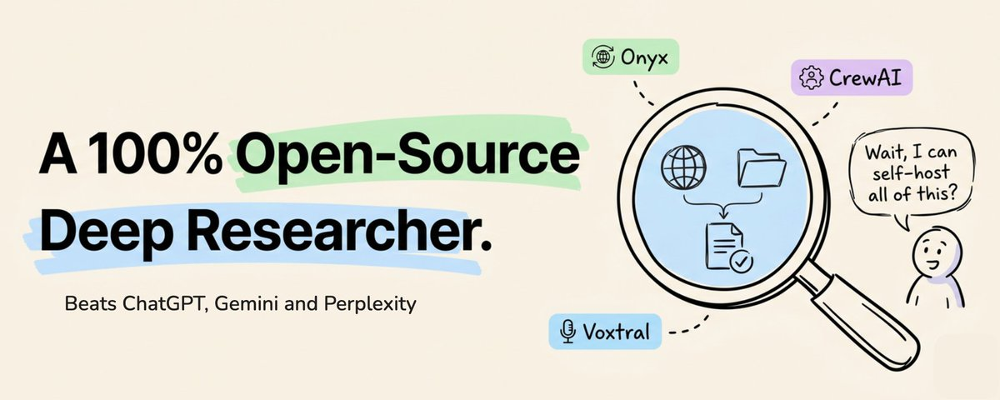

图中要点：这套方案的卖点不是“又一个聊天机器人”，而是把 Deep Research 变成一套可以自己部署、自己审计、自己扩展的系统。原图把 Onyx、CrewAI、Voxtral 放在同一张放大镜里，强调三者组合后可以替代一部分闭源 Deep Research 产品的工作流。

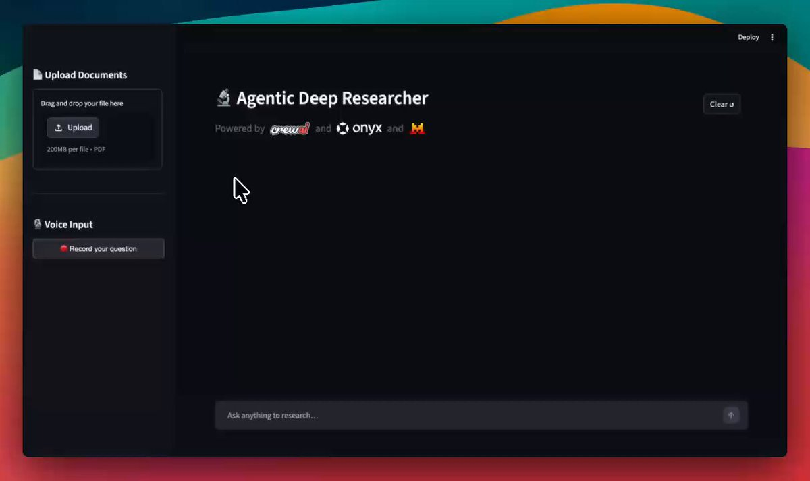

图中要点：Demo 左侧支持上传文档和语音输入，中间是 Agentic Deep Researcher 主界面，底部是研究问题输入框。这个界面想表达的不是“写个搜索框”，而是把文档上传、语音提问、检索、分析和最终报告放进一个端到端工作流。

## 为什么自托管真的重要

现在主流 AI 研究工具的默认形态，是闭源云服务。方便，但代价也清楚。

第一，**你的查询会离开自己的网络**。

研究问题本身就会暴露你正在做什么。你问“如何评估某个并购目标的技术债”，和你问“某个数据库迁移故障怎么复盘”，泄露的信息密度完全不一样。

第二，**你的连接数据会在对方基础设施里被索引**。

很多工具支持连接 Google Drive、Slack、Notion、GitHub、Jira、Confluence。集成很方便，但索引在哪里，权限如何同步，日志保留多久，通常不是你完全说了算。

第三，**留存、日志和审计规则由供应商决定**。

企业版可以缓解这个问题，但不能消除这个问题。尤其是数据驻留、合规审计、内部权限继承这些场景，最终还是要问：索引和中间结果到底在谁手里？

第四，**配额和价格也在供应商节奏里变化**。

今天可以用的能力，明天可能变成更高价套餐；今天可接受的调用限制，明天可能变成瓶颈。

对很多团队来说，过去只有两个选择：接受闭源云服务，或者干脆不用 AI 做严肃研究。

原文的判断是：现在有第三个选择，就是把整套 Deep Research 栈跑在自己的基础设施上。

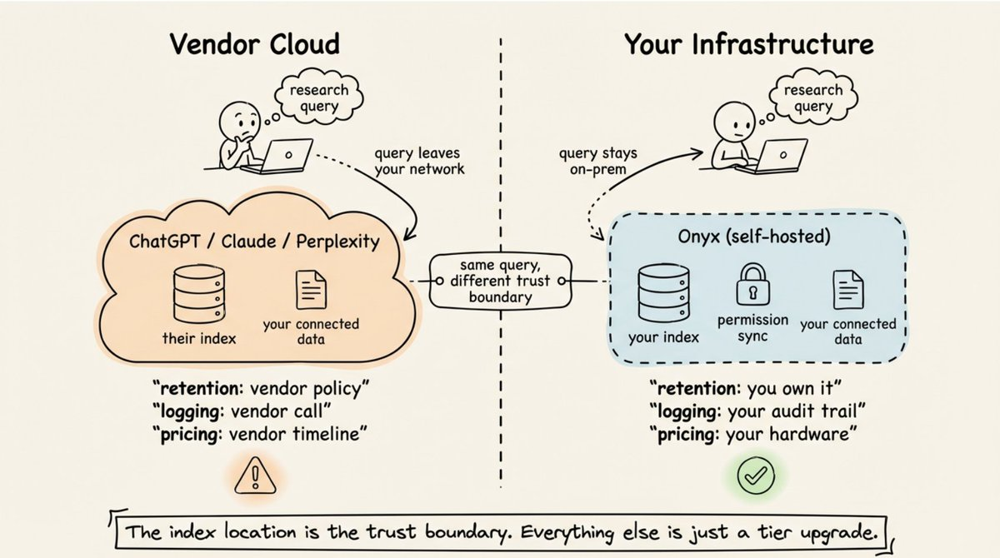

图中要点：左边是 Vendor Cloud，查询离开你的网络，数据和索引放在 ChatGPT、Claude、Perplexity 等供应商侧；保留策略、日志和价格都由供应商决定。右边是 Your Infrastructure，查询留在本地或自有网络里，Onyx 自托管，索引、权限同步和连接数据都由你控制。图底部一句话很关键：**索引在哪里，信任边界就在哪里**。

## 现有研究工具为什么会失效

很多研究工具的失败，不是因为模型不够会写，而是因为它把“研究”当成一个单任务。

常见流程是：搜一下，收集结果，然后交给 LLM 写一份报告。

浅问题这样做可以。比如“某个框架怎么安装”“某个 API 怎么调用”，一轮检索就够。

但严肃研究通常不是这样。它需要跨来源综合、矛盾识别、多跳推理、内部资料和公开资料对齐。

原文举了几个非常典型的失败场景：

- Agent 找到一个来源，又找到一个相反来源，但它只选了其中一个，然后继续写。矛盾没有被暴露出来。
- 两个来源其实转述的是同一个材料，但 Agent 把它们当成两条独立证据。
- 关键连接事实藏在没被召回的文档里，因为关键词匹配无法理解“cloud migration”和“把 PostgreSQL 集群迁到 AWS”说的是同一类事情。

这些不是边缘情况，而是真实研究问题的常见形态。

它们有同一个根因：**研究不是一个任务，而是一组阶段**。

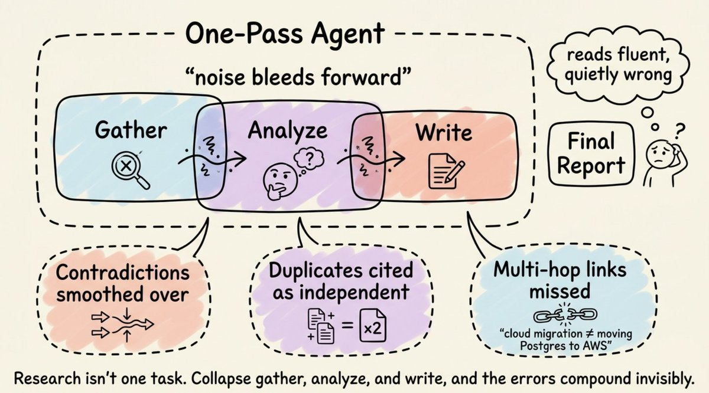

图中要点：一轮式 Agent 把 Gather、Analyze、Write 连成一个链条，噪音会一路向后传。最后报告读起来可能很流畅，但事实质量很差。图中列了三种典型问题：矛盾被抹平、重复来源被当成独立证据、多跳连接被漏掉。

## 好的 Deep Research 至少需要五件事

原文把高质量 Deep Research 拆成五个要求。

第一，**阶段分离**。

收集、分析、写作之间要有硬边界。每个阶段只接收上一个阶段清理过的输出，而不是共享同一个越来越脏的上下文窗口。

第二，**会推理的检索**。

关键词搜索很脆，向量相似度也会在多跳问题上失效。更稳的方式是：并行生成查询变体，做智能重组，然后让 LLM 在综合前先筛选材料。如果跳过 LLM 选择阶段，幻觉很容易进入报告。

第三，**循环里的反思**。

静态计划碰到真实材料之后经常失效。一个好的研究系统应该在发现新线索后调整方向，同时持续追踪原始计划里哪些已经覆盖、哪些还缺。

第四，**统一搜索公开资料和内部资料**。

研究层不能只查 Web，也不能只查内部知识库。它应该在同一个流程里查询公开 Web 和内部文档，同时按文档权限控制结果可见性。索引跑在供应商侧还是自己侧，决定了数据归属。

第五，**语音层**。

语音不是第一优先级，但会降低使用摩擦。说一个复杂研究问题，比打字更自然；听一份长报告，也可能比盯着屏幕读更舒服。

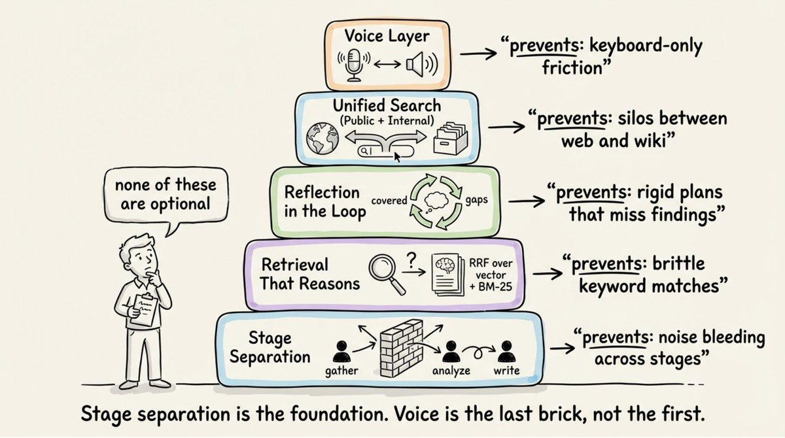

图中要点：底座是 Stage Separation，然后是 Retrieval That Reasons、Reflection in the Loop、Unified Search，最上层才是 Voice Layer。图上写得很清楚：阶段分离是基础，语音是最后一块砖，不是第一块。

## Onyx：开源的自托管检索层

Onyx 是这套系统里的检索层。

它是一个开源 AI 平台，目标是给任意模型提供 RAG、Web Search、代码执行、Deep Research、自定义 Agent、MCP 等能力。

关键点是：它可以自托管。

也就是说，内部数据不必离开你的基础设施。

原文提到，Onyx 参加了 DeepResearch Bench。这个 benchmark 覆盖 100 个博士级研究任务，横跨 22 个领域，用报告质量和引用准确性等指标评估 Deep Research Agent。

原文发布时，Onyx 在该 benchmark 的表现压过了 OpenAI Deep Research、Gemini 2.5 Pro 和 Perplexity Deep Research。

这里要加一个更新边界：我在 2026 年 5 月 25 日核对 Hugging Face Leaderboard 时，Onyx 仍然高于这三个闭源产品，但已经不是当前总榜第一。所以更稳妥的说法是：**Onyx 已经进入了可以和主流闭源 Deep Research 产品同台比较的区间**。

原文里 Onyx 团队总结了一个很有意思的 prompt 哲学：宁可研究得更彻底，也不要急着显得有帮助。

这个哲学落到架构上，就是下面这三阶段。

## Onyx 的三阶段：不是一个大循环

**第一阶段：澄清问题。**

当用户的问题太短或太模糊时，系统最多会问 5 个定向澄清问题。如果用户已经给了足够详细的研究任务，这一步会自动跳过。

**第二阶段：规划。**

系统会把问题拆成最多 6 个探索方向。这里有一个重要设计：规划器没有工具访问权限。它只能做计划，不能直接查资料、不能直接给答案。

**第三阶段：迭代执行。**

编排器和研究 Agent 交替运行，最多 8 轮。每一轮可以并行派发最多 3 个研究 Agent。

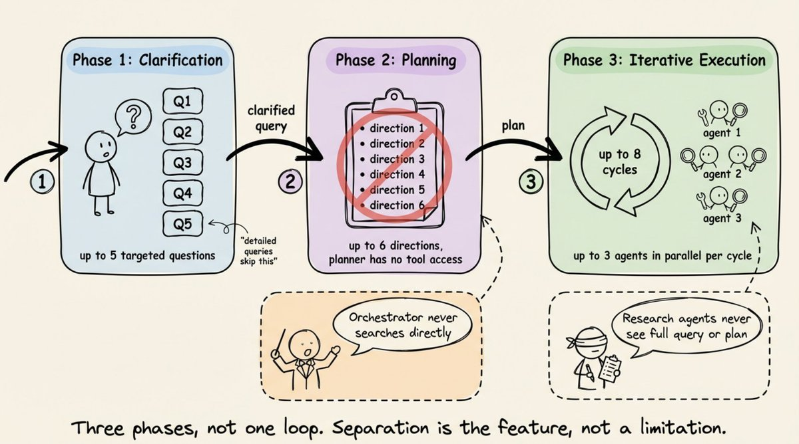

图中要点：Phase 1 是 Clarification，最多 5 个问题；Phase 2 是 Planning，最多 6 个方向，而且 planner 没有工具权限；Phase 3 是 Iterative Execution，最多 8 个循环，每轮最多 3 个 Agent 并行。图底部还强调了两个隔离：Orchestrator 从不直接搜索，Research Agent 看不到完整 query 或完整 plan。

这两个隔离很重要。

编排器不直接搜索，可以避免它一边做全局调度，一边被局部搜索结果污染。

研究 Agent 看不到完整问题和完整计划，可以迫使每个任务 brief 都是自洽的。它只完成自己的子任务，不把全局上下文带进去乱推理。

## 自适应策略：每轮都要反思

Onyx 不会死守最初计划。

每次派发研究 Agent 之后，系统都会做一次强制反思，输出结构化信息：

- 已经覆盖了哪些内容？
- 还缺哪些信息？
- 有哪些新方向出现？
- 继续搜索还会不会带来新信息？

这个反思步骤每次都跑。

结果就不再像一个单纯检索引擎，而更像一个会调整调查路径的研究员。

## 六段式检索流水线

每个研究 Agent 在真正让 LLM 总结之前，会先走一条六段式检索流程。

**第一段：Query Generation。**

系统会并行生成多种查询：语义改写、关键词变体、更宽泛的问题。如果用户问题由多个子问题组成，还会自动拆开。

**第二段：Search and Recombination。**

检索不是只靠一种方式。Onyx 使用混合索引，也就是向量检索加 BM25 关键词检索。结果再用 Reciprocal Rank Fusion 做融合排序，并把相邻 chunk 合并起来。

**第三段：LLM Selection。**

LLM 会先审查所有候选 chunk，只保留真正相关的部分。原文强调：如果跳过这一步，幻觉就很容易进来。

**第四段：Context Expansion。**

对每个被选中的文档，LLM 会读取它周围的上下文，判断需要扩展多大范围。这个步骤可以按文档并行。

**第五段：Prompt Building。**

系统把选中的段落、引用和对话历史组装成最终 prompt。

**第六段：Answer Synthesis。**

LLM 生成有来源支撑的回答，并把 inline citation 链接回具体来源。

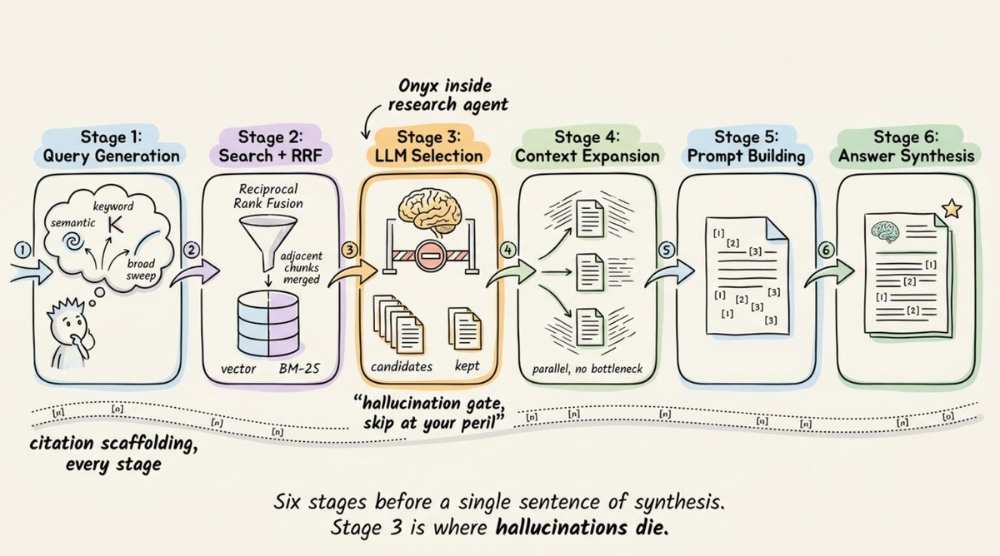

图中要点：Stage 1 生成查询，Stage 2 搜索和 RRF 融合，Stage 3 让 LLM 筛选候选材料，Stage 4 扩展上下文，Stage 5 构建 prompt，Stage 6 合成答案。图底部那句话很关键：**第 3 步是幻觉死亡的地方**。也就是说，材料筛选不是优化项，而是质量闸门。

## 引用完整性：不要最后才补链接

很多 AI 报告看起来有引用，但引用链并不可靠。

原文强调，引用应该从中间报告就开始保留，而不是最后再补。

Onyx 的做法是：

- Agent 写中间报告时就带 inline citation。
- 多个并行 Agent 的引用会被合并并重新编号。
- 最终报告里的每个 claim，都能追溯到具体来源文档。

这样做的价值不是好看，而是可审计。

当报告里写出一个重要判断时，你能追问：这句话来自哪份材料？谁有权限看到这份材料？如果来源更新了，这个判断是否需要重算？

## 内部资料：索引必须在你的基础设施里

Onyx 可以连接很多企业数据源。原文提到 Slack、Confluence、Jira、GitHub、Salesforce、Google Drive、SharePoint、Notion、Zendesk、HubSpot、Gong 等。

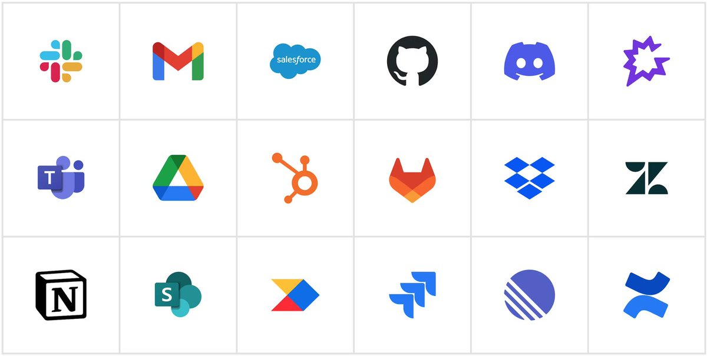

图中要点：这里展示的是连接器生态。你可以看到 Slack、Gmail、Salesforce、GitHub、Discord、Teams、Google Drive、HubSpot、GitLab、Dropbox、Zendesk、Notion、SharePoint 等图标。原文想表达的是：Deep Research 不该只检索网页，也应该检索组织内部已有知识。

关键区别不是“能不能连接”，而是“连接之后索引在哪里”。

Onyx 会在你的基础设施里持续预索引这些内容，同步文档、元数据和权限。

这样带来的结果是：

- 一个查询可以同时覆盖公开 Web 和内部资料。
- 用户只能看到自己有权限访问的文档结果。
- 权限会从源系统自动同步。
- 内部资料不需要离开你的网络去供应商侧建索引。

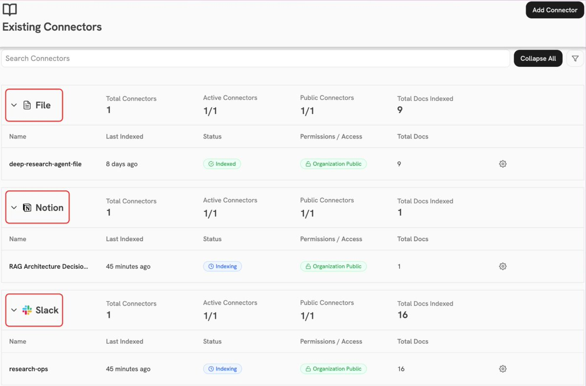

图中要点：这是 Onyx 的连接器界面示例。图里展示了 File、Notion、Slack 三类连接器，每个连接器有 Last Indexed、Status、Permissions / Access、Total Docs 等字段。这个截图补充了一个工程细节：自托管检索不是一次性上传文档，而是持续索引、持续同步权限和状态。

## CrewAI：编排层

Onyx 负责检索，CrewAI 负责协调。

很多开发者会自然写出一个“单 Agent + 三个顺序任务”的流程：

- 先研究。
- 再分析。
- 最后写报告。

问题是，这三个任务会共享一个不断膨胀的上下文。

原始搜索噪音会流进分析阶段，分析阶段的误读会流进写作阶段。到最后，Writer 看到的材料可能已经被重新解释了两遍。

原文里把这种现象叫作“deep frying”：事实被反复加工，矛盾被抹平，源材料到 Writer 手里时已经变形。

CrewAI 在这套方案里主要用三个能力解决这个问题。

第一，**Flows**。

Flows 可以把多个独立 Crew 串起来。每个 Crew 只接收上一阶段的干净输出，而不是继承全部上下文。

第二，**Skills**。

Skills 可以在运行时把领域特定的说明注入 Agent prompt，比如报告格式、证据标准、结构要求。

第三，**MCP Integration**。

CrewAI 可以把 MCP server 直接挂到 Agent 上。这样研究 Agent 可以直接使用 Onyx 暴露的搜索工具，不需要手写一堆 adapter。

原文给了一个简化代码：

```python
from crewai import Agent

researcher_agent = Agent(
    role="Senior Research Analyst",
    goal="Gather information on research query with source URLs",
    backstory="You are a disciplined analyst. Record every source URL.",
    mcps=[
        f"{ONYX_MCP_URL}?token={ONYX_TOKEN}"
    ]
)
```

这个 Agent 会立刻拿到三类工具：

- 搜索知识库。
- 搜索 Web。
- 从任意 URL 抓取完整页面内容。

核心不是代码短，而是工具边界清楚：研究 Agent 负责找材料，后面的分析和写作阶段不应该继续乱搜。

## Voxtral：语音层

每个研究工作流都有一个摩擦点：键盘。

语音能力在很多 AI 工具里只是一个外接组件。输入用 Whisper 包一层，输出用普通 TTS，再把它们粘到聊天界面上。

原文把 Voxtral 放进来，是为了让研究体验从“只能打字和读屏幕”变成“可以说问题，也可以听报告”。

它带来两个变化。

第一，**语音输入**。

用户可以直接说出研究问题，转录结果进入研究流水线。

第二，**报告朗读**。

最终 Markdown 报告可以被读出来。长报告不一定适合一直盯着屏幕看，朗读会让它更容易被消费。

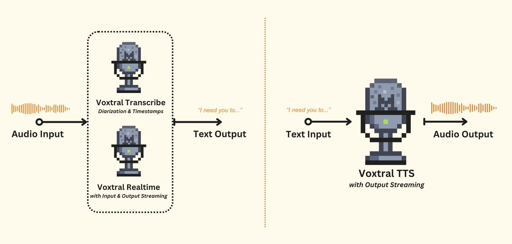

图中要点：左侧是 Audio Input 进入 Voxtral Transcribe 或 Voxtral Realtime，输出 Text Output；右侧是 Text Input 进入 Voxtral TTS，输出 Audio Output。它在这套系统里不是替代检索和编排，而是降低人机交互摩擦。

## 完整工作流怎么串起来

原文完整流程是这样的：

用户可以输入文本、说一段语音，或者上传 PDF 作为研究问题。

Researcher Agent 通过 Onyx MCP 搜索 Web 和你的文档。

Analyst Agent 对研究发现做去重，标记矛盾，并按主题分组。

Report Writer Agent 生成结构化、带引用的 Markdown 报告。

最后，用户可以点击 Play Report，用 Voxtral TTS 听完整报告。

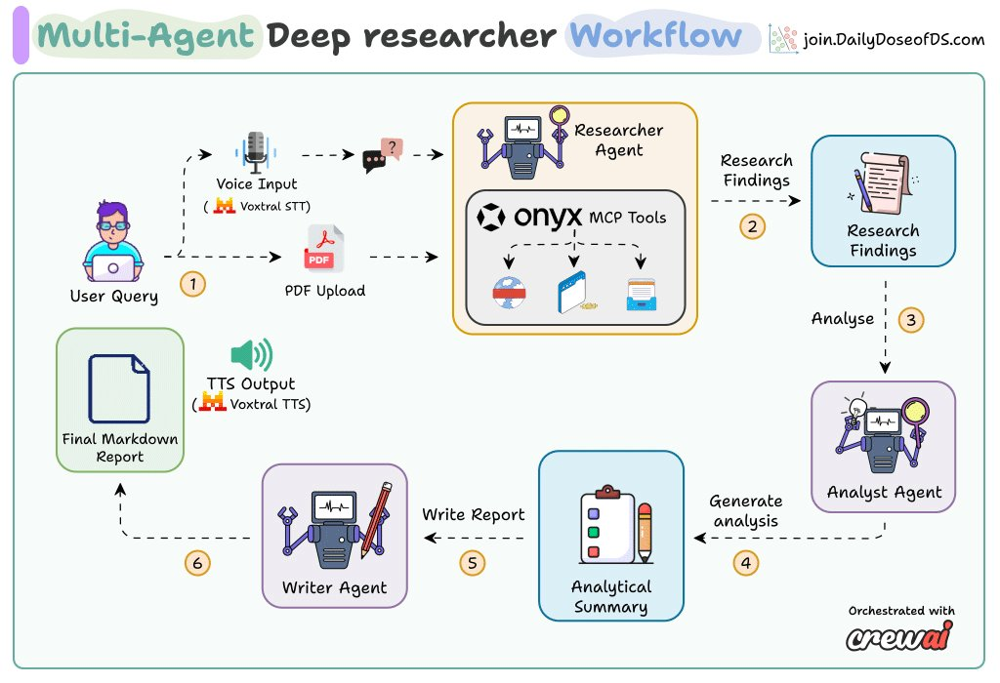

图中要点：这是原文最完整的一张工作流图。左侧是 User Query，可以来自语音输入或 PDF 上传；中间 Researcher Agent 通过 Onyx MCP Tools 得到 Research Findings；然后 Analyst Agent 生成 Analytical Summary；Writer Agent 写出 Final Markdown Report；最后 Voxtral TTS 输出语音。底部标注这套流程由 CrewAI 编排。

## 三个 mini-crews，而不是一个大 Crew

最自然的第一版设计，是一个 Crew 里放三个顺序任务。

原文明确说：不要这么做。

共享上下文会破坏事实质量。因为每一层都会把上一层的材料再解释一次，最后报告会越来越像“流畅但不可靠”的二手总结。

更好的方式是 Flow：三个独立 Crew，每个 Crew 只接收上一阶段明确产出的结构化结果。

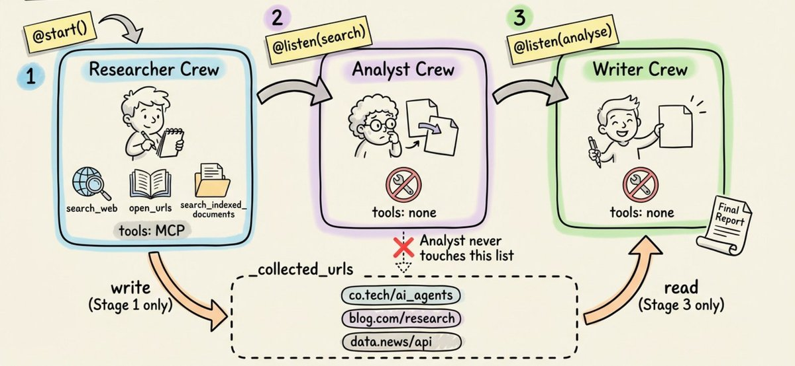

图中要点：Researcher Crew 只在 Stage 1 运行，拥有 `search_web`、`open_urls`、`search_indexed_documents` 这些 MCP 工具，并写出 `collected_urls`；Analyst Crew 没有工具，只读取研究发现并分析，图中还特别标出它不能碰 collected_urls；Writer Crew 也没有工具，只在最后读取分析结果并写报告。这个图强调的是工具权限和上下文边界。

三个 Crew 的职责可以这样理解。

**Researcher Agent** 通过 CrewAI 的 MCP 集成连接 Onyx。它负责搜索 Web、读取完整 URL、搜索上传的 PDF 或内部文档。每条发现都必须带引用。

**Analyst Agent** 接收原始发现，然后做四件事：

- 去重重叠事实。
- 合并表达不同但含义相同的来源。
- 标记明确矛盾。
- 按主题组织材料。

它的输出是结构化摘要，不是一堆搜索结果。

**Report Writer Agent** 把结构化摘要写成最终报告。它会使用一个 CrewAI Skill，在生成时注入报告格式和证据标准。

原文里的 Skill 目录大概长这样：

```plaintext
deep-research-report/
├── SKILL.md       # 报告格式、证据标准、结构要求
├── scripts/       # 可选脚本
└── references/    # 可选参考材料
```

`SKILL.md` 使用 YAML front matter 加 Markdown 正文：

```markdown
---
name: deep-research-report
description: >
  Guidelines for writing high-quality, publication-ready deep research reports.
  Covers structure, tone, evidence standards, and formatting rules.
metadata:
  author: deep-research-agent
  version: "1.0"
---

Instructions for the agent go here.
This markdown is injected into the agent's prompt when the skill is activated.
```

这里的重点是：报告质量不只靠模型临场发挥，而是把格式、证据标准和写作规则变成可复用的 Skill。

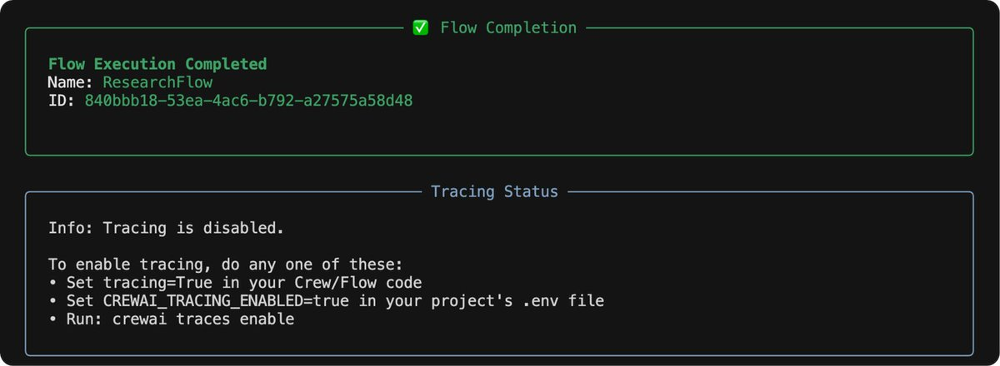

图中要点：截图显示 Flow Execution Completed，并给出 ResearchFlow 的 ID。下方提示 Tracing disabled，如果要开启追踪，可以设置 `tracing=True`，或配置 `CREWAI_TRACING_ENABLED=true`，也可以运行 `crewai traces enable`。这说明原文不只是概念图，也跑通了 CrewAI Flow。

## 代码在哪里

原文最后给出的入口是 Lightning AI Studio 模板。

如果要动手试，可以从原文链接里的模板开始：

<https://lightning.ai/lightning-ai/templates/multi-agent-deep-researcher-powered-by-gemma-4?utm_campaign=akshay&utm_medium=twitter>

Onyx 的开源仓库在这里：

<https://github.com/onyx-dot-app/onyx>

## 搭完之后你得到什么

原文最后的判断不是“开源终于追上闭源”，而是更具体：

Onyx 让 Deep Research 跑在你可以检查、可以自托管、可以修改的基础设施上。

CrewAI 强制做阶段分离，减少上下文污染。

Voxtral 增加语音输入和报告朗读，让研究结果更容易被消费。

合在一起，你得到三件东西。

**第一，能力。**

研究质量进入可以和主流 Deep Research 产品比较的范围，并且保留引用完整性。

**第二，控制。**

查询、索引、内部资料和权限同步都可以留在自己的基础设施里。

**第三，透明。**

代码是开源的，你可以阅读、审计、扩展，而不是只能相信一个黑盒 SaaS。

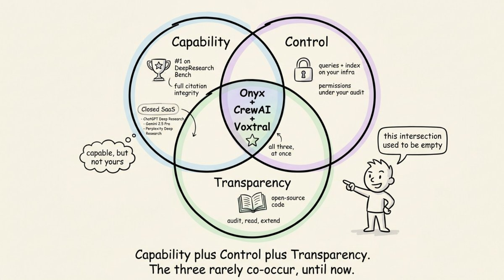

图中要点：这张图用三圆交集解释这套方案的价值。Capability 包括 DeepResearch Bench 表现和引用完整性；Control 包括查询和索引在自己的基础设施里、权限可审计；Transparency 包括开源代码、可读、可审计、可扩展。Onyx + CrewAI + Voxtral 处在三者交集里。

最后可以把问题换一种问法：

如果数据主权不再是约束，你的团队会怎么设计自己的研究工作流？

这才是这篇原文真正有价值的地方。

它不是在介绍一个新工具，而是在提醒我们：Deep Research 不是“让模型多搜一点”，而是一条需要工程化的流水线。

能不能检索，能不能分阶段，能不能保留引用，能不能继承权限，能不能审计中间结果，才决定它能不能从演示变成基础设施。

---

参考资料：

- 原文：<https://x.com/akshay_pachaar/status/2047395420935229724>
- Onyx GitHub：<https://github.com/onyx-dot-app/onyx>
- Onyx 官网：<https://onyx.app/>
- DeepResearch Bench：<https://deepresearch-bench.github.io/>
- DeepResearch Bench Leaderboard：<https://huggingface.co/spaces/muset-ai/DeepResearch-Bench-Leaderboard>
- CrewAI：<https://crewai.com/>
- Voxtral-4B-TTS-2603：<https://huggingface.co/mistralai/Voxtral-4B-TTS-2603>
