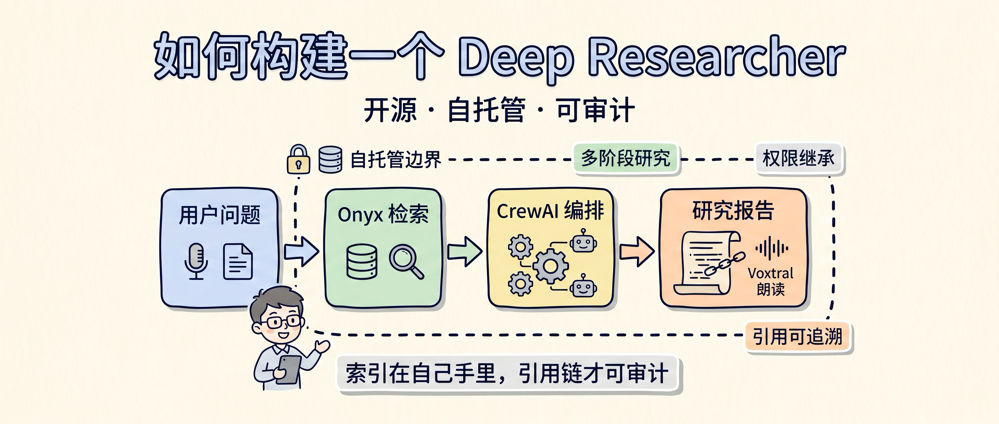

# Deep Research 最大坑：数据和流程都不在你手里

做 Deep Research，最容易被忽略的风险不是答案不够长，而是每一次查询、每一份内部文档、每一条引用链，都可能被放进别人的云服务里。

ChatGPT Deep Research、Gemini、Perplexity 这类产品已经足够强。问题在于：当研究对象变成客户合同、产品路线图、投融资材料、故障复盘、代码库和内部知识库时，能力不是唯一指标，数据主权、权限继承、审计和成本也会进入工程决策。

Akshay 这篇 X Article 讲的是一个开源自托管 Deep Research 栈：**Onyx 负责检索，CrewAI 负责编排，Voxtral 负责语音/朗读体验**。

我更愿意把它理解成一个判断框架：Deep Research 不是一个“搜索一下再总结”的功能，而是一条需要拆层、控权限、保引用的工程流水线。

## 先看结论：自托管的价值不是省钱，而是可控

闭源 Deep Research 的默认交换是很清楚的：你得到更低的使用门槛，也把查询、连接器、索引、日志、配额和定价节奏交给供应商。

这对公开资料研究通常问题不大。对三类团队会变硬：

- 受监管行业，需要明确数据驻留和审计边界。
- 内部资料密度很高，研究质量依赖公司自己的文档、工单、代码和会议记录。
- AI 研究工作流会变成长期基础设施，而不是一次性体验。

自托管方案的价值，不是“开源就一定更强”，而是你可以决定数据放在哪里、索引怎么建、权限怎么继承、引用怎么追溯、模型供应商怎么替换。

## 为什么普通研究 Agent 容易写出“看起来对”的报告

很多研究 Agent 的失败，不是模型不会写，而是流程太粗。

常见做法是一轮搜索、一轮收集、一轮总结。浅问题可以用，复杂问题会出几个典型毛病：

- 两个来源互相矛盾，Agent 选了一个顺眼的写进报告。
- 多篇文章转述同一个来源，Agent 误以为是多重证据。
- 关键事实藏在内部文档里，因为关键词不匹配，没有被检索出来。
- 原始材料在“研究员、分析师、撰稿人”之间反复转述，最后引用链断了。

所以，Deep Research 要做好的不是“多搜一点”，而是把研究拆成几个边界清楚的阶段：先检索，再分析，再写作；每一步只接收上一步清洗后的输出。

这也是这套开源栈里最值得借鉴的地方。

## 三层架构：检索、编排、表达要分开

可以把原文方案压缩成一张工程表：

| 层 | 组件 | 作用 | 我会关注的工程指标 |
|---|---|---|---|
| 检索层 | Onyx | 连接公网和内部知识库，做 RAG、Web Search、Deep Research、MCP 和权限控制 | 文档覆盖率、权限继承、引用可追溯、索引更新延迟 |
| 编排层 | CrewAI | 把研究拆成多个阶段和多个 Agent，避免共享一个越来越脏的上下文 | 阶段边界、输入输出契约、异常重试、工具调用可观测 |
| 表达层 | Voxtral | 让长报告能被朗读，降低阅读摩擦 | 语音质量、延迟、语言支持、部署成本 |

Onyx 官方 README 把它定位成可自托管的开源 AI 平台，支持 RAG、Web Search、代码执行、文件生成、Deep Research、MCP 等能力。Onyx 官网也强调它可以连接团队文档、应用和人员，并支持细粒度访问控制。

CrewAI 的位置更像“流程粘合剂”。它不负责把所有内容塞进一个大上下文，而是让不同 Crew 只拿到上个阶段的干净输出。这个设计能减少事实在多轮转述中被“炸糊”的概率。

Voxtral 这层要谨慎看。原文把它放在语音体验里，但 Hugging Face 上的 `mistralai/Voxtral-4B-TTS-2603` 明确是 Text-to-Speech 模型，适合报告朗读和语音输出。我不会把它写成一个模型同时解决完整语音输入闭环。

## Onyx 的 benchmark 结果该怎么读

原文里最吸引人的说法是：Onyx 在 DeepResearch Bench 上压过 OpenAI Deep Research、Gemini 2.5 Pro Deep Research 和 Perplexity Deep Research。

这里要加一个边界。

截至我核查时，也就是 2026 年 5 月 25 日，Hugging Face 上 DeepResearch Bench Leaderboard 的数据里，Onyx 总分是 54.54，确实高于：

- OpenAI DeepResearch：46.45
- Gemini 2.5 Pro DeepResearch：49.71
- Perplexity Research：40.46

但它已经不是当前总榜第一。榜单会变化，不能把“当时第一”写成“永远第一”。

更值得看的不是名次，而是能力信号：一个开源、自托管、可审计的研究系统，已经能在专业 Deep Research benchmark 上进入和闭源产品同台比较的区间。

这对工程团队的意义是：自托管不再只等于“能力打折但数据安全”，它开始变成一个可以认真评估的选项。

## 真正该学的是这三条流程约束

第一，**检索层不要只做关键词搜索**。

复杂研究需要语义改写、关键词变体、多路查询、混合排序、相邻 chunk 合并，再让 LLM 做相关性筛选。少了筛选，噪音会直接进入报告；少了上下文扩展，引用又容易断。

第二，**编排层不要让所有 Agent 共享一锅上下文**。

研究员负责找材料，分析师负责去重和标记矛盾，撰稿人负责组织成文。每个阶段接收结构化输出，而不是原始搜索噪音。这种分层比“一个超级 Agent 从头写到尾”更符合工程直觉。

第三，**引用必须从中间过程就开始保留**。

很多 AI 报告的问题不是没有引用，而是最后才补引用。真正要控质量，研究员写中间报告时就应该带 source，后续合并、重排、去重时再统一编号。

引用链越早建立，最终报告越不容易变成“有参考链接的幻觉”。

## 什么时候值得自己搭

我不会建议每个团队都去自托管 Deep Research。维护索引、连接器、权限同步、模型网关、队列、缓存和观测，本身就是成本。

可以用这个清单判断：

- 研究材料是否包含合同、客户数据、内部路线图、代码库、故障记录等敏感内容？
- 研究结果是否需要被审计，能追到“哪句话来自哪份文档”？
- 内部知识是否比公开网页更关键？
- 权限是否复杂到不能让所有人看到同一个知识库？
- 现有闭源工具的配额、价格、数据条款是否已经影响使用？
- 团队是否有人能维护检索基础设施，而不是只想体验一个新工具？

如果前四项大多为“是”，自托管 Deep Research 就值得进入技术调研。如果只是查公开资料、写市场概览、做临时信息整理，闭源 SaaS 反而更省事。

## 我会怎么用这套思路

我不会第一步就照着原文把 Onyx、CrewAI、Voxtral 全部接起来。

更现实的落地顺序是：

1. 先用 Onyx 或类似系统把内部资料接入，验证权限继承和引用质量。
2. 再把研究流程拆成“检索、分析、写作”三个明确阶段，禁止共享脏上下文。
3. 最后再加语音朗读、报告模板、自动分发这些体验层能力。

因为 Deep Research 的护城河不在“会不会生成一篇长文”，而在它能不能稳定回答三个问题：

- 这句话从哪里来？
- 这个人有没有权限看到？
- 这份报告下周还能不能用同样流程复现？

能回答这三个问题，Deep Research 才从玩具变成基础设施。

如果你也在给团队搭 AI Agent 或内部知识库，可以先从今天这张三层表开始：检索层、编排层、表达层分别用什么，边界在哪里，引用怎么留下来。

回复「Deep Research」，我可以继续整理一份自托管 Deep Research 的工程评估清单，包括组件选型、权限模型、引用链、成本和上线前验收项。

---

参考资料：

- 原文：<https://x.com/akshay_pachaar/status/2047395420935229724>
- Onyx GitHub：<https://github.com/onyx-dot-app/onyx>
- Onyx 官网：<https://onyx.app/>
- DeepResearch Bench 项目页：<https://deepresearch-bench.github.io/>
- DeepResearch Bench Leaderboard：<https://huggingface.co/spaces/muset-ai/DeepResearch-Bench-Leaderboard>
- CrewAI 官网：<https://crewai.com/>
- Voxtral-4B-TTS-2603：<https://huggingface.co/mistralai/Voxtral-4B-TTS-2603>
