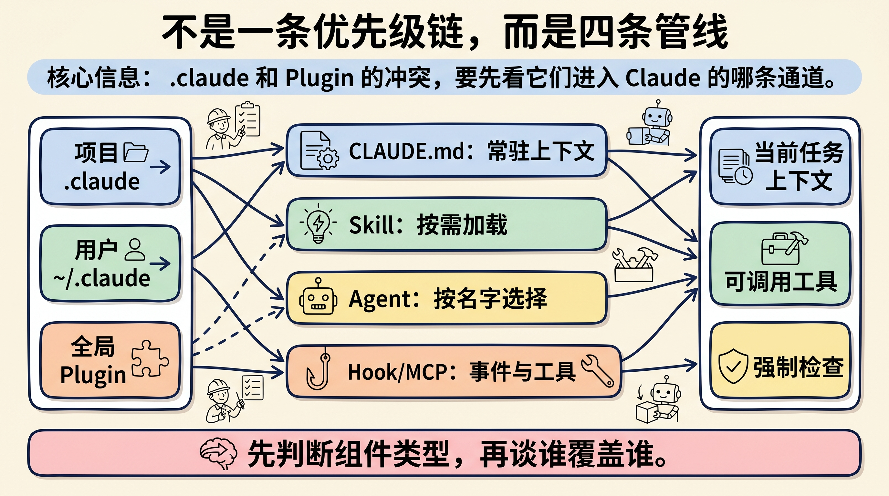
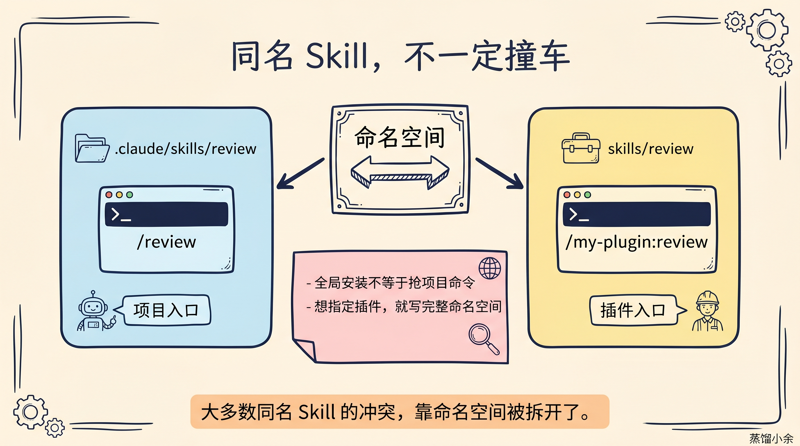
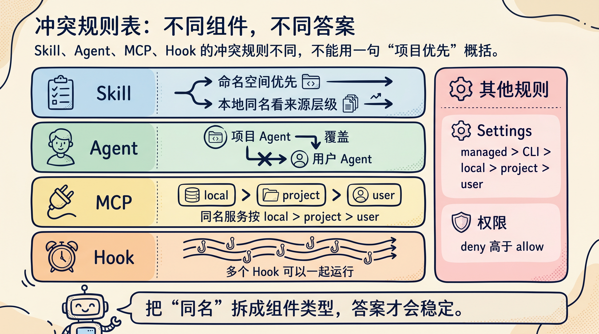
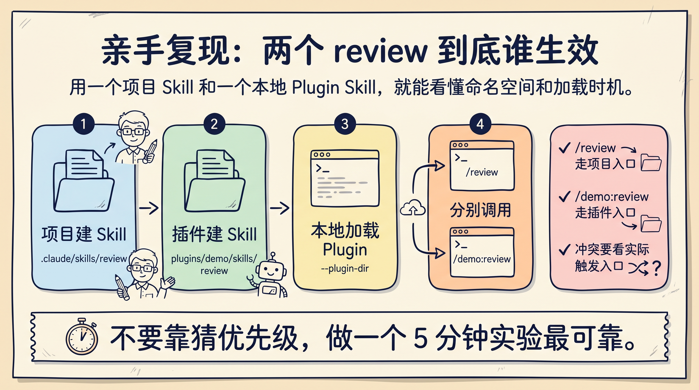

# Claude 指令撞车时，谁说了算？

你在项目里写了一个 `.claude` 规则，团队又装了一个全局 Plugin，两个地方都叫 `review`。这时候 Claude 到底听谁的？

答案不是“项目一定优先”，也不是“全局插件覆盖项目”。**Claude Code 的冲突规则要按组件类型看：Skill、Agent、MCP、Hook、Settings 走的是不同管线。**

最容易误判的是 Skill。项目里的 `/review` 和插件里的 `/some-plugin:review`，很多时候根本不是同一个入口。它们看起来同名，但命名空间已经把它们拆开了。


## 先把“同一个指令”拆开

开发者说“同一个指令冲突”，通常混了四类东西：

- `CLAUDE.md` 里的常驻项目规则。
- `.claude/skills/` 或 `.claude/commands/` 里的 slash 命令。
- Plugin 里打包的 Skill、Agent、Hook、MCP。
- `settings.json` 里的权限、工具、插件开关。

这些东西不会排成一条简单的优先级队列。更准确的理解是：它们从不同入口进入 Claude Code，最后一起影响当前任务。



`CLAUDE.md` 更像项目说明书，会作为项目上下文的一部分出现。Skill 是按需加载的操作手册，只有被触发时才把完整内容塞进上下文。Agent 是任务分工入口。Hook 和 MCP 则更像事件系统和工具系统，不是普通提示词。

所以第一步不是问“项目和全局谁大”，而是问：**冲突发生在 Skill、Agent、MCP、Hook，还是普通上下文里？**

## Skill：多数同名不会真的撞车

最常见的问题是：项目有一个 `review`，全局 Plugin 也有一个 `review`。

如果项目里是：

```text
.claude/skills/review/SKILL.md
```

你通常会用：

```bash
/review
```

如果插件里也有：

```text
skills/review/SKILL.md
```

插件的调用入口会带插件命名空间，例如：

```bash
/my-plugin:review
```

这就意味着：`/review` 和 `/my-plugin:review` 不是同一个命令。

把你问的例子说具体一点。

假设项目里有一个旧格式 command：

```text
.claude/commands/review.md
```

同时团队全局安装了一个 Plugin，插件名叫 `team-tools`，里面也有一个 `review` Skill：

```text
team-tools/
└── skills/
    └── review/
        └── SKILL.md
```

这时你输入：

```bash
/review
```

会走项目里的 `.claude/commands/review.md`。因为全局 Plugin 里的 Skill 不叫 `/review`，它的入口是：

```bash
/team-tools:review
```

所以这个场景里，**不是 Plugin Skill 覆盖项目 command，而是两个入口被命名空间拆开了**。

但要注意另一个容易混淆的场景：如果所谓“全局 Skill”不是 Plugin，而是个人目录里的：

```text
~/.claude/skills/review/SKILL.md
```

那它和项目 `.claude/commands/review.md` 争的是同一个 `/review`。官方文档的规则是：skill 和 command 同名时，skill 优先；并且同名 skill 跨层级时，personal 会覆盖 project。

所以一句话判断：

- 全局 **Plugin** 的 `review` Skill：用 `/team-tools:review`，不会抢 `/review`。
- 个人级 `~/.claude/skills/review`：会争 `/review`，通常会压过项目里的 legacy command。



全局安装 Plugin，不等于插件抢走了项目命令。你明确输入 `/my-plugin:review`，就是走插件入口；你输入 `/review`，就是走当前环境里可解析到的普通入口。

这也是官方推荐新插件用 Skill 的原因之一：Skill 可以有描述、命名空间、按需加载，比老式 flat markdown command 更适合分发。

## 真正冲突时，看组件自己的规则

把几个常见场景压成一张表：

| 场景 | 会发生什么 | 怎么判断 |
|---|---|---|
| 项目 Skill 和 Plugin Skill 同名 | 通常被命名空间拆开 | `/review` 和 `/plugin:review` 是两个入口 |
| 普通 Skill 和旧 slash command 同名 | Skill 优先于 command | `~/.claude/skills/review` 会争 `/review` |
| Plugin Skill 和项目 command 同名 | Plugin Skill 不抢普通入口 | `/review` 走 command，`/plugin:review` 走插件 |
| 项目 Agent 和用户 Agent 同名 | 项目 Agent 优先于用户 Agent | 适合项目专属角色 |
| MCP server 同名 | 按 local > project > user 覆盖 | 同名服务不要随便复用 |
| 多个 Hook 命中同一事件 | 可能都会运行 | Hook 更像事件监听，不是提示词覆盖 |
| 权限 allow 和 deny 冲突 | deny 优先 | 安全规则不要靠口头约定 |



Settings 还有另一套优先级。官方文档里，settings 的覆盖顺序是：企业托管策略、命令行参数、本地项目设置、共享项目设置、用户设置。

这解释了一个常见现象：你以为“全局配置已经开了”，但项目本地设置可能改变了行为。反过来，如果团队用共享项目设置打开某个插件或权限，本地项目设置也可能成为最后一道个人覆盖层。

## 普通规则冲突，不等于确定性覆盖

还有一种冲突更隐蔽：不是命令同名，而是两个说明互相矛盾。

比如项目 `CLAUDE.md` 写：

```text
所有代码审查都要输出中文。
```

某个 Plugin Skill 写：

```text
Review comments must be written in English.
```

当你触发这个 Plugin Skill 时，Claude 的上下文里可能同时出现项目规则和 Skill 规则。此时就不是“哪个文件覆盖哪个文件”的配置问题，而是模型如何理解当前任务、系统层级、上下文距离和具体指令的问题。

工程上不要依赖这种模糊裁决。

如果你希望项目永远中文输出，就把项目 Skill 写得更具体，或者在项目 Hook / settings 里加硬约束。如果只是某个插件偶尔需要英文，那就用完整命名空间明确调用，并在命令里写清楚本次例外。

一句实用判断：**提示词冲突靠模型理解，工具和权限冲突靠配置规则。前者不稳定，后者可验证。**

## 五分钟做个实验

与其猜，不如自己建两个同名入口。

第一步，在项目里建一个 Skill：

```text
.claude/skills/review/SKILL.md
```

内容写得很明显：

```markdown
---
description: Project review style
---

你是项目级 review。输出第一行必须写：PROJECT REVIEW。
```

第二步，在本地建一个 Plugin：

```text
demo-plugin/
├── .claude-plugin/
│   └── plugin.json
└── skills/
    └── review/
        └── SKILL.md
```

插件里的 `SKILL.md` 写：

```markdown
---
description: Plugin review style
---

你是插件级 review。输出第一行必须写：PLUGIN REVIEW。
```

第三步，用本地插件启动：

```bash
claude --plugin-dir ./demo-plugin
```

第四步，分别调用：

```bash
/review
/demo-plugin:review
```

你会看到两个入口的行为被拆开。这个实验比背优先级更有价值，因为它会逼你看清：命名空间、加载时机、调用入口，才是 Claude Code 深度使用里的关键变量。



## 我会怎么设计团队规则

第一，项目专属规则放进项目 `.claude`。

比如这个仓库的架构约定、测试命令、发布流程、代码风格。它们只对当前项目成立，不应该做成全局插件。

第二，跨项目复用经验做成 Plugin。

比如公众号写作、代码审查框架、故障复盘模板、PR 描述生成。只要你希望多个项目安装和更新，就不要散落在每个仓库里。

第三，强约束不要只写在 Skill 里。

比如禁止访问某类文件、提交前必须跑测试、某些工具调用必须拦截。能放进 settings、permissions、Hook 的，就不要只靠一句“请务必”。

第四，同名入口要主动命名。

项目里可以叫 `/review`，插件里就保留 `/team-review:review` 这种完整命名空间。团队文档里也应该写清楚：默认项目审查走 `/review`，跨项目审查走 `/team-review:review`。

## 最小实践清单

下次你怀疑 `.claude` 和全局 Plugin 冲突，按这张清单排：

1. 先确认冲突对象：是 Skill、Agent、MCP、Hook、settings，还是 `CLAUDE.md` 文本。
2. 如果是 Skill，先看是否有插件命名空间。
3. 如果是 Agent，同名时优先检查项目级 Agent。
4. 如果是 MCP，同名服务按 local、project、user 顺序查。
5. 如果是 Hook，不要假设覆盖，检查是否多个 Hook 都会运行。
6. 如果是权限，记住 deny 高于 allow。
7. 如果只是两段提示词矛盾，不要靠猜，写一个最小实验验证。

Claude Code 越用越深，真正需要掌握的不是“多背几个命令”，而是理解它的加载模型。

项目 `.claude` 负责把当前仓库讲清楚。全局 Plugin 负责把稳定能力打包复用。两者不是敌人，前提是你别把所有东西都叫同一个名字，也别把软提示词当成硬约束。

回复「冲突表」，我可以继续整理一份 Claude Code `.claude`、Plugin、Skill、Agent、MCP、Hook 的优先级速查卡，直接贴到团队 README 里用。

---

参考资料：

- Claude Code：Create plugins：<https://code.claude.com/docs/en/plugins>
- Claude Code：Plugins reference：<https://code.claude.com/docs/en/plugins-reference>
- Claude Code：Slash commands：<https://code.claude.com/docs/en/slash-commands>
- Claude Code：Settings：<https://code.claude.com/docs/en/settings>
- Claude Code：Subagents：<https://code.claude.com/docs/en/sub-agents>
