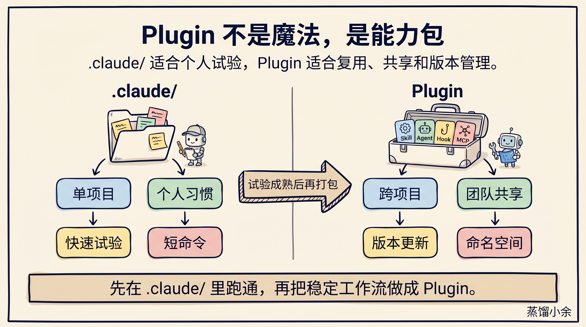
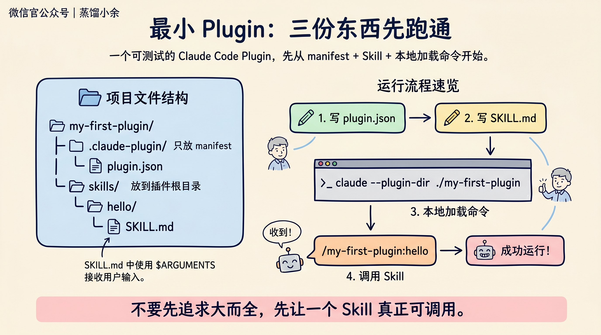
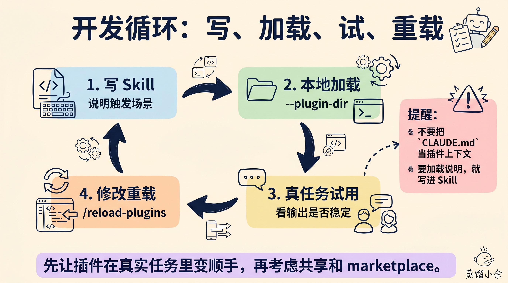
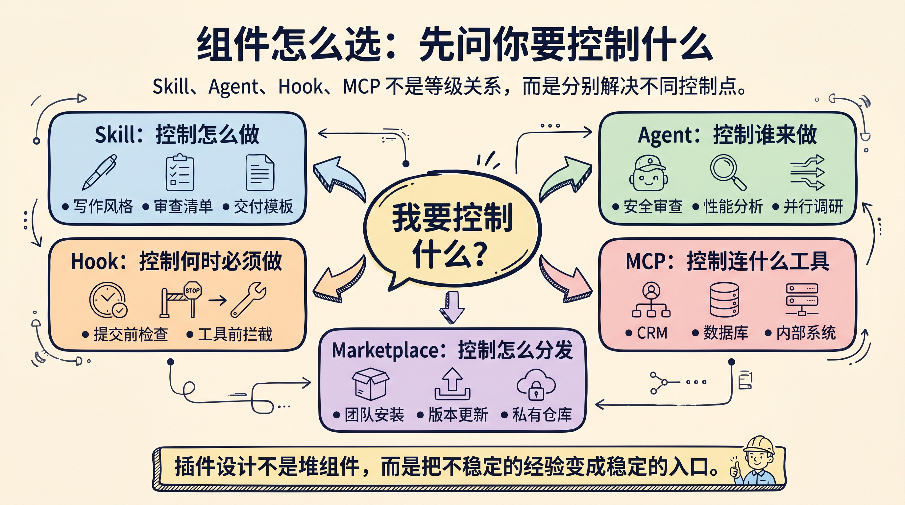

# Claude 总跑偏？做个 Plugin 固化工作流

如果你经常在 Claude 里反复交代同一套规则，比如“按我的代码审查清单看”“按这个格式写周报”“调用这个内部工具前先检查权限”，问题通常不在 Claude 不聪明，而在工作流没有被打包。

**Claude Plugin 的价值，就是把可复用的提示词、工具、规则和团队经验，变成一个可安装、可测试、可版本管理的能力包。**

这篇文章不讲玄学。我们只做一件事：从一个最小 Claude Code Plugin 开始，跑通目录、`plugin.json`、`SKILL.md` 和本地测试命令。等这条链路通了，再判断什么时候需要 Agent、Hook、MCP 和 marketplace。


## 先分清：Plugin 不是更大的提示词

官方文档把 Claude Code Plugin 定义成一类可复用扩展包，里面可以放 Skills、Agents、Hooks、MCP servers 等组件。

更通俗一点说：

- **Skill**：告诉 Claude 遇到某类任务时“应该怎么做”。
- **Agent**：把某类任务交给一个专门角色去做。
- **Hook**：在特定事件发生时强制执行检查或脚本。
- **MCP**：让 Claude 接入外部工具、数据源或内部系统。
- **Marketplace**：让插件可以被团队或社区发现、安装和更新。

所以 Plugin 不是一个更长的 Prompt，而是一个“能力打包格式”。它把以前散落在口头约定、个人配置、复制粘贴提示词里的经验，收进一个目录。



官方文档也给了一个很实用的判断：如果只是个人项目、快速试验、短命令，放在 `.claude/` 里就够了；如果你希望跨项目复用、让团队安装、通过版本更新分发，就应该做成 Plugin。

我建议的顺序是：**先在 `.claude/` 里试验，稳定后再封装成 Plugin。** 不要一上来就追求完整插件生态。

## 最小可跑版本：只做一个 Skill

一个最小 Claude Code Plugin 可以先长这样：

```text
my-first-plugin/
├── .claude-plugin/
│   └── plugin.json
└── skills/
    └── hello/
        └── SKILL.md
```

注意一个容易踩坑的地方：`.claude-plugin/` 目录只放 `plugin.json`。`skills/`、`agents/`、`hooks/` 这些组件目录，要放在插件根目录，不要塞进 `.claude-plugin/` 里面。

先写 manifest：

```json
{
  "name": "my-first-plugin",
  "description": "A tiny plugin for learning Claude Code plugins",
  "version": "1.0.0"
}
```

再写第一个 Skill：

```markdown
---
description: Greet the user with a personalized message
---

# Hello Skill

Greet the user named "$ARGUMENTS" warmly.
Then ask what workflow they want to turn into a reusable Claude Plugin.
```

这里的 `$ARGUMENTS` 会接收 slash 命令后面的输入。比如你输入：

```bash
/my-first-plugin:hello 小余
```

Skill 里就能拿到“小余”。



## 本地测试：先别急着发 marketplace

写完目录以后，用本地方式加载插件：

```bash
claude --plugin-dir ./my-first-plugin
```

进入 Claude Code 后，试一下：

```bash
/my-first-plugin:hello 小余
```

如果能触发，第一步就完成了。

Plugin 里的 Skill 默认会带命名空间，例如 `/my-first-plugin:hello`。这个设计不是多余，而是为了避免不同插件都叫 `hello`、`review`、`deploy` 时互相撞名。

后续修改 `SKILL.md` 后，可以运行：

```bash
/reload-plugins
```

让 Claude Code 重新加载插件。



这里有一个反直觉点：**插件根目录里的 `CLAUDE.md` 不会被当成项目上下文加载。** 如果你想把某段说明真正贡献给 Claude，就应该放进 Skill、Agent 或 Hook，而不是指望根目录 `CLAUDE.md` 自动生效。

## 什么时候该加 Agent、Hook 和 MCP

新手最容易犯的错，是一开始就把所有组件都塞进去。

更稳的判断方式是：先问自己到底要控制什么。

如果你要控制“Claude 遇到这类任务时应该怎么做”，用 Skill。比如代码审查清单、公众号写作风格、事故复盘模板。

如果你要控制“谁来做这件事”，用 Agent。比如把安全审查、性能分析、竞品调研交给不同子 Agent，让它们并行工作。

如果你要控制“某个时刻必须发生什么”，用 Hook。比如工具调用前做权限检查，提交前跑格式化或安全扫描。

如果你要控制“Claude 能连接什么外部能力”，用 MCP。比如内部数据库、CRM、工单系统、知识库检索服务。

如果你要控制“别人怎么安装和更新”，再考虑 marketplace。



用一句工程化的话说：**Skill 解决经验复用，Agent 解决分工，Hook 解决强制约束，MCP 解决工具连接，Marketplace 解决分发。**

这几个组件不是等级关系，不是越多越高级。一个只有 Skill 的插件，如果能稳定降低团队沟通成本，就已经很有价值。

## 真正该封装的，不是炫技能力

我会优先把三类东西做成 Claude Plugin。

第一类是**高频交付格式**。

比如 PRD、代码审查、技术方案、复盘报告、公众号文章。如果每次都要重新解释结构、语气、检查项，就适合做成 Skill。

第二类是**容易遗漏的质量门槛**。

比如发布前必须检查测试、迁移脚本、安全边界、用户数据处理。这类东西只靠人记不稳，更适合用 Hook 固化。

第三类是**团队内部工具和数据**。

比如查工单、读客户反馈、拉取监控、写入 Linear 或 Jira。这类场景只靠 Prompt 不够，要靠 MCP 或 connector 把工具接进来。

我暂时不建议把“还没跑通的想法”直接做成 Plugin。插件的意义是把稳定经验产品化，不是把不确定性包装得更正式。

## 最小实践清单

你可以照着下面这张清单做第一个自定义插件：

1. 选一个你每周至少重复三次的 Claude 工作流。
2. 先写成一个普通 `.claude/skills/` 或临时提示词，在真实任务里试两三轮。
3. 稳定后创建 `my-plugin/.claude-plugin/plugin.json`。
4. 把稳定说明放进 `skills/<name>/SKILL.md`。
5. 用 `claude --plugin-dir ./my-plugin` 本地加载。
6. 用 `/my-plugin:<skill-name>` 触发测试。
7. 修改后用 `/reload-plugins` 重载。
8. 准备共享前，补 `README.md`、版本策略和真实使用示例。
9. 提交或分发前，运行 `claude plugin validate`。

如果要做团队共享，再去看 marketplace。官方 marketplace 文档里，marketplace 本质是一个 `marketplace.json`，列出可安装插件和来源。它可以来自 GitHub repo、Git URL、本地路径或远程 URL。

入门阶段不用急。先让一个 Skill 在你自己的任务里变顺手，再谈分发。

## 最大坑：把 Plugin 当成配置垃圾桶

Plugin 最怕变成“什么都往里塞”的目录。

一个好的 Plugin 应该能回答三个问题：

- 它帮用户少重复解释什么？
- 它让哪条工作流更稳定？
- 它的触发入口和边界是什么？

如果这三个问题答不上来，先别打包。

我的建议是给第一个插件起一个很具体的名字，比如 `wechat-writer`、`release-reviewer`、`incident-postmortem`，不要叫 `my-ai-assistant`。名字越具体，Skill 的边界越清楚，后面越容易维护。

最后留一个小作业：今天打开你最常复用的一段 Claude 提示词，把它改成一个 `SKILL.md`。不要追求完美，只要能用 `--plugin-dir` 跑起来。

当你第一次看到 `/your-plugin:your-skill` 能在不同项目里稳定触发时，你会很直观地理解 Claude Plugin 的意义：不是让模型变神，而是把你的工作方法变成可复用软件。

回复「Claude Plugin」，我可以继续整理一份可直接复制的插件目录模板，包括 `plugin.json`、`SKILL.md`、README 和 marketplace 示例。

---

参考资料：

- Claude Code：Create plugins：<https://code.claude.com/docs/en/plugins>
- Claude Code：Plugins reference：<https://code.claude.com/docs/en/plugins-reference>
- Claude Code：Discover plugins：<https://code.claude.com/docs/en/discover-plugins>
- Claude Code：Plugin marketplaces：<https://code.claude.com/docs/en/plugin-marketplaces>
- Claude.ai：Plugins overview：<https://claude.com/docs/plugins/overview>

