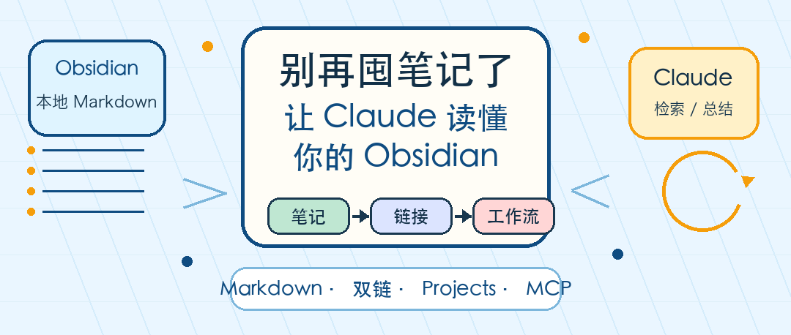

# 别再囤笔记了：让 Claude 读懂你的 Obsidian

很多人的“第二大脑”，最后会变成第二个收藏夹。

文章收藏了，会议纪要写了，灵感也记进去了，但真正要写方案、复盘项目、做技术选型时，还是重新搜索、重新翻聊天记录、重新问一遍 AI。问题不在你记得不够多，而在这些笔记没有参与工作流。

Claude + Obsidian 值得看的地方，不是“AI 加笔记”这个概念，而是一个更具体的变化：**你的知识库开始能被 AI 读取、检索、串联、改写和维护。**

如果要把它做成可用系统，重点也不是先装一堆插件，而是先让笔记变成机器能稳定理解的材料。



## 笔记失效，通常不是因为工具太弱

很多知识库失效，有三个常见原因。

第一，笔记只负责“存”，不负责“用”。你把文章摘要、会议结论、项目想法都放进同一个文件夹，短期看很充实，长期看很难检索。

第二，笔记缺少上下文。三个月后再打开一条记录，只看到“优化检索策略”“下周看 RAG 方案”，但不知道当时讨论的是哪个项目、谁提出的问题、为什么要做这个决定。

第三，笔记之间没有关系。孤立文档越多，AI 越容易把它们当成一堆散落文本，而不是一张可推理的工作地图。

所以“AI Second Brain”的关键不是让 Claude 读到更多文件，而是让 Claude 读到更有结构、更有来源、更有关系的笔记。

## 为什么 Obsidian 适合接 AI

Obsidian 的优势很朴素：它把笔记存成 Markdown 格式的纯文本文件，vault 本质上就是本地文件夹。

这意味着几件事。

一是可读。Claude Code、Codex、本地模型或其他脚本工具，都可以直接读取 `.md` 文件，不需要先从专有数据库里导出。

二是可迁移。你可以用 Git 管理版本，也可以用 Obsidian Sync、iCloud、Dropbox、OneDrive 这类方案同步。工具换了，文件还在。

三是可连接。Obsidian 的内部链接可以把笔记连成知识网络，最常见的是 `[[项目名]]` 这种 wikilink，也可以改用标准 Markdown 链接来提高互操作性。

这里要补一个边界：Obsidian 的部分语法有平台特性，比如 block reference 并不是标准 Markdown。它在 Obsidian 里很好用，但如果你的目标是让多种 Agent、脚本和编辑器都能稳定消费笔记，就不要把核心信息只藏在 Obsidian 专属语法里。

小余判断：Obsidian 适合接 AI，不是因为它“更会记笔记”，而是因为它把知识库退回到了一个最容易被 AI 处理的形态：本地文件、纯文本、显式链接。

## 三种连接方式，先按风险选

原文给了几种 Claude 接 Obsidian 的路径。实际使用时，我建议按风险和维护成本来选，不要一上来追求最强方案。

| 方式 | 适合谁 | 优点 | 最大坑 |
|---|---|---|---|
| Claude Projects | 想先试概念的人 | 上传文档就能用，设置成本最低 | 需要手动上传，vault 更新后不一定自动同步 |
| Claude Code 直接读 vault | 开发者、重度命令行用户 | 能搜索、读取、生成和改写本地 Markdown | 权限边界要写清楚，避免 Agent 乱改原笔记 |
| MCP / Obsidian Skills | 想长期集成的人 | 可以把检索、读写、技能和工具链标准化 | 依赖插件、服务和配置，维护成本更高 |

Claude Projects 更像“把一批资料放进项目知识库”。Anthropic 的支持文档也明确说，Projects 有独立聊天历史和知识库，可以上传文档、文本、代码或其他文件。它适合验证：Claude 用你的材料回答问题时，体验到底有没有提升。

Claude Code 直接读 vault，更适合开发者。你可以把 Obsidian vault 当成本地知识库，让 Claude 先搜索相关笔记，再回答问题、生成新笔记、整理项目复盘。

MCP 和 Obsidian Skills 适合长期玩家。比如 `obsidian-local-rest-api` 提供 REST API 和 MCP server，`mcp-obsidian` 通过 Obsidian Local REST API 插件操作 vault，`kepano/obsidian-skills` 则把 Obsidian Markdown、Bases、JSON Canvas 和 CLI 用法写成 Agent Skills。

我的建议是：**先用 Projects 验证价值，再用 Claude Code 跑真实工作流，最后才考虑 MCP 和 Skills。**

## 最小 vault 结构，不要设计三天

先别做复杂知识分类。

一个能跑起来的 vault，五个目录就够：

```text
Inbox/          临时收集，所有未处理输入先放这里
Projects/       当前正在推进的项目
Areas/          长期责任区，比如写作、产品、健康、投资
Resources/      可复用资料、文章、论文、工具说明、模板
Archive/        结束项目和过期资料
Weekly Reviews/ 每周由 Claude 生成或辅助生成的回顾
```

这个结构借鉴了 PARA 的思路，但不要把它当成宗教。目录的价值是给 Claude 一个粗粒度上下文，让它知道“这是项目材料”“这是参考资料”“这是已归档内容”。

真正影响效果的，是每条笔记是否有足够的上下文。

## 笔记要写给未来的你，也写给 Claude

AI 友好的笔记，不需要很复杂，但要稳定。

可以从这个模板开始：

```markdown
---
tags: [meeting, product, q2-2026]
date: 2026-05-31
project: "[[AI Knowledge Base]]"
status: active
source: "https://example.com/source"
---

# 会议纪要：AI Knowledge Base 路线讨论

一句话摘要：这次会议决定先做本地 Markdown 检索，不直接接入企业知识库。

## 背景

为什么开这个会，问题来自哪里。

## 关键结论

- 决定 1：...
- 决定 2：...

## 待办

- [ ] 谁在什么时候完成什么

## 相关链接

- [[RAG Evaluation]]
- [[Claude Code Workflow]]
```

这里最有价值的不是 YAML，而是三个习惯。

第一，每条笔记开头有一句话摘要。Claude 可以先读摘要判断相关性，不必每次把全文都塞进上下文。

第二，结论和待办分开。否则 AI 很容易把“讨论过的想法”和“已经决定的动作”混在一起。

第三，相关链接要显式。不要指望 Claude 总能从含糊表述里猜出关系，重要项目、人物、方案、资料都应该被链接出来。

## 先跑五个工作流

别把 Claude + Obsidian 做成一个“看起来很强”的系统。先跑出几个能省时间的动作。

**1. 每周摘要**

```text
读取 Weekly Reviews/ 之外，过去 7 天新增或修改的笔记。
输出一份周报，包含：关键进展、重要决策、未完成待办、反复出现的问题。
保存到 Weekly Reviews/YYYY-MM-DD.md。
```

**2. 项目接续**

```text
搜索 Projects/ 中和 [[当前项目名]] 相关的笔记。
告诉我：项目目标、最近决定、未解决问题、下一步最应该做什么。
不要给泛泛建议，只引用已有笔记里的证据。
```

**3. 研究综合**

```text
读取 Resources/ 中和 [主题] 相关的笔记。
合并成一份 synthesis note，标出共同结论、冲突观点、证据不足处和下一步要查的资料。
```

**4. 孤岛笔记清理**

```text
找出过去 30 天没有入链、也没有明显项目归属的笔记。
为每条笔记建议 2 个可能的链接对象，并说明理由。
```

**5. 早晨简报**

```text
读取最近三天 Daily Notes、当前 Projects/ 和未完成待办。
生成今天的工作简报：应该优先处理什么、为什么、需要避开什么分心任务。
```

这些 prompt 不追求漂亮。它们的价值在于让 Claude 从“回答问题”变成“维护知识工作流”。

## 最大坑：让 AI 维护一堆脏笔记

我会这样用 Claude + Obsidian：

先把正在做的项目、最近阅读的资料和会议纪要放进去，保证每条笔记都有摘要、日期、来源和项目链接。然后每周让 Claude 做一次项目接续和知识库清理。

我暂时不建议三类人重度投入：

- 只想收藏网页、不愿意写一句话摘要的人。
- 对本地文件权限没有把握，却想让 Agent 自动改 vault 的人。
- 还没有稳定项目流，就急着折腾复杂 MCP 配置的人。

最大的坑也在这里：你让 Claude 维护的是一套知识库，不是一堆随机文本。输入越脏，AI 越像一个更快的搜索框；输入越结构化，它才更像一个能跟你一起工作的助理。

## 可以直接照抄的落地清单

今天就能做的版本很简单：

1. 新建一个 Obsidian vault。
2. 建 `Inbox/`、`Projects/`、`Areas/`、`Resources/`、`Archive/`、`Weekly Reviews/`。
3. 先放 20 条真实笔记，不要导入历史垃圾。
4. 每条笔记补一句话摘要、日期、来源和相关项目。
5. 用 Claude Projects 上传一小批笔记，验证它能不能基于你的材料回答问题。
6. 如果你是开发者，再让 Claude Code 直接读取这个 vault，并明确禁止它未经确认批量改文件。
7. 稳定后再考虑 MCP、Obsidian Skills 和自动维护。

第二大脑不是文件夹，也不是工具崇拜。

它是一套可被你和 AI 共同使用的工作流：你负责输入真实上下文，Claude 负责检索、串联、总结和提醒你哪些知识正在失效。

回复「Obsidian」，我可以继续整理一份可复制的 `CLAUDE.md` / `AGENTS.md` 模板，让 Claude Code 读取 vault 时遵守权限、命名和写入规则。

---

参考资料：

- 原文：<https://x.com/eng_khairallah1/status/2060652660773314833>
- Obsidian Help：Data storage：<https://help.obsidian.md/data-storage>
- Obsidian Help：Internal links：<https://help.obsidian.md/links>
- Claude Support：What are projects?：<https://support.claude.com/en/articles/9517075-what-are-projects>
- kepano/obsidian-skills：<https://github.com/kepano/obsidian-skills>
- coddingtonbear/obsidian-local-rest-api：<https://github.com/coddingtonbear/obsidian-local-rest-api>
- MarkusPfundstein/mcp-obsidian：<https://github.com/MarkusPfundstein/mcp-obsidian>
