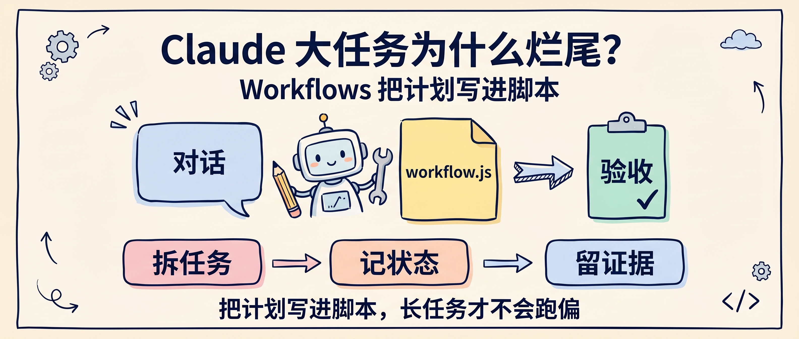
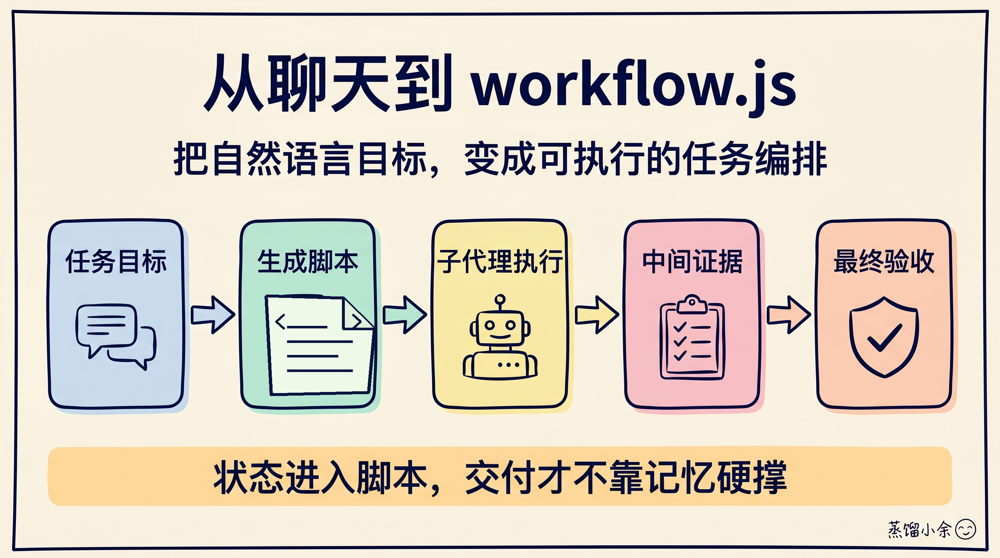
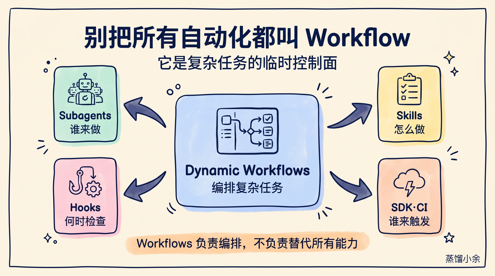

# Claude 大任务为什么烂尾？Workflows 把计划写进脚本

让 Claude 连续做一个大任务，最常见的问题不是第一步做不好，而是做到第十步以后开始变形：上下文越来越乱，目标被局部细节挤掉，检查项漏掉，最后输出看起来很努力，离交付还差一截。

Claude Code 新发布的 Dynamic workflows，解决的正是这个问题。它的价值不是让 Claude 多一个“自动执行”按钮，而是让 Claude 把复杂任务先写成一个可执行的 `workflow.js`，再用脚本去编排子代理、分支、重试、状态和验收。

换句话说，Workflows 把一次性聊天，变成了一份可以跑、可以看、可以改的任务计划。



## Workflows 不是待办清单，是临时编排器

普通对话里，你给 Claude 一个任务：

```text
把这个项目迁移到新版框架，顺便修掉测试。
```

Claude 会边想边做。任务短的时候没问题，任务长的时候就容易出现三个问题：

- 计划写在上下文里，不是写在可执行结构里。
- 多个子任务之间的依赖关系靠模型记忆维持。
- 中间失败以后，后续步骤可能继续跑，但方向已经偏了。

Dynamic workflows 的变化，是 Claude 会先生成一个 `workflow.js`。这个脚本负责描述任务怎么拆、哪些步骤并行、哪些步骤必须等待、失败后怎么处理、最后怎么验收。

官方文档给的核心方式很直接：在 Claude Code 里用 `/workflows`，描述目标，Claude 会生成并执行工作流。你也可以在普通任务里自然描述需求，让 Claude 判断是否需要工作流。

真正要理解的是：`workflow.js` 不是你手写的传统自动化脚本，而是 Claude 为当前任务临时写出的“任务编排器”。它可以使用 JavaScript 的控制流，比如 `if`、`for`、`Promise.all`、`try/catch`，把复杂任务从自然语言计划变成更稳定的执行结构。



## 它和子代理、Hook、SDK 到底差在哪

Claude Code 现在的能力越来越多，新手很容易把几个概念混在一起。

我建议先用一张工程视角的表来分清：

| 能力 | 解决什么问题 | 适合什么时候用 |
|---|---|---|
| Subagents | 把任务交给不同专长的代理 | 代码审查、研究、测试、迁移拆分 |
| Skills / Slash commands | 复用一段固定操作说明 | 团队规范、写作模板、审查清单 |
| Hooks | 在特定事件强制执行脚本 | 提交前检查、权限门禁、日志记录 |
| GitHub Actions / CI | 在远端事件里自动触发 | PR 审查、CI 修复、issue 响应 |
| Agent SDK | 把 Claude 嵌进自己的程序 | 自建工具、后台服务、产品功能 |
| Dynamic workflows | 让 Claude 为复杂任务写编排脚本 | 多步骤、多分支、需要中间状态的大任务 |



所以 Workflows 不是替代这些能力，而是站在它们上面做编排。

子代理像执行者，Skill 像操作手册，Hook 像门禁，SDK 像外部接口，Workflows 更像临时项目经理：先把任务拆清楚，再调人，再记录状态，再验收结果。

这个差异很重要。你不应该把所有 Claude 自动化都塞进 Workflows。一个固定的代码审查格式，用 Skill 更合适；一个每次保存文件都要跑的检查，用 Hook 更合适；一个 PR 评论触发的自动修复，用 GitHub Actions 更合适。

Workflows 适合的是那些“每次目标都不完全一样，但结构复杂到不能只靠聊天”的任务。

## 官方为什么拿 Bun 迁移做例子

Anthropic 发布博客里最醒目的例子，是 Bun 从 Zig 迁移到 Rust 的 PR。官方说 Claude Code 用 Dynamic workflows 协助处理了约 75 万行代码，并把测试通过率推进到 99.8%。

这个案例不要读成“以后大型重构可以全自动交给 Claude”。更准确的读法是：Workflows 的上限场景，正是大规模、可拆分、需要反复检查的工程任务。

大型迁移最难的地方不是“改一处语法”，而是同时管理几类状态：

- 哪些模块已经迁移。
- 哪些测试还在失败。
- 哪些失败是迁移问题，哪些是旧问题。
- 哪些文件需要人工复核。
- 哪些步骤可以并行，哪些必须串行。

如果这些状态都塞在聊天上下文里，Claude 很快会被细节淹没。Workflows 把状态显式写进脚本和执行过程里，至少让任务结构更可见。

这也是我认为它值得单独学习的原因：它不是“模型更聪明了”的故事，而是“复杂任务的控制面从对话搬到了脚本”。

## 入门先别追求大自动化

第一次用 Workflows，不建议直接丢一个“帮我重构整个系统”。

更稳的上手方式，是选一个边界清楚、能验证、可回滚的小型复杂任务：

1. 审查一个模块的性能问题，并给出改动建议。
2. 把一个组件从旧 API 迁移到新 API。
3. 对一个仓库做安全/测试/文档三路并行检查。
4. 整理一个技术主题的资料，并输出引用清单和文章提纲。
5. 在一个小范围内修复失败测试，并解释每个修复。

这种任务有两个特点：步骤不止一个，但验收标准能写清楚；Claude 可以拆分子任务，但不会一上来就越过你的控制边界。

我会这样给第一条 Workflows 任务：

```text
用 Dynamic workflow 处理这个任务，但先不要修改代码。

目标：
- 审查 src/auth 目录里的登录流程
- 找出安全、错误处理和测试覆盖问题
- 输出一个按优先级排序的修复计划

工作流要求：
- 先生成 workflow.js 并解释步骤
- 至少分成 security、testing、code-path 三个子任务
- 每个子任务必须给出证据文件路径
- 最后合并成一张 P0/P1/P2 表
- 不要读取 .env，不要访问外部网络，不要执行写操作

验收标准：
- 每条建议都有文件路径或测试证据
- 明确区分事实、推测和建议
- 给出我下一步可以直接执行的命令或改动清单
```

这段提示词的重点不是写得漂亮，而是把边界讲清楚：先别改代码、不要碰敏感文件、每条结论要有证据、最后要有验收对象。

## 安全边界要提前写进任务

Workflows 看起来像脚本，但不能把它当成无约束的脚本运行器。

官方文档里有一个关键限制：工作流脚本本身不能直接访问文件系统或 shell。它要通过调度子代理来完成实际操作，而子代理仍然受 Claude Code 的工具权限控制。

这条限制很重要。它意味着 Workflows 不是绕过权限的后门，也不是让 Claude 静悄悄执行所有本地命令。真正的风险仍然来自你给了什么工具权限、让它看了什么目录、允许它改了哪些文件。

我建议第一次使用时遵守五条规则：

1. 在干净 git 分支或 worktree 里跑。
2. 先让 Claude 展示计划和 `workflow.js`，不要直接大范围修改。
3. 明确禁止读取 `.env`、密钥、私有凭证和无关目录。
4. 写清楚允许的工具范围，比如只读、只测试、只改某个目录。
5. 每个阶段结束后要求输出证据，而不是只输出“已完成”。

还有一个容易忽略的点：工作流运行成功，不等于业务任务成功。官方文档也提醒，如果 workflow 显示完成，但实际目标没完成，说明这个 workflow 设计不足，需要改工作流本身。

这句话很像传统工程里的 CI：流水线绿了，不等于产品没问题；只是说明你定义的检查通过了。

## 我会怎么用 Workflows

我会优先把 Workflows 用在三类任务上。

第一类是**并行研究**。

比如写一篇技术文章前，让 Claude 同时查官方文档、GitHub issue、release notes 和竞品资料，最后合并成结构化研究笔记。这个场景的关键不是“搜得更多”，而是每一路都有来源、结论和可信度标记。

第二类是**大改动前的侦察**。

比如迁移测试框架、改权限模型、拆分大组件。先用 Workflows 跑只读分析，把风险、依赖、文件分布、测试缺口摸清楚，再决定要不要动手。

第三类是**重复但不完全固定的交付**。

比如每次发布前做一次代码、文档、测试、迁移脚本四路检查。它不像 Hook 那么固定，也不像普通聊天那么松散，适合让 Claude 临时生成一份本次发布专用工作流。

我暂时不建议把 Workflows 用在三类任务上：

- 含有生产密钥、用户隐私数据或高权限操作的任务。
- 验收标准写不清的大而空任务。
- 你自己完全不理解、也无法复核的系统级重构。

Workflows 能降低复杂任务的协调成本，不能替代工程判断。

## 一张上手清单

第一次试 Claude Workflows，可以照着这张清单走：

- 选一个 30 到 90 分钟能复核的小任务。
- 明确目标、范围、禁止事项和验收标准。
- 要求 Claude 先生成并解释 `workflow.js`。
- 检查是否有过大的权限、无边界搜索、无验收输出。
- 让它先跑只读分析，再决定是否允许写操作。
- 复杂改动放在 git worktree 或独立分支里。
- 每个子任务必须输出证据：文件路径、测试结果、日志或引用链接。
- 最后不要只看 summary，要跑测试、看 diff、读关键文件。
- 如果结果不稳，修改 workflow 设计，而不是继续催 Claude “再试一次”。

这套清单背后的原则很简单：Workflows 负责把复杂任务结构化，人负责定义边界和验收。

## 结尾：从“催模型”切到“设计流程”

Claude Code Workflows 的入门门槛不在 JavaScript，而在你能不能把任务说成一条可执行流程。

以前我们经常在大任务里反复催模型：

```text
继续。
别忘了测试。
再检查一下。
你漏了刚才那个文件。
```

Workflows 更好的使用方式，是把这些提醒提前写进计划：谁来查、查什么、怎么合并、失败怎么处理、最后拿什么验收。

这也是 AI 编程正在发生的变化。开发者的工作不是把每一步都手动做完，而是把任务边界、检查标准和交付流程设计清楚。

Claude 可以写 `workflow.js`，但工作流应该服务于你的工程判断。

回复「Workflows」，我可以继续整理一份可直接复制的 Claude Code Workflows 入门模板：包含任务描述、权限边界、子代理拆分、验收清单和复盘提示词。

---

参考资料：

- Anthropic：Introducing dynamic workflows in Claude Code：<https://claude.com/blog/introducing-dynamic-workflows-in-claude-code>
- Claude Code Docs：Dynamic workflows：<https://code.claude.com/docs/en/workflows>
- Claude Code Docs：Changelog：<https://code.claude.com/docs/en/changelog>
- Claude Code Docs：Agents：<https://code.claude.com/docs/en/agents>
- Claude Code Docs：Subagents：<https://code.claude.com/docs/en/sub-agents>
- Claude Code Docs：Routines：<https://code.claude.com/docs/en/routines>
- Claude Code Docs：Hooks guide：<https://code.claude.com/docs/en/hooks-guide>
- Claude Code Docs：SDK：<https://code.claude.com/docs/en/sdk>
- Claude Code Docs：GitHub Actions：<https://code.claude.com/docs/en/github-actions>
- Claude Code Docs：Permissions：<https://code.claude.com/docs/en/permissions>
- Claude Code Docs：Costs：<https://code.claude.com/docs/en/costs>
- Bun PR：Rewrite Bun in Rust：<https://github.com/oven-sh/bun/pull/30412>
- Bun 迁移说明：PORTING.md：<https://raw.githubusercontent.com/oven-sh/bun/3157cb14b5970b69532a47800504a28ef5963e22/docs/PORTING.md>
