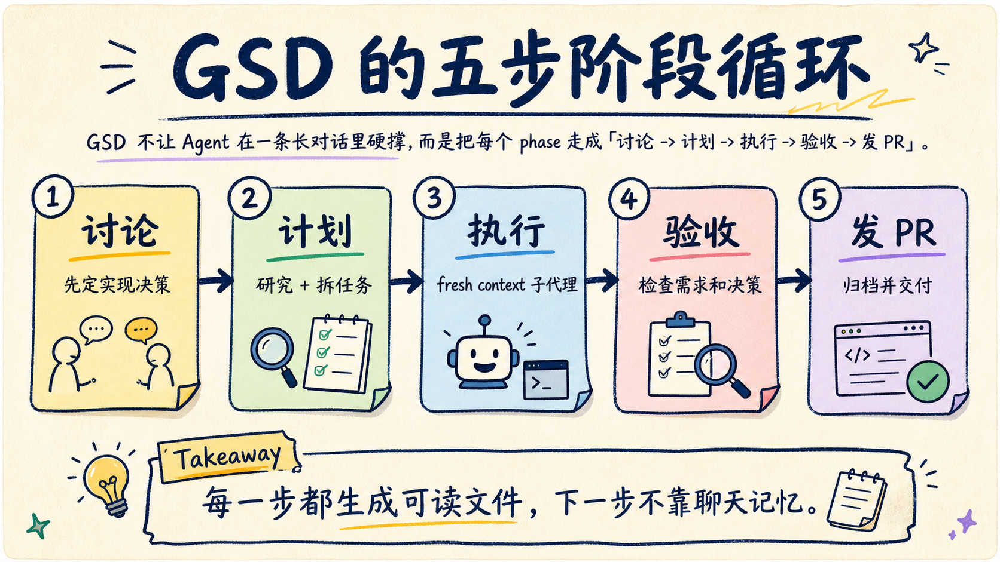
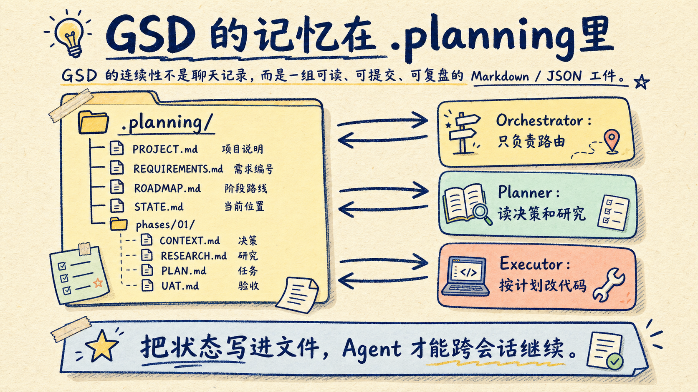
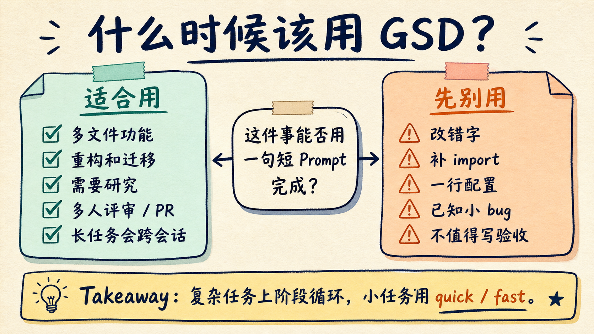
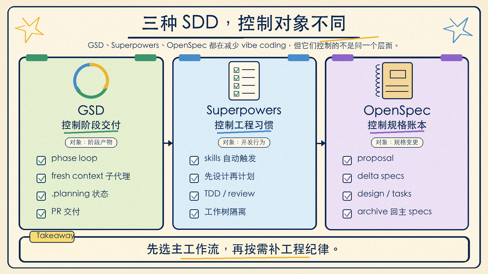

# Agent 长任务总烂尾？GSD 用阶段循环跑到 PR

Agent 写代码最容易烂尾的地方，不是它不会补一个函数，而是任务一长、文件一多、上下文一脏，它开始忘掉前面说好的决策。

GSD 的思路很直接：不要让一个 Agent 在一条越来越长的聊天里硬撑。把需求拆成 phase，把每个 phase 走完讨论、计划、执行、验收、发 PR，再把状态写进仓库文件里。

所以 GSD 不是一个更长的 Prompt，也不是一个神秘的自动编程框架。它更像一套给 AI 编程助手用的项目推进器：让 Agent 不只是“写点代码”，而是按阶段把工作交付到 PR。


先校正一个信息：你看到的 `gsd-build/get-shit-done` 已经不是活跃开发仓库。它的 README 现在指向新的 `open-gsd/gsd-core`。如果要安装和跟进问题，应该看 GSD Core，而不是继续沿用旧包名。

## GSD 解决的不是 Prompt 问题，而是上下文腐化

长任务里，Agent 经常不是突然变笨，而是上下文开始腐化。

刚开始它知道需求、知道约束、知道你说过不要改哪些文件。二十轮之后，聊天记录里混进了错误日志、临时尝试、返工解释、旧计划和新决定。模型还能回答，但它对早期约束的注意力会下降。

GSD Core 文档把这种现象叫 context rot。

它的解决方案不是让主会话背更多东西，而是让主会话变薄：主会话只负责路由和状态更新，研究、计划、执行、验证这些重活，交给 fresh-context subagents。

换句话说，GSD 的核心不是“上下文越长越好”，而是“每个子任务只带刚好需要的上下文”。



这个结构带来一个很重要的变化：Agent 不再靠聊天记忆交接，而是靠文件交接。

GSD 会在项目里维护 `.planning/`：

```text
.planning/
  PROJECT.md
  REQUIREMENTS.md
  ROADMAP.md
  STATE.md
  config.json
  phases/
    01-xxx/
      CONTEXT.md
      RESEARCH.md
      01-01-PLAN.md
      01-01-SUMMARY.md
      VERIFICATION.md
      UAT.md
```

这些文件不只是“文档”。它们是 Agent 之间的接口。

`CONTEXT.md` 记录实现决策，`RESEARCH.md` 记录研究结论，`PLAN.md` 拆成可执行任务，`SUMMARY.md` 记录每个 executor 做了什么，`UAT.md` 记录验收结果，`STATE.md` 告诉下一个会话现在走到哪里。



这就是 GSD 和普通 “Plan Mode” 的区别。普通计划经常还停留在对话里，GSD 会把计划变成可以被后续 Agent 读取、检查、归档的项目工件。

## 照着跑一遍：从安装到第一个 PR

GSD Core 当前的安装入口是：

```bash
npx @opengsd/gsd-core@latest
```

它会问你使用哪个运行时，以及全局安装还是项目内安装。文档强调不要直接复制 `agents/` 或 `commands/` 目录，因为不同运行时的 schema、目录结构和命令格式不一样，installer 会做转换。

如果你用 Claude Code，常见全局安装命令是：

```bash
npx @opengsd/gsd-core@latest --claude --global
```

安装后重启对应运行时。不同运行时的命令名字会略有差异，Claude Code / OpenCode 这类环境常见是 `/gsd-*`，Gemini CLI 是 `/gsd:*`，Codex 是 `$gsd-*`。下面用 Claude Code 形态举例。

第一步，初始化项目：

```text
/gsd-new-project
```

GSD 会问你要做什么、目标是什么、有哪些约束。它不是马上写代码，而是先生成项目层面的 `.planning/PROJECT.md`、`REQUIREMENTS.md`、`ROADMAP.md`、`STATE.md` 和 `config.json`。

如果是一个已有代码库，这一步的意义是让 Agent 先拥有稳定的项目地图，而不是每次开新会话都重新猜项目结构。

第二步，清理主会话上下文，然后讨论第一个 phase：

```text
/clear
/gsd-discuss-phase 1
```

Discuss 不是产品需求访谈，而是把“怎么做”的关键决策问清楚。

比如错误处理策略、是否引入新依赖、数据结构怎么选、边界情况怎么处理。这些答案会写进 `CONTEXT.md`，后面的 planner、executor、verifier 都读它。

第三步，规划 phase：

```text
/gsd-plan-phase 1
```

这一步会跑研究、拆解任务，并生成多个原子 `PLAN.md`。一个好的 plan 会写清楚要改哪些文件、按什么步骤改、用什么命令验证、怎样才算完成。

这一步很像把“我要做一个功能”拆成“可以交给不同工程师并行处理的任务包”。

第四步，执行 phase：

```text
/gsd-execute-phase 1
```

GSD 会按 wave 执行计划。互不冲突的任务可以并行，每个 executor 都用干净上下文，只读取项目摘要、phase context、研究结果和自己的 plan。

这比让一个长会话从头写到尾更稳。一个 executor 做完一个原子任务，就提交对应 commit；后面的 verifier 再检查 phase 目标有没有被满足。

第五步，验收：

```text
/gsd-verify-work 1
```

这里的 verify 不只是跑测试。它还会检查需求覆盖、决策覆盖和 phase 目标是否对齐。失败时，GSD 会诊断原因并生成 fix plan，而不是简单说“可能需要修改”。

最后一步，发 PR：

```text
/gsd-ship 1
```

GSD 会用前面的 planning artifacts 组装 PR body，里面包含 Summary、Changes、Requirements Addressed、Verification 和 Key Decisions。

这条链路跑完，你得到的不是一堆散落的聊天输出，而是一个可复盘的工程过程。

## GSD 的真正价值：把长任务变成可验收 phase

GSD 最适合的任务有几个共同点：

- 需要读很多文件，不能靠一条短 Prompt 讲完。
- 有多个实现路径，需要先定决策。
- 需要研究依赖、架构、边界或迁移方案。
- 会跨会话、跨天、跨多个 Agent。
- 最终需要 PR、验收记录和可追溯决策。

比如这些任务就很适合 GSD：

- 重构一个认证模块。
- 给已有系统加一套多租户权限。
- 迁移数据库访问层。
- 实现一个完整 UI flow。
- 拆一个需要多次验证的 Agent 工作流。

但 GSD 不适合所有事。

如果只是改错字、补 import、改一行配置、修一个已经定位清楚的小 bug，上完整 phase loop 反而太重。GSD 自己也承认 phase loop 有开销，并提供 `/gsd-quick`、`/gsd-fast` 这类更轻的入口。



我的判断标准很简单：

如果这个任务能用一句短 Prompt 说清楚，并且一轮就能完成，不要上 GSD。

如果这个任务需要先研究、先定决策、拆多步执行、最后有人验收，GSD 的开销通常值得。

## 和 Superpowers、OpenSpec 的 SDD 差别

GSD、Superpowers、OpenSpec 都在反对 vibe coding，但它们控制的是不同层面。



可以先记住这句话：

**GSD 管阶段交付，Superpowers 管工程习惯，OpenSpec 管规格账本。**

| 工具 | 它最关心什么 | 主要工件 | 适合场景 |
|---|---|---|---|
| GSD Core | 一个 phase 如何从讨论走到 PR | `.planning/`、`CONTEXT.md`、`RESEARCH.md`、`PLAN.md`、`UAT.md` | 长任务、多文件、多 Agent、需要交付闭环 |
| Superpowers | Agent 是否按工程纪律工作 | Skills、design doc、implementation plan、TDD / review 流程 | 想强制先设计、写测试、审查、验证 |
| OpenSpec | 需求和变更是否有可追踪规格 | `openspec/specs/`、`changes/<name>/proposal.md`、`design.md`、`tasks.md`、delta specs | 团队需要轻量 SDD、审查规格变更、沉淀系统行为 |

GSD 的强项是 orchestration。

它把一次需求推进成 phase loop：Discuss、Plan、Execute、Verify、Ship。它还非常强调 fresh-context subagents 和 `.planning/` 状态文件。读起来更像一套“AI 项目经理 + 多个执行 Agent + 验收员”的工作系统。

Superpowers 的强项是行为约束。

它不是先建一个 `.planning/` 项目状态机，而是给 coding agent 装上一组会自动触发的 skills。比如 brainstorming 要先追问目标，writing-plans 要把任务拆到足够具体，test-driven-development 要走 RED-GREEN-REFACTOR，requesting-code-review 要按严重程度报告问题。

所以 Superpowers 更像“把靠谱工程师的工作习惯写成技能”。如果你的痛点是 Agent 太容易跳过设计、测试和 review，Superpowers 很对症。

OpenSpec 的强项是规格管理。

它把当前系统行为放进 `openspec/specs/`，把每次变更放进 `openspec/changes/<change-name>/`。一个 change 里有 proposal、delta specs、design 和 tasks。做完后 archive，delta specs merge 回主 specs。

这套模型特别适合 brownfield 项目。你不需要一次性重写所有需求文档，而是让规格随着每次变更有机长出来。

三者的差别，不是谁更高级，而是谁在控制主要风险。

如果你的风险是长上下文里 Agent 跑偏，选 GSD。

如果你的风险是 Agent 不按工程纪律走，选 Superpowers。

如果你的风险是需求只在聊天里、团队没人知道系统到底承诺了什么，选 OpenSpec。

## 不要把三套流程一股脑叠起来

看到这里，很容易产生一个冲动：GSD、Superpowers、OpenSpec 都装上，肯定更稳。

我不建议一开始这么做。

SDD 工具最怕的是控制面重叠。一个工具说要先写 phase context，另一个工具说要先写 design spec，第三个工具又要 proposal、delta spec、tasks。它们的目标都没错，但叠在一起之后，Agent 可能不知道哪个工件才是 source of truth。

更稳的做法是先选一个主工作流。

如果你正在做一个长功能，想从需求一路走到 PR，就让 GSD 做主工作流。Superpowers 里的 TDD、code review 思路可以借鉴，但不要让两个系统同时抢流程控制权。

如果你在团队里推动规格沉淀，希望每个需求变更都有 proposal 和 delta spec，就让 OpenSpec 做主工作流。GSD 的 fresh-context 思路可以借鉴，但不要让 `.planning/` 和 `openspec/` 同时保存两套互相不一致的计划。

如果你只是想让 Agent 更像靠谱工程师，少跳测试、少乱改、少自我宣布完成，Superpowers 可能比完整 GSD 更轻。

## 我会怎么用 GSD

我会把 GSD 放在三类任务上。

第一类是跨文件功能。

比如“给后台加角色权限”“把支付回调改成幂等”“把一个旧页面迁到新设计系统”。这种任务最怕 Agent 一边写一边改主意，GSD 的 Discuss 和 Plan 能先把关键决策固定下来。

第二类是迁移和重构。

迁移的风险不在写代码，而在遗漏边界。哪些旧路径还要兼容，哪些测试能证明迁移成功，哪些模块不能碰，都应该先进 `CONTEXT.md` 和 `PLAN.md`。

第三类是需要 PR 证据的交付。

如果你希望最后的 PR 不是一句“完成了”，而是包含需求覆盖、验证结果和关键决策，GSD 的 Ship 步骤很有价值。

我不会把 GSD 用在所有日常小修上。一个成熟的 AI 编程工作流，应该有快慢两档：小事快速处理，大事进入阶段循环。

## 明天可以这样开始

不要先拿最大项目试 GSD。

找一个真实但边界清楚的任务，比如“给现有 CLI 增加一个配置文件”“给一个页面补完整错误状态”“把某个接口迁到新 SDK”。

然后只跑一个 phase：

```text
/gsd-new-project
/clear
/gsd-discuss-phase 1
/gsd-plan-phase 1
/gsd-execute-phase 1
/gsd-verify-work 1
/gsd-ship 1
```

跑完以后，不要只看代码结果。打开 `.planning/` 看三件事：

1. `CONTEXT.md` 有没有保存你真正关心的决策。
2. `PLAN.md` 是否具体到另一个 Agent 可以照着做。
3. `UAT.md` 是否记录了可以复现的验收证据。

如果这三件事成立，GSD 就不是文档负担，而是在帮你把“让 Agent 做长任务”变成一条可复盘的工程流水线。

这也是我对 GSD 的一句话判断：

**它不追求让 Agent 一次性更神，而是让 Agent 每次只做一段能验收的工作。**

参考资料：

- GSD 原仓库迁移说明：https://github.com/gsd-build/get-shit-done
- GSD Core README：https://github.com/open-gsd/gsd-core
- GSD Core 安装文档：https://github.com/open-gsd/gsd-core/blob/main/docs/how-to/install-on-your-runtime.md
- GSD Core 第一个项目教程：https://github.com/open-gsd/gsd-core/blob/main/docs/tutorials/your-first-project.md
- GSD Core phase loop：https://github.com/open-gsd/gsd-core/blob/main/docs/explanation/the-phase-loop.md
- GSD Core context engineering：https://github.com/open-gsd/gsd-core/blob/main/docs/explanation/context-engineering.md
- Superpowers README：https://github.com/obra/superpowers
- OpenSpec README：https://github.com/Fission-AI/OpenSpec
- OpenSpec Getting Started：https://github.com/Fission-AI/OpenSpec/blob/main/docs/getting-started.md
- OpenSpec OPSX Workflow：https://github.com/Fission-AI/OpenSpec/blob/main/docs/opsx.md
