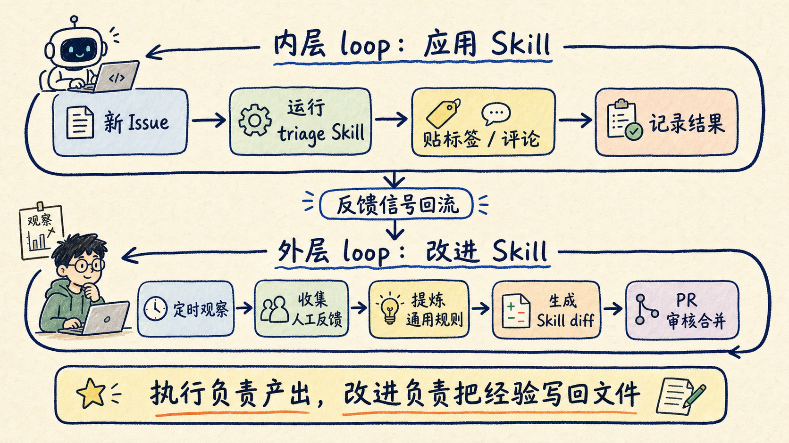
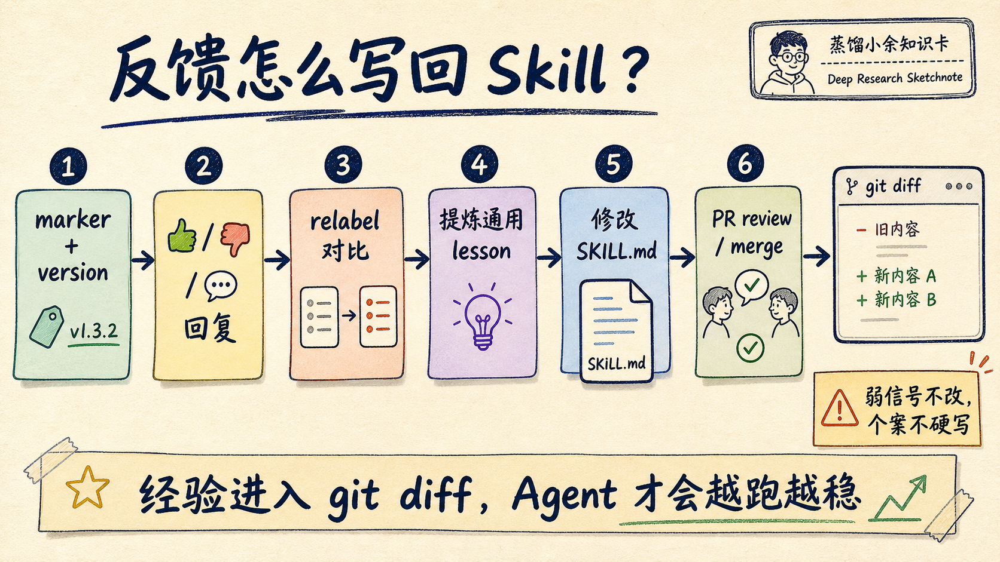

# Agent 为什么总学不会？把反馈写回 Skill

Agent 总学不会，常常不是模型不够聪明，而是每次纠错都停在聊天记录、Slack 讨论、Issue 评论里，没有回到下一次 Agent 会读取的执行规则。

Zach Lloyd 最近写了一篇 X Article，标题是 [How to build a self-improvement loop for your Skills](https://x.com/zachlloydtweets/status/2066908445425496348)。它有意思的地方不在于又发明了一个新名词，而是把“自我改进 loop”讲成了一个能落地的工程结构：一个 Agent 负责用 Skill 干活，另一个 Agent 负责观察它干得怎么样，然后把有价值的反馈改写回 Skill 文件。

换句话说，Agent 的进步不应该只是“这次我知道错了”。更可靠的路径是：错误被记录，反馈被归因，经验被提炼，Skill 产生 diff，最后经过人类审核合并。

这样下一次 Agent 再执行时，读到的不是旧说明书，而是被真实反馈改过的新说明书。

## loop 不是让 Agent 原地打转

现在很多人谈 Agent loop，容易把它理解成一个 while 循环：模型规划一步，执行一步，再看结果，再规划一步。

这种循环当然有用，但 Zach 这篇文章讨论的不是“单次任务怎么跑完”，而是“一个能力怎么越用越好”。

这里要分清两层：

第一层是执行 loop。比如有一个 issue triage Skill，每当 GitHub 新建 issue，云端 Agent 就读取 issue 内容，把它分到 `ready-to-implement`、`duplicate`、`needs-info` 三个桶里，并贴标签、发评论。

第二层是改进 loop。另一个 Agent 定期观察这些 triage 结果：维护者有没有把标签改掉？有没有点 👎？有没有回复说“这不是 duplicate”或者“这个其实缺少复现信息”？如果反馈足够明确，它就把经验提炼成新的 Skill 规则，提交一个 PR。

这两层不能混在一起。执行 loop 关心的是“这次 issue 怎么处理”；改进 loop 关心的是“过去一批处理结果说明 Skill 哪里该改”。

如果不拆开，反馈很容易变成零散噪音。人类纠正了 Agent，Agent 当场道歉，下一次还是照旧。

## 为什么 Skill 适合做自我改进的载体

Zach 的关键判断是：Skills are just files。

这句话很朴素，但工程含义很重。Skill 如果只是口头经验，Agent 没法稳定继承；Skill 如果是一个版本化文件，就可以被 review、被 diff、被回滚、被审计。

示例仓库 [warpdotdev-demos/issue-triage-loop](https://github.com/warpdotdev-demos/issue-triage-loop) 里，`triage-issue` Skill 不是泛泛地说“请你判断一下 issue”。它把动作拆得很硬：

1. 读取 issue。
2. 搜索潜在重复 issue。
3. 只能选择一个桶：`ready-to-implement`、`needs-info`、`duplicate`。
4. 确保标签存在。
5. 贴上唯一标签。
6. 发一条 triage 评论。

评论里还有一个隐藏标记：`<!-- oz-triage v:<N> -->`。

这个标记不是装饰。它解决了一个真实问题：外层 Agent 需要知道“这条判断是哪个版本的 Skill 做出的”。没有版本归因，就很难判断某次错误是旧规则造成的，还是新规则已经修过但仍然不够。

这也是很多 Agent 记忆系统容易失败的地方。它们只记“用户不满意”，却不知道不满意对应哪条规则、哪次运行、哪个版本。

## 反馈要先结构化，才能变成改进

在这个方案里，人类反馈不是一句“下次注意”。反馈被设计成可观察信号。

维护者可以做几类动作：

- 对 triage 评论点 👍 或 👎。
- 直接回复纠正理由。
- 把 Agent 贴的标签从 `ready-to-implement` 改成 `needs-info`。
- 对 duplicate 判断做保留或否定。

外层的 `improve-triage-skill` Skill 会收集这些信号。它不只看 reactions，也会看评论、当前标签、label drift 和 duplicate accuracy。

这里有一个特别值得抄的规则：信号弱或者互相冲突时，不改。

自我改进听起来很酷，但最危险的失败模式就是过拟合。一个用户抱怨一句，Agent 就把 Skill 改成迎合个案；下一次遇到相似但不同的问题，规则反而更差。

所以外层 Agent 的任务不是“把所有反馈写进去”，而是只提炼可泛化 lesson。比如：

> crash 报告如果缺少 OS / version 信息，两次被维护者从 ready-to-implement 改成 needs-info，那就把“崩溃问题需要环境信息”写进 Skill。

这类规则能服务未来一类问题，而不是只修补某个 issue。

## 真正的闭环，要经过 PR

这套方案最克制的地方，是外层 Agent 不直接改 main。

它生成的是 Skill improvement PR。PR 里应该解释看了哪些 issue、观察到哪些反馈、提炼了哪些 lesson、具体改了 `SKILL.md` 哪些内容，以及版本号怎么从 v1 变成 v2。

人类 review 之后，合并才生效。

这一步让“Agent 自我改进”从玄学变成了普通软件工程：

- 有输入：过去的运行记录和反馈。
- 有判断：哪些反馈足够强，哪些只是噪音。
- 有输出：对 Skill 文件的 diff。
- 有闸门：PR review。
- 有历史：git 记录能追溯每次能力变化。

如果没有 PR 闸门，自我改进很容易变成自我污染。Agent 会把偶然反馈写成永久规则，也可能把错误理解带入后续任务。

把改进放进 PR，不是保守，而是让能力变化有证据、有责任边界、有撤销路径。

## 这个模板不只适合 issue triage

Zach 用 issue triage 做例子，是因为它的反馈信号很清楚：标签对不对，维护者有没有改，评论里有没有纠正。

同一个结构可以迁移到其他 Skill：

- code review Skill：看人类是否采纳评论、是否反驳建议、是否要求重审。
- bug fixing Skill：看 PR 是否通过测试、review 是否指出根因不对、修复是否被 revert。
- incident response Skill：看分级是否被调整、时间线是否补充、runbook 是否缺步骤。
- 文档生成 Skill：看编辑是否大量改写结构、是否补充遗漏事实、是否删除幻觉内容。

迁移时不要先问“能不能让 Agent 自己优化”。先问四个更工程的问题：

1. 运行记录在哪里？
2. 反馈信号是什么？
3. 哪些反馈算强证据？
4. 改进结果能不能以 diff 形式进入 review？

这四个问题答不出来，就不要急着上 self-improvement loop。

## 我会怎么用这套方法

如果要在自己的团队里落地，我会先选一个低风险、高频、有明确反馈的 Skill。

issue triage 是好例子，因为它影响协作效率，但不直接改业务代码。文档初审、PR 摘要、客服问题分类、运行日志归因，也都适合。

第一版不需要复杂：

1. 让 Skill 每次输出都带版本号和运行 ID。
2. 把结果写到一个可查询的位置，比如 issue comment、review comment、trace 文件或数据库。
3. 设计两三种人类反馈动作，不要一开始就做复杂评分表。
4. 外层 Agent 每天或每周跑一次，只提炼强信号。
5. 所有 Skill 改动走 PR。

这条链路跑通以后，再考虑自动 grader、更多指标和更细粒度的评估。

Agent 工程里，最值钱的不是让模型“记住更多”，而是让经验进入下一次执行路径。Skill 自我改进 loop 的价值就在这里：它把反馈从一次性纠错，变成可审计、可合并、可回滚的能力更新。

下次 Agent 又犯同一个错时，不要只在对话里纠正它。去看那条反馈有没有回到 Skill。没有写回执行规则的经验，通常不算真正学会。

---

参考材料：

- [Zach Lloyd 的 X Article：How to build a self-improvement loop for your Skills](https://x.com/zachlloydtweets/status/2066908445425496348)
- [示例仓库：warpdotdev-demos/issue-triage-loop](https://github.com/warpdotdev-demos/issue-triage-loop)
- [Oz Agent Action README](https://github.com/warpdotdev/oz-agent-action)
- [Oz for OSS README](https://github.com/warpdotdev/oz-for-oss)
