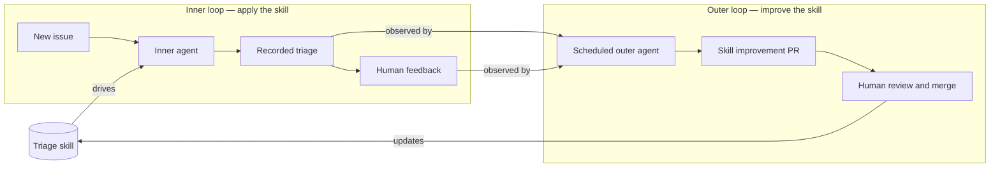

# issue-triage-loop

A demo of a **skill-based self-improvement loop** built on GitHub issues and [Oz cloud agents](https://docs.warp.dev/agent-platform/cloud-agents/overview).

An agent triages every new issue using a versioned skill. Humans react to its triage decisions (reactions, replies, relabels). A second agent periodically studies that feedback and proposes improvements to the triage skill — via a pull request that humans review. The skill gets better over time, with full audit history in git.

## How the loop works



### Components

| Path | Role |
| --- | --- |
| `.agents/skills/triage-issue/SKILL.md` | Triages a single issue into `ready-to-implement`, `needs-info`, or `duplicate`; posts a comment with a hidden `<!-- oz-triage v:<N> -->` marker and a feedback footer. Carries a version number and a `## Learned guidelines` section. |
| `.github/workflows/triage-new-issues.yml` | Runs the triage skill via [`oz-agent-action`](https://github.com/warpdotdev/oz-agent-action) whenever an issue is opened. |
| `.agents/skills/improve-triage-skill/SKILL.md` | Run by an Oz cloud agent. Finds recent triage comments, measures feedback (reactions, correction replies, label drift), synthesizes generalizable lessons, edits the triage skill, bumps its version, and opens a PR. |
| `scripts/seed-issues.sh` | Creates five sample issues covering all three buckets to drive a demo. |

### Why it works as a loop

- The **marker + version** in every triage comment lets the improver find past decisions and attribute them to a specific skill revision.
- **Maintainer relabels are ground truth**: if the bot says `ready-to-implement` and a human relabels to `needs-info`, that's a strong training signal.
- The improver only writes **generalizable guidelines** (never one-off fixes), keeps the guidelines list bounded, and makes **no change** when signals are weak.
- Improvements land as **PRs, never direct commits** — humans stay in the loop on skill evolution.

## Setup

1. **Warp API key** — generate one in Warp settings (Platform page) and add it as a repo secret:
   ```sh
   gh secret set WARP_API_KEY --repo warpdotdev-demos/issue-triage-loop
   ```
2. **Oz environment** — create a cloud environment that checks out this repo (used by the improver agent). See `oz-dev environment create --help`.
3. **Schedule the improver** — run it weekly:
   ```sh
   oz-dev schedule create --cron "0 9 * * 1" \
     --name "Improve triage skill" \
     --prompt "Run the improve-triage-skill skill on warpdotdev-demos/issue-triage-loop" \
     --environment <ENV_ID>
   ```

## Demo walkthrough

1. Seed the sample issues (the workflow must already be on `main`):
   ```sh
   scripts/seed-issues.sh
   ```
   Expected triage: #1 and #2 → `ready-to-implement`, #3 and #4 → `needs-info`, #5 → `duplicate` of #1.
2. Watch the `Triage new issues` workflow runs label each issue and post triage comments.
3. Give feedback: react 👍/👎 on a couple of triage comments, reply with a correction, or swap a bucket label (e.g. relabel #2 from `ready-to-implement` to `needs-info`).
4. Run the improver on demand instead of waiting for the schedule:
   ```sh
   oz-dev agent run-cloud --environment <ENV_ID> \
     --skill "warpdotdev-demos/issue-triage-loop:improve-triage-skill"
   ```
5. Review the PR it opens: observed feedback, lessons learned, and the exact edits to `triage-issue/SKILL.md` (including a version bump). Merge it and the next issue is triaged with the improved skill.
