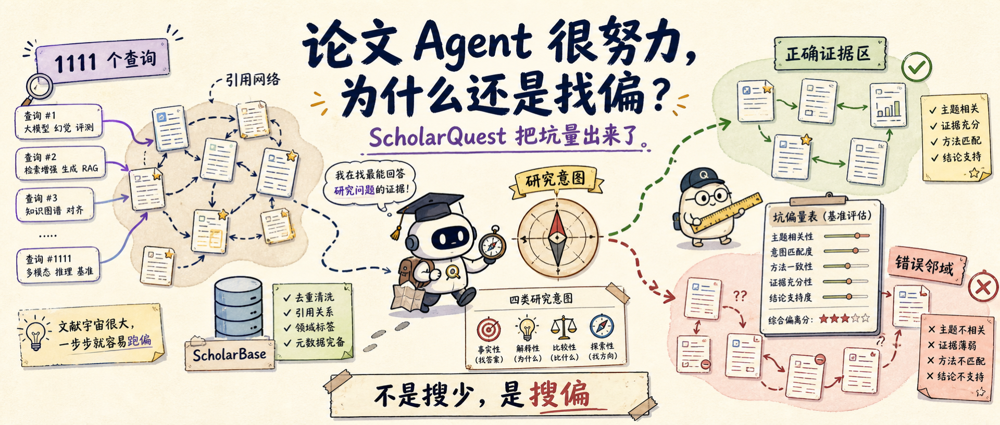
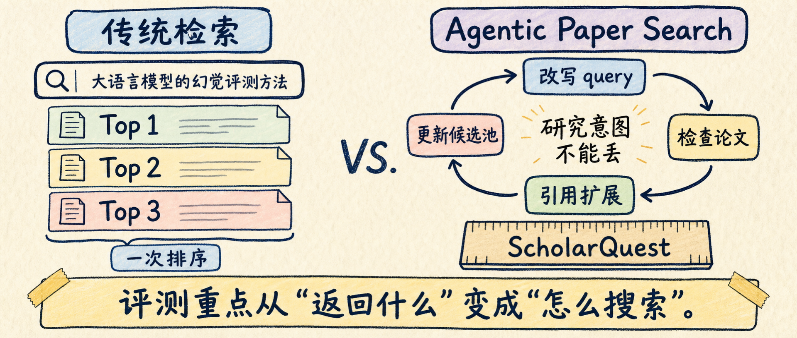
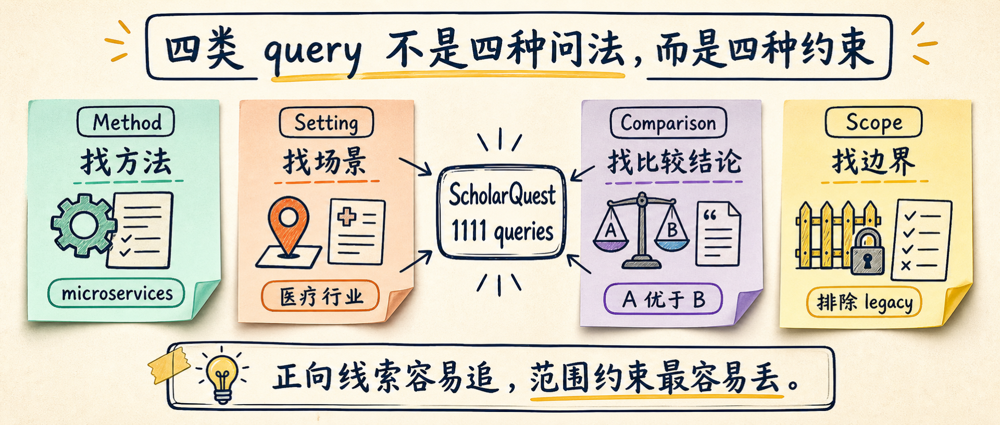
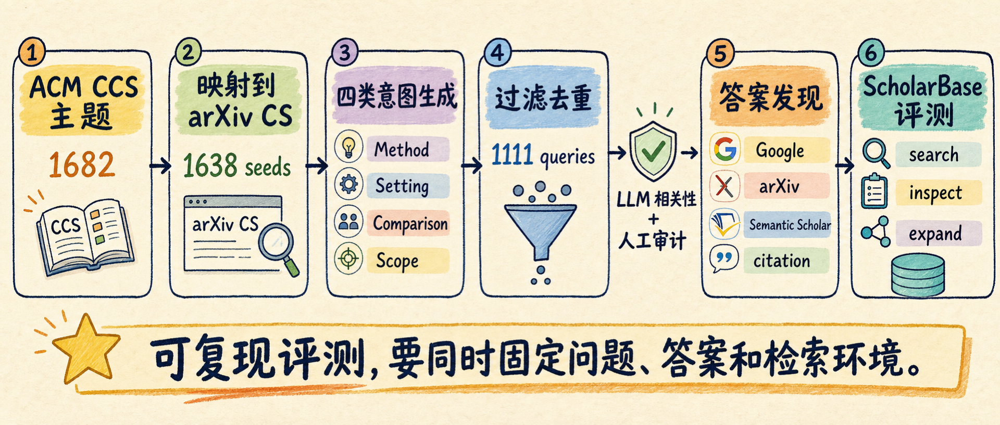
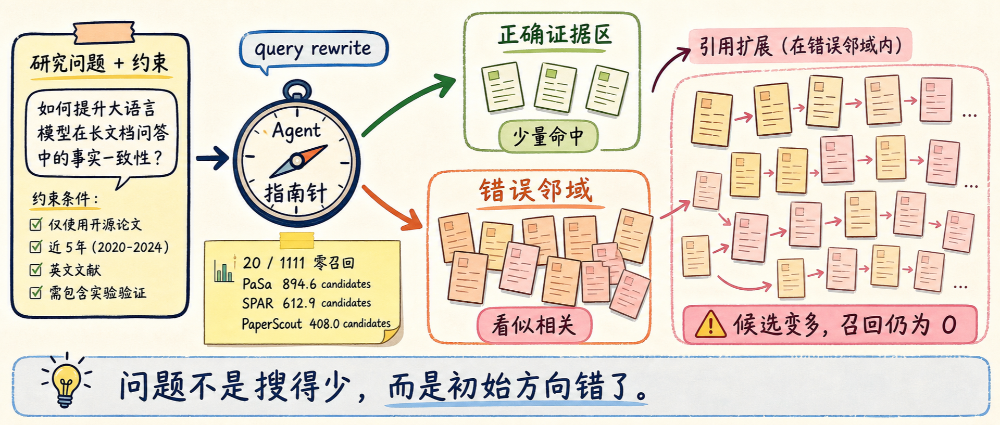

# 论文 Agent 很努力，为什么还是找偏？ScholarQuest 量出来了

你让 Deep Research 帮你找一组论文。它很快给出十几篇引用，摘要写得也顺，甚至还能解释每篇为什么相关。

最麻烦的地方在这里：你抽查两篇以后发现，它不是没搜索，而是从第一轮 query rewrite 开始就偏了。后面越搜索、越扩引用、越总结，反而越像在错误方向上堆证据。

我读 ScholarQuest 最大的收获就是这个：论文搜索 Agent 的风险，不在“会不会调用搜索工具”，而在“多轮搜索以后，它还记不记得自己到底要找什么”。

这篇 2026 年 6 月 18 日提交到 arXiv 的论文，专门把这个问题做成 benchmark。它给 Agent 一个研究问题，让它多轮搜索、检查论文、沿引用扩展，最后交出一组相关论文。

结果挺冷静：最好的 PaperScout 把整体 Recall@100 从最强非 Agent baseline 的 0.214 提到 0.314，相对提升 46.7%。Agentic search 确实有用，但离“放心交给它做文献调研”还差一段。

## 别只看第一屏，研究任务会变形

传统学术搜索像一次排序题：输入 query，返回 ranked list。

BM25、embedding 检索、hybrid retrieval 都适合这种问题。关键词明确时，它们快，也够用。

但研究者经常问的不是一个关键词。

比如这四个问题：

- 哪些论文研究了“基于 microservices 的 IT architecture”？
- 哪些论文在“医疗行业语境”下评估 IT architecture？
- 哪些论文声称 microservices 架构优于 monolithic designs？
- 我想找 IT architecture 论文，但排除 legacy systems 范围。

表面都在说 IT architecture，实际搜索动作完全不同。

第一个要抓方法，第二个要守场景，第三个要识别比较 claim，第四个要记住排除边界。

如果 Agent 只把它们揉成一个相似度检索问题，第一屏看起来会很相关，后面就开始偏。

所以 ScholarQuest 评测的不是“哪个搜索框更像 Google Scholar”，而是论文搜索 Agent 能不能在多轮探索里守住研究意图。

这对做 Deep Research 产品的人很现实。报告最后写得流畅，不代表前面的候选论文池是对的。

## ScholarQuest 先把题目做成可诊断对象

我喜欢这篇论文的一点，是它没有随便收一堆用户 query 然后开始跑榜。

它先从 ACM Computing Classification System 收集主题，再映射到 arXiv 的 CS 分类。正文说覆盖 1000+ 计算机主题，附录给了更细数字：从 1682 个 ACM CCS topic 出发，保留 1638 个 CS topic seed，最后经过去重和质量过滤，得到 1111 个高质量查询。

每个主题会被改造成四类研究意图：

| 意图类型 | 读者可以理解成 | 最容易丢的东西 |
|---|---|---|
| Method-oriented | 找使用某种方法的论文 | 方法同义词 |
| Setting-anchored | 找特定场景下的论文 | 场景限定 |
| Comparison-based | 找支持某个比较结论的论文 | claim 方向 |
| Scope-controlled | 找满足范围限制的论文 | 排除条件和边界 |

这个分类很有工程味。

因为一旦 Agent 失手，你能问得更具体：它是没识别方法，没守住场景，没看懂比较结论，还是把负约束弄丢了？

GitHub 仓库里也放出了数据：`ScholarQuest.jsonl` 有 1111 条最终 benchmark 查询，`query_metadata.jsonl` 有 13097 条生成和去重后的 query metadata。README 还写明，最终数据集保留的是有 5 到 200 个相关答案的查询。

这点要单独拎出来。论文搜索不是问答题，很多研究问题对应的是一组论文，不是一篇标准答案。

## 同一个考场，分数才有解释力

Agent benchmark 最怕环境不统一。

一个系统接 Google Scholar，一个系统接私有索引，另一个系统还能用额外 citation API。分数出来以后，你很难判断：到底是 Agent 策略好，还是工具更强。

ScholarQuest 把环境也一起做了。它提供 ScholarBase 作为统一检索后端，基于 S2 PaperData 快照保留 arXiv 论文、摘要、元数据和引用关系。仓库 README 提到，本地部署的 Lewen API 大约覆盖 300 万篇 arXiv 论文。

ScholarBase 支持几类动作：

- sparse retrieval：基于 SQLite FTS5 的 BM25。
- dense retrieval：基于 BGE-M3 的标题-摘要 embedding。
- hybrid retrieval：用 RRF 合并 sparse 和 dense 排名。
- paper inspection：查论文元数据和详情。
- citation/reference traversal：沿引用和参考文献扩展。

这样 PaSa、SPAR、PaperScout 这些 Agentic 方法，以及 Dense、Hybrid、Google Search、Google Scholar、Semantic Scholar、DeepXiv 等 baseline，至少是在同一套答案和相近检索目标下比较。

我的判断是：ScholarQuest 最有用的部分不是排行榜，而是它把搜索过程也记录下来。

它看 tool calls、rounds、observed candidates，也看每 100 个候选换来多少 Recall@100。对做 Agent 的人来说，这比一句“召回率更高”有用得多。

## PaperScout 赢了，但不能只看赢了

主表里最关键的一组数字，是整体 Recall@100。

| 方法 | Overall Recall@100 |
|---|---:|
| Dense Retrieval | 0.208 |
| Hybrid Retrieval | 0.214 |
| PaSa | 0.281 |
| SPAR | 0.270 |
| PaperScout | 0.314 |

PaperScout 的成绩最好。论文也明确说，它把 R@100 从 0.214 提到 0.314，相对提升 46.7%。

但我不会把这组数字解读成“Agent 已经能稳定做论文搜索”。

0.314 反而提醒我们：多轮搜索、引用扩展、自主工具调用确实能抬高召回，但还没有把开放文献搜索变成可靠能力。

效率分析更值得看。

PaSa 平均 60.1 次工具调用，其中 55.1 次是 expansion，观察 744 个候选，Recall@100 per 100 candidates 只有 0.051。

SPAR 平均 47.1 次工具调用，观察 515 个候选，效率是 0.064。

PaperScout 平均 9.2 轮交互，15.3 次 search call，19.0 次 expansion，观察 408 个候选，效率达到 0.120。

这给工程实现一个很直接的提醒：搜索 Agent 不是越忙越好。

更好的路线，是让每一次 search 和 expansion 都服务于当前研究意图，而不是把候选池越滚越大。

## 最容易翻车的是负约束

四类意图里，scope-controlled 最难。

它要求 Agent 一边找相关主题，一边保住排除条件、范围限制和细粒度边界。人类读起来不复杂，Agent 多轮改写 query 时很容易漏。

论文里的 scope-controlled R@100 很直观：

| 方法 | Scope-controlled R@100 |
|---|---:|
| Google Search | 0.006 |
| Google Scholar | 0.010 |
| PaSa | 0.193 |
| SPAR | 0.188 |
| PaperScout | 0.182 |

Agent 比传统搜索好很多，但这仍然是所有类别里最弱的一档。

原因很朴素：正向线索容易追，负向边界难保存。

“找使用强化学习做视频摘要的论文”是一类任务。

“找某类论文，但排除某个范围、不要某类方法、只保留某个语境”是另一类任务。

后一类需要 Agent 在每次 query rewrite、citation expansion、candidate filtering 时重新检查约束。

如果没有显式的 constraint ledger，负约束很容易在多轮工具调用里被磨掉。

## 搜偏以后，扩引用会放大错误

论文里最刺眼的一段，是 failure analysis。

共同零召回失败只有 20 个查询，占 1111 个查询的 1.80%。比例不高，但很能说明问题。

这些失败查询里，PaSa 平均观察 894.6 个候选，SPAR 是 612.9，PaperScout 是 408.0。结果三个 Agent 都没有召回任何金标准答案。

这就是开放文献搜索里最危险的一类失败。

一开始的 query rewrite 偏向了一个语义相似、但约束错误的方向。后续检索会返回一批看起来相关的论文。Agent 再沿这些论文的引用关系扩展，就会拿到更多同一邻域里的论文。

候选池变大了，证据看起来变多了，但离正确答案没有更近。

用户最难发现的也是这种失败。报告有引用、有表格、有顺滑叙述，只是底层证据空间从第一步就歪了。

## 我会给研究 Agent 加这张清单

如果把 ScholarQuest 的结论带回自己的 Deep Research 或论文搜索 Agent，我会先加一张“防搜偏清单”。

| 检查项 | 我会怎么做 | 防的是什么 |
|---|---|---|
| 意图拆字段 | 把 topic、method、setting、comparison claim、scope boundary、negative constraints 分开存 | query 越改越泛 |
| 负约束置顶 | 每轮搜索和候选过滤前重读 negative constraints | 排除条件被磨掉 |
| 轨迹留证据 | 记录每次 search 的理由、query 来源、扩展 seed | 事后无法诊断 |
| 早停信号 | 候选池变大但都来自同一主题邻域时暂停 | 在错误邻域里加速 |
| 写作前冻结候选 | 先找全、去重、过滤，再交给写作阶段 | 边找边写把早期错误写成主线 |

这张表比“让 Agent 多搜几轮”更有用。

我愿意让 Agent 多查论文，但不会让它在没有约束账本的情况下自由扩引用。

尤其是 scope-control 任务，我会强制它在每轮工具调用前回答两个问题：

1. 这次搜索保留了哪些正向意图？
2. 这次搜索有没有破坏原来的负约束？

回答不出来，就不要继续 expansion。

## 这篇论文也别神化

ScholarQuest 做得扎实，但它不是终局答案。

第一，它主要覆盖计算机科学主题，而且是 arXiv-grounded 的开放文献环境。医学、法律、社科、专利、工业报告，不在同一个分布里。

第二，相关性判断主要基于标题、摘要和元数据，不是全文证据。这样能规模化，但遇到只藏在正文里的细粒度 claim，仍然可能漏。

第三，答案集是自动构造加人工审计，不是穷尽式人工标注。论文的人审结果不错：最终高置信正例有 86.0% strict precision 和 98.7% relaxed precision。但开放文献环境里，漏标风险永远存在。

所以我更愿意把 ScholarQuest 当成诊断台，不当成终局排行榜。

它让我确认了一件事：论文搜索 Agent 的瓶颈，不只是模型聪不聪明，而是有没有把“研究意图保持”做成可检查的工程对象。

如果你的 Agent 只是“多搜几次、多扩展几篇引用”，它可能会变得更忙，不会变得更准。

下次你评测自己的 Deep Research Agent，可以先拿上面那张清单过一遍。尤其看三件事：负约束有没有单独存，搜索轨迹能不能复盘，写报告前候选池有没有冻结。

想让我把这张“防搜偏清单”改成可直接塞进 Agent prompt / eval case 的版本，可以在后台回「搜偏清单」。

原论文：https://arxiv.org/html/2606.20235v1

代码与数据：https://github.com/pty12345/ScholarQuest
