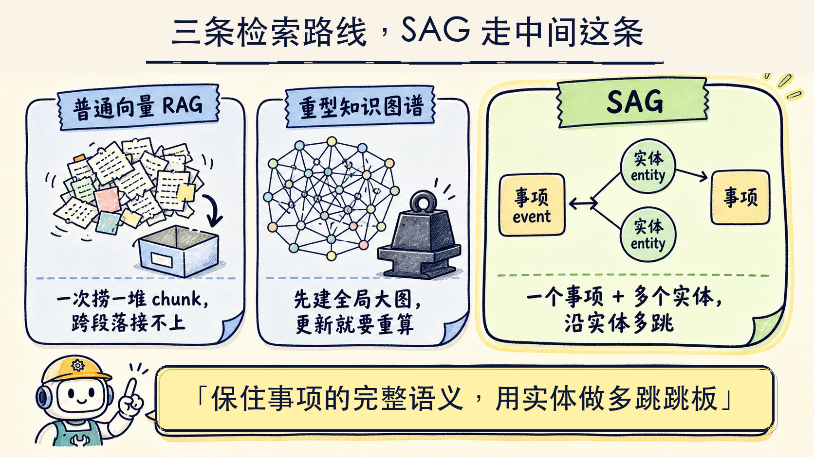
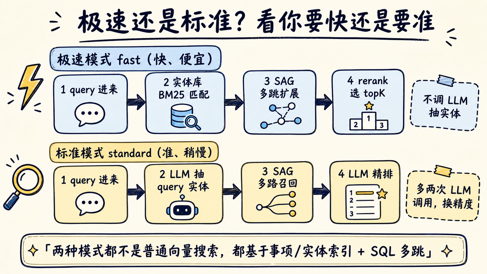
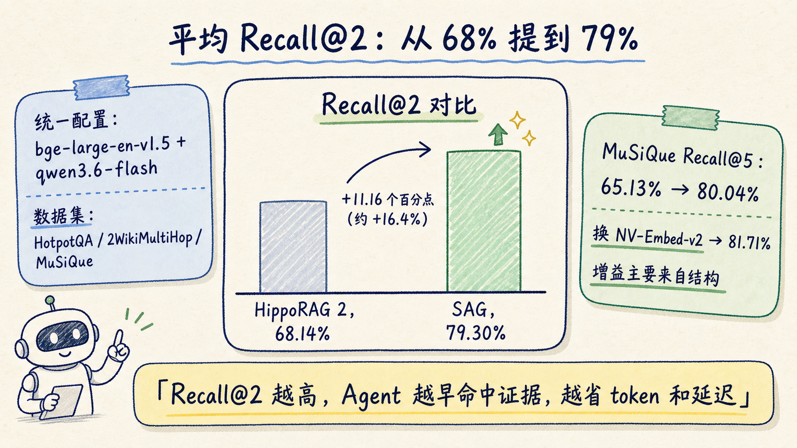
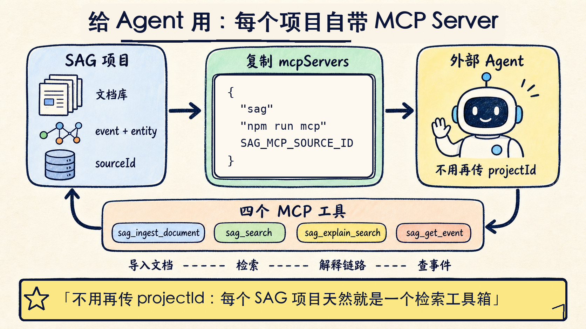

做过 RAG 的人大概都遇到过同一种卡点：问一个需要"绕两步"才能回答的问题，检索就开始失灵。

比如"写《XX》的作者出生在哪个国家"，模型得先找到"作者是谁"，再找到"这个人出生在哪"。普通向量检索一次只会把和问题字面最像的 chunk 捞回来，结果第一跳的线索和第二跳的答案常常不在同一个 chunk 里。于是大家的本能反应是：把 topK 调大，把更多 chunk 塞进上下文，指望模型自己拼出来。塞得越多，噪声越多，token 越贵，首 token 越慢，模型反而更容易被无关内容带偏。

[SAG](https://github.com/Zleap-AI/SAG) 给的是另一条路。它是 Zleap-AI 开源的一个文档检索工作台（TypeScript 全栈，MIT 协议，截至 2026-06-25 GitHub 上 1,618 star），做法可以压成一句话：不靠堆 chunk，而是把文档重新组织成"事项 + 实体"的轻结构，让检索能从命中的一条事项出发，沿着实体关系多跳走下去。在 HotpotQA / 2WikiMultiHop / MuSiQue 三个多跳问答数据集上，它把平均 Recall@2 从 HippoRAG 2 的 68.14% 提到了 79.30%。

下面把它的原理和用法拆开讲。



## 多跳检索难在哪，重型知识图谱又贵在哪

先说清楚 SAG 想替代的是什么。

普通向量 RAG 的问题前面说了：它更像"一跳"检索，靠相似度一次性捞 chunk，跨文档、跨段落的关系它不认。多跳问题里，证据天然散在好几个 chunk 里，相似度高的那个 chunk 不一定是答案所在。

那把关系显式建出来不就行了？这正是 GraphRAG、HippoRAG 这类"知识图谱 RAG"的方向：先用大模型把整个语料抽成实体和关系的大图，检索时在图上游走。思路对，但代价不小。建一张覆盖全语料的知识图谱，要对每段文本反复调用 LLM 抽三元组，成本高、耗时长；更麻烦的是数据一更新就得重算，动态语料下这个全局重建几乎扛不住。

SAG 的判断是：多跳能力需要的是"局部能接上关系"，不是"先建一张完整的全局大图"。所以它砍掉了重型图谱的全局重建成本，只保留够用的那部分结构。

## 原理拆开看：chunk → event，chunk → entities，event ↔ entities

SAG 的结构可以写成三行：

```text
chunk  -> event      # 每个切片抽出一个完整事项
chunk  -> entities   # 每个切片抽出多个实体
event <-> entities   # 事项和实体互相挂钩
```

拆开解释一下这三行各自负责什么。

**event（事项）负责"保住完整语义"。** 每个 chunk 会被抽成一个完整的事项——它不是关键词，而是一句保留了主语、动作、对象的完整陈述。检索最后要喂给模型的，是这种成块的、自带上下文的语义单元，而不是被切碎的实体词。这一步保证了召回回来的东西是"能读的证据"，不是一地碎片。

**entities（实体）负责"建索引和搭桥"。** 同一个 chunk 还会抽出多个实体，实体是轻量的、可被精确匹配的节点。它们干两件事：一是当索引入口，让 query 能快速命中；二是当跳板，因为同一个实体会出现在不同的事项里，顺着它就能从一条事项跳到另一条相关事项。

**event ↔ entities 这条双向关系，就是"多跳"发生的地方。** 检索从命中的事项出发，找到它挂着的实体，再顺着这些实体找到别的事项，一跳一跳走下去。论文里把这层叫 query-time dynamic hyperedges：不是提前维护一张静态全局图，而是在查询发生时，用 SQL join 把共享实体的事项临时连成局部结构。

对比一下就清楚了：普通 RAG 是"一次捞一堆 chunk"，重型 GraphRAG 是"先建全局大图再游走"，SAG 是"保留事项的完整语义，用实体做轻量的多跳跳板"。它落在两者中间，拿到了多跳能力，又躲开了全局重建的成本。论文还提到，这种基于标准数据库基础设施的设计更适合增量写入、并发处理和动态语料；项目是否能扛住你的生产负载，仍然要用自己的数据压一遍。

## 检索怎么跑：极速模式和标准模式

SAG 提供两种检索模式，区别主要在"要不要让 LLM 参与"。



**极速模式（fast）**：直接拿 query 在实体库里做全文 / BM25 匹配命中入口，再用 SAG 的多跳扩展把相关事项捞出来，最后用 rerank 模型（默认示例是 `qwen3-rerank`）选 topK。这条链路全程不调 LLM 抽 query 实体，也不用 LLM 过滤候选，所以快、便宜，适合在线检索和 Agent 高频调用。

**标准模式（standard）**：先用 LLM 把 query 里的实体抽出来，再走 SAG 多路召回，最后用 LLM 做精排。多了两次 LLM 调用，换来更高的精度，适合离线或者对召回质量要求高的场景。

要记住的一点是：这两种模式都不是普通向量搜索。它们都建立在 SAG 的 event / entity 索引和 SQL 多跳扩展之上，向量只是其中一环，不是全部。

## 实测：多跳召回比 HippoRAG 2 高了一截

光讲结构容易空，看数字。

SAG 在三个标准多跳问答数据集上做了对比，配置是统一的：Embedding 用 `bge-large-en-v1.5`，LLM 用 `qwen3.6-flash`，数据集是 HotpotQA / 2WikiMultiHop / MuSiQue。复现代码作者单独开了个仓库 [SAG-Benchmark](https://github.com/Zleap-AI/SAG-Benchmark)。



几个关键数字：

- **平均 Recall@2 从 68.14% 提到 79.30%**，提升 11.16 个百分点，相对提升约 16.4%。
- **MuSiQue 的 Recall@5 从 65.13% 提到 80.04%**；把 embedding 换成更强的 NV-Embed-v2 后进一步到 81.71%。

第二组数字其实更值得看。换 embedding 只是锦上添花，主要增益来自结构本身，说明这套 event / entity 设计是吃到了真东西，不是靠一个更贵的向量模型撑起来的。

为什么 Recall@2 高一截对 Agent 很重要？因为 Recall@2 高，意味着 Agent 在前两条结果里就能命中关键证据，不用把上下文撑大去赌。证据进来得早、进来得干净，token 成本、延迟和多轮任务里的干扰都会跟着降下来。对一个要反复检索的 Agent 来说，这是省钱省时间的地方。

> 提醒一句：这些数字来自项目自测，配置和评测口径都写在 README 和 benchmark 仓库里。要落到自己的语料上，建议用你真实的文档和问题重新跑一遍，别直接把别人的 benchmark 当成自己的结论。

## 基本使用：从克隆到第一次提问

SAG 本身是一个开箱即用的本地工作台，不只是一个库。上传 Markdown / TXT，它会自动完成切片、向量化、事项提取、实体提取和关系整理，然后你可以像用 ChatGPT 一样围绕这批文档提问，还能看到每一步的中间产物。

环境要求很常规：Node.js 20+、npm、PostgreSQL，以及 pgvector 扩展。

跑起来就这几步：

```bash
# 1. 克隆项目
git clone https://github.com/Zleap-AI/SAG.git
cd SAG

# 2. 复制配置文件（默认配置已经填好，真实使用时换成自己的 API Key）
cp .env.example .env

# 3. 用 Docker 起 PostgreSQL（镜像已带 pgvector，省事）
docker compose up -d

# 4. 安装依赖并初始化数据库
npm install
npm run db:setup

# 5. 启动开发服务
npm run dev
# WebUI: http://localhost:5173
# API:   http://localhost:4173
```

模型这一侧，SAG 兼容 OpenAI-compatible 接口，Embedding、LLM、Rerank 都可以换成你自己的 provider。默认示例长这样：

```env
EMBEDDING_BASE_URL=https://api.302ai.cn/v1
EMBEDDING_MODEL=text-embedding-3-large
EMBEDDING_DIMENSIONS=1024

LLM_BASE_URL=https://api.302ai.cn/v1
LLM_MODEL=qwen3.6-flash

RERANK_MODEL=qwen3-rerank
DEFAULT_SEARCH_MODE=fast
```

如果你没填 API Key，系统会走一个本地 deterministic fallback，能把界面和流程跑通，但检索效果不作数——想看真实效果一定要配远程模型。

WebUI 打开后的第一次使用，大致是：新建项目 → 进「文档」页上传 `.md` / `.txt` → 等处理队列跑完 → 回「对话」页提问。值得点开看的是右侧的「搜索过程」面板和「原始日志」，它把 SAG 内部的检索链路、每一跳、以及 LLM / Embedding / Rerank 的原始请求都摊开了，调检索的时候这个比答案本身更有用。想看关系就进「图谱」页，实体和事项是可拖动、可展开的节点。

## 给 Agent 用：每个项目自带一个 MCP Server

SAG 对 Agent 场景的友好，体现在它把 MCP 接入做成了项目级的默认能力。

每个项目都会自动生成一份 `mcpServers` 配置，绑定当前项目 ID，外部 Agent 调用时不用再传 `projectId`。进「MCP」页直接复制那段 JSON 就能接：

```json
{
  "mcpServers": {
    "sag": {
      "command": "npm",
      "args": ["run", "mcp"],
      "env": { "SAG_MCP_SOURCE_ID": "当前项目ID" }
    }
  }
}
```

目前暴露的工具有四个，覆盖了"灌数据—检索—看链路—查详情"一条龙：

- `sag_ingest_document`：导入文档并完成切片、抽事项、抽实体、向量化。
- `sag_search`：对当前项目做 SAG 多路检索，返回内部 trace。
- `sag_explain_search`：返回检索链路说明和 trace，方便调试。
- `sag_get_event`：按事件 ID 查事件详情。

不想走 MCP，也有 HTTP API。创建项目、写入文档、检索、流式拿检索过程都有现成 endpoint，比如检索：

```bash
curl -X POST http://localhost:4173/api/search \
  -H 'Content-Type: application/json' \
  -d '{"query":"SAG 为什么适合多跳检索？","sourceIds":["项目ID"],"strategy":"multi","searchMode":"fast","topK":5,"returnTrace":true}'
```

`returnTrace: true` 会把内部检索链路一起返回，这点对调 Agent 的人很实用——你能看清它到底跳了哪几步、命中了哪些事项。



## 适合谁，最大的坑在哪

我会这样判断要不要上手 SAG：

**适合**：做项目文档问答、个人知识库检索、RAG / Agent 原型验证的人；尤其是被多跳问题、跨文档关联检索卡住，又不想为了一张全局知识图谱付重型建图成本的人。它还特别适合调检索——搜索过程和原始日志全摊开，比黑盒检索好 debug 太多。

**要掂量一下**：它依赖 PostgreSQL + pgvector，不是纯内存或纯文件方案，部署有一定门槛；真实检索效果强依赖你配的 Embedding / LLM / Rerank，fallback 模式只够看界面；目前文档输入主要是 Markdown / TXT，PDF、网页这类还得自己先转一道。

**最大的坑**是别把 README 里的 benchmark 直接当成自己语料上的结论。那组数字是在英文多跳问答数据集、特定 embedding 和 LLM 配置下跑出来的。中文语料、你自己的文档结构、换一套模型，结果都会变。正确姿势是拿 SAG 跑通流程后，用你真实的文档和真实的问题，自己测一遍 Recall 和延迟，再决定要不要用它替换现有检索。

如果你手上正好有一个被多跳问题拖慢的 RAG，或者在搭一个要反复检索文档的 Agent，值得把 SAG clone 下来，灌一批自己的文档，打开右侧的搜索过程面板看它怎么一跳一跳找答案。看明白它的检索链路，比记住"事项 + 实体"这个名词更有用。

建议收藏这三个判断，试 SAG 时直接照着看：你的问题是否真的需要多跳证据；前两条召回结果是否已经命中关键证据；trace 里每一次实体跳转是否能被人读懂。三条都过，再谈替换现有 RAG；三条不过，先调语料切分、模型配置和问题集。

---

**项目地址**：https://github.com/Zleap-AI/SAG ｜ Benchmark 复现：https://github.com/Zleap-AI/SAG-Benchmark ｜ 论文：https://arxiv.org/abs/2606.15971
