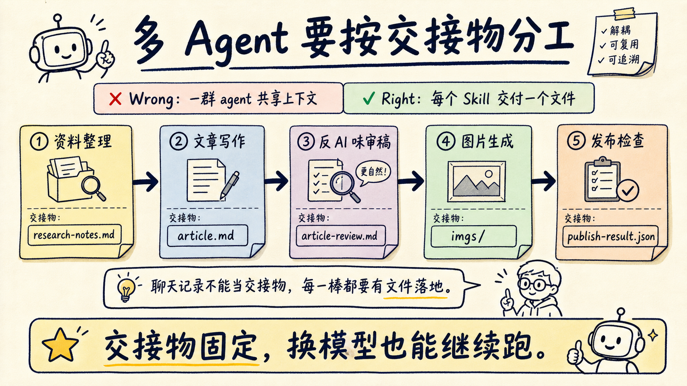
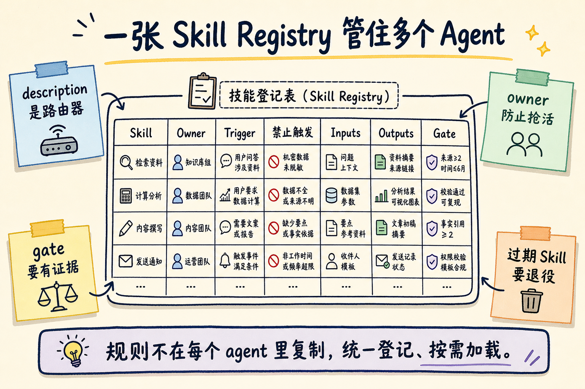

# 多 Agent 最大坑不在数量，而在 Skill 边界

多 Agent 协作最容易翻车的地方，不是 agent 不够多，而是每个 agent 都以为自己该管全局。

写作 agent 想顺手改发布流程，审稿 agent 想重写选题，图片 agent 开始判断文章结构，发布 agent 发现 frontmatter 不对又回头改正文。最后看起来每个 agent 都很努力，结果是上下文变脏、责任变糊、交接物消失。

我现在更愿意先管 `Skill`，再谈多 Agent 编排。

原因很简单：多 Agent 不是把一群模型放进同一个任务里，而是把一条工作流拆成多个可交接的岗位。Skill 的价值，就是把每个岗位的触发条件、输入材料、输出文件、验收标准写清楚。

小余判断：多 Agent 的管理对象不是 agent，而是 agent 之间的工作协议。

## 先别按人设分 Agent，要按交接物分

很多人做多 Agent，第一步会先起名字。

研究员、架构师、程序员、测试员、审稿人、发布员。

这听起来像一个团队，但实际运行时很容易失控。因为名字只说明“像谁”，没有说明“交什么”。

我更推荐从交接物反推 Skill。

比如一条公众号生产链路，可以拆成这样：

| 环节 | Skill 负责什么 | 交接物 |
|---|---|---|
| 资料整理 | 抓取源文、保留来源、补背景 | `research-notes.md` |
| 文章写作 | 选标题、搭结构、写主稿 | `article.md` |
| 反 AI 味审稿 | 查标题、第一屏、节奏、CTA | `article-review.md` |
| 图片生成 | 规划封面和插图提示词 | `imgs/` / `illustrations/` |
| 发布检查 | dry-run、渲染、推送草稿 | `publish-result.json` |

这张表比“研究 agent / 写作 agent / 图片 agent”更有用。

因为只要交接物固定，换哪个模型、哪个工具、哪个线程来执行，都不影响工作流继续往下跑。

小余判断：多 Agent 要稳定，先让每一棒都有一个文件落地。聊天记录不能当交接物。



## `description` 是路由器，不是宣传语

Skill 最容易写废的地方，是 `description`。

很多 Skill 的描述像这样：

```text
帮助管理多 Agent 工作流，提高协作效率。
```

这句话看着顺，其实没用。

Agent 读完不知道什么时候该触发，也不知道什么时候不该触发。结果是写文章时触发，发版时触发，问一个概念也触发。

好的 `description` 应该像路由规则：

```text
Use when a task requires coordinating multiple specialized agents or skills through explicit handoff artifacts. Use for defining agent roles, trigger boundaries, review gates, and shared workflow contracts. Do not use for single-agent one-off answers, simple prose edits, or generic project planning.
```

这里至少写清楚了三件事：

- 什么场景要用：多个 agent / skill 需要交接
- 具体管什么：角色、触发边界、评审门禁、工作协议
- 什么场景不要用：单 agent 简单回答、普通改文案、泛泛规划

多 Agent 管理里，负面触发条件尤其重要。

因为 agent 最擅长“热心”。只要描述写得宽，它就会在不该出场的时候出场。

## 公共规则只放一处，别让每个 Skill 各写一遍

多个 agent 用久了，还有一个典型问题：规则开始复制。

每个 Skill 都写一遍：

- 不要改无关文件
- 跑测试再说完成
- 不要覆盖用户改动
- 输出要有证据
- 公众号正文不要加相关阅读

短期看很保险，长期会制造冲突。

某个 Skill 更新了，另一个没更新。一个说“直接发布”，另一个说“先 dry-run”。一个要求文章里加来源段，另一个要求来源只放 frontmatter。Agent 同时读到这些规则时，就会开始猜。

我的做法是分三层：

第一层，项目长期规则放 `AGENTS.md`。

比如这个知识库里，哪些目录是 raw，哪些是 outputs，wiki 怎么写，frontmatter 只能增不能改，这些都应该是项目规则。

第二层，跨任务的能力规则放 Skill。

比如“公众号文章怎么审稿”“图片生成用什么风格”“发布前怎么 dry-run”，这些适合写成独立 Skill。

第三层，单次任务约束放用户 prompt。

比如“这篇不配图”“这次只写草稿不发布”“尽量保留原图”，这些不应该沉进永久 Skill。

小余判断：共享规则越多，越要有一个源头。多 Agent 协作怕的不是规则少，而是同一条规则有五个版本。

## 每个 Skill 都要有 owner，不然会互相抢活

管理多个 Skill 时，我会给每个 Skill 写一个“owner 边界”。

不是说谁拥有这个文件，而是说它拥有工作流里的哪一段。

比如：

```text
create-wechat-article
Owner: 从源材料到可发布公众号主稿的生产链路。
Output: article.md / article-anti-ai.md / image prompts / rendered html。
Not owner: 账号增长复盘、历史数据分析、长期选题策略。
```

再比如：

```text
xiaoyu-wechat-article-reviewer
Owner: 标题、第一屏、AI 味、结构、可保存资产、CTA。
Output: review note + optimized draft。
Not owner: 事实调研、图片生成、公众号 API 发布。
```

这类边界写清楚以后，agent 就不容易越权。

审稿 Skill 可以指出“这篇缺少可保存清单”，但不应该自己去查一堆新资料；发布 Skill 可以检查 frontmatter 和图片路径，但不应该重写全文风格。

小余判断：Skill 之间要像微服务一样有接口，不要像会议室里所有人一起改同一份文档。

## 我现在用这张表管理多个 Agent / Skill

如果你已经有 5 个以上 Skill，我建议直接建一个 `skill-registry.md`。

不用复杂，先写这 7 列：

| 字段 | 要回答的问题 |
|---|---|
| Skill | 叫什么 |
| Owner | 它负责哪段工作 |
| Trigger | 什么情况下必须触发 |
| Negative Trigger | 什么情况下禁止触发 |
| Inputs | 它需要读什么 |
| Outputs | 它必须产出什么 |
| Gate | 通过的证据是什么 |

可以写成这样：

```md
| Skill | Owner | Trigger | Negative Trigger | Inputs | Outputs | Gate |
|---|---|---|---|---|---|---|
| article-reviewer | 公众号审稿 | 蒸馏小余稿件发布前 | 普通翻译、非技术文案 | article.md | article-review.md / article-anti-ai.md | ai_smell_hits 为空或有解释 |
| image-cover | 封面和插图 | 用户要求配图或发布需要封面 | 只写草稿、不发图文 | article-anti-ai.md / style guide | imgs/article-cover.png | 2.35:1，1:1 裁切可读 |
| publisher | 微信草稿箱提交 | 用户明确说推送、存草稿、更新 draft | 只要 Markdown、只要本地预览 | final markdown / cover | publish-result.json | success: true 或 updated: true |
```

这张表有两个好处。

第一，它让 agent 知道自己什么时候该停。

第二，它让人类能看出哪段流程缺 Skill。

如果一个任务经常靠“临场发挥”才能完成，就说明表里少了一个稳定岗位，或者某个 Skill 的 owner 写得太宽。



## 别把所有 agent 都塞进同一段上下文

多 Agent 还有一个常见误区：把所有规则一次性喂给所有 agent。

这会让上下文很热闹，但执行变差。

研究 agent 不需要知道公众号发布 API 的每个参数。图片 agent 不需要知道 raw 目录 frontmatter 的所有细则。发布 agent 不需要学习标题怎么起。

更好的方式是渐进加载：

- 项目规则始终可见
- 当前任务需要的 Skill 才加载
- 大块参考文档按需打开
- 交接物写成文件，不靠上一个 agent 的长篇解释

这也是 Skill 比超级 prompt 更适合多 Agent 的原因。

超级 prompt 试图让一个 agent 一次性记住全部规则。Skill 更像按工种打开工具箱：轮到谁干活，谁再读对应说明。

小余判断：上下文不是越全越好。多 Agent 协作里，最贵的是把不相关规则塞给当前执行者。

## 定期退役 Skill，比不断新增更重要

Skill 会过期。

有些是模型能力变强后不再需要，有些是团队流程改了，有些是工具接口变了，还有些一开始就是为某个临时项目写的。

我会用一个很土的方法检查：

每隔一段时间，拿 3 到 5 个真实任务，分别跑“带 Skill”和“不带 Skill”。

看四个指标：

- 是否更少跑偏
- 是否更少漏步骤
- 是否更快拿到可验收产物
- 是否减少人类补救

如果一个 Skill 不再带来明显收益，要么删掉，要么合并，要么降级成 reference。

这一步很多人舍不得做，因为每个 Skill 都像自己攒出来的经验。

但 Skill 库不是收藏夹。

它是执行系统。执行系统里，过期规则会拖慢每一次任务。

## 适合谁，不适合谁

这套方法适合三类人。

第一，你已经不是偶尔问 AI，而是让 agent 长时间参与真实工作。

第二，你有多个固定流程，比如写稿、审稿、发版、数据分析、代码评审、线上排障。

第三，你已经开始感觉“提示词越写越长，但结果没有更稳”。

不适合谁？

如果你只是单轮问答，或者偶尔让 AI 改一段文案，不需要上多 Agent Skill 管理。那会把简单问题复杂化。

如果团队没有测试、没有交接物、没有最基本的验收标准，也别急着写 20 个 Skill。先把工作流本身跑顺。

小余判断：Skill 管理不是为了显得专业，而是为了让 agent 少猜、少抢活、少靠人类救场。

## 最后给一个起步动作

如果你也在管理多个 agent，不要先去设计一个宏大的多 Agent 框架。

先做一件小事：

把你最常用的一条工作流拆成 5 列。

```text
环节 -> 触发条件 -> 输入 -> 输出 -> 通过证据
```

然后问自己：

- 哪一步最常跑偏？
- 哪一步最依赖你的口头提醒？
- 哪一步没有文件交接？
- 哪一步经常和别的 agent 抢边界？

答案最明显的那一步，就是第一个应该被 Skill 化的位置。

我把文中的「多 Agent Skill 管理表」整理成了可复制模板。

关注「蒸馏小余」，回复 `SKILLMAP` 获取。

下一篇我会继续拆：一个团队的 code review 经验，怎么写成 agent 能稳定执行、还能定期自我改进的 Skill。
