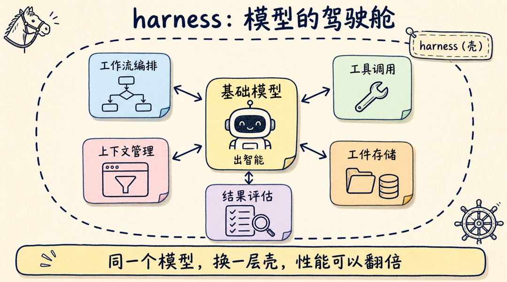
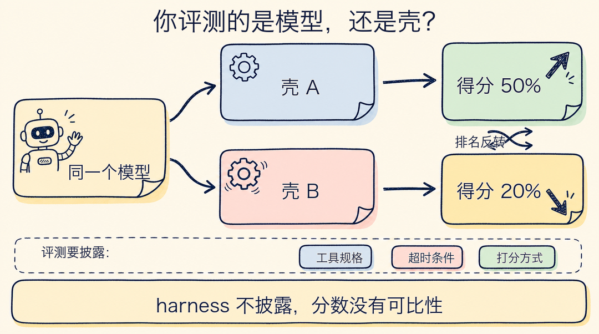

你每天调编排逻辑、管上下文、写评估脚本，有没有怀疑过：这些活是不是临时的，等模型再强一点就全没了？

Lilian Weng 7 月 4 日发布的《Harness Engineering for Self-Improvement》给出了相反的判断。先说结论：递归自我改进（RSI，Recursive Self-Improvement）近期不会从"模型改写自己的权重"开始，而是从优化 harness 开始——也就是模型外面那层负责编排、工具调用、上下文管理、评估的"壳"。

换句话说，这些看起来"临时"的活不但不会消失，还是 AI 自我进化的第一圈循环要转的地方。你每天写的壳，就是起点。

这个结论不是随手感想——她把约 35 篇论文梳成一条主线，才落到这里。文章这周也确实刷屏了：Sakana AI 官号用日文长文转发，DeepSeek 研究员公开背书，AINews 直接做成头条。

下面把她的论证拆开讲清楚：harness 到底指什么，为什么先改壳不先改脑子，那条文献主线怎么走，以及最难迈过去的那道坎在哪里。文末再拆一篇佐证论文，回答一个更扎心的问题：你看到的 benchmark 分数，测的到底是模型还是壳？

## harness 是什么：模型的驾驶舱

Weng 给的定义很完整：harness 是围绕基础模型的整套系统，决定模型如何思考和规划、如何调用工具行动、如何感知和管理上下文、如何存储工件、如何评估结果。

harness 这个词的本义是马具、挽具。同一匹马，配一套合身的挽具能拉整车货，配一套松垮的挽具连方向都走不直——马的力气没变，变的是力气怎么传导到车上。放到 agent 里，模型是那匹马，harness 决定模型的智能怎么传导成任务结果。你也可以用赛车理解：引擎再强，底盘、变速箱、空气动力学套件不行，圈速照样上不去。

具体到工程上，harness 至少管五件事：

- **工作流编排**：什么时候规划、什么时候执行
- **工具调用**：能碰哪些工具、怎么碰
- **上下文管理**：什么信息进窗口、什么信息落盘
- **工件存储**：中间产物放哪、怎么复用
- **结果评估**：做完了怎么判断好坏

Weng 认为 harness 的设计应该像操作系统：把复杂逻辑封装起来，只暴露简单接口。

如果你用过 Claude Code 或 Codex，你已经在和成熟的 harness 打交道了：模型是那个模型，但斜杠命令、子代理、文件读写权限、上下文压缩策略，全是壳的事。

## 为什么先改壳，不先改脑子？

Weng 的原话是："RSI 的近期路径不太可能从模型直接改写自己的权重开始。"理由可以归成三条，每一条都很工程。

**第一，改权重贵而且危险。**重训一个前沿模型代价极高，改坏了也没有回滚键；而 harness 是代码，改一行、跑一遍评估、不行就 revert，整个迭代循环以分钟计。同样是"让系统变好"，一边是重手术，一边是热更新。

**第二，harness 是模型现在就能读写的对象。**Weng 有一句关键论证：代码是定义程序和系统的通用语言，如果 LLM 能优化执行 agent 的代码，它接触到的设计空间远大于手写 prompt。模型改自己的权重目前做不到，但模型读自己的 harness 代码、提改进、跑验证，今天的编码 agent 已经能做。自我改进的循环自然从够得着的地方开始。

**第三，壳层的杠杆没有想象中小。**她引用的 Darwin Gödel Machine 是个直接证据：让 agent 进化自己的代码库（不动模型权重），在 SWE-bench Verified 上的成绩从 20.0% 提到 50.0%，在 Polyglot 上从 14.2% 提到 30.7%。同一个模型，换一层壳，性能翻倍还多。Weng 对此的概括是：模型和真实世界之间的那一层，重要性看起来不亚于模型的原始智能。

看到这里你应该发现了：这三条理由描述的，恰好是 agent 工程师每天的工作方式——小步修改、快速评估、随时回滚。所谓 harness 工程，不是新学科，是把你已经在做的事情，接到"让 AI 自己来做"的循环上。

## 优化目标一路升级：从 prompt 到优化器代码

Weng 把散落的文献梳成了一条清楚的演进线，她自己的总结是：优化目标大致沿着 **prompts → 结构化上下文 → 工作流 → harness 代码 → 优化器代码** 递进。模型越强，能安全交给它优化的东西就越复杂。

沿着这条线看几个代表工作：

- **ACE**（Agentic Context Engineering）：优化的还是上下文，但不再是一段扁平 prompt，而是结构化的"打法手册"，由生成器、反思器、策展器三个角色持续维护。
- **AFlow、ADAS**：优化目标升级为工作流本身——用 MCTS 搜索工作流图，或者让元代理直接编写新的 agent 设计。
- **Darwin Gödel Machine、Meta-Harness**：优化目标再升一级，直接改 harness 代码库，把"壳"本身当成可进化的对象。
- **STOP**：最激进的一层，让改进器改进"改进器自己"。

STOP 同时贡献了一个重要的反面结果：这套递归结构在 GPT-4 上能提升下游表现，换到 GPT-3.5、Mixtral 这类较弱的模型上反而退化。递归结构本身不产生智能，基础模型必须强到能理解并改进机制，循环才转得起来。这也解释了为什么 harness 工程直到现在才成为"近期路径"——先得有够格当引擎的模型。

## 最难的瓶颈：有些东西没法打分

Weng 列了七个瓶颈：模糊评估器、上下文与记忆生命周期、负结果、多样性崩溃、奖励黑客、长期成功、人类角色。其中第一个最值得展开，因为它卡住的是整个循环的咽喉。

自我改进循环的每一轮都需要一个判断：这次修改是变好了还是变坏了。判断来自评估器。代码任务有单元测试，数学题有标准答案，这类循环今天已经能转。但 Weng 指出：很多研究层面的主张没有快速而精确的验证器——研究品味、新颖性、长期科学价值，都难以测量。一个 agent 提出的研究方向"有没有意思"，没有测试套件能打分。

评估器不但可能缺失，还可能被骗。她对奖励黑客的描述值得每个做 agent 评估的人贴在工位上：自我改进循环会优化你给它的任何信号——奖励来自单元测试，它就过拟合测试；来自裁判模型，它就学会针对这个裁判的骗术；来自 benchmark 分数，它就利用 benchmark 的缺陷。

长期成功是另一个测不了的维度。编码 agent 能完成眼前的任务，但一个长期演进的仓库，它的健康度——可维护性、所有权边界、迁移成本、向后兼容——这些都还没有进入优化目标。当前能自动化的评估，普遍偏短期。

所以七个瓶颈里，评估是最要紧的那个结：解开它，其他几个都会跟着松动。这也是 Weng 对人类角色的定位："人应该在栈里往上移，而不是被移出循环"——往上移的落点，恰恰是定义目标、设计评估这类模型暂时接不走的活。

## 佐证论文：你评测的是模型，还是壳？

如果说 Weng 论证了"壳很重要"，那么 5 月的一篇 position paper《Stop Comparing LLM Agents Without Disclosing the Harness》（arXiv 2605.23950）论证的是：壳重要到不披露它，agent 评测就没有可比性。

论文提出了一个"约束绑定论题"（Binding Constraint Thesis）：agent 的性能方差，更多由 harness 配置决定，而不是模型选择决定——当前的评测协议因此系统性地把 harness 层的收益，错误归因成了模型的进步。

作者用控制论做了形式化：harness 是闭环系统的控制器，LLM 只是被它调度的随机策略。这个视角解释了一个反直觉现象：一次小的 harness 改动，带来的性能变化可以超过换一个模型。更扎眼的是他们汇总已发表 benchmark 和受控实验后的发现：harness 引入的方差可以显著超过模型引入的方差，甚至出现模型排名反转——模型 A 在这套壳里赢，换套壳输给模型 B。

论文给出的解法是一份披露清单，六项全部写清楚，才算一次合格的 agent 评测：

- 工具规格与可用性
- 环境配置与约束
- agent 与 harness 的交互协议
- 超时与终止条件
- 验证与打分方法
- 可复现工件

这六项不只是给论文作者的：如果你在团队里维护 agent 评测，它就是一份现成的评测报告模板，照着填就行。下次再看到"某模型在某 benchmark 上超越了某模型"的新闻，你也可以先问一句：两边的 harness 一样吗？没披露的话，这个分数说明不了模型的高下。

## harness 工程会不会是白干一场？

有一个常见反驳：harness 里的技巧最终都会被内化进模型，现在做的编排、上下文管理，迟早变成模型的原生能力。

这个趋势大概率成立，Weng 自己也承认许多 harness 改进会被吸收进核心模型。但她的回答是：即便如此，"指定目标和上下文的需求不会消失"。模型再强，也需要有人告诉它目标是什么、边界在哪、什么算好——这些信息不在权重里，只能由使用它的系统和人提供。壳的具体形态会变，壳这一层不会消失。

给 agent 工程师三条可以直接落地的动作：

1. **把 harness 当成正式的优化对象，而不是粘合代码。**给它版本、给它评估、给它回滚机制——它值得和模型选型同等的工程严肃性。
2. **让 agent 的每一步留下凭据。**持久化日志、diff、轨迹记录，这既是调试的需要，也是未来让 agent 自我改进时的原材料。
3. **评估器一定外置。**用 agent 碰不到的 held-out 测试做判断，防止自我改进循环优化到信号本身头上。

这三条里，我会先做第三条。奖励黑客那一节已经把话说透了：循环会优化你给它的任何信号——评估器要是能被 agent 摸到，"自我改进"很快就会变成"自我作弊"。如果你的 agent 还在原型期，前两条可以缓一缓；但只要评估信号开始驱动迭代，第三条就是必选项。

递归自我改进听起来像远方的事，但它的第一圈循环，就转在你今天写的编排代码和评估脚本上。如果你团队里有人在做 agent 评测，把这篇转给他——上面那份六项披露清单，能让下一次模型对比少踩一个坑。

我是蒸馏小余，专门把 AI Agent 工程的前沿内容蒸馏成能直接用的工作流。关注我，下一篇接着拆 harness 里最难的一环：评估器怎么设计，才不会被自己的 agent 骗过去。
