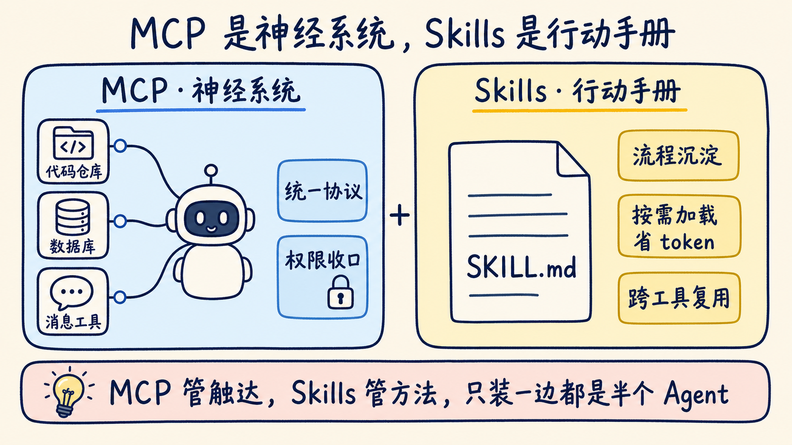
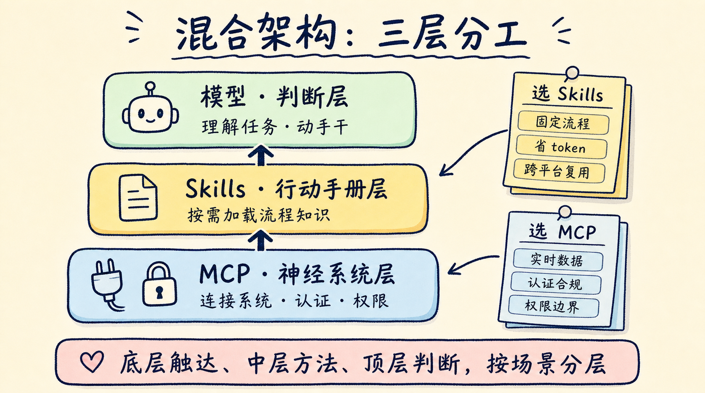

过去一周，AI Agent 圈吵翻了一个问题：Skills 这么火，MCP 是不是可以退休了？Frank's World、BrightCoding、InfoWorld 三家技术媒体同一周先后发文，争的都是这一件事。

先说结论：MCP 没有被淘汰，数据反而在打脸唱衰者。标题里的 232% 来自 Bloomberry 对 1400 个 MCP 服务器的分析——2025 年 8 月到 2026 年 2 月的半年里，MCP 服务器数量增长了 232%。单个产品的数据也在涨：Firecrawl 披露自家 MCP 使用量单月就增长了约 35%，他们的原话是"单个产品的数据，但这种增长很难当成噪音忽略"。

争论吵到最后，几篇文章给出的答案高度一致：MCP 和 Skills 不是替代关系，是分层关系。这轮讨论里，把两者关系说得最透的是 Analytics Vidhya 的比喻——MCP 是 Agent 的神经系统，负责触达世界；Skills 是行动手册，负责到了现场知道怎么干。只装一边，Agent 都干不好活。

这篇文章把两层拆开讲清楚，最后给一张能直接用的选型决策表。

## MCP 是神经系统：Agent 靠它摸到真实世界

MCP 解决的是连接问题。它是模型和外部系统之间的标准化中间层，把模型的意图翻译成可执行的 API 请求，同时管好身份验证和数据权限。

没有这个协议层，集成成本是乘法。Analytics Vidhya 算过一笔账：5 个 Agent 要接 5 个后端系统，就得写 25 套定制集成；有了 MCP，两边各自对齐一个协议就够了。这正是它像神经系统的原因——不管手要碰的是 GitHub、PostgreSQL 还是 Stripe，信号走的都是同一套通路。

企业场景更依赖这套通路里的治理能力。Merge 的联合创始人兼 CTO 在 InfoWorld 的采访里说，MCP 实施得当时能强制执行策略驱动的访问控制：哪怕 Agent 本身权限很大，初级工程师也没法借它看到自己无权访问的日志。这种权限收口，靠给模型写提示词是做不到的。

所以年初的唱衰潮才显得讽刺。OpenClaw 作者 Peter Steinberger 一月份放话"mcp were a mistake, bash is better"，带起了一波"MCP 已死"的论调。但 Firecrawl 复盘这场争论时点破：他抱怨的是易用性，不是能力上限。

半年过去，Zuplo 的《MCP 状态报告》显示 63% 的 MCP 用户在用它连接文档和知识库这类数据源——需求没有消失，只是从尝鲜变成了基础设施。InfoWorld 的判断是：MCP 会像早期的 REST 一样，成为 AI 系统和数据之间的控制平面。

## Skills 是行动手册：到了现场知道怎么干

Skills 解决的是另一个问题：Agent 接上了系统，却不知道你们团队的活该怎么干。

一个 Skill 就是一份领域流程的封装：一个 SKILL.md 文件配上脚本和示例，告诉 Agent 这类任务的步骤、规范和边界。它不需要起服务、不需要配基础设施，扔进文件夹就能用。Frank's World 举的例子很典型：代码调试的固定套路、合规检查的清单、销售团队要求的统一数据格式——这些重复性流程写成 Skill，Agent 每次都按同一套标准执行。

Skills 最值得借鉴的设计是加载机制，也就是"渐进式披露"。BrightCoding 拆解过这套设计：Agent 启动时只加载每个技能的名称和描述，不到 200 个 token；等任务触发了某个技能，才把 2000 多 token 的完整流程调进上下文。对比把所有提示词一次性塞进系统提示的老做法，该技能库的生产用户报告 token 用量降了 60% 到 80%；其中一个生产环境的客服机器人案例，token 节省了 70%。

另一个优势是复用。SKILL.md 是纯文本标准，不绑定任何平台，同一份技能在 Claude Code、Cursor 或自建 Agent 里都能用。流程沉淀一次，处处生效。

## 只装一边的 Agent，各有各的翻车方式

争论有价值的地方，是逼着两边把失败模式亮出来了。

**只有 MCP，是有手没脑。**工具接了一堆，Agent 却不知道怎么组合。更现实的代价是上下文：Scalekit 的基准测试显示，一次 MCP 操作要吃掉 3.2 万到 8.2 万 token，而等价的 CLI 命令只要 200 左右；按每月一万次操作算，成本是 55.2 美元对 3.2 美元。

InfoWorld 也提醒，挂太多 MCP 服务器会显著撑大模型输入，Claude Code 靠工具搜索功能才把工具定义从 51k token 压到 8.5k。工具越多、说明书越厚，Agent 反而越容易在一堆定义里迷路——Firecrawl 引用的测试里，一份 800 token 的技能文件，就能替代 2.8 万 token 的 MCP 架构。

**只有 Skills，是有脑没手。**流程手册写得再漂亮，Agent 也摸不到真实系统。它拿不到 CRM 里的实时客户数据，过不了企业的 OAuth 认证，碰不了带权限管控的生产日志。

Sonar 的调查显示 96% 的开发者不完全信任 AI 编码输出，StackOverflow 的调查里近一半开发者最头疼"几乎正确但不完全正确"的 AI 方案——不信任的根源之一，就是模型拿着过时的知识凭空作答。

Skills 管不了这个。把新鲜、真实的数据喂进上下文，是 MCP 这层的活。

两种翻车方式放在一起看，结论自然就出来了。Analytics Vidhya 说得直接："MCP 扩展你的系统，Skills 扩展你 Agent 的行为。不同时用上这两个，你造的就是半个 Agent。"

## 混合架构怎么分层：一张决策表

共识不是"都装上就完事"，而是按场景分层。这几篇文章的建议可以合并成一张表：

| 你的场景 | 优先选 | 原因 |
| --- | --- | --- |
| 要接 CRM、数据库、生产日志等真实系统 | MCP | 实时数据 + 权限收口，提示词替代不了 |
| 需要 OAuth、多租户、审计合规 | MCP | 协议层统一治理，企业可建内部 MCP 注册表 |
| 要防止使用者借 Agent 越权（如初级工程师看生产日志） | MCP | 权限边界在协议层强制执行，不靠使用者自觉 |
| 固定流程反复跑（调试套路、合规清单、格式规范） | Skills | 流程沉淀一次，每次执行同一标准 |
| token 敏感的生产管线 | Skills | 渐进式披露，不触发不占上下文 |
| 同一套流程要在多个工具间复用 | Skills | SKILL.md 纯文本标准，跨平台通用 |

组合的思路，Firecrawl 总结成内外循环：内循环是本地开发、高频日常操作，走 CLI、技能文件这类轻量路径；外循环是企业多租户集成、OAuth 和审计，交给 MCP。BrightCoding 的分工说法也一样：框架级的工具连接归 MCP，Agent 级的上下文策略归 Skills。

落到具体架构上就是三层：底层 MCP 负责触达——连接系统、管理认证、执行权限；中层 Skills 负责方法——什么任务用什么流程、调哪些工具、按什么顺序；模型在最上层做的只剩判断——理解任务，然后翻手册、动手干。

## 别站队，学会分层

回到开头的问题：MCP 会被 Skills 淘汰吗？数据和架构逻辑都说不会。它在涨，因为触达真实系统的需求只会越来越多；Skills 在火，因为光有触达、没有方法的 Agent 干不好活。两条曲线是同时向上的。

我自己的取舍也放在这里：个人项目和小团队，我会先写 Skills 再考虑 MCP——流程沉淀几乎零基础设施投入，跑顺了再看哪个环节非要实时数据、非要权限管控不可——确实有，再上 MCP。反过来在企业环境，我不建议为了省事绕开 MCP 直接给 Agent 塞脚本：权限没有协议层收口，出了事连审计线索都没有。

具体动手，按三步走：

1. 盘点手里的 Agent 缺哪一层：接不上真实系统，补 MCP；接上了但干活质量不稳定，把你的流程写成 SKILL.md；
2. 检查 MCP 挂载数量：工具定义吃掉的上下文超出预算，就把低频工具换成按需加载；
3. 把团队里被反复口述的操作规范挑三条出来，沉淀成技能文件——这是投入产出比最高的一步。

别再纠结站哪边。给 Agent 一套神经系统，再配一柜行动手册，它才算长齐了手和脑。文中那张选型决策表，建议收藏或转到团队群——下次再有人争"MCP 还是 Skills"，直接按场景对号入座。

我是蒸馏小余，专注把 AI Agent 工程化的前沿实践蒸馏成你能直接上手的工作流。关注我，下次 Agent 圈再吵成一团，你直接来这儿拿蒸馏好的结论。
