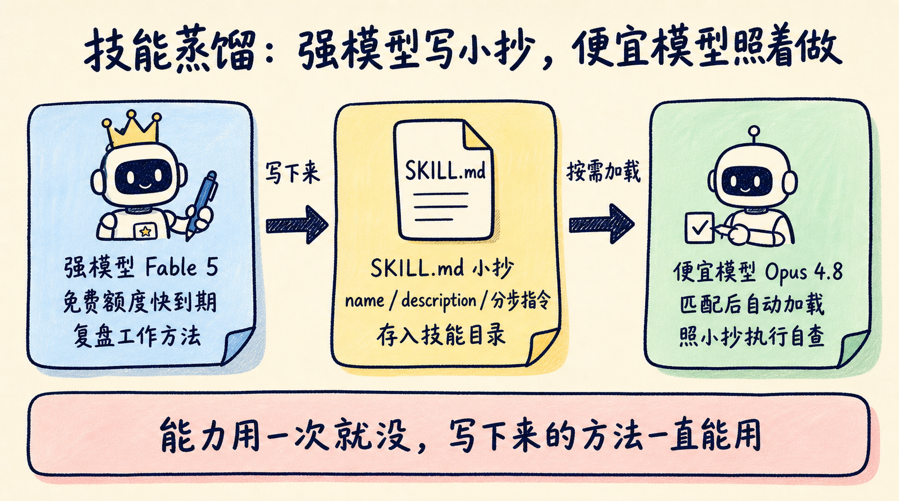
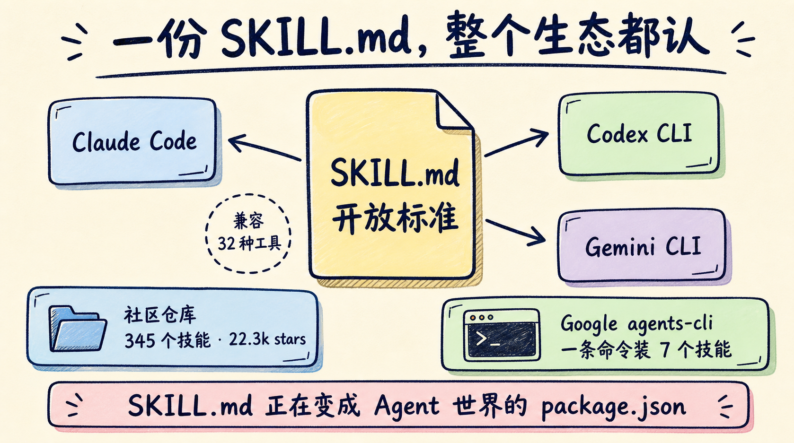

强模型太贵舍不得常开，便宜模型又老在关键步骤上翻车——如果你每天也在这两档模型之间反复横跳，这个纠结最近有了个新解法。先说结论：**让最贵的模型把自己的"干活方法"写成一份 markdown 小抄，留给便宜模型照着执行。有人认真做了 14 轮盲测：带小抄的一方 12 胜、0 负、2 平。**

事情是这样的：Anthropic 给 Fable 5 的附赠免费额度在 7 月 7 日到期。到期前一周（7 月 1 日），Reddit 上有人想出这个办法：趁它还免费，让这个最贵的模型把工作方法写成技能文件，留给便宜的 Opus 4.8 日常使用。这条帖子攒下数百条评论，一天之内出圈，评论区给这个玩法起了个名字——**skill distillation，技能蒸馏**。

这笔账很好算：额度到期后，Fable 5 的价格是每百万输入 token 10 美元、输出 50 美元；而一份写好的技能文件，之后每次调用只增加约 7% 的 token 成本。贵模型的能力用一次就没了，但它写下来的方法可以一直用。

这篇文章拆三件事：技能蒸馏到底蒸的是什么、盲测数据里藏着哪些细节、以及你怎么在自己的工作流里复刻这套玩法。

## 蒸馏的不是模型，是流程

传统意义上的"蒸馏"（distillation）是模型压缩技术：用大模型的输出当训练数据，把能力压进小模型的权重里，需要训练管线和大量算力。技能蒸馏跟权重没有任何关系。原文说得很直白：**无权重、无微调、无 API**。它蒸馏的是书面流程——强模型把"这类任务应该怎么做"写成一份 markdown 文件，弱模型在干活时照着执行。

这份文件就是 SKILL.md。解剖开来只有三部分：

- **name**：技能叫什么；
- **description**：什么时候该用它——agent 靠这段描述做任务匹配；
- **正文**：纯文本指令，一步步写清楚该怎么做、做完怎么自查。

文件放在 `~/.claude/skills/<name>/SKILL.md` 下，当任务和 description 匹配时，agent 会自动把正文加载进上下文。没有任何黑魔法，就是一份会被按需取用的操作手册。

为什么这招对便宜模型有效？社区仓库 fable-skills 的 README 给了一个准确的解释：**"你没法用一个 markdown 文件给模型更多能力，但你可以移动它的检查点。"**

便宜模型和贵模型的差距，很大一部分不在"想不出来"，而在"没想起来要做"——没验证就汇报完成、没找根因就动手改代码、diff 越改越大。

把这些纪律写成技能，等于在便宜模型的工作流里预埋了一排"停下来检查"的路标。这个 9 技能的仓库里，verified-done、root-cause-first、minimal-diff 这些名字，全都是冲着弱模型的典型翻车点去的。

## 盲测 12 胜 0 负，但有两次翻车

回到那份实测。Iwo Szapar 让 Fable 5 写了 6 个技能，在 Opus 4.8 上做盲测对比：同一任务，加载技能和不加载各跑一遍，由不知道分组的评估方选出更好的结果。14 次评估里，加载技能的一方 12 胜 0 负 2 平。

这份数据有三个值得注意的细节。

第一，**战绩不是一次成型的**。作者坦承，初版 6 个技能里有 2 个输掉了盲测，改写之后才扭转。强模型写的第一版不等于好技能，写完必须测，测不过就改——技能是迭代出来的资产，不是一次性生成的咒语。

第二，**便宜不是免费**。技能正文会占上下文，实测每个任务的 token 成本增加约 7%。用 7% 的开销换取稳定接近强模型的产出质量，这笔账在绝大多数场景下划算，但它提醒你：技能要写得精炼，不是把整本文档塞进去。

第三，**结论有明确边界**。作者特意声明，性能数字只来自 Opus 4.8 的盲测。换一个执行模型、换一类任务，战绩不保证复现。把 12:0:2 当成"此路可通"的信号比当成通用定律更靠谱。

我自己的看法：这三个细节比 12:0:2 的战绩更值钱。它们说明这套玩法的正确姿势是"写完就测、输了就改"，而不是"生成、装上、祈祷"。真正值得抄走的不是那 6 个技能，而是这条验证纪律。

## 一份 SKILL.md，三个 CLI 都认

技能蒸馏能出圈，还有一个容易被忽略的前提：SKILL.md 不是 Claude Code 的私有格式，而是一份开放标准（Agent Skills open standard）。同一份技能文件，换个目录就能在别家 CLI 里直接用：

| 工具 | 技能路径 |
|---|---|
| Claude Code | `~/.claude/skills/<name>/SKILL.md` |
| Codex CLI | `~/.agents/skills/<name>/SKILL.md` |
| Gemini CLI | `~/.gemini/skills/`（或 `~/.agents/skills/` 别名） |

原文的说法是："同一个文件夹、同样的 frontmatter、同样的 markdown 正文。"这意味着你用 Fable 5 蒸馏出来的技能，不会被锁死在 Anthropic 的生态里——明天换 Codex 或 Gemini 干活，这份资产原样带走。

跨工具通用，直接改变了写技能的收益预期。给单一工具写配置是消耗品，给开放标准写技能是可迁移资产，社区愿意大规模投入的原因就在这里。

## SKILL.md 正在变成 Agent 世界的 package.json

技能蒸馏走红的这几天，Skills 生态的几个数字也值得放在一起看。

社区侧，alirezarezvani 维护的 claude-skills 仓库目前已有 **22.3k stars**，收录 **345 个技能包**，外加 30+ agents 和 70+ 自定义命令，兼容 Claude Code、Codex、Gemini CLI、Cursor 等 **12 种编码智能体**，覆盖工程、产品、营销、合规、C-Level 顾问等 18 个领域。

一条 `/plugin marketplace add` 命令接入，还带一个把技能批量转成各平台原生格式的转换脚本。

大厂侧，Google 早在今年 4 月就发布了 agents-cli：一条命令 `uvx google-agents-cli setup`，把 **7 个结构化技能文件**装进你的编码助手，覆盖 agent 的整个生命周期——脚手架、评估管线、部署到 Cloud Run / GKE、注册 Gemini Enterprise、配置可观测性。

按 TechTimes 的报道，这些文件遵循的正是 Anthropic 在 2025 年 12 月发布的 SKILL.md 规范，如今已有 **32 种编码工具**支持这份规范。

把这些信号拼起来，SKILL.md 的角色已经很像 Node 世界的 package.json：一份纯文本清单，任何兼容工具都能读，围绕它长出仓库、市场和安装器。区别只在于，package.json 声明的是代码依赖，SKILL.md 声明的是**工作方法依赖**。

## 三步做你自己的技能蒸馏

看懂原理之后，复刻这套玩法不需要任何基础设施。三步：

**第一步：让强模型复盘，而不是让它猜。** 挑一类你反复做、且便宜模型经常做砸的任务——比如代码评审、周报改写、bug 定位。先用强模型完整做一遍，再发给它这句话：

> 把你刚才的做法总结成一份 SKILL.md，包含 name、description 和分步指令，指令要具体到可以被逐条检查。

基于真实任务的复盘，比凭空让它"写一个 XX 技能"质量高得多。

**第二步：把技能装给便宜模型日常执行。** 文件放进 `~/.claude/skills/<name>/SKILL.md`（其他 CLI 对照上面的路径表），之后同类任务交给便宜模型跑。description 要写清楚触发场景，否则技能装了也不会被加载。

**第三步：盲测验证，输了就改。** 同一任务，加载技能和不加载各跑一遍，打乱顺序让同事（或另一个模型）选更好的那份。记住实测里的教训：6 个技能里 2 个初版是失败的。没经过盲测的技能只是心理安慰，测不过的就拿回去让强模型重写。

一个额外提醒：技能数量不是越多越好。每个被加载的技能都在消耗上下文（实测约 7% 成本），优先蒸馏那些"高频 + 便宜模型稳定翻车"的任务，性价比最高。反过来说，一年做不了几次的任务、便宜模型本来就能干好的任务，我不建议为它付这 7%——蒸了也只是心理安慰。

## 模型会换代，写下来的流程是你的

上个月我们在《Agent 为什么总学不会？把反馈写回 Skill》里聊过：Agent 的经验要沉淀进版本化的技能文件，才能跨会话积累。技能蒸馏是同一条思路的另一半——自我改进循环解决"经验从哪来"，技能蒸馏解决"最好的经验由谁来写"。答案是：让当下最强的模型来写，让最便宜的模型来执行。

Fable 5 的免费额度已经过期了，但这个事件留下的方法论不会过期。模型会换代、会涨价、会下线，而你沉淀成文字的工作流程，跨模型、跨工具、可版本管理——它是少数真正属于你自己的 AI 资产。下次拿到任何强模型的试用额度，别只顾着让它干活，记得让它把"怎么干"写下来。

今晚就可以试：挑一个便宜模型最常翻车的任务，按上面三步蒸馏出你的第一份 SKILL.md。蒸完欢迎到评论区说说你选了什么任务、盲测结果怎么样——被提得最多的场景，我会在后续文章里当案例细拆。

关注蒸馏小余，Skills 这条线我会一直跟下去。

## 参考链接

- Skill distillation 实测：https://www.iwoszapar.com/p/claude-code-skills-written-by-a-smarter-model
- fable-skills 仓库：https://github.com/benjaminard/fable-skills
- claude-skills 仓库：https://github.com/alirezarezvani/claude-skills
- Google agents-cli 报道：https://www.techtimes.com/articles/319412/20260701/google-agents-cli-one-command-adds-ai-agent-lifecycle-skills-claude-code-codex.htm
