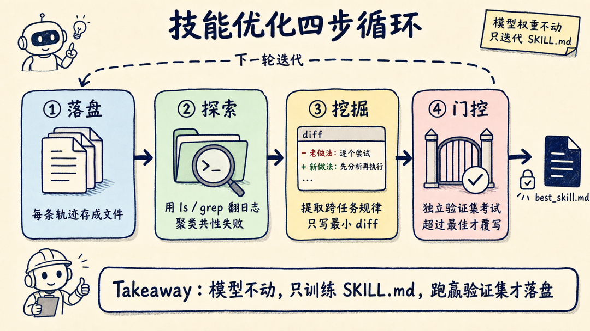
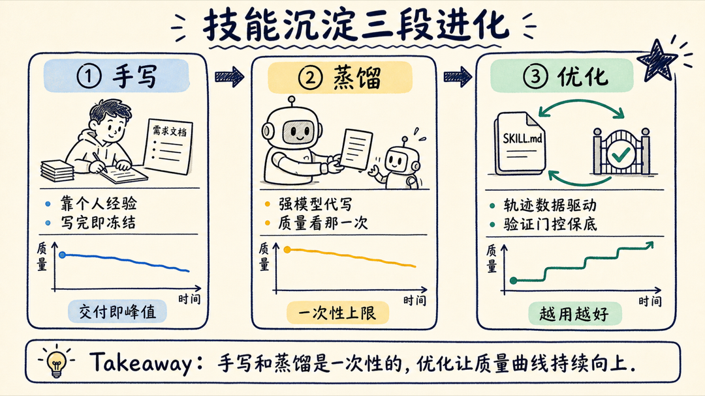

大家都在囤技能：一个收录 345 个 skills、agents 和 commands 的仓库能拿 5.2k+ stars，SKILL.md 快成了 Agent 世界的 package.json。但绝大多数技能的生命周期是——写完，跑几次，永远停在 v1。它写得好不好、有没有更优版本，没人管，也没有工具管。

先说结论：HuggingFace 本周 trending 的论文 SkillOpt-Lite 认为，技能不是文档，是可以被"训练"的参数。模型权重完全冻结，把 SKILL.md 本身当成优化变量，靠执行反馈一版版迭代——这在数学上就是一个零阶（Zeroth-Order）优化问题，收敛性和泛化性都可以论证。

标题里那句"小模型反超旗舰"也不是修辞：技能加 harness 一起优化到位后，GPT-5.4-nano 在 SpreadsheetBench 上直接超过了旧方法设置下的 GPT-5.5；LiveMath 基准上，GPT-5.5 比前代方法再涨 8.8 分，GPT-5.4-nano 更是涨了 25.4 分。

这篇文章拆三件事：零阶优化到底在优化什么、三条原则各自挡住哪种翻车、以及你怎么给自己的技能库装上这个循环。

## 零阶优化：不改厨师，改菜谱

先把形式化讲通俗。论文把技能优化写成一个目标函数：

> f(s) = E[ R( H(M, z, s) ) ]

s 是技能文件（一个 markdown 文本），M 是冻结的大模型，z 是一个个具体任务，H 是执行框架，R 是打分。整句话翻译过来：**固定模型、固定框架，只调技能文本，让任务平均得分最高。**

问题在于，s 是一段离散文本，没法对它求梯度——你不能像训练神经网络那样算出"这句提示词往哪个方向改 0.01 会更好"。模型加执行环境整个是个黑盒，唯一能拿到的信号是：这一版技能跑出来，任务成了还是败了。

这就是零阶优化的标准场景：没有梯度，只有函数值。类比一下，厨师（模型）不动，你改的是菜谱（SKILL.md）。你算不出"盐多放 1 克"是更好还是更糟，只能让厨师照着新菜谱做一遍，尝一口，决定这版菜谱留不留。试吃反馈，就是零阶优化里的函数评估。

论文里有一张有意思的映射表：Agent 圈这两年的各种"反思"技巧，其实都是零阶优化里的经典操作换了个名字——对着单条轨迹做反思，等价于 1 点梯度估计；成功失败轨迹做对比诊断，等价于中心差分；限制每次只改一小块，等价于信任域约束。

区别只有一个：经典零阶优化的扰动是盲目的数值抖动，而 Agent 的执行轨迹是可解释的调试日志，信息量大得多。

把这层对应关系挑明的价值在于：一旦技能优化被写成标准优化问题，收敛快不快、会不会过拟合，就不再靠感觉，而是能用优化理论和 PAC 学习去分析——哪些步骤必要、哪些步骤纯属冗余，都可以论证。

## 三条原则，各挡一种翻车

论文用这套理论筛出了三条原则，每条对应技能自我迭代时的一种典型翻车。

**第一条：轨迹探索——把每次执行落成文件，让优化器自己去翻。**

具体做法朴素到有点反直觉：每条执行轨迹存成一个独立文本文件，然后让负责优化的模型拿着 ls、grep 这类最原始的文件系统工具，自己去日志堆里导航、聚类共性失败。

论文的论据是 bitter lesson 式的：随着基座模型变强，"让模型直接翻原始日志"持续跑赢各种重度工程化的分析管道，预先设计的复杂归并拓扑反而成了阻碍。

这一条挡住的翻车是：分析框架写得越精巧，丢掉的原始信息越多。

**第二条：共识挖掘——只把跨任务的公共规律写回技能。**

单条轨迹里的教训不可信。某次任务失败可能只是这道题刁钻、这次采样运气差，你把它总结成规则写进 SKILL.md，等于在用噪声更新参数。论文在泛化误差界里给这种行为标了价：过拟合单次试验的异常，会直接推高界里的稳定性系数。

正确做法是横向看一批轨迹，只提取反复出现的不变量——十次失败里有八次都栽在同一个环节，这才配写进技能。而且写回时遵循最小更新原则：每次只生成一个紧凑的 diff，而不是大段重写，对应优化里的信任域约束。前作 SkillOpt 为此专门设计了编辑预算衰减调度（每轮上限从 4 收紧到 2），Lite 把它简化成了对每个补丁的最小化要求。

**第三条：验证门控——新版技能必须过独立考试，才允许落盘。**

这是三条里最容易被省略、也最不能省的一条。我看各种"技能自我改进"方案时，第一个检查的就是这里。

论文用 PAC 学习给出了硬结论：候选技能在一个与训练集严格不相交的验证集上过关，泛化界里那个讨厌的稳定性项就能被整个移除；跳过这一步，你没有任何理由相信"在训练任务上变好"等于"技能变好"。

论文还点了名：Reflexion 跳过了独立验证，SkillCAT 拿训练失败的子采样当验证集——相当于用练习册原题当期末考卷。这一条挡住的翻车最隐蔽：技能在你眼皮底下"越改越好"，换一批任务立刻现原形。

## 四步循环：最小可行管线长什么样

三条原则串起来，就是论文说的最小可行管线，一共四步：

1. **落盘**：每条执行轨迹存为独立文本文件；
2. **探索**：优化器模型用文件系统工具翻日志，聚类共性失败；
3. **挖掘**：提取跨任务不变量，生成对技能文件的最小 diff；
4. **门控**：候选技能在独立验证集上评估，只有超过历史最佳，才覆写 best_skill.md。



"最小"不是口号，是砍出来的。相比前作 full SkillOpt，Lite 版删掉了四个组件：mini-batch 反思池、epoch 级慢更新阻尼、拒绝编辑缓冲、层级树归并。

删完反而更强：LiveMath 上 GPT-4o 从 31.2 涨到 58.8，收敛曲线显示主要收益在前两三步就拿到了，而 full 版被批处理切分和更新阻尼拖慢了早期探索。

整个循环在 IDE 里一行命令触发（论文标题里的 "one line of vibe" 就指这个）：

```
/skillopt-loop rounds=10 batchsize=40 target=gpt5.4-nano
```

对照这四步，给自己的技能库加一个优化循环并不遥远。Claude Code 的 `.claude/skills/<name>/SKILL.md`、Codex 的 `$CODEX_HOME/skills`，本来就是"技能即文件"，天然满足第一条原则的前提。你需要补的是另外三块：

- 给技能执行留轨迹：会话日志本来就有，关键是按技能归档；
- 攒一小批固定的验证任务：论文里 LiveMath、OfficeQA 的验证集只有 10 到 20 个实例，规模门槛很低；
- 立一条纪律：任何对 SKILL.md 的修改，必须在验证任务上跑赢当前版本才允许合入。

剩下的探索和挖掘，交给一个定期运行的优化 agent 就够了。

还有一个数字值得单独说：论文把同样的方法扩展到整个 harness 的优化（HarnessOpt）后，GPT-5.4-nano 在 SpreadsheetBench 上从 0.2989 拉到 0.7758，超过了旧方法设置下 GPT-5.5 的 0.7620。

换句话说，技能和 harness 优化到位，小模型能干过没优化好的旗舰模型——这笔账对任何在意推理成本的团队都值得算一算。

## 手写、蒸馏、优化：技能沉淀的三段进化

把这篇论文放进最近一个月的时间线看，Agent 能力沉淀的路径已经走完了三段。

第一段是手写：工程师把自己的工作流整理成 SKILL.md，质量取决于个人经验，写完即冻结。

第二段是蒸馏：让最强的模型代写技能给便宜模型执行。前段时间那个出圈的实测里，强模型代写的 6 个技能盲测拿下 12 胜 0 负 2 平——上限从"你的经验"变成了"旗舰模型的经验"。

第三段就是这篇论文的位置：优化。技能不再依赖任何单次写作的质量，而是靠执行数据持续迭代，有验证门控保底，有收敛性可以论证。



三段的差别在于质量曲线的形状。手写和蒸馏都是一次性的：交付那一刻是质量峰值，之后随着任务分布漂移慢慢失效。只有第三段的曲线是向上的——用得越多，轨迹越多，共识越准，技能越好。

## 技能不是文档，是需要持续训练的资产

给三个能直接落地的建议。

第一，从今天起给技能执行留痕。哪个技能、哪次任务、成了还是败了，按技能目录归档轨迹。没有轨迹，后面一切优化无从谈起。

第二，给最常用的两三个技能配一个 10 到 20 条任务的验证集。不用追求覆盖，固定、独立、和日常任务不重叠即可——这是论文验证过的最小规模。

第三，立一条门控纪律：SKILL.md 的任何修改（不管是人改的还是模型改的），跑赢验证集才合入。这条纪律本身不需要任何新工具，今天就能执行。

如果只能先做一件，我会选第三条——门控不用写一行代码，却直接决定你的技能库是在进化，还是在原地漂移。

技能库和模型的差别正在消失：都有参数（技能文本）、都有训练数据（执行轨迹）、都有验证集和准入门槛。区别只是它优化的不是权重，而是写给模型看的那份文档。SKILL.md 写完不是结束，是这份资产的初始化。

细节以论文原文为准：arXiv 2607.03451，建议顺着验证门控那一节的 PAC 论证读起。

我是蒸馏小余，专拆 AI Agent 工程化的一线进展。技能蒸馏、技能生态、技能优化，Skills 这条线我会一直追下去。

如果你的技能库也停在 v1，先把上面三条纪律立起来。下一篇我会拿自己的技能库真跑一遍这个四步循环，效果和翻车都原样贴出来——想第一时间看到实测结果，关注蒸馏小余就行。
