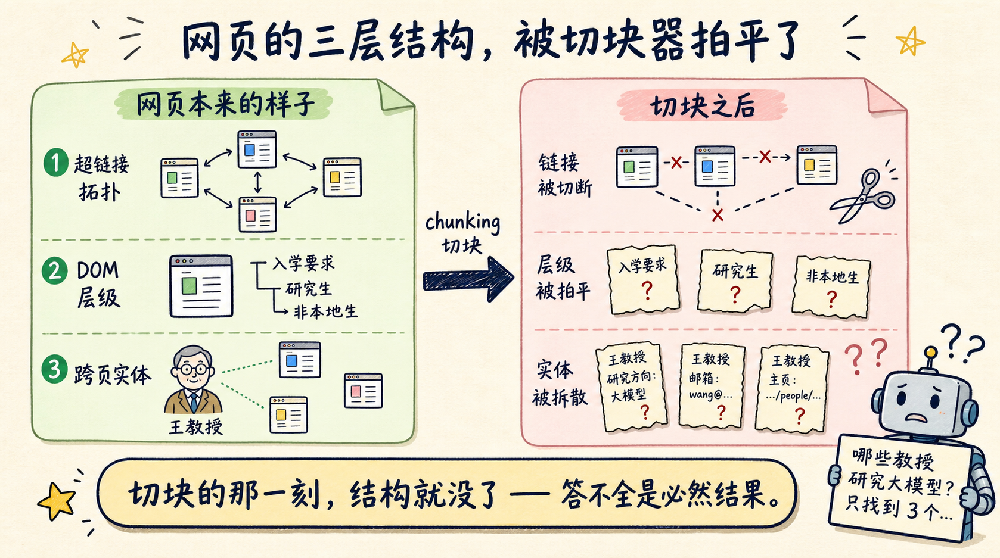
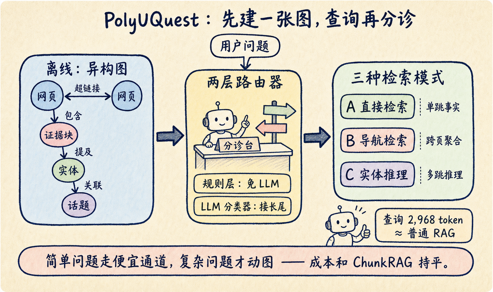
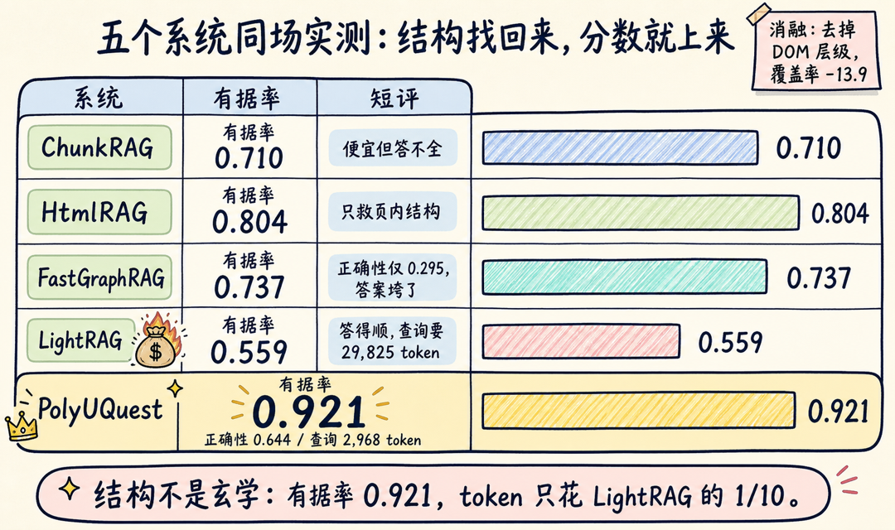

给官网做过问答机器人的同学，大概率遇到过这一幕：把整站几千个页面切块、灌进向量库，用户问"哪些教授在做大模型方向"，机器人只答出三个名字——剩下十几位散落在不同院系页面里，检索根本没碰到。换更强的模型，没用；加大 top-k，噪声跟着涨。

问题不在模型，在检索层的第一步：**切块的那一刻，网页就被拍平成了纯文本**。超链接没了，标题层级没了，同一个人名出现在八个页面这条线索也没了。模型拿到的是一堆彼此失联的碎片，答不全是正常结果。

香港理工大学团队 7 月 9 日放出的论文 PolyUQuest（arXiv:2607.08269）就冲着这个问题来：把网页的三层结构接回检索层，用一张异构图统一管理，再配一个查询路由器。在港理工官网 4,240 个页面上实测，答案有据率（Faithfulness）0.921——92% 的回答内容能在证据里找到出处，比一众基线高出一截，每次查询的 token 消耗却只有 LightRAG 的十分之一。

这篇文章拆一下它是怎么做到的，以及哪些场景值得抄这套作业。

## 网页天生有三层结构，切块器全给扔了

一个组织型网站（大学、政府、医院、企业官网）的知识，不是平铺在单个页面里的，而是靠三层结构组织起来的：

- **页面之间**：超链接拓扑。院系首页链向教授主页，招生总览链向各专业要求页。
- **页面内部**：DOM 层级。一个块挂在"入学要求 > 研究生 > 非本地生"这条标题路径下，含义和挂在"本科生"下完全不同。
- **页面之间反复出现的实体**：同一位教授出现在院系名单、实验室主页、新闻稿里，这些提及连起来才是完整画像。

普通 RAG（论文里的 ChunkRAG 基线）把这三层全部抹掉，只留文本块。于是两类问题必然翻车：跨页聚合类（"哪些教授研究 X"需要沿链接扫多个页面）和多跳实体类（"A 教授实验室的合作机构有哪些"需要沿实体关系走两步以上）。

已有的改进各救了一层，但只救一层。HtmlRAG 保留页面内的 HTML 结构，页内层级找回来了，页面之间照样失联——它的正确性只有 0.453。GraphRAG 一系（LightRAG、FastGraphRAG）用 LLM 抽实体建图，把实体层捡了回来，代价是把结构问题转嫁成了账单问题：LightRAG 建图烧掉 3,740 万 token，每次查询还要再花近 3 万。

## 一张异构图，把三层结构装进同一个索引

PolyUQuest 的离线阶段只干一件事：把整个网站建成一张异构图。节点分四类——网页、证据块、实体、话题；边也分四类，正好对应被丢掉的结构：

1. 页面—页面：超链接
2. 页面—块：包含关系
3. 块—实体：提及关系
4. 实体—实体/话题：语义关联

每个证据块不是裸文本，还随身带着元数据：来自哪个页面、挂在哪条标题路径下、提及了哪些实体。这些字段后面既用于检索，也用于溯源。

在港理工官网上，这张图的规模是 4,240 个页面、31,086 个证据块、29,119 个实体、37,680 条关系。建图消耗 1,750 万 token——大约是 LightRAG 的一半。省钱的原因不难理解：超链接和 DOM 层级是 HTML 里现成的结构，解析就能拿到，不需要 LLM 逐段"读"出来；LLM 只花在实体关系这一层。

## 查询先分诊，再走三条不同的检索路

有了图，下一个问题是怎么查。PolyUQuest 没有用一条统一的检索流程硬扛所有问题，而是先给查询分诊，路由到三种模式：

- **模式 A（Direct Block Retrieval）**：单跳事实题，比如"图书馆几点开门"。密集向量加 BM25 召回，交叉编码器重排，和普通 RAG 一样便宜。
- **模式 B（Navigation Retrieval）**：跨页聚合题，比如"对比两个专业的入学要求"。先分解查询，检索到相关页面后，沿超链接扩展到邻近页面，再全局重排。
- **模式 C（Entity Reasoning）**：多跳实体题，比如"哪些教授参与了某实验室的项目"。先抽出查询里的实体，沿实体关系边扩展，再回溯到源块综合评分。

路由器本身是两层的。第一层是轻量规则，捕获明确的结构信号——查询里出现"哪些教授"（which professors）这类字眼直接进模式 C，"××的入学要求"（admission requirements for）进模式 B，不花 LLM 的钱。规则接不住的长尾查询才交给第二层的 LLM 分类器，输出三种模式的置信度。

这个设计解释了它的成本曲线：简单问题走便宜通道，每次查询平均 2,968 个 token，几乎和最朴素的 ChunkRAG（2,947）持平，却能答对 ChunkRAG 答不了的跨页问题。

## 有据率 0.921 的背后，是每句话都能点回原文

论文在 300 个问题上和四个基线对比。先看答案质量三个指标——正确性、覆盖率、有据率。有据率（Faithfulness）衡量答案里有多少内容能在检索到的证据里找到支撑，分数越低，说明模型编得越多。PolyUQuest 三项全部第一：

| 系统 | 正确性 | 覆盖率 | 有据率 |
|-----|------|------|------|
| ChunkRAG | 0.532 | 0.479 | 0.710 |
| HtmlRAG | 0.453 | 0.448 | 0.804 |
| FastGraphRAG | 0.295 | 0.469 | 0.737 |
| LightRAG | 0.610 | 0.612 | 0.559 |
| **PolyUQuest** | **0.644** | **0.649** | **0.921** |

再看成本。质量领先没有靠堆 token 换，查询开销几乎贴着最便宜的 ChunkRAG：

| 系统 | 每次查询 token | 离线建图 token |
|-----|--------------|--------------|
| ChunkRAG | 2,947 | — |
| HtmlRAG | 4,009 | — |
| FastGraphRAG | 4,484 | 28.1M |
| LightRAG | 29,825 | 37.4M |
| **PolyUQuest** | **2,968** | **17.5M** |

最扎眼的对比是 LightRAG：正确性 0.610 不算差，有据率却只有 0.559——将近一半的回答内容在证据里找不到支撑。它抽取实体建图之后，回答时依赖的是图里的摘要而不是原文块，答案听起来头头是道，溯源就断了。PolyUQuest 的有据率 0.921，比它高 36 个百分点。

做到这一点靠的不是更强的生成模型，而是引用结构：每个被引用的块随身带三样东西——源页面、标题路径、实体链接。用户可以点回确切的页面位置，也可以在 Graph 视图里看到支撑这个答案的页面、块、实体节点，还能继续展开相邻节点。答案的每一句话都拴在图上的具体位置，模型想飘也飘不远。

消融实验反过来确认了结构的价值：去掉 DOM 块层级，正确性掉 8.1 个点、覆盖率掉 13.9 个点——页内结构是三层里贡献最大的；去掉跨页导航，正确性再掉 2.0 个点。

## 什么场景值得抄这套作业

论文自己划了适用边界，我给它翻译成决策清单：

**适合上这套方案的信号：**

- 知识分布在几百到几千个互链页面上：大学、政府、医院、企业官网、内部 Wiki
- 用户会问跨页聚合和多跳实体问题，不只是单点查事实
- 业务要求答案可溯源——教育、政务、医疗这类场景，"答对"不够，还得"指得出出处"
- 预算压不住 GraphRAG 系的 token 消耗

**不适合的信号：**

- 内容本身没结构：论坛帖子、聊天记录、纯文档库，三层里两层不存在，退回普通 RAG 或通用图方案（比如 NodeRAG）更划算
- HTML 质量很差、链接稀疏的老站，图建出来也是残缺的
- 问题分布里 95% 都是单跳事实题，模式 B 和 C 派不上用场，白付建图成本

最大的坑在迁移成本：换一个站点要重新爬取，实体 schema 也要按领域重新设计——大学的"教授—课程—实验室"换到医院就得变成"医生—科室—诊疗项目"。索引、路由、检索、溯源机制可以复用，但别指望开箱即用。

还要留一分清醒：论文只在港理工一个站点上做了评估。数字很好看，但泛化能力还没经过第二个站点的检验，照搬前先在自己的数据上小规模验证。

## 检索质量的上限，在你决定丢掉哪些结构时就定了

PolyUQuest 给 RAG 工程师的启发，比系统本身更值钱。超链接、标题路径、实体共现，这些信息在 HTML 里免费躺着，大多数流水线却在切块的第一步就把它们扔了，然后花十倍的 token 请 LLM 把丢掉的关系猜回来。

如果你手上正好有一个官网问答项目，可以先做一件低成本的事：给每个文本块补上"源页面 + 标题路径"两个元数据字段，引用时展示出来。这不需要建图，一天就能改完，但答案的有据率和用户信任感的提升立竿见影。至于要不要上完整的异构图，先统计一下用户问题里跨页聚合和多跳推理的占比，再决定值不值得付建图的钱。

论文原文在 arXiv:2607.08269，方法细节和消融实验都写得很实在，值得一读。

---

我是蒸馏小余，专注把 AI Agent 与 RAG 工程的前沿论文，蒸馏成你能直接抄的作业。本文的「要不要上异构图」决策清单和论文精读笔记已经整理成文档，关注公众号后台回复 **RAG** 领取。下一篇准备拆 NodeRAG——内容没有网页结构可借时，异构图该怎么建，想看的话评论区扣个 1。点个「在看」，下次翻车的就不是你的检索层了。
