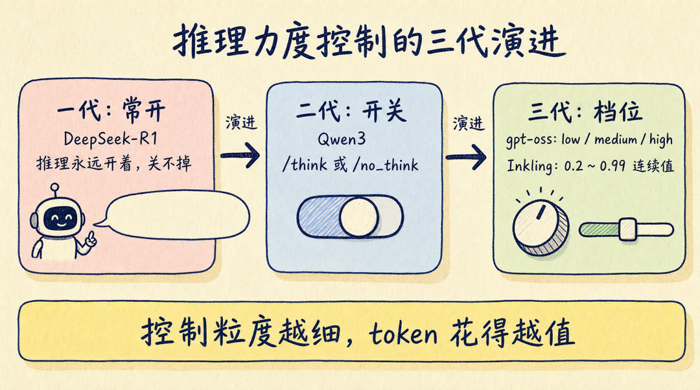
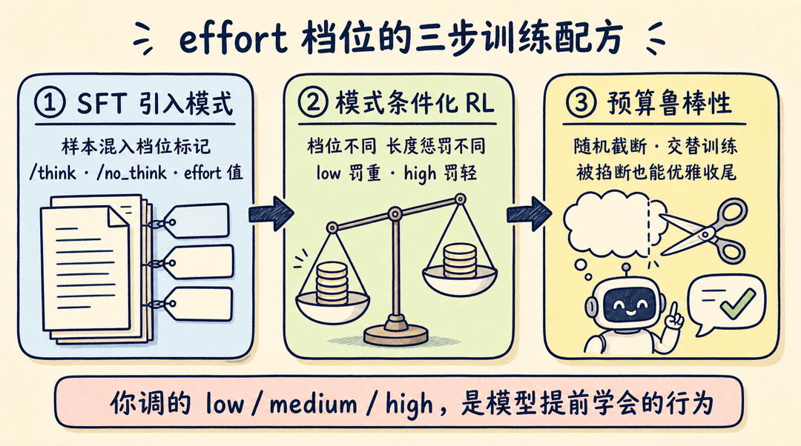
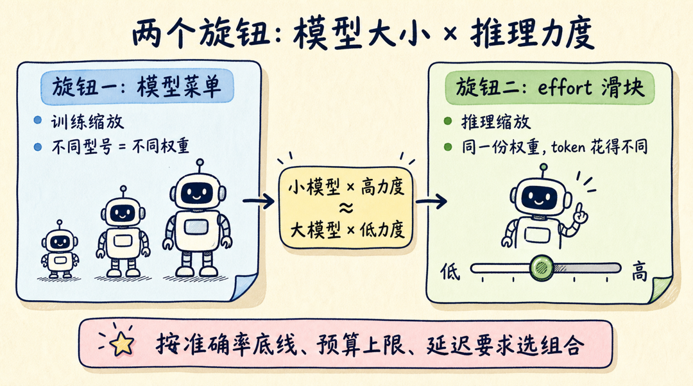

用过推理模型的开发者，大多有同一个抱怨：一个简单问题也要想半天，token 账单和首字延迟一起涨。于是各家 API 都给了一个"思考力度"旋钮——OpenAI 的 `reasoning_effort`、Claude 的 thinking budget、gpt-oss 的 low/medium/high。旋钮天天在调，但很少有人追问一句：模型是怎么学会"少想点"的？

Sebastian Raschka 上周发了一篇长文，把这个问题拆到了训练配方层面。结论先给：**reasoning effort 档位不是推理时的简单截断，而主要是训练出来的行为**。你在系统提示里写一句 "Reasoning: low"，模型输出就变短，是因为它在后训练阶段被专门教过"看到这句话就少想"。

更有意思的是，Raschka 对比了六份公开配方——DeepSeek V4、Nemotron 3 Ultra、Kimi K2.5、GLM-5、Qwen3、Inkling——发现它们殊途同归，都落在同一个三步框架里。这篇文章把这个框架讲清楚，最后给出选档位的实操建议。

## 先补底子：推理模型的奖励，只看答案不看过程

推理模型和普通模型的区别，是它在给出最终答案前，会先输出一段中间推理轨迹（reasoning trace），一步步把问题做出来。

这个能力主要靠 RLVR（Reinforcement Learning with Verifiable Rewards，可验证奖励强化学习）训练出来，DeepSeek-R1 是公开配方的起点。做法是挑答案可以机器判对错的领域——数学用 SymPy 这类工具校验，代码用编译器和单元测试——奖励信号是二元的：答对给 1，答错给 0。

反直觉的地方在于：**那段长长的推理轨迹，在训练中是被忽略的**。奖励只看最终答案对不对、格式合不合规。模型没有被逐句教"应该怎么想"，却在只奖励结果的训练中，自发学会了写中间步骤、发现错误、回头改——也就是常说的 "aha moment"。DeepSeek 团队试过给推理过程单独打分（process reward model），结论是对训练没有帮助。

顺带澄清一个常见误解：`<think></think>` 标签不承载推理能力，它只是"化妆品"。作用是把推理段落和正式回答分开，方便训练管线切分、方便 UI 折叠隐藏。标签本身靠一个格式奖励项引入（总奖励 = 答案正确性 + 格式合规），换成任何别的分隔符都一样。

## 从"开关"到"档位"：先看 Qwen3 怎么做开关

有了推理能力，第一代模型的问题是关不掉。DeepSeek-R1 不管问题多简单，永远输出长篇推理。

Qwen3 给出了教科书式的开关方案，叫 **Thinking Mode Fusion**：在 SFT 阶段把两类样本混在一起训——

```text
/think 样本:    <think>{完整推理过程}</think>{答案}
/no_think 样本: <think></think>{答案}        # think 块直接留空
```

模型见多了这两种格式，就学会了按指令切换。这是"软开关"。工程上还有一个"硬开关"兜底：tokenizer 直接往输出里预填一个空的 `<think></think>` 块，模型没有机会思考，只能直接作答。

开关解决了"想不想"，但没解决"想多少"。这就到了 reasoning effort 档位。



## low/medium/high 档位，到底改变了什么

以 gpt-oss 为例，档位的推理时实现朴素到令人意外：系统提示里就一句话，"Reasoning: low"（或 medium/high）。没有特殊 token，没有运行时开关。

这一句话能生效，是因为档位、输出长度、准确率三者在训练后被绑定了：档位越高，推理轨迹越长；轨迹越长，基准分数越高——但收益会饱和。Raschka 引用 GPT-5.6 Sol 的数据指出，最高档位上性能提升明显收窄，"继续增加推理预算在某个点之后就不经济了"。这条饱和曲线对做成本控制的工程师是关键信息，后面行动建议会用到。

那训练时怎么把这三者绑定？公开资料指向两条路径，可以叠加使用：

**路径一，RL 阶段的长度惩罚**。根据系统提示里的档位，对生成长度施加不同惩罚：low 档罚得重，逼模型写短；high 档罚得轻甚至不罚，允许模型充分展开。

**路径二，RLVR 之后再做一轮 SFT**。准备一批带档位标注的样本，每个提示配上对应"思考量"的目标回答，让模型监督学习档位和长度的对应关系。

Thinking Machines Lab 三天前发布的开源模型 Inkling 把这套做法推到了极致：档位不再是三个离散值，而是 0.2 到 0.99 的**连续浮点数**。训练时奖励函数写成：

```text
R(e) = R_task − λ(e) × N_tokens
# e 是 effort 值；effort 越低，每个 token 的成本 λ 越高
# 模型学会按 e 的大小连续调节推理长度
```

Inkling 用超过 3000 万次 rollout 的异步 RL 完成这个条件化。一个有意思的副产品：训练持续奖励效率之后，模型的推理轨迹自发变得更短、更"电报体"——压缩是涌现出来的，不是设计出来的。

## 六份公开配方，各家押了不同的注

同一个目标，六个模型队伍给了六种工程答案。

| 模型 | 核心思路 | 推理时怎么控制 |
|---|---|---|
| DeepSeek V4 | 训练三个模式专家再蒸馏合体 | 系统提示 |
| Nemotron 3 Ultra | 拿 gpt-oss-120b 当老师造数据 | 模板 + 外部预算截断 |
| Kimi K2.5 | 两种 RL 阶段交替（Toggle） | 训练学会的，无需外控 |
| GLM-5 | 按轮次、按工具调用控制 | 模板预填 think 标签 |
| Qwen3 | Mode Fusion + 硬预算截断 | tokenizer 硬预算 |
| Inkling | 连续 effort 值 + 动态 token 成本 | 系统消息里的浮点数 |

几个值得单独说的设计：

**DeepSeek V4 走分治路线**。non-think、think high、think max 三种模式在后训练阶段被当成三个专家分开训，各自用不同的上下文窗口和长度惩罚，最后通过 on-policy 蒸馏合并成一个模型。think max 的实现很直白：在 think high 的基础上，系统指令里加一句"推理力度：绝对最大，不允许走捷径"。

**Nemotron 3 Ultra 解决的是"被掐断怎么办"**。它训练时把推理轨迹在随机 token 预算处截断、把 `</think>` mask 掉，逼模型学会从没想完的状态直接过渡到答案。这样推理时外部预算一到就掐断，模型也能优雅收尾，而不是输出半句话。medium 档位的数据来自 gpt-oss-120b 老师生成的 SFT 样本，对应的 RLVR 提示只占约 2.5%——档位控制的训练成本可以很低。

**Kimi K2.5 解决的是"截断训练的后遗症"**。固定预算训练有个坑：模型会过拟合到短答案上，失去从长推理中获益的能力。K2.5 的 Toggle 方案是让两种 RL 阶段按固定迭代数交替——预算约束阶段教模型在给定 token 预算内做对题，不限长度阶段恢复模型充分展开的能力。效果：生成 token 减少 25% 到 30%，基准性能几乎不变。

**GLM-5 把控制粒度做细了**。它支持 turn-level thinking（多轮对话里每一轮单独决定想不想）和 interleaved thinking（每次工具调用前插一段推理），这对 Agent 场景很实用——工具调用密集的任务里，不是每一步都值得深想。

**Qwen3 有个训练之外的彩蛋**。它支持推理时硬预算：思考到阈值就强行插入一条"停止思考"指令让模型作答。有意思的是，"想一半也能答对"的能力并没有被显式训练过，是 Thinking Mode Fusion 阶段之后涌现出来的。

## 殊途同归：三步共同框架

把六份配方放在一起看，Raschka 提炼出的共同框架是：

1. **SFT 引入模式**。用带档位标记的样本或 chat template，先让模型见过"不同力度长什么样"。
2. **模式条件化 RL**。按档位调整上下文窗口和长度惩罚，把档位指令和实际输出长度用奖励绑死。
3. **预算鲁棒性技巧**。随机截断、交替训练、续写学习——保证模型在预算被硬性掐断时不至于崩掉。



框架之外，还有一个容易混淆的概念要分开：模型菜单（比如 GPT-5.6 的 Luna/Terra/Sol 不同型号）是**训练缩放**的产物，不同型号是不同的权重；effort 滑块是**推理缩放**，同一份权重花不同的 token。两个旋钮会交叉：小模型开高 effort，可以逼近大模型开低 effort 的准确率，但延迟和 token 成本完全不同。选哪个组合，取决于你的准确率底线、预算上限和延迟要求，没有统一答案。



至于"圣杯"——模型自己判断该想多少——目前还没人做成。GPT-5 试过 Auto 模式，后来从界面上撤掉了。Raschka 的判断是：这层决策会上移到 Agent harness 或内部 router，由一个便宜的模型根据任务状态、工具状态和剩余预算选档，用户保留覆盖权。

## 给工程师的四条行动建议

读完配方，落到日常工作里是四件事：

1. **默认档位别无脑开 high**。先用 medium 跑你自己的评估集，画出成本-准确率曲线，找到饱和点再定档。GPT-5.6 Sol 的数据已经说明最高档的边际收益在收窄。
2. **按任务类型定档**。答案可验证的难题（数学、复杂代码、多步规划）才值得高档位；分类、抽取、格式转换这类任务用低档甚至直接关掉推理，省下的是真金白银。
3. **有严格延迟约束时，优先选预算鲁棒的模型**。支持硬截断优雅收尾的模型（Qwen3 的硬预算、Nemotron 的截断训练）可以给你确定性的延迟上界，这是"软"档位给不了的。
4. **自动选档先别等模型，自己在 harness 层写路由**。既然 router 选档是明确的行业方向，与其等厂商做好，不如现在就在自己的 Agent 框架里加一层规则：按任务类型和剩余预算路由到不同档位，效果立竿见影。

原文还带了一份更完整的训练细节对照，值得做后训练的同学精读：

> https://magazine.sebastianraschka.com/p/controlling-reasoning-effort-in-llms

如果你在自己的 Agent 里做过档位路由，或者实测过某个模型的成本-准确率饱和点，欢迎留言聊聊数据。关注蒸馏小余，下一篇继续拆 AI Agent 工程化的第一手材料。
