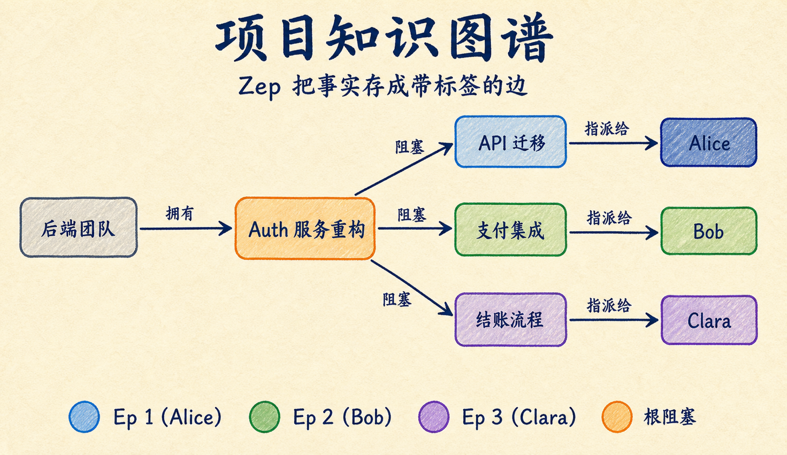
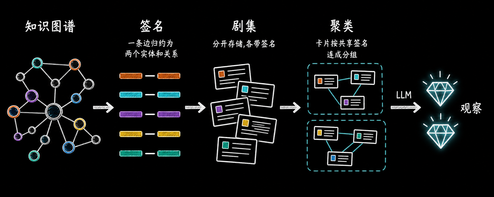
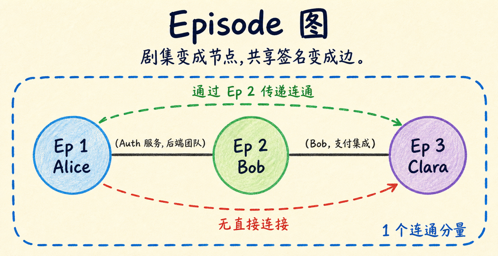
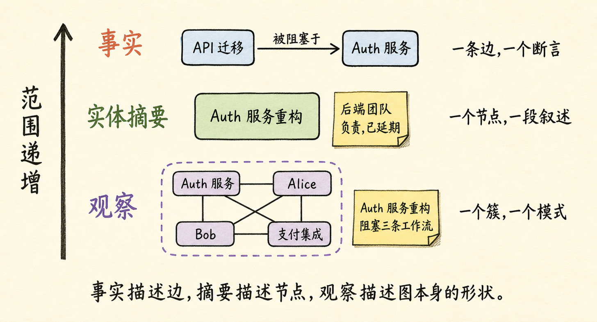
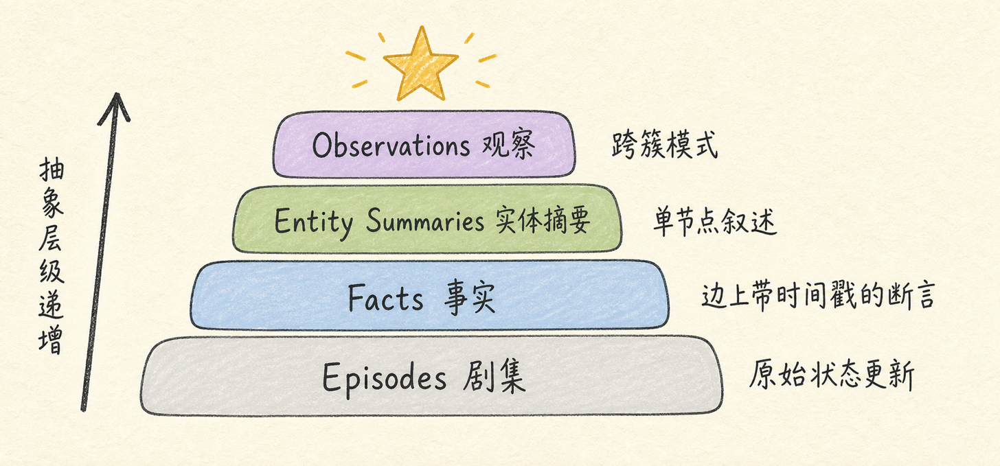

同一个星期，三个工程师分别向 PM 助手提交了阻塞上报：

- 周一，Alice：API 迁移卡住，在等后端团队的 auth 服务重构。
- 周三，Bob：支付集成停了，也在等后端团队的 auth 服务重构。
- 周五，Clara：结账流程推不动，因为 Bob 的支付集成还没好。

Agent 把三条都存下来了，每条都能准确检索。但你问它"团队这周被什么卡住了"，它只能把三条事实列给你。

它看不出来的是：**三条阻塞指向同一个根因——auth 服务重构。解掉这一个任务，三个人全部松绑。**

一个刚入职的 PM 看到三条上报，会当成三个问题去解；一个老 PM 看到同样的三条，会看到一个问题带着三个症状。没人教过老 PM 这么连线，他开的站会足够多，认得出这个"形状"。

今天的 Agent 记忆系统，给你的永远是那个新 PM。

Akshay Pachaar 昨天发了一篇长文，拆解 Zep（开源版本是 Graphiti）怎么补上这一层，功能叫 **Observations**。先说清楚：原文是 Zep 赞助的，立场有倾向性，但里面的机制设计是真的值得拆——尤其是"哪些事交给算法、哪些事交给 LLM"这条边界，画得很克制。

结论先给：**记忆系统缺的不是更好的检索，而是一步对已有事实做结构分析、并把分析结果写下来的动作。** 这步动作的产出，就是 Observation。

## 先把底座说清楚：事实是怎么存的

Zep 会把对话和业务数据构建成一张知识图谱，三种构件：

- **实体（Entities）**：名词。人、任务、服务、团队。
- **事实（Facts）**：连接两个实体的带标签边。"Alice 被 API 迁移阻塞"就是 Alice 节点和 API 迁移节点之间的一条边。
- **剧集（Episodes）**：原始素材。对话消息、JSON、文档原文。每条事实都能溯源回它来自哪一集。

图可以按用户隔离，也可以整个团队共享一张项目图。上面三条周报进来，图长这样：



注意一个细节：**Clara 从头到尾没提过 auth 服务。** 她离根因隔了两跳——后面讲规则方案为什么抓不到她，就漏在这里。

## 为什么"把检索调好一点"没用

Agent 查询"团队被什么卡住了"，图谱返回六条事实，条条正确：

```text
Alice 被 API 迁移阻塞
API 迁移在等 auth 服务重构
Bob 被支付集成阻塞
支付集成在等 auth 服务重构
Clara 被结账流程阻塞
结账流程在等支付集成
```

你可以调 reranker、扩大检索范围、多返回几条——都没用。**Agent 需要的那条洞察，从来没有被当作一条内容存进去过。** 它存在于三条独立对话的连接方式里，而检索只能取出"已存的东西"。

大多数团队的 workaround 是写规则：超过三个人提到的阻塞就报警。这条路有两个洞：

1. 它只说"团队卡住了"，不说"先解哪个任务"。
2. 它只能抓住被大家直接点名的阻塞。Clara 没提 auth 服务，规则就数不到她那一票。

每周三条上报，人脑还连得过来。每周三十条的时候没人做得到——而那恰恰是依赖链最值钱的时候。

## Observations 怎么生成：算法分组，LLM 只写摘要

Zep 给这张项目图生成的 Observation 长这样：

> **名称**：Auth 服务重构正在阻塞多条工作流
>
> **摘要**：auth 服务重构（后端团队负责）是一条依赖链的根阻塞，影响三条工作流。Alice 的 API 迁移和 Bob 的支付集成直接等它，Clara 的结账流程在支付集成下游被卡住。解掉 auth 服务重构，三个工作流全部清通。

图里没有任何一条单独的事实包含这段话。它横跨三个人、四个工作项、三次独立对话。

生成机制是一条两段流水线，分工非常明确：



**第一段，确定性算法负责聚类，不用任何模型。**

先把每条事实归约成一个"签名"：它连接的两个实体 + 关系类型。于是每一集对话都带着一组签名：

```text
第 1 集（Alice）：(Alice, API 迁移)、(API 迁移, Auth 服务)、(Auth 服务, 后端团队)
第 2 集（Bob）：(Auth 服务, 后端团队)、(支付集成, Auth 服务)、(Bob, 支付集成)
第 3 集（Clara）：(Bob, 支付集成)、(结账流程, 支付集成)、(Clara, 结账流程)
```

然后视角翻转：不看"实体被事实连接"，改看"剧集被共享签名连接"——剧集是节点，共享签名是边。



第 1 集和第 3 集没有任何共同实体，但第 2 集两头都沾，充当桥梁，三集落进同一个连通分量。这里有个巧合值得记住：**算法走的链，和项目里真实的依赖链，是同一个结构。**

为什么不用 embedding 聚类？因为 embedding 按"话题相似"分组——三条周报都是工程内容，会跟本周其他所有周报糊成一坨。签名聚类按"引用同一对实体之间的同一种关系"分组，特定的依赖链才能被切出来。

**第二段，LLM 只做一件事：把聚类结果写成人话。**

一次受约束的调用，输入是这个簇的关键实体、按时间排序的原始对话、关系类型，输出一个名字加一段摘要。提示词被引导向"持久信号"——决策、约束、依赖、状态变更——并且只允许写证据明确支持的内容。

哪些实体进来、哪些对话算数、时间窗口多大，全部由算法决定。LLM 不决定分组，只负责表达。

这个分工是我觉得全文最值得抄的设计。聚类交给确定性算法，可解释、可复现、便宜；LLM 只做它擅长的那部分——把结构翻译成自然语言。反过来的系统（让 LLM 决定"哪些事实相关"）我见一个怕一个，因为你既没法调试它的分组逻辑，也没法保证它明天和今天分的一样。

## 三条硬约束：Observation 和"Agent 的猜测"的区别



- **跨实体**：事实蹲在一条边上，Observation 综合的是整个簇。
- **带证据**：每个结论都能回溯到具体的事实和剧集。
- **只读**：不能手动创建、编辑、删除。Observation 跟着证据走。

只读这条初看别扭，细想是自洽的：Observation 是图的结构属性的自然语言描述，不是用户数据。证据变了，它就变——新对话落进已有簇，Observation 带着新证据重新生成；出现矛盾证据，旧的直接退役。后端团队下周把 auth 重构发出去，这条 Observation 会自动改写，围绕"现在到底什么在卡进度"重新成形。

它不会变成那种写完就腐烂在角落里的静态文档。

## 怎么用，以及什么时候值得用

SDK 层面就是两个调用：

```python
# 列出项目图的全部 observations
observations = client.graph.observation.get_by_graph_id(graph_id="project-atlas")

# 按相关性搜索
results = client.graph.search(
    graph_id="project-atlas",
    query="blocked workstreams",
    scope="observations",
)
```

PM 问"这周优先推什么"，没有 Observations 的 Agent 列出三条阻塞，排序还得人自己想；有的 Agent 直接回答：auth 服务重构是根阻塞，解掉它直接清通 Alice 和 Bob、下游清通 Clara，本周杠杆最高的动作是给后端团队加资源。

同一个查询，同一份数据。一个描述了处境，一个指出了动作。



但我不会因为一篇赞助文就给所有项目加上这层。我的取舍是：

**值得加的场景**：PM 助手、客服知识库、投研助手这类"多人、多会话、事实之间存在依赖链"的系统。判断信号很直接——你的用户是不是经常需要问"这些情况之间有没有关联"这类问题。

**不值得加的场景**：单用户、事实之间基本独立的场景（个人笔记助手、FAQ 机器人）。事实不构成簇，Observation 这层就是空转，还白付一份图构建的成本。

## 可以直接拿走的自检清单

不管你用不用 Zep，判断自家 Agent 记忆缺不缺这一层，回答四个问题：

```text
1. 我的 Agent 回答"这些情况有什么关联"时，是在检索还是在推理？
   —— 检索出来的事实条条正确却拼不出结论，就是缺这层。
2. 系统里有没有"没人直接点名、但多跳之后是根因"的模式？
   —— 有（像 Clara 那样隔两跳），规则方案会漏，需要结构分析。
3. 每周新增的事实量，是否已经超过人脑手动连线的规模？
   —— 几十条以内靠人，往上靠算法。
4. 如果加一层"综合判断"，它能不能溯源、会不会自动过期？
   —— 不能溯源的是猜测，不会过期的是负债。
```

记忆系统这些年的演进，从向量检索到图谱到实体摘要，解决的都是"记住"和"找到"。Observations 这个方向第一次正面处理"看懂"——而且用的是最 boring 也最让人放心的方式：确定性算法定结构，LLM 只做表达。这个"算法分组、模型摘要"的切分方式，即使你不买 Zep，也值得搬进自己的记忆管线里。

## 最后

Agent 记忆的军备竞赛，过去几年全打在"检索"上：更大的窗口、更好的 embedding、更细的 rerank。但 Alice、Bob、Clara 的例子说明，检索做得再好，回答的也只是"人们说了什么"。

没人能上报那条链，因为没人看得见整条链。把它显式写出来，需要的是对合并后的数据做结构分析——这一步做完，Agent 才从"过目不忘的书记员"变成"看得出形状的老 PM"。

我把文中的「四层记忆模型 + 是否需要 Observation 层的自检清单」整理成了可复制版本。关注「蒸馏小余」，回复 `OBS` 获取。

## 参考资料

- 原文：[Your Agent Remembers Everything and Understands Nothing](https://x.com/akshay_pachaar/status/2086451430580470095)，Akshay Pachaar（Zep 赞助内容，请自行甄别立场）
- Graphiti 开源仓库：<https://github.com/getzep/graphiti>
- Zep Observations 文档：<https://help.getzep.com/observations>
