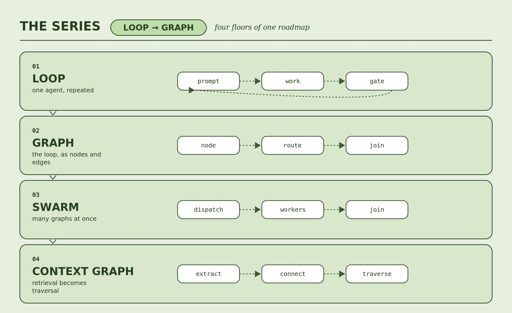
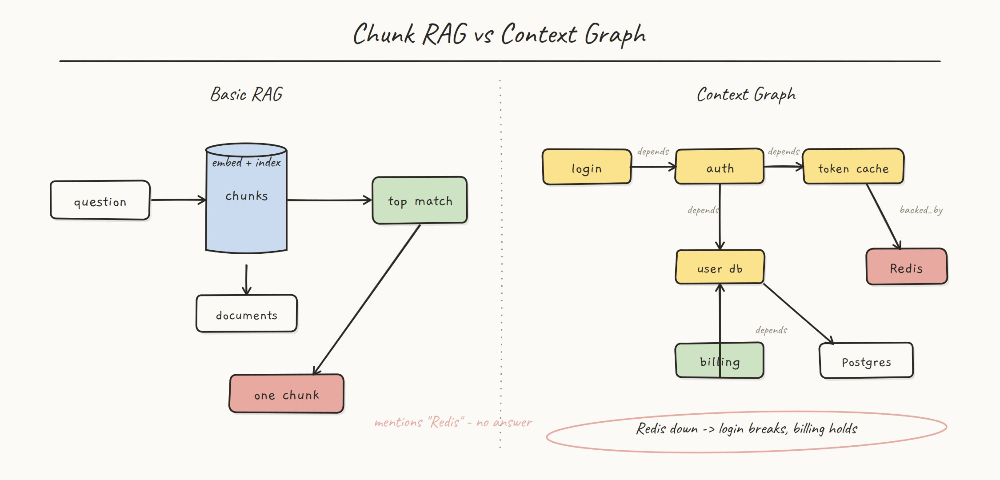
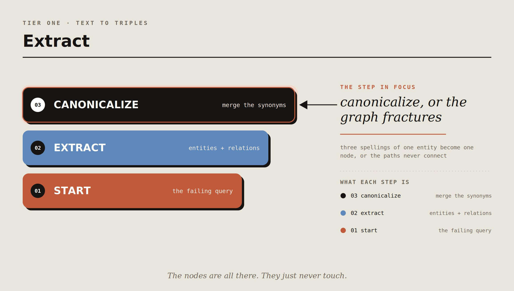
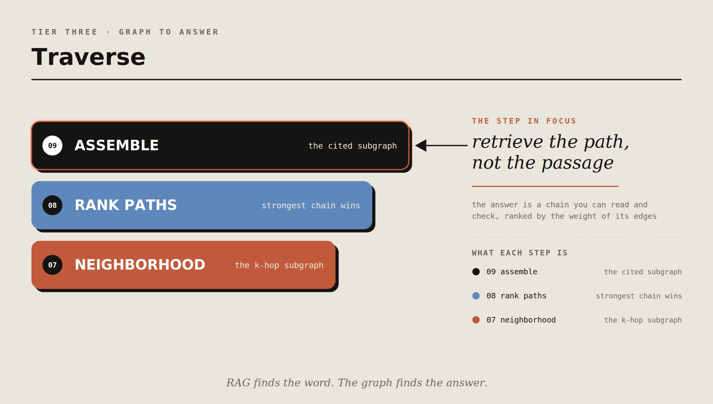
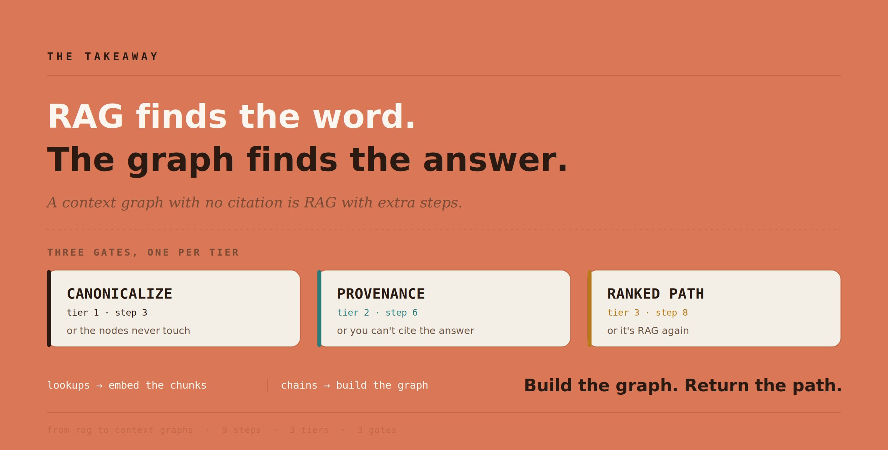

# From RAG to Context Graphs: the 9-step roadmap

Ask a chunk retriever - "what breaks if Redis goes down" and it hands you the one sentence in your corpus that contains the word Redis. 

- That sentence does not answer the question. The answer was spread across four documents that never mention each other, and similarity search has no way to walk from one to the next. 



That is the ceiling of RAG, and it is not a tuning problem. Embeddings retrieve text that mentions the thing you asked about. They cannot retrieve the thing itself, or the chain of relationships that actually holds the answer. For a single-fact lookup that is fine. For anything multi-hop, it is structurally the wrong tool.



- The fix is to stop retrieving passages and start retrieving a graph: entities as nodes, relationships as edges, answers as paths. This is the 9-step roadmap from chunks to a context graph you can traverse and cite. No framework. The engine below is about 150 lines.

# Tier I - Extract



## 01. Start from the question RAG can't answer

Do not begin by building a graph. Begin by writing down the query that your current retriever fails, because that query defines the entities and relations the graph actually needs.

> The failing queries have a shape: they are multi-hop. "What breaks if Redis goes down" is really "what depends on the thing that depends on the thing that Redis backs." Each hop is a relationship, and the answer is a path, not a passage. If your hardest queries are single-hop lookups, you do not need a graph. If they are chains, you do.

## 02. Pull entities and relations, not embeddings

RAG embeds chunks. A context graph reads each chunk and extracts triples: subject, relation, object. In production the extractor is an LLM call. Here it is a handful of deterministic patterns, so the output is reproducible.

```python
PATTERNS = [
    (re.compile(r"(.+?) depends on (.+)", re.I),   "depends_on"),
    (re.compile(r"(.+?) is backed by (.+)", re.I), "backed_by"),
    (re.compile(r"(.+?) runs on (.+)", re.I),      "runs_on"),
    (re.compile(r"(.+?) is owned by (.+)", re.I),  "owned_by"),
]

def extract(chunk_id: str, text: str) -> list[Triple]:
    out = []
    for sentence in re.split(r"[.\n]", text):
        s = sentence.strip()
        if not s:
            continue
        for rx, rel in PATTERNS:
            m = rx.match(s)
            if not m:
                continue
            subj = m.group(1)
            for obj in re.split(r"\band\b", m.group(2)):   # "X and Y" -> two edges
                obj = obj.strip()
                if obj:
                    out.append(Triple(subj.strip(), rel, obj, chunk_id))
            break
    return out
```

The "chunk_id" on every triple is not an afterthought. It is what makes the eventual answer citable, and it is the thing RAG throws away the moment it concatenates chunks into a prompt.

## 03. Canonicalize, or the graph fractures

First gate.

- "The Auth Service," "auth service," and "AuthService" are one entity. 

If the graph treats them as three, every edge you draw lands on a different node and the paths never connect. Canonicalization is the unglamorous step that decides whether the graph is a graph or three disconnected fragments.

```python
ALIASES = {
    "authservice": "auth service",
    "user db": "user database",
    "postgres": "postgresql",
}

def canon(name: str) -> str:
    n = name.strip().lower()
    n = re.sub(r"^the\s+", "", n)
    n = re.sub(r"\s+", " ", n)
    n = re.sub(r"[.]$", "", n)
    return ALIASES.get(n, n)
```

Lowercase, strip the article, collapse whitespace, apply an alias map. This is the entity-resolution problem in miniature, and getting it wrong is the single most common reason a homegrown GraphRAG returns nothing useful: the nodes are all there, they just never touch.

# Tier II - Connect


## 04. Build the edge list: subject, relation, object

The graph itself is two adjacency maps, forward and reverse, because you will traverse in both directions: forward to answer "what does X depend on" reverse to answer "what depends on X."

```python
@dataclass
class Edge:
    rel: str
    dst: str
    weight: int = 1
    sources: set = field(default_factory=set)

def add(self, t: Triple) -> None:
    s, o = canon(t.subj), canon(t.obj)
    self.nodes.add(s); self.nodes.add(o)
    self._merge(self.fwd, s, t.rel, o, t.source)
    self._merge(self.rev, o, t.rel, s, t.source)
```

Storing both directions doubles the memory and removes an entire class of "I can only search one way" bugs. For a knowledge graph that is always the right trade.

## 05. Weight edges by how many sources agree

If two different chunks both say the auth service depends on the token cache, that edge is stronger than one asserted by a single source. This is corroboration, the same idea that turned a swarm into a verifier, applied to a graph.

```python
@staticmethod
def _merge(side, a, rel, b, src) -> None:
    for e in side[a]:
        if e.rel == rel and e.dst == b:      # same edge seen again = corroboration
            e.weight += 1
            e.sources.add(src)
            return
    side[a].append(Edge(rel, b, 1, {src}))
```

On the real run, the auth-service-to-token-cache edge came from two chunks and carries weight 2. When two paths could answer a question, the one built from corroborated edges is the one to trust, and the weight is how you rank them in step 8.

## 06. Attach provenance to every edge

Second gate.

Every edge carries the set of chunks it came from. This is the property that makes a context graph answerable rather than merely suggestive: when the graph returns a path, it returns the receipt for each hop.

```python
def cite_path(g: ContextGraph, path: list[str]) -> list[str]:
    lines = []
    for a, b in zip(path, path[1:]):
        for e in g.fwd.get(a, []):
            if e.dst == b:
                src = ",".join(sorted(e.sources))
                lines.append(f"{a} -{e.rel}-> {b}  [{src}]  x{e.weight}")
                break
    return lines
```

The output looks like this, and it is the whole point: 

login flow -depends_on-> auth service  [c1]  x1
auth service -depends_on-> token cache  [c2,c8]  x2
token cache -backed_by-> redis  [c3]  x1

Three hops, three citations, one of them corroborated. A graph that cannot cite its edges is a pile of assertions with better packaging.

# Tier III - Traverse



## 07. Retrieve by k-hop neighborhood

Now retrieval stops being similarity and becomes a walk. The context for a question is not the top-k most similar chunks. It is the subgraph within k hops of the entities the question names.

```python
def neighborhood(g: ContextGraph, start: str, hops: int) -> set:
    seen, frontier = {canon(start)}, {canon(start)}
    for _ in range(hops):
        nxt = set()
        for n in frontier:
            for e in g.fwd.get(n, []):
                nxt.add(e.dst)
        frontier = nxt - seen
        seen |= nxt
    return seen
```

## 08. Rank paths, not passages

Third gate.

The multi-hop question is answered by reverse reachability: if Redis breaks, walk the reverse edges to find everything upstream that breaks with it.

```python
def impacted_by(g: ContextGraph, failed: str) -> list[tuple[str, list[str]]]:
    start = canon(failed)
    out, seen = [], {start}
    q = deque([(start, [start])])
    while q:
        node, path = q.popleft()
        for e in g.rev.get(node, []):
            if e.dst in seen:
                continue
            seen.add(e.dst)
            newpath = path + [e.dst]
            out.append((e.dst, newpath))
            q.append((e.dst, newpath))
    return out
```

The result is not a ranked list of documents. It is a ranked list of paths, each one a causal chain you can read and check.

token cache   via redis <- token cache
auth service  via redis <- token cache <- auth service
login flow    via redis <- token cache <- auth service <- login flow
survives: billing, platform team, postgresql, user database

Three things break, four survive, and the graph can name both sets. A chunk retriever cannot produce the "survives" list at all, because nothing in the corpus states it. It is only visible in the structure.

## 09. Assemble the subgraph, with citations

The final step hands the model a subgraph, not a wall of text. The nodes on the answer path, the edges that connect them, and the chunk id behind each edge become the context window, and the model's job shrinks from "find the answer in this pile" to "read this chain and phrase it."

That shrinking is the real win. You have moved the hard part, connecting scattered facts, out of the prompt and into a structure you built and can inspect. The model stops guessing at connections and starts reading them.

## What the graph actually answers

I built the graph from eight one-fact chunks, ran the chunk retriever and the traversal on the same question, and printed both.

Read the first block against the last. The chunk retriever returns the sentence with Redis in it, and that sentence does not contain the answer. The graph returns the chain from the login flow down to Redis, with a citation on every hop and a weight of 2 on the edge two sources agreed on. Same corpus. One retriever found the word, the other found the answer.

## Conclusion: RAG retrieves what mentions the answer. A graph retrieves the answer.

Nine steps, three tiers, three gates.

> Tier 1 turns prose into entities and relations and makes them line up. Tier 2 connects them into a weighted, cited graph. Tier 3 retrieves by walking that graph instead of by measuring similarity, and returns paths you can read and verify.

Notice where the gates sit. Canonicalization ends Tier 1, provenance ends Tier 2, the ranked path ends Tier 3. Same shape as the loop, the graph, and the swarm, and for the same reason. A context graph with no citation is RAG with extra steps.

- For two years the retrieval pitch has been better embeddings: bigger models, longer context, smarter chunking. That work has a ceiling, and the ceiling is not embedding quality. It is that a chunk can only tell you what it says, and a multi-hop answer is never in any single chunk. No amount of similarity closes a gap that is structural.

But the honest version is not that everyone should build a graph. Most retrieval is single-hop, and for single-hop lookups RAG is simpler, cheaper, and correct. The test is step 1: are your hardest questions lookups or chains? If they are lookups, embed your chunks and move on. If they are chains, you are already asking the graph a question. You just have not built it yet.



- If you pass the test, build small. One relation type. One canonical entity table. One traversal. Get "what depends on X" returning a cited path before you add a second edge type. Order matters: extraction feeds connection, connection feeds traversal, and a traversal over un-canonicalized nodes returns nothing at all.

The point was never better search over text. It was retrieving structure instead of prose. Build the graph. Return the path.