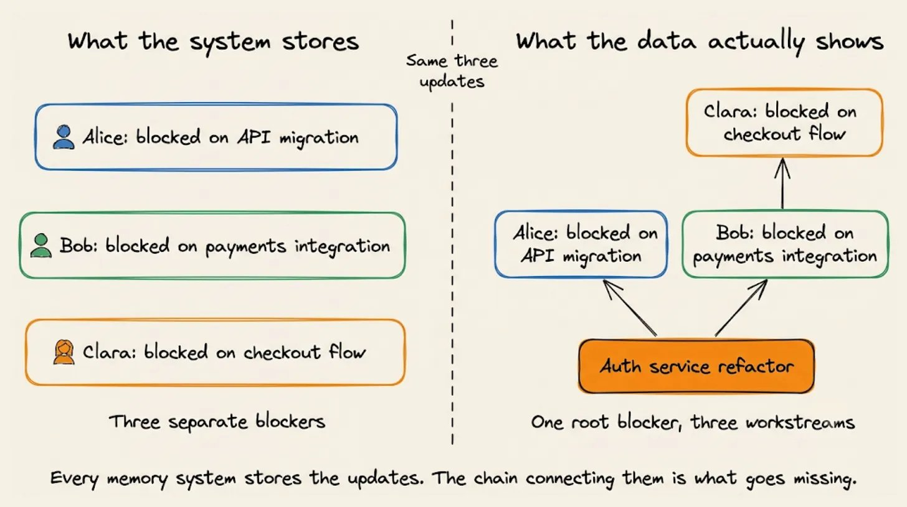
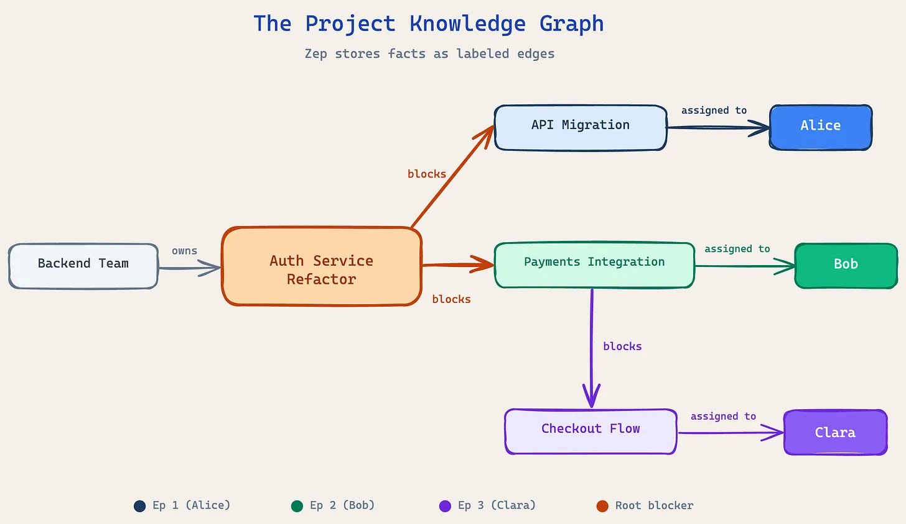
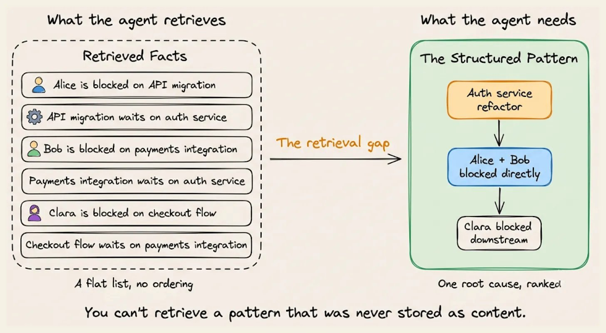
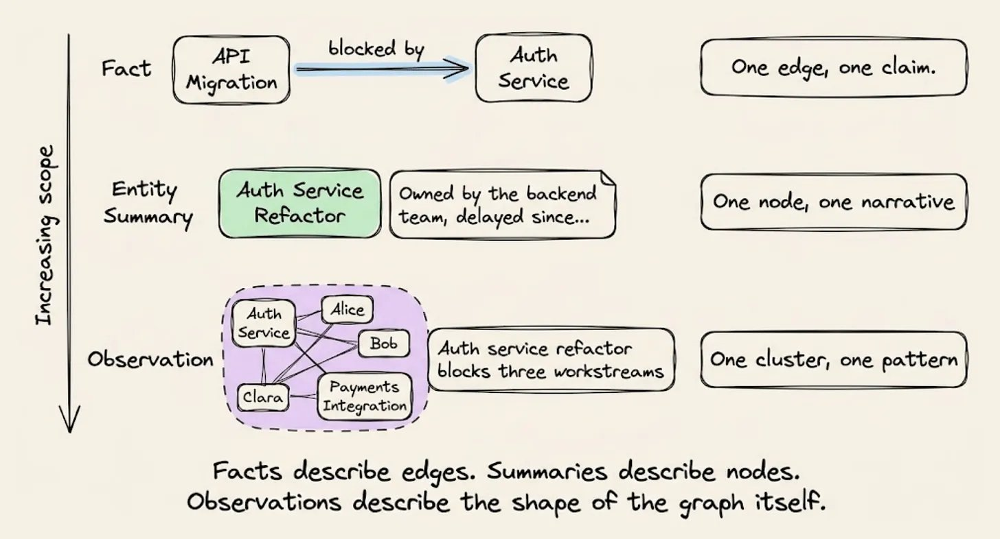
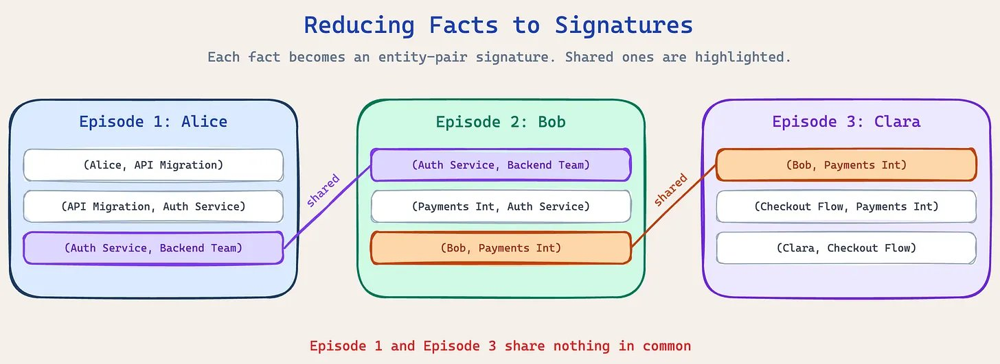
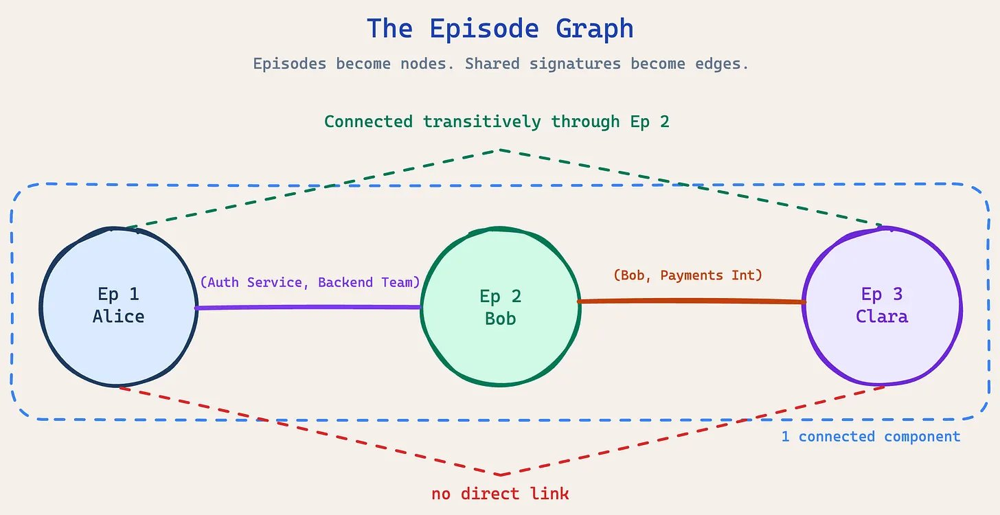
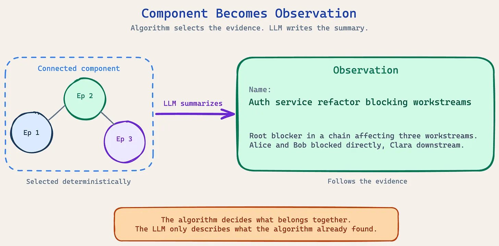
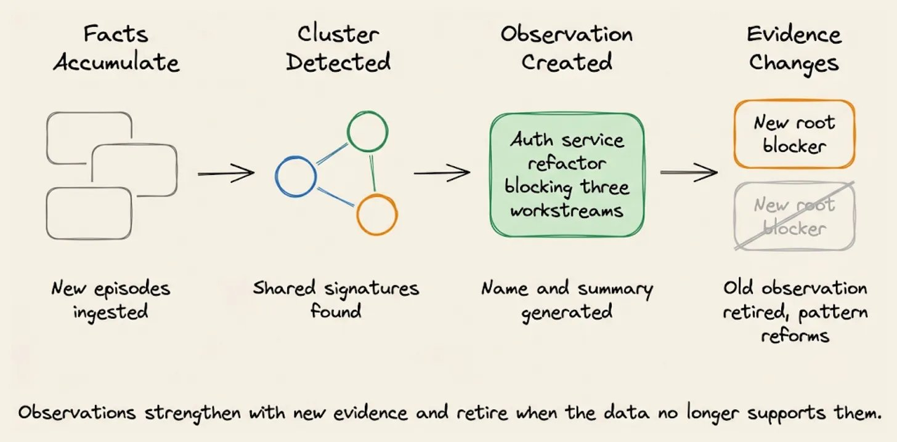
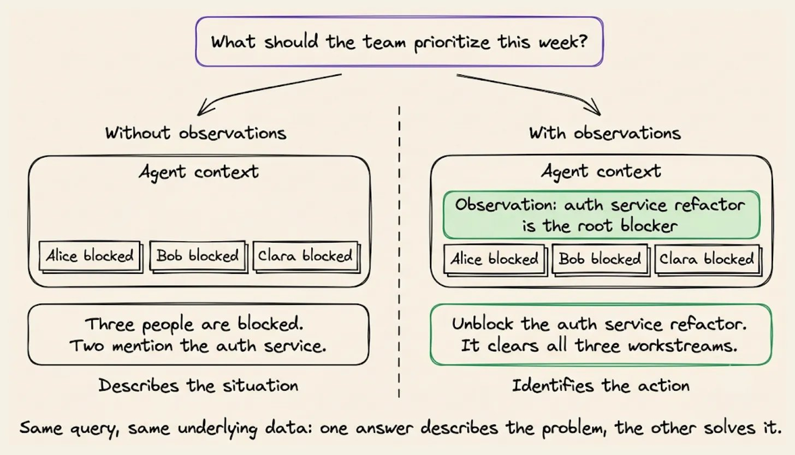
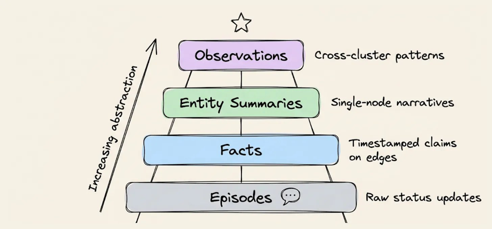

# Your Agent Remembers Everything and Understands Nothing

Agent memory is where analytics was for years, returning what you asked for and nothing more. Then analytics started surfacing which number moved and why, without the query. Agent memory hasn't made that jump yet.

Or it just has?   

Every agent memory system today solves the same problem. They store facts and retrieve the right ones at query time.

The part that’s missing is pattern recognition.

Consider a project management assistant that reads status updates from an engineering team. Three people file updates in the same week. Each one reports a blocker and each report is accurate and specific.

The agent stores all three and can retrieve any of them on request.

What it can’t tell you is that all three blockers trace back to a single delayed task.



Think of it like this. A new project manager reads three status updates and sees three problems to solve. An experienced one reads the same three and sees one problem with three symptoms.

Nobody taught the experienced PM to connect them. They've sat through enough standups to recognize the shape.

Agent memory today gives you the new PM. It stores every update correctly, retrieves them accurately, but misses the structure connecting them,

Closing that gap takes something other than better retrieval. It takes a step that analyzes the stored facts as a structure and writes down what that structure shows.

The output of that step is an observation. It is a piece of context assembled from how facts connect across many conversations rather than from anything a single conversation contained.

Each one stays tied to the specific facts and messages that produced it, which is what makes it durable context the agent can rely on instead of a guess.

Let's look at how it works.

# How the knowledge graph stores data

[Zep](https://www.getzep.com/) ([open-source Graphiti](https://github.com/getzep/graphiti)) is one of the agent memory platforms that implements this, and it ships the capability as a feature called Observations. The mechanism starts with the graph it builds from your data.

It builds a knowledge graph from conversations and business data. The structure has three building blocks:

- Entities are the nouns: people, products, places, tasks, services.
- Facts are specific claims connecting two entities, stored as labeled edges. “Maya purchased a standing desk” is a fact that sits on the edge between the Maya entity and the Standing Desk entity.
- Episodes are the raw source material: the actual conversation messages, JSON payloads, or documents that Zep ingested. Every fact traces back to the episode it was extracted from.

Graphs can be scoped to a single user or shared across a team.

A user graph holds one person's history. A shared graph holds everything about a project, a workspace, or an organization, with data from many people flowing into the same structure.

Here’s a concrete example of a shared project graph.

Three engineers file status updates with a PM assistant over one week:

- Alice (Monday): The API migration is blocked. She’s waiting on the auth service refactor, which the backend team owns.
- Bob (Wednesday): The payments integration is stalled. He’s also waiting on the auth service refactor from the backend team.
- Clara (Friday): The checkout flow can’t move forward because the payments integration isn’t ready. That work belongs to Bob.

Zep processes each update as an episode, extracts the entities and facts automatically, and builds the knowledge graph:



Every fact is accurate and individually retrievable. What the graph doesn’t contain is the shape those facts form together.

# Why better retrieval doesn’t solve this

When the agent queries “what’s blocking the team,” it gets back the stored facts:

- Alice is blocked on the API migration
- The API migration is waiting on the auth service refactor
- Bob is blocked on the payments integration
- The payments integration is waiting on the auth service refactor
- Clara is blocked on the checkout flow
- The checkout flow is waiting on the payments integration

Every line is correct but nothing in the result tells the agent that unblocking one task clears all three people.



You can tune the reranker, widen the search scope, or return more results.

None of it helps, because the insight the agent needs was never stored as a discrete piece of content. It exists in how the facts connect across three separate conversations.

The workaround most teams reach for is a rule: flag any task that three or more people mention as a blocker. It just tells you the team is stuck without telling you which task to unblock first, and it only catches blockers that people name directly.

Clara never mentions the auth service. Her update is two hops away from the actual cause.

At this scale a person could connect the dots manually. But at thirty status updates a week, nobody does, and that's exactly when the chain matters most.

What Observations produce

For this project graph, Zep generates:

> Name: Auth service refactor blocking multiple workstreams
> 
> Summary: The auth service refactor, owned by the backend team, is the root blocker in a dependency chain affecting three workstreams. Alice’s API migration and Bob’s payments integration are both waiting on it directly. Clara’s checkout flow is blocked downstream of the payments integration. Unblocking the auth service refactor clears all three.

No individual fact in the graph contains this. It spans three people, four work items, and three separate conversations.



Three properties make observations different from individual facts:

- Cross-entity: A fact sits on one edge between two entities. An observation synthesizes across an entire cluster, connecting multiple entities and conversations.
- Evidence-backed: Every claim traces to specific facts and episodes in the graph.
- Read-only: You can’t manually create, edit, or delete observations. They follow the evidence. The mechanism below explains why.

# How Observations are created

The mechanism is a two-stage pipeline:

- A deterministic algorithm first handles the clustering
- An LLM writes the summary afterward. The model never decides what gets grouped.

## Reducing facts to signatures

Zep runs a background process that periodically checks for new data. When new conversations have been ingested and the graph has settled, it kicks off the analysis.

The first step reduces every fact to a signature: the two entities it connects plus the relationship type. The goal is to find which conversations reference the same relationships between the same entities.

After reduction, each episode (conversation) has a set of signatures:

- Episode 1 (Alice’s update): (Alice, API Migration), (API Migration, Auth Service), (Auth Service, Backend Team)
- Episode 2 (Bob’s update): (Auth Service, Backend Team), (Payments Integration, Auth Service), (Bob, Payments Integration)
- Episode 3 (Clara’s update): (Bob, Payments Integration), (Checkout Flow, Payments Integration), (Clara, Checkout Flow)



The overlaps become visible:

- (Auth Service, Backend Team) appears in Episode 1 and Episode 2
- (Bob, Payments Integration) appears in Episode 2 and Episode 3
- Episode 1 and Episode 3 share nothing

Alice never mentions Bob, Clara, the payments integration, or the checkout flow. Clara never mentions Alice, the auth service, or the backend team.

## Building the episode graph

Here Zep flips the perspective.

Instead of looking at entities connected by facts, it builds an episode graph where conversations are the nodes and shared signatures are the edges.

- Episode 1 links to Episode 2 through (Auth Service, Backend Team)
- Episode 2 links to Episode 3 through (Bob, Payments Integration)
- Episode 1 and Episode 3 don’t share a signature

But all three end up in the same connected component because Episode 2 bridges them.

Alice's update and Clara's update join the same cluster despite having no entity in common, because Bob's update touches both sides and acts as the bridge between the two.



Worth noticing that the chain the algorithm follows and the dependency chain in the project are the same structure. Zep finds the root blocker by following exactly the kind of transitive link it was built to follow.

This uses no embeddings, no semantic similarity, and no ML model. It’s pure graph topology: which conversations share facts about the same entity pairs, and how those shared pairs chain them into connected groups.

The distinction matters because embedding-based clustering groups content that discusses similar topics. All three status updates would cluster together under that approach simply because they're all about engineering work, along with every other status update that week.

Signature-based clustering groups episodes that reference the same relationships between the same entities, which is what makes the specific chain detectable.

## Summarizing the cluster

Once the algorithm identifies the connected component, an LLM writes the summary.

A single, constrained LLM call receives the cluster’s key entities, the supporting conversations in chronological order, and the relationship types.

It then returns a name and summary steered toward durable signals like decisions, constraints, dependencies, and state changes, and restricted to facts the evidence explicitly supports.



Every structural property of the observation (which entities, which conversations, the time window) is decided by the algorithm. The LLM only turns that structure into readable prose.

This is why observations are read-only. They’re structural properties of the graph, described in natural language. When the evidence changes:

- New conversations that fit an existing observation cause it to be regenerated with the new evidence
- Contradicting evidence causes the old observation to be retired
- The graph always reflects the current state of what is known’



If the backend team ships the auth service refactor next week, the observation updates. Alice and Bob unblock, Clara's dependency shifts, and the pattern reforms around whatever is actually blocking work now.

What this changes for the agent

Retrieving observations through the SDK:

```python
# List all observations for a project graph
observations = client.graph.observation.get_by_graph_id(graph_id="project-atlas")

# Search observations by relevance
results = client.graph.search(
    graph_id="project-atlas",
    query="blocked workstreams",
    scope="observations",
)

```

Now consider the PM asking the agent what the team should prioritize this week.

Without observations, the agent retrieves the blocker facts and lists them. Three people are blocked. Two mention the auth service. One mentions the payments integration. The PM gets an accurate summary and still has to work out the ordering.

With observations, the agent’s context includes the dependency chain. It reports that the auth service refactor is the root blocker, that unblocking it clears Alice and Bob directly and Clara downstream, and that the single highest-leverage action this week is getting the backend team the resources to finish it.



Same query, same data. One response describes the situation. The other identifies the action.

# The bigger picture

The progression of context in Zep:

- Episodes store raw conversation data
- Facts structure it into timestamped claims
- Entity summaries narrate the history of individual nodes
- Observations synthesize patterns across the cluster

Each layer answers a different type of question. Together, they move agents from recall toward understanding.



Alice, Bob, and Clara each filed an accurate status update. Every fact went into the graph correctly and every one was retrievable.

What none of them could report, because none of them could see it, was the chain running underneath all three.

That's the gap Observations closes. Not better retrieval of what people said, but structural analysis of what their combined data shows.

Resources:

- [Zep Graphiti GitHub repo →](https://github.com/getzep/graphiti)
- [Zep Observations docs →](https://help.getzep.com/observations)

If you are building an open-source tool that AI engineers would love, reach out. We only cover tools that pass our own test, so we'll try yours first and write about it only if it holds up.

Thanks to ZepAI for sponsoring today's issue.