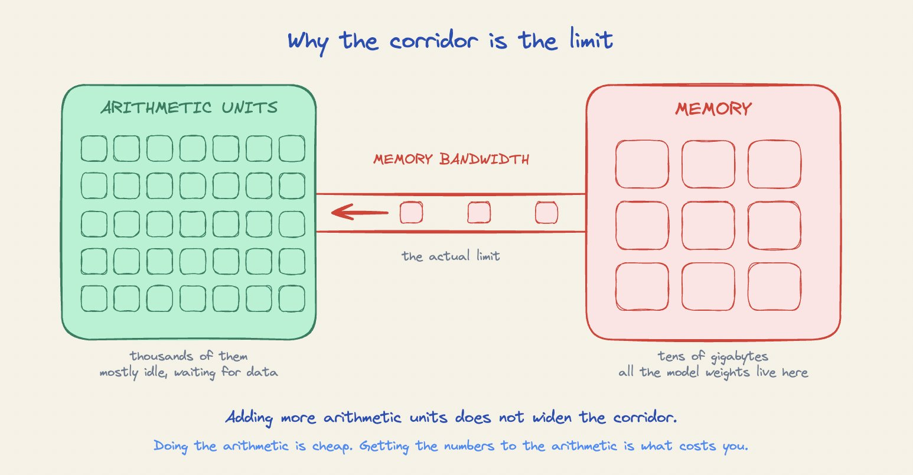
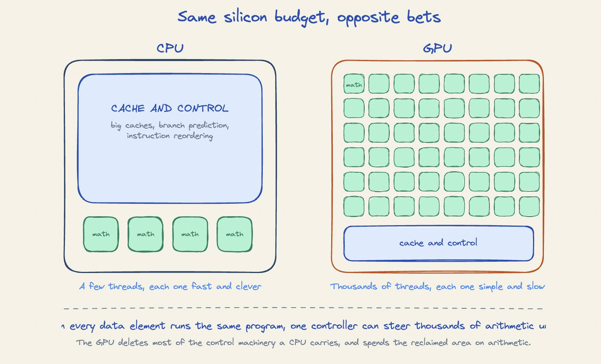
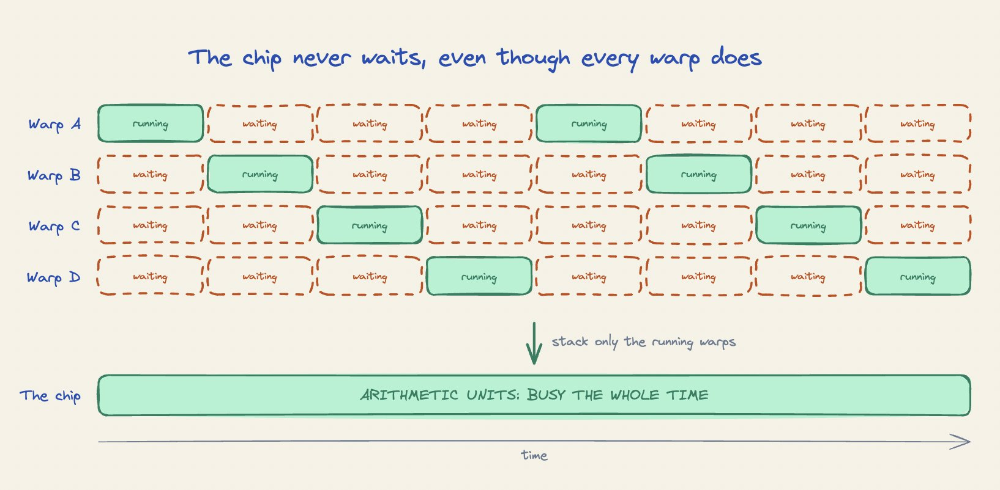
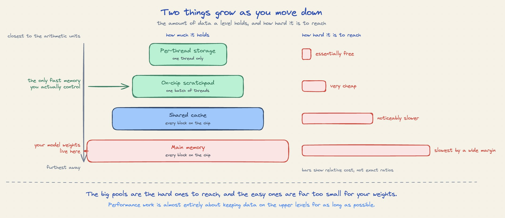
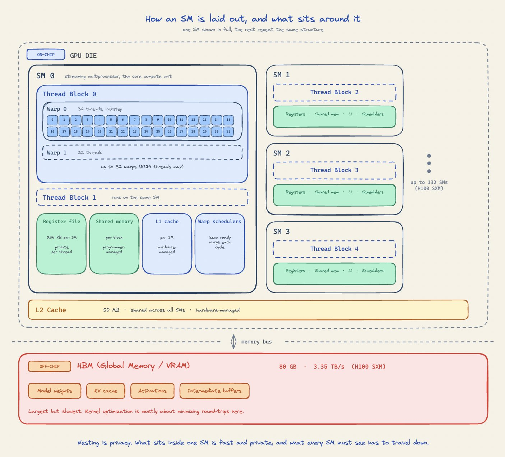
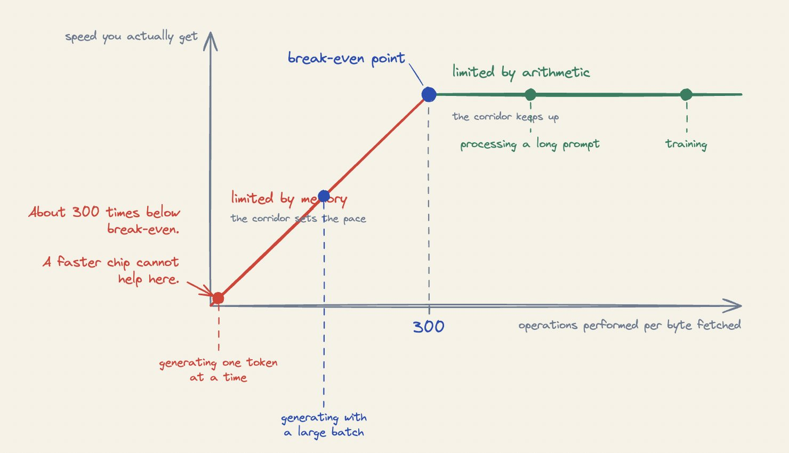
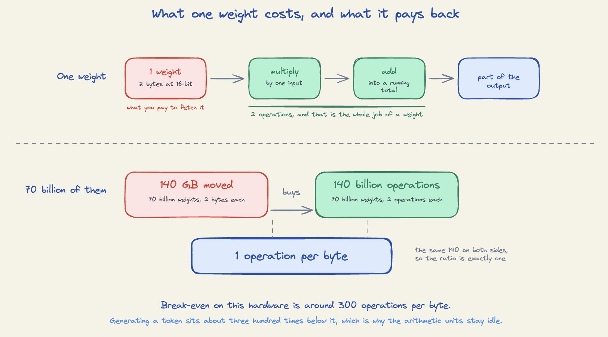
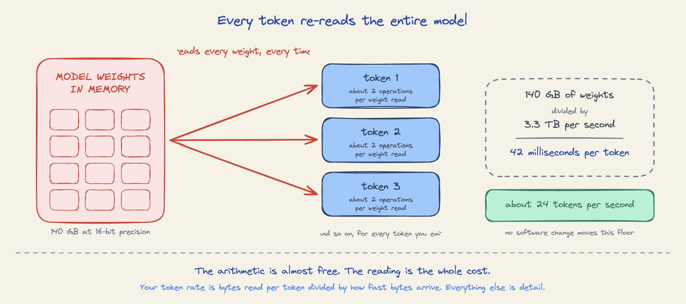
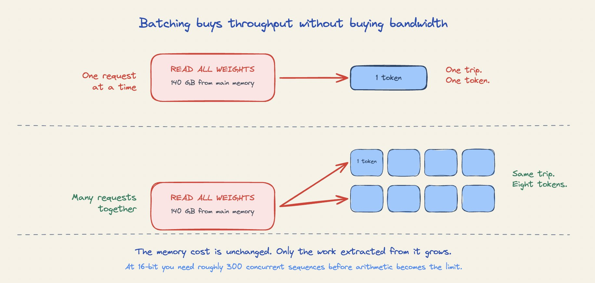
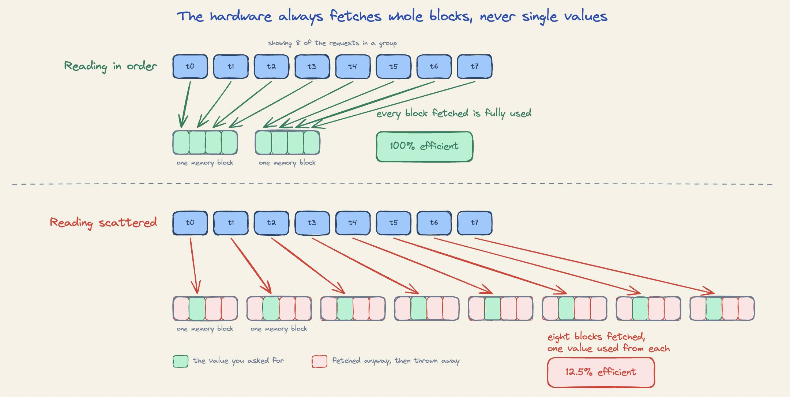

# How a GPU Actually Works

The intuition an LLM engineer needs, without the hardware manual.

By the end, techniques like quantization, speculative decoding, and continuous batching should stop looking like a list of tricks to memorize.

Here is something that confuses almost everyone who starts serving language models.

You rent a top-end data center GPU. The spec sheet says it can perform close to a thousand trillion arithmetic operations per second. You load a 70 billion parameter model onto it and start generating text. You watch the utilization monitor, and it reads high. Everything looks healthy.

Then you count the tokens. You are getting a few dozen per second from a chip rated for a thousand trillion operations. Almost none of that arithmetic capability is doing anything.

Nothing is broken. Your code is fine, your drivers are fine, and buying a bigger GPU will barely help. What you are seeing is the single most important fact about this hardware, and once you can see it clearly, most performance advice you have read stops being a list of tricks and starts being obvious.

This article builds that intuition from the ground up. We will look at why a GPU is shaped the way it is, why memory and compute are in constant competition, and what actually makes these machines go faster.

No CUDA is required. We will name a few real chips where a concrete number helps, but nothing here depends on memorizing them, and in every case the ratio matters far more than the figure it came from.

> 👉 Prerequisites. You should be comfortable with the idea of a neural network doing matrix multiplications, and you should know that model weights are numbers stored in memory. That is genuinely all.

Let's begin!

# One asymmetry explains almost everything

Start with the single fact the whole design rests on.

Doing arithmetic is cheap. Fetching the numbers to do arithmetic on is expensive.

That statement feels wrong the first time you read it. Multiplication sounds like the hard part and moving a number sounds trivial. On modern hardware the opposite is true, and it is not a small gap.

A useful picture is a workshop. The arithmetic units are workbenches, thousands of them, packed into the middle of the room. The data lives in a warehouse, and the warehouse is connected to the workshop by one corridor.

The benches can consume material far faster than the corridor can deliver it. Add more benches and nothing changes, because the corridor was already the limit. That corridor is what people mean by memory bandwidth.

Every performance technique you will meet later is a way of getting more work out of each trip down that corridor.

# Why the gap keeps widening

This is not a temporary engineering shortfall. It is a long-running trend.

Across recent generations of accelerators, arithmetic capability has grown several times faster than memory bandwidth. Each new chip can do far more math, and can fetch only somewhat more data to do it on.

So the imbalance gets worse with every generation, not better. Techniques that reduce data movement become more valuable over time, and raw arithmetic capability tells you less and less about how a chip will actually perform for you.

# Why a GPU has thousands of simple units instead of a few clever ones

Now let's look at how the hardware responds to that asymmetry.

A CPU is built around making one sequence of instructions finish quickly. It spends most of its silicon on machinery for that. Large caches so data is already nearby. Prediction hardware so it can guess what comes next. Reordering logic so it can keep working while it waits.

All of that serves a single stream of work, and all of it is expensive in chip area.

A GPU makes the opposite bet, because it was designed for a workload with an unusual property. In graphics, every pixel runs the same short program on different data. In neural networks, every element of a tensor gets the same treatment.

When the program is identical across millions of data elements, you no longer need one controller per element. One controller can steer thousands of arithmetic units, all executing the same instruction on different values.

That is the whole trick. The GPU deletes most of the control machinery a CPU carries and spends the reclaimed area on arithmetic units instead.

The comparison in raw counts is stark. A high-end server CPU advances a few hundred threads at once. A data center GPU advances tens of thousands per clock tick, on a similar power budget.

The catch is that a GPU thread is a much weaker thing. It cannot go its own way, and it is not fast on its own. It is one lane in a very wide, very simple machine.

> 👉 One term worth learning, because you will see it everywhere. Threads are not scheduled one at a time. The hardware handles them in fixed groups of 32 that move in lockstep and share a single instruction, and a group of 32 is called a warp. That is the whole definition, and it is the unit the chip actually works with.

# The one place this leaks

Because a warp shares a single instruction, the 32 threads in it cannot disagree about what to do.

If your code branches on the data, and some threads in a warp take one path while others take the other, the hardware runs both paths in sequence. It switches off the threads that are not on the current path, and they sit idle producing nothing.

The warp takes as long as both branches added together.

This only costs you when the disagreement happens inside a warp. Different warps taking different paths is free. In practice it means data-dependent branching in a tight inner loop is worth avoiding, and it is rarely something you hit when you are calling library operations rather than writing your own.

# The GPU does not make waiting shorter. It makes waiting invisible.

We have said fetching data is slow. Both CPUs and GPUs face the same physical delay. They handle it in opposite ways.

A CPU tries to make the wait not happen, using caches and prediction to have the data ready before it is asked for.

A GPU accepts the wait and arranges to always have something else to do during it.

Here is the mechanism. The chip keeps far more work loaded than it can run at once. A single one of the chip's compute units might have sixty-four warps sitting resident, while only one gets to execute in a given tick.

When the running warp asks for data from main memory, it stalls. The scheduler does not wait with it. It picks another warp that is ready and runs that instead. When that one stalls, it picks a third.

The arithmetic units stay busy. Every individual warp spends most of its life waiting, and the machine as a whole never idles.

Switching between warps costs essentially nothing. On a CPU, changing which thread is running means saving one thread's state and restoring another's, which takes hundreds of cycles. On a GPU, every resident warp's state is already parked on the chip in dedicated storage. Switching means pointing at a different set of storage. It takes one tick.

This is why GPUs carry an enormous amount of fast on-chip storage. It is not there to make any one thread faster. It is there so thousands of threads can sit half-finished at the same time, ready to be picked up the instant their data arrives.

> 👉 This is the reason the utilization number in your monitoring is misleading. It usually reports whether any work was scheduled on the chip, not whether the arithmetic units were doing anything useful. A GPU that is 100% "utilized" while starved for data looks identical to one running at full throughput.

# The practical version

If you take one operational idea from this section, take this.

A GPU needs a large pile of independent work to run well. Give it a small job and it will finish that job at roughly the speed of the memory system, with most of the chip idle. Give it a large batch of similar work and the same hardware suddenly looks fast.

This is not a quirk. It is the design working as intended, and it is why batch size shows up in every serving discussion you will ever have.

# Memory is a ladder, and each level is far slower than the last

Now for the part that determines almost all of your performance.

Data does not simply live "in memory". It lives at one of several distances from the arithmetic units, and the difference between the nearest and the farthest is enormous.

There are four levels worth knowing.

1. Per-thread storage. The closest and fastest. Each thread holds a handful of values here while it works on them. Access is effectively instant.
2. On-chip scratchpad. A small pool of very fast memory attached to each compute unit, a few hundred kilobytes in size. Crucially, this one is under your control if you are writing low-level code. You decide what goes in it and how long it stays.
3. Shared cache. A larger pool, tens of megabytes, shared by the whole chip. Managed automatically by the hardware. You do not choose what lives here, though access patterns influence it.
4. Main memory. The big pool, tens of gigabytes, where your model weights and activations actually live. This is what people mean by VRAM. It sits physically outside the processing die, and reaching it is by far the slowest thing the chip does.

Two things change as you move down that list. The pools get bigger, and getting to them gets harder.

Level Roughly how big Who can see it Cost to reach     Per-thread storage a handful of values one thread essentially free   On-chip scratchpad hundreds of KB per block one batch of threads very cheap   Shared cache tens of MB, whole chip every block noticeably slower   Main memory tens of GB every block slowest by a wide margin

The gap between the two ends is not a modest one. Reading a value a thread already holds costs you nothing worth measuring. Reaching main memory costs hundreds of times more.

Your weights sit at the bottom level, which is the largest one and the only one big enough to hold them.

# Two costs, and the hardware only handles one

Reaching memory costs you in two separate ways, and keeping them apart is what makes the rest of this article make sense.

The first cost is the wait. You ask for data, and some time passes before it arrives.

The hardware deals with this one for you, using exactly the mechanism from the previous section. It keeps thousands of requests moving at the same time, so while one warp waits, plenty of others are being served. The wait is real, and it is almost entirely hidden.

The second cost is the width of the path. Only so many bytes can move per second, and no amount of overlapping requests changes that.

Nothing hides this one. It is a hard ceiling, and it is the reason a chip advertises its memory bandwidth as a headline number.

That is why every calculation in the rest of this article is about bandwidth rather than waiting.

# Where these levels actually sit

The ladder tells you how far away each level is. It helps to also know where they physically sit, because the layout explains why some of them are shared and others are not.

A GPU is not one big pool of arithmetic units. It is divided into a hundred or so independent units, and each one is a small self-contained machine. These are called streaming multiprocessors, almost always written as SMs, and it is worth using the real name because every tool and document you meet will use it.

Each SM carries its own copy of the top two levels. Its own register file for the threads living there, its own shared memory and L1 cache, and its own warp schedulers deciding which warp runs next. None of it is shared with the SM next door.

Work arrives as a thread block, which is a batch of threads handed to one SM that stays there until it finishes. Inside the block, the threads are handled as the warps we met earlier.

An example makes the split concrete. Say you launch a thread block of 256 threads, which is a common choice. The hardware divides it into 8 warps of 32, and those 8 warps are what the scheduler picks between from then on.

You never choose that division. You pick the size of the batch, and the grouping into 32s happens underneath you.

This is why batch sizes are almost always multiples of 32. Ask for 250 threads and you still get 8 warps, but the last one runs with only 26 of its 32 lanes doing anything, and the other 6 produce nothing while still taking their turn.

The largest thread block allowed is 1024 threads, which works out to 32 warps sitting on one SM.

This is the reason shared memory is useful, and where its name comes from. Every thread in the block is on the same SM, so they can all read the same shared memory, and cooperating with each other costs almost nothing.

Below all of the SMs sits the L2 cache, which every SM can reach. Below that, off the die entirely and across the memory bus, sits HBM holding your weights, your KV cache, and your activations. HBM is what people mean when they say global memory or VRAM.

The picture explains the trade-off you keep running into. Anything you can keep inside one SM is fast and private. Anything that has to be seen by the whole chip has to travel down to L2 or further, and the trip down is the expensive part.

That also gives the four levels their real names, which is what you will see everywhere else. Per-thread storage is the register file. The scratchpad is shared memory, sitting alongside L1. The shared cache is L2. Main memory is HBM, and it is the same thing people call global memory or VRAM.

The rest of this article uses those names.

# The counterintuitive part

On a CPU, storage gets larger as it gets slower, in a smooth pyramid. Registers are tiny, caches are bigger, main memory is huge.

On a GPU the shape is distorted. The register files across the whole chip add up to roughly the same size as L2. That is unusual, and it follows directly from the previous section. Thousands of half-finished threads need somewhere to park their state, so the chip devotes an unusual amount of area to holding it.

In summary, the memory system is not one thing. It is a ladder, and performance work is almost entirely about keeping data on the upper levels for as long as possible.

# Work per byte is the number that decides everything

We now have enough to state the central idea precisely.

Take any operation you run on a GPU. Count two things. How many arithmetic operations it performs, and how many bytes it has to pull from main memory to perform them.

Divide the first by the second. That ratio is the operation's work per byte, and it predicts your performance before you measure anything.

The formal name is arithmetic intensity, and you will see it used that way. The idea is simply how much value you extract from each trip down the corridor.

# Two operations at opposite ends

The useful question is not how many bytes an operation reads. It is how many times it uses each value it reads.

Multiplying every element of an array by two uses each value exactly once. Fetch it, double it, write it back, never look at it again. One operation per value fetched.

Multiplying two matrices is the opposite. In a 1024 by 1024 product, every value you fetch from the first matrix gets multiplied against 1024 different values from the second. One fetch, a thousand operations.

That is a thousandfold difference in what a single fetch buys you, and it comes from reuse alone. Matrix multiplication is the one operation accelerators genuinely excel at, and that is why.

# The break-even ratio

Every chip has a threshold, and it comes from one division.

Take the chip's peak arithmetic rate and divide it by its peak memory bandwidth. That gives you the work-per-byte ratio at which the two exactly balance.

For a current data center GPU running 16-bit precision, that number is around 300 operations per byte.

> Take the H100 SXM5, which is the workhorse most people are renting. Its datasheet gives 989 TFLOPS of dense BF16 throughput and 3.35 TB/s of memory bandwidth.
> Divide one by the other. 989 trillion operations per second over 3.35 trillion bytes per second comes to 295 operations per byte, which is where the 300 comes from.

That single number tells you a lot before you profile anything. An operation that does fewer than 295 operations per fetched byte cannot use the full chip, no matter how well it is written.

The threshold also moves with the hardware, and not in the direction you might expect. The H200 uses the same compute die as the H100, so its arithmetic ceiling is unchanged at 989 TFLOPS, but its bandwidth rises to 4.8 TB/s. That drops the threshold to 206 operations per byte.

A lower threshold is a good thing. It means more of your workloads clear the bar and become compute-bound, which is why a bandwidth upgrade with no extra arithmetic still speeds up inference.

Below 300, you are limited by memory. Adding arithmetic capability changes nothing, because the arithmetic units are already waiting.

Above 300, you are limited by arithmetic. Adding bandwidth changes nothing, because the data is already arriving faster than you can consume it.

The threshold belongs to the hardware. Where your workload sits relative to it belongs to you.

> 👉 The name for this picture is the roofline model. It is worth knowing the term, because it is the standard way performance engineers frame these conversations, and it is exactly the two-ceiling idea described above.

# Why generating a token is the worst case imaginable

Apply that framework to language model inference and the opening puzzle resolves itself.

Generating text happens one token at a time. Each new token requires a full forward pass through the model. That pass reads every weight in the model, once.

Start with what a single weight actually does.

A weight sits between two numbers. It gets multiplied by one incoming value, and the result gets added into a running total that becomes part of the output.

That is the entire job of a weight. One multiply, one add, so two operations every time it is used.

Now scale that up. A 70 billion parameter model does about 140 billion operations to produce one token, because every weight does its two.

Next count the bytes. At 16-bit precision each weight takes 2 bytes, so reading all of them means moving 140 GB.

Put the two together. 140 billion operations funded by 140 GB of traffic, which is 1 operation per byte.

The break-even threshold was around 300. Serving a single request puts you roughly three hundred times below it.

That is why the arithmetic units sit idle. There is nothing wrong with your setup. The operation itself simply does not contain enough work to keep them fed.

# The number this actually predicts

Once you accept that generation is limited by memory, your token rate stops being mysterious and becomes a calculation you can do yourself in a few seconds.

A 70 billion parameter model in 16-bit precision occupies about 140 gigabytes. A high-end GPU delivers roughly 3.3 terabytes per second from main memory.

That gives you two numbers and one division. 140 gigabytes of weights, and 3,300 gigabytes arriving every second, which works out to 0.042 seconds to read the weights once.

Call it 42 milliseconds. That is the time to produce one token, because at batch size 1 one full read of the weights is exactly what one token costs.

Now flip it into a rate. If each token takes 42 milliseconds, then one second holds 1,000 divided by 42 of them, which is about 24.

So roughly 24 tokens per second, and no amount of software cleverness moves that floor.

The floor is set by how many bytes you must read per token, divided by how fast bytes arrive. Everything else is detail.

# Prefill behaves in the opposite way

There is a second phase, and it lands on the other side of the line.

When you send a prompt, the model processes all of its tokens at once before generating anything. That phase is called prefill, and because it handles many tokens together, each weight fetched gets used across all of them.

Work per byte climbs immediately. Prefill is usually compute-bound, which is why long prompts feel expensive in a different way than long outputs.

The same model has two phases with opposite bottlenecks. A lot of confusion in performance discussions comes from treating them as a single thing.

# Every optimization you have heard of moves the same ratio

Here is where the framework pays off. Once you see performance as a single ratio, the techniques stop looking like a list of unrelated tricks.

There are only two things you can change. Increase the work done per fetch, or decrease the bytes fetched. Every technique below does one or the other.

# Batching increases the work

Process several requests at the same time and you read each weight once, then use it for all of them.

Ten concurrent requests means ten times the work per byte, at no extra memory cost. Nothing else you can do for serving throughput comes close, and the only thing it costs you is a little latency for each individual user.

The break-even math is worth remembering. At 16-bit precision, you need roughly 300 concurrent sequences before generation becomes compute-bound. Below that, you have spare arithmetic capability going unused, which is exactly why serving systems work so hard to keep batches full.

# Fusion decreases the bytes

Chained elementwise operations are the clearest case.

Run three operations separately and each one reads its input from main memory and writes its output back. That is six trips down the corridor for arithmetic that takes almost no time.

Fuse them into one operation and the intermediate values never leave the chip. One read, one write, identical arithmetic. You have cut memory traffic by two thirds.

This is why compilers that fuse operations produce large speedups on models full of small elementwise work, and why those same compilers do nothing for a pure matrix multiplication.

# Keeping data close decreases the bytes

Shared memory exists precisely for this.

Load a chunk of data into shared memory, do every calculation that needs it, then move on. You paid for the trip once and spent it many times.

FlashAttention is the famous example. Ordinary attention builds a large intermediate matrix, writes it to main memory, then reads it back. FlashAttention computes attention in tiles that stay in on-chip memory, so that intermediate never touches main memory at all.

The arithmetic is essentially unchanged. The memory traffic collapses, and so does the runtime.

# Quantization decreases the bytes directly

Store weights in 8 bits instead of 16 and every weight is half the size.

That halves the bytes you must read per token, which doubles the work per byte and roughly doubles your generation ceiling. The same 70 billion parameter model drops from 140 gigabytes to 70, and the theoretical floor moves from about 24 tokens per second to about 48.

The trade-off, however, is accuracy. Lower precision loses information, and how much that costs depends heavily on the model and the quantization method. This is a real engineering decision, not something you get for free.

# Reading in order matters more than it should

One access-pattern detail is worth knowing even if you never write a kernel.

Memory does not move one value at a time. The hardware fetches fixed-size blocks. When the threads in a warp read neighboring addresses, their requests fall inside the same few blocks, every fetched byte gets used, and you get the bandwidth you paid for.

When they read scattered addresses, each thread pulls in a whole block to use a few bytes of it. You can end up fetching eight times the data you actually needed.

The practical consequence is that memory layout is a performance decision. Reading a matrix along the wrong axis, or using a data structure that scatters related values, can cost you most of your bandwidth with no change to the arithmetic.

# Small jobs have a floor of their own

There is one bottleneck the ratio does not capture.

Sending work to a GPU has a fixed cost. The CPU has to prepare and dispatch each job, and that takes time whether the job is large or tiny.

If your model runs many small operations, you can end up spending more time dispatching than computing. You are neither memory-bound nor compute-bound at that point. You are overhead-bound.

The symptom is a GPU that looks idle while your CPU works hard. The fixes are fewer and larger operations, or capturing a whole sequence of operations so it can be replayed as one unit.

# How to tell which situation you are in

The framework is only useful if you can locate yourself on it, and there is a simple way to do that.

Measure two things during a run. How many bytes per second you are actually moving from main memory, and how many arithmetic operations per second you are actually performing. Compare each against what the hardware can do.

Three outcomes cover nearly everything.

- Bandwidth near its ceiling, arithmetic far below. You are memory-bound. Reduce bytes moved. Batch harder, quantize, fuse, fix layouts. Adding arithmetic capability will do nothing.
- Arithmetic near its ceiling, bandwidth far below. You are compute-bound. This is a good place to be. Improvements now come from lower precision, better algorithms, or more capable hardware.
- Both far below their ceilings. You are overhead-bound or your work is too small to fill the chip. Look at how many separate operations you are launching and how large each one is.

> 👉 Note on where to look first. For language model serving, generation is memory-bound in essentially every realistic configuration. If you are optimizing token throughput and have not yet examined batch size, precision, and KV cache size, those three will almost always dominate anything else you try.

# What stays true when the hardware changes

Specifications move quickly. It is worth knowing which parts of this you will have to relearn and which parts you will not.

What changes are the numbers. Memory capacity, bandwidth, and arithmetic throughput all grow with each generation, with arithmetic growing fastest of the three. New precision formats keep appearing, each smaller than the last, because shrinking bytes is the most direct attack on the bottleneck.

What does not change is the shape. Arithmetic remains far cheaper than data movement. The memory ladder keeps its levels. Work per byte keeps deciding which ceiling you hit.

If anything, the framework gets more useful over time. Because arithmetic capability grows faster than bandwidth, the break-even ratio keeps rising. Workloads that were compute-bound on older hardware become memory-bound on newer hardware without a line of code changing.

That is the direction to bet on. Techniques that reduce data movement will keep gaining value, and peak arithmetic figures on a spec sheet will keep being the least predictive number in the document.

# Conclusion

In this article, we built an intuition for how a GPU works from a single asymmetry, which is that arithmetic is cheap and moving data is expensive.

We saw why that asymmetry produced a chip full of thousands of simple arithmetic units sharing one controller, rather than a few sophisticated ones. We saw that the GPU does not shorten the wait for data, it hides the wait by keeping far more work loaded than it can run, and swapping instantly between pieces.

We walked the memory ladder, from the register file through shared memory and L2 down to HBM, where each level is bigger than the last and harder to reach. We also saw where those levels sit, with the top two owned privately by each SM and everything below either shared across the die or off it entirely.

That gave us the central number, which is work performed per byte fetched. Every chip has a break-even ratio, around 300 operations per byte on current hardware at 16-bit precision. Below it you are limited by memory, and above it you are limited by arithmetic.

Applying that to language models explained the opening puzzle. Generating a token reads every weight to perform about two operations on each, giving a ratio near one, roughly three hundred times below break-even. Prefill sits on the opposite side of the line, which is why the two phases behave so differently.

Finally, we saw that every well-known optimization is one of two moves. Batching and tiling increase the work done per fetch. Fusion, quantization, and better memory layouts decrease the bytes fetched.

We deliberately left out the low-level details of writing GPU code, because the intuition has to come first. Kernel writing before this framework tends to produce code that is fast for reasons the author cannot explain, and slow for reasons they cannot find.

Upcoming pieces will build on this and get more concrete, including how to read profiler output against the break-even line, how the KV cache changes the memory picture as context grows, and what actually happens inside a serving engine when it decides how to batch.

The aim, as ever, is to develop a solid system-level perspective and to equip you with an adaptable engineering framework for building AI systems that are robust and maintainable.

As always, thanks for reading!

Cheers! :)