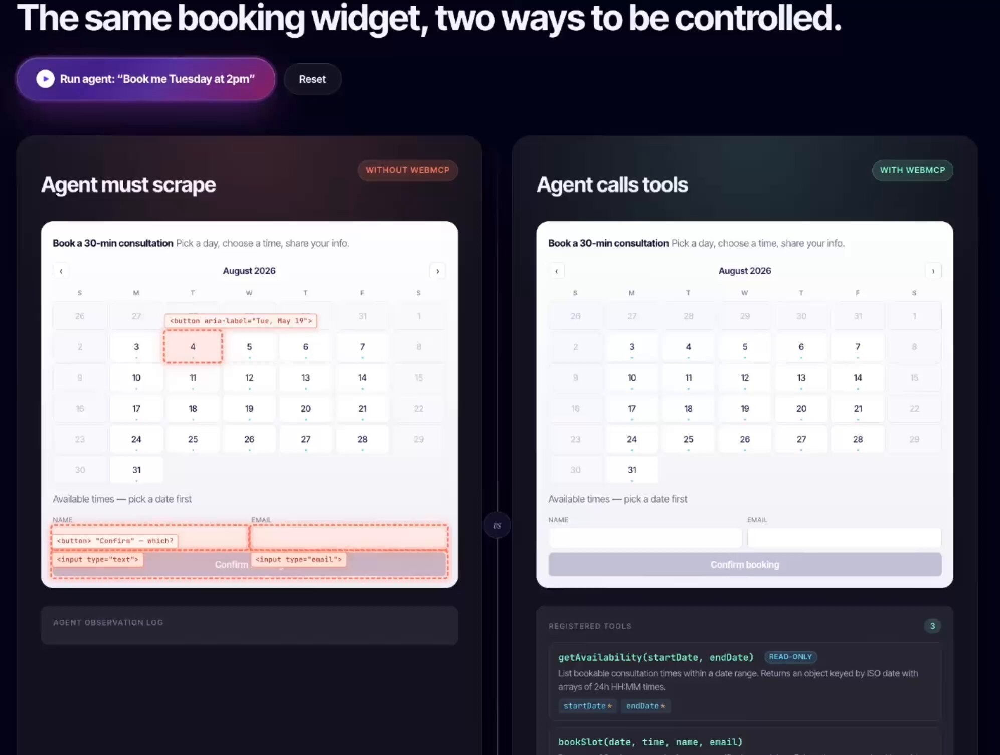
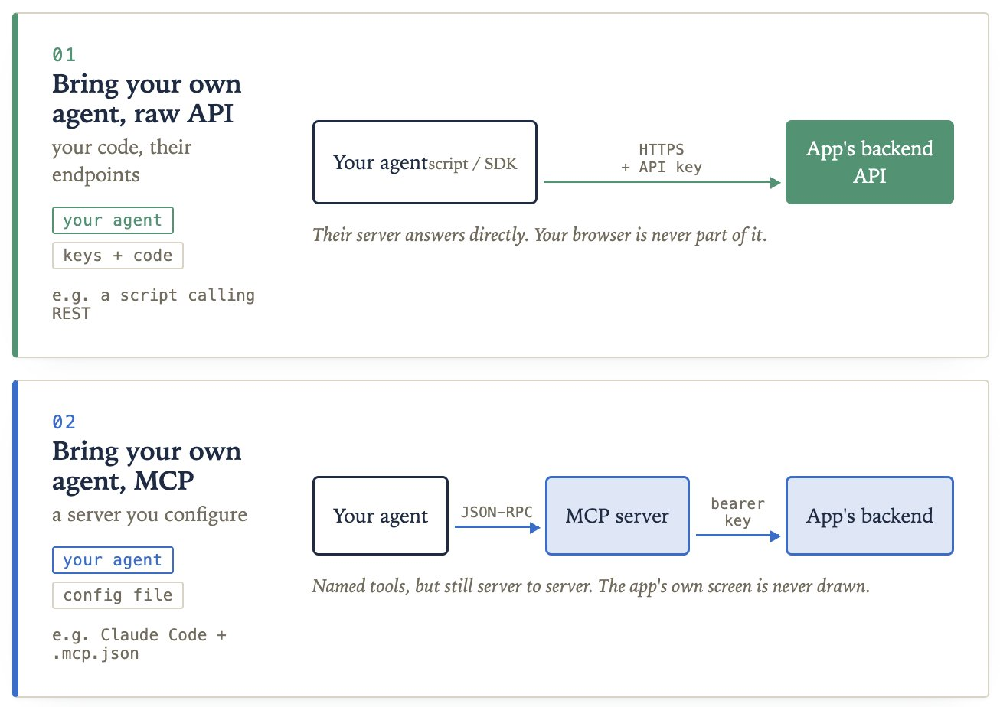
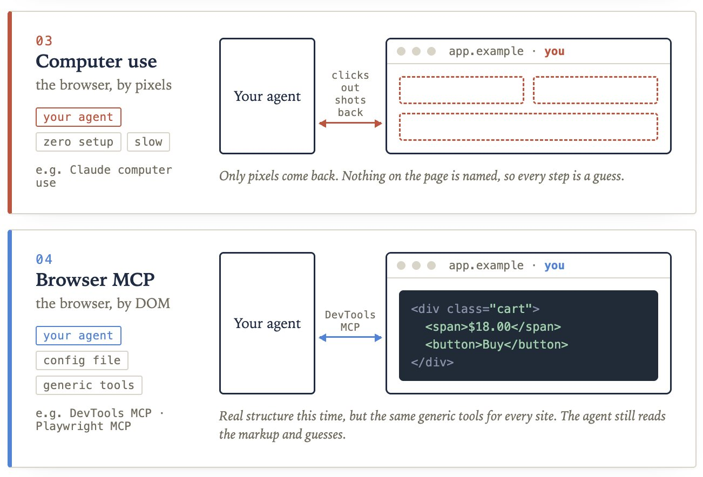
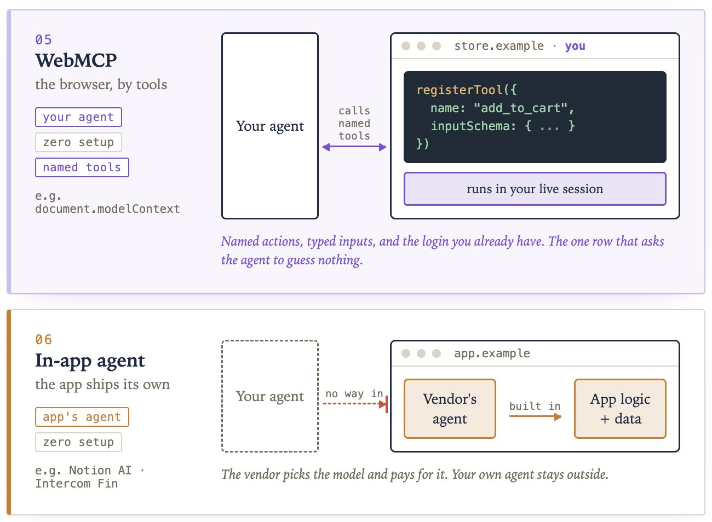
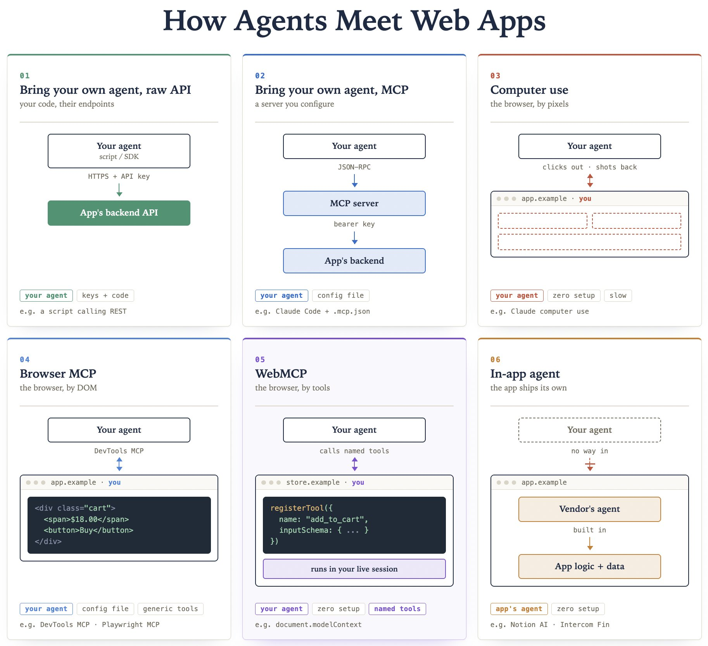

# WebMCP Clearly Explained

Google and Microsoft rarely agree. But now they are building the same thing to fix web access for agents, and it could be the biggest change to the web in years.

Ask an agent to buy something for you and watch what it actually does.

It takes a screenshot of the page. It looks for something that resembles a button. It clicks, waits, and screenshots again. It is reading your screen the way you would, except it is slower at it and you pay tokens every time it looks.

That works often enough to demo. It breaks the moment a site ships a redesign.

Here is what makes this stranger than it first appears. The website already knows exactly what it can do. It has a search, a cart, a checkout, a booking flow. None of that is written down anywhere a program can read it. All of it is buried inside a layout built for humans.

So the problem is not that agents are bad at reading pages. It is that pages were never written for anything except humans.

Check this example:


[video](videos/video-001-C2wyFxvTI2Yi8HZc.mp4)

WebMCP is a browser API from the Chrome and Edge teams that lets a site write those actions down. Search, add to cart, book a slot, each one gets a name, a description written for a model to read, and a list of the inputs it accepts.

WebMCP is one of six ways an agent can reach an app. Lay all six side by side, walk through them one at a time, and it becomes clear why this one is the better bet.

Let's do it!

# Six ways an agent can reach an app

Line them up from furthest away to closest to the interface.

1. Call the raw API. Your script hits the company's backend directly with an API key. Precise and fast. You had to find the endpoints yourself, you manage the key, and the website is never involved.

2. Connect to a backend MCP server. The company builds a server that describes its actions as named tools, and your agent connects to it. Better, because someone who understands the product defined those tools. The user interface is still skipped entirely.



3. Let the agent use the computer. Your agent sees the live page as an image and clicks around. Nothing to set up. It is slow, every look costs money, and a layout change confuses it.

4. Point a browser automation tool at it. Your agent reads the page's underlying code instead of a picture of it. More reliable than pixels. The tools are still generic, so the agent is left inferring meaning from anonymous divs and buttons.



5. WebMCP. The page declares its own actions with names, descriptions, and typed inputs. Your agent calls them.

6. Use the site's built-in assistant. The company ships its own chat box. It picks the model, pays for the tokens, and your agent stays outside. Basically this doesn't let you bring your own agents to interact with the website.



# What lining them up actually shows

Once all six sit side by side, the pattern is easy to see. Three things vary across them.

Whose agent does the work. What the user has to configure before anything happens. And what the agent actually receives when it arrives.

Every one of those options gives up at least one of the three.

- The raw API and the backend MCP server give you clean typed actions, but you configure them and the website disappears from the picture.
- Computer use needs no setup, but hands the agent pixels and asks it to work everything out.
- Browser automation gives structure, but the same generic structure for every site on the internet.
- The built-in assistant is free and precise, and it is not your agent, so nothing it learns about you carries anywhere else.

WebMCP is the only one that keeps all three. Your own agent, nothing to configure, and real named actions instead of guesswork.

# Why declaring beats guessing

The change is small to describe and large in effect. Instead of the agent working out what a button does, the site says what it does.

A few things follow from that.

- The guessing stops. The agent gets a list of actions with typed inputs. There is no interpretation step where a wrong click quietly does the wrong thing.
- Login comes for free. The action runs inside your browser tab, in your session. No API key for the agent to hold, no separate login, no token to pass around. You are already signed in, so it already has access.
- The available actions change with the page. This is the part people miss. A logged out visitor's agent sees a handful of read-only actions like search and product lookup. After signing in, the site adds the rest, like order history, cart, and checkout. Nothing special happens on the agent's side. It just reads the list again.
- Your interface stays. The action runs on your visible page, so the user watches it happen and your product does not get reduced to an API somebody else's chat window is calling.
- Any model can use it. Inputs are described with JSON Schema, the same format Claude, GPT, and Gemini already use for tool calling. You describe your actions once.

# What it looks like in code

A tool is a plain JavaScript object handed to the browser. The code goes in your page's own front-end script, the same JavaScript that already runs when someone loads the site. You register each tool once, when the page loads, and from then on any agent visiting that page can see it and call it.

```javascript
document.modelContext.registerTool({
  name: "add_to_cart",
  description: "Add a product to the shopping cart",
  inputSchema: {
    type: "object",
    properties: {
      productId: { type: "string" },
      quantity: { type: "number" }
    },
    required: ["productId"]
  },
  async execute({ productId, quantity }) {
    await addToCart(productId, quantity);
    return `Added ${quantity} to the cart`;
  }
});
```

Four parts, and only one of them is new work.

The name is what the agent calls. The description is written in plain English, because a language model reads it to decide whether this is the right action. The schema says which inputs are valid, so bad arguments never reach your code.

The last part is the function that runs. Notice it just calls addToCart, which is the same function already sitting behind your own button. You are not building a second version of your product for agents. You are pointing at the one you have.

If the thing you want to expose is already a form, you write no JavaScript at all. You add two attributes to the form markup you already have in your HTML.

```markdown
<form toolname="search_flights"
      tooldescription="Search available flights between two cities">
  <input name="from">
  <input name="to">
  <button type="submit">Search</button>
</form>

```

Two attributes. The browser reads the form, works out that it takes a from and a to, and builds the schema itself.

That is the whole idea. The web spent thirty years describing itself to people through layout, and it has no equivalent for programs. WebMCP is one attempt at that missing description, written by the site that already knows the answer.

# Where this leaves you

For most of the web's history the only visitor worth designing for was a person. That is starting to change, and the site that tells an agent what it can do will get cleaner, more reliable results than the site that makes the agent guess from pixels.

It is still early. One browser family has shipped it, the standard is not final, and only the browser's own agent calls these tools today. But the cost of trying is close to nothing. If you own a site, the cheapest place to start is a form you already have. Add the two attributes, open it in a browser that supports the trial, and watch an agent use it.

[Read the official docs here →](https://developer.chrome.com/docs/ai/webmcp)

The illustration below is a summary of how agents access web apps today.



That's all for today.

Thanks for reading!

Cheers! :)